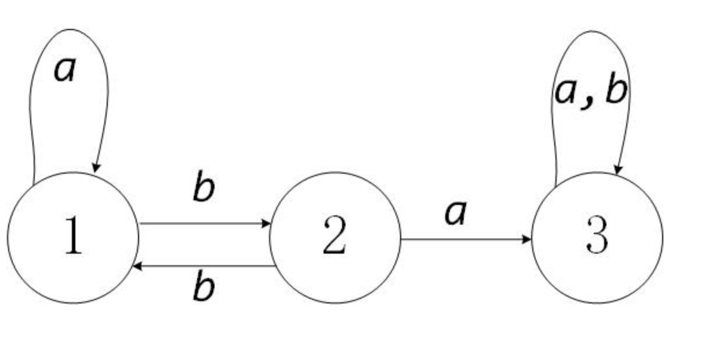

### 一、二分查找

**思路很简单，细节是魔鬼。**

1、计算 mid 时需要技巧防止溢出，建议写成: **mid = left + (right - left) / 2**

2、注意while循环结束条件、left、mid、right变化

寻找目标值，返回下标

```java
int binarySearch(int[] nums, int target) {
    int left = 0;
    int right = nums.length - 1;
    while(left <= right){
        int mid = (left + right) / 2;
        if(nums[mid] == target){
            return mid;
        }else if(nums[mid] < target){
            left = mid + 1;
        }else if(nums[mid] > target){
            right = mid - 1;
        }
    }
    return -1;
}
```

- 为什么 while 循环的条件中是 <=，而不是 < ？

  答：因为初始化 right 的赋值是 nums.length - 1，即最后一个元素的索引，而不是 nums.length。这二者可能出现在不同功能的二分查找中，区别是：前者相当于两端都闭区间 [left, right]，后者相当于左闭右开区间 [left, right)，因为索引大小为 nums.length 是越界的。我们这个算法中使用的是 [left, right] 两端都闭的区间。**这个区间就是每次进行搜索的区间，我们不妨称为「搜索区间」(search space)**。 while 循环什么时候应该终止？**搜索区间为空的时候应该终止**，意味着你没得找了，就等于没找到嘛。while(left <= right)的终止条件是 left == right + 1，写成区间的形式就是 [right + 1, right]，或者带个具体的数字进去 [3, 2]，可见**这时候搜索区间为空**，因为没有数字既大于等于 3 又小于等于 2 的吧。所以这时候 while 循环终止是正确的，直接返回 -1 即可。

- 为什么 left = mid + 1，right = mid - 1？

  刚才明确了「搜索区间」这个概念，而且本算法的搜索区间是两端都闭的，即 [left, right]。那么当我们发现索引 mid 不是要找的 target 时，如何确定下一步的搜索区间呢？当然是去搜索 [left, mid - 1] 或者 [mid + 1, right] 对不对？因为 mid 已经搜索过，应该从搜索区间中去除。


#### 1、搜索旋转数组

题1之[33. 搜索旋转排序数组](https://leetcode-cn.com/problems/search-in-rotated-sorted-array/)

> 整数数组 nums 按升序排列，数组中的值 互不相同 。
>
> 在传递给函数之前，nums 在预先未知的某个下标 k（0 <= k < nums.length）上进行了 旋转，使数组变为 [nums[k], nums[k+1], ..., nums[n-1], nums[0], nums[1], ..., nums[k-1]]（下标 从 0 开始 计数）。例如， [0,1,2,4,5,6,7] 在下标 3 处经旋转后可能变为 [4,5,6,7,0,1,2] 。
>
> 给你 旋转后 的数组 nums 和一个整数 target ，如果 nums 中存在这个目标值 target ，则返回它的索引，否则返回 -1 。
>
> ```
> 输入：nums = [4,5,6,7,0,1,2], target = 0
> 输出：4
> ```

第一次做法（自己实现）：

- 首先遍历得出被旋转的个数（即有多少个元素被移动到了尾部）
- 然后根据移动个数，将原数组重新生成新数组。即排序。
- 然后在排序新数组中用二分查找法定位目标值，然后根据旋转的个数计算出原数组的下标值

```java
public int search(int[] nums, int target) {
        if(nums.length <= 1){
            return nums[0] == target ? 0 : -1;
        }
        int index = 1;
        while(index < nums.length && nums[index] > nums[index-1]){
            index++;
        }
        //被翻转了多少个，3
        int count = nums.length - index;
        int[] result = new int[nums.length];
        //native操作
        System.arraycopy(nums, index, result, 0, count);
        System.arraycopy(nums, 0, result, count, index);
        int start =0;
        int end = result.length - 1;
        while(start <= end){
            int mid = (end + start) / 2;
            if(result[mid] == target){
                return mid < count ? mid + index : mid - count;
            }else if(result[mid] < target){
                start = mid + 1;
            }else if(result[mid] > target){
                end = mid - 1;
            }
        }
        return -1;
    }
```

以上实现就是笨！！

题解后做法：**直接二分查找！**

分析：被旋转的数组二分查找时，从mid出切分，必然至少一边是有序的！如此我们在二分查找过程中，判断哪边是有序的，然后分情况缩小查找范围即可！

```java
public int search3(int[] nums, int target){
        if(nums.length <= 1){
            return nums[0] == target ? 0 : -1;
        }
        int len = nums.length;
        int start = 0;
        int end = len - 1;
        while(start <= end){
            int mid = (start + end) / 2;
            if(nums[mid] == target){
                return mid;
            }else if(nums[mid] >= nums[start]){
                //左边有序,需判断是否在左边区间内
                if(nums[start] <= target && target < nums[mid]){
                    end = mid - 1;
                }else {
                    start = mid + 1;
                }
            }else {
                //右边有序,判断是否在右侧区间内
                if(nums[mid] < target && target <= nums[end]){
                    end = mid - 1;
                }else {
                    start = mid + 1;
                }
            }
        }
        return -1;
    }
```

变形：

> 假设按照升序排序的数组在预先未知的某个点上进行了旋转。
>
> ( 例如，数组 [0,0,1,2,2,5,6] 可能变为 [2,5,6,0,0,1,2] )。
>
> 编写一个函数来判断给定的目标值是否存在于数组中。若存在返回 true，否则返回 false。
>
> 该题是以上的延伸，本题中nums数组元素可以重复。

分析二分查找法：

由于数组元素存在重复，所以仅靠`nums[mid] >= nums[start]`无法判断出左边是有序的，此时可以拆分为两个条件：**`nums[mid] > nums[start]`时左边一定有序，如果`nums[mid]==nums[start]`，此时只需要将start++即可。**

```java
public boolean search4(int[] nums, int target){
    	if(nums.length <= 1){
            return nums[0] == target;
        }
        int len = nums.length;
        int start = 0;
        int end = len - 1;
        while(start <= end){
            int mid = (start + end) / 2;
            if(nums[mid] == target){
                return true;
            }
            if(nums[mid] == nums[start]){
                start++;
                continue;
            }
            if(nums[mid] >= nums[start]){
                //左边有序,需判断是否在左边区间内
                if(nums[start] <= target && target < nums[mid]){
                    end = mid - 1;
                }else {
                    start = mid + 1;
                }
            }else {
                //右边有序,判断是否在右侧区间内
                if(nums[mid] < target && target <= nums[end]){
                    end = mid - 1;
                }else {
                    start = mid + 1;
                }
            }
        }
        return false;
    }
```

#### 2、旋转数组找最小值

> 153：假设按照升序排序的数组在预先未知的某个点上进行了旋转。例如，数组 [0,1,2,4,5,6,7] 可能变为 [4,5,6,7,0,1,2] 。
>
> 请找出其中最小的元素。
>

还是通过相同的二分查找方式，如果某一区间有序，则只需取该区间第一个，然后到另一区间搜索即可。

```java
public int findMin(int[] nums){
        int current = nums[0];
        int start = 0;
        int end = nums.length - 1;
        while(start <= end){
            int mid = (start + end) / 2;
            if(nums[mid] >= nums[start]){
                //左侧有序，只需取该区间第一个最小的值更新，然后跳到另一个区间即可
                if(nums[start] < current){
                    current = nums[start];
                }
                start = mid + 1;
            }else {
                //右侧有序
                if(nums[mid] < current){
                    current = nums[mid];
                }
                end = mid - 1;
            }
        }
        return current;
    }
}
```

旋转数组最小值变种（可重复）【154】：

> 154：假设按照升序排序的数组在预先未知的某个点上进行了旋转。
>
> ( 例如，数组 [0,1,2,4,5,6,7] 可能变为 [4,5,6,7,0,1,2] )。
>
> 请找出其中最小的元素。
>
> 注意数组中可能存在重复的元素。
>

与普通版不同的关键点还是在如果`nums[mid]==nums[start]`，此时只需要将start++即可。

```java
int current = nums[0];
        int start = 0;
        int end = nums.length - 1;
        while(start <= end){
            int mid = (start + end) / 2;
            if(nums[mid] < current){
                current = nums[mid];
            }//如果相等，start++
            if(nums[mid] == nums[start]){
                start++;
                continue;
            }
            if(nums[mid] > nums[start]){
                //左侧有序
                if(nums[start] < current){
                    current = nums[start];
                }
                start = mid + 1;
            }else {
                //右侧有序
                if(nums[mid] < current){
                    current = nums[mid];
                }
                end = mid - 1;
            }
        }
        return current;
```

#### 3、两个有序数组中查询中位数

> 给定两个大小分别为 `m` 和 `n` 的正序（从小到大）数组 `nums1` 和 `nums2`。请你找出并返回这两个正序数组的 **中位数** 。

如果直接排序后生成新数组查找，时间复杂度为O(m+n)。题目要求复杂度为O(log(m+n))。

###### 题解一之通用化成【求两个有序数组中第K小的元素】：

```
/* 主要思路：要找到第 k (k>1) 小的元素，那么就取 pivot1 = nums1[k/2-1] 和 pivot2 = nums2[k/2-1] 进行比较
 * 这里的 "/" 表示整除
 * nums1 中小于等于 pivot1 的元素有 nums1[0 .. k/2-2] 共计 k/2-1 个
 * nums2 中小于等于 pivot2 的元素有 nums2[0 .. k/2-2] 共计 k/2-1 个
 * 取 pivot = min(pivot1, pivot2)，两个数组中小于等于 pivot 的元素共计不会超过 (k/2-1) + (k/2-1) <= k-2 个
 * 这样 pivot 本身最大也只能是第 k-1 小的元素
 * 如果 pivot = pivot1，那么 nums1[0 .. k/2-1] 都不可能是第 k 小的元素。把这些元素全部 "删除"，剩下的作为新的 nums1 数组
 * 如果 pivot = pivot2，那么 nums2[0 .. k/2-1] 都不可能是第 k 小的元素。把这些元素全部 "删除"，剩下的作为新的 nums2 数组
 * 由于我们 "删除" 了一些元素（这些元素都比第 k 小的元素要小），因此需要修改 k 的值，减去删除的数的个数
 */
```

```java
//题解
public double findMedianSortedArrays(int[] nums1, int[] nums2) {
        int size = nums1.length + nums2.length;
        double k1MinValue = getNumberKMinValue(nums1, nums2, size / 2 + 1);
        if(size % 2 == 1){
            return k1MinValue;
        }else {
            double numberKMinValue = getNumberKMinValue(nums1, nums2, size / 2);
            return (numberKMinValue + k1MinValue) / 2.0;
        }

 }

/**
*表示从两个数组中查找出第k小的元素
*/
private getNumberKMinValue(int[] nums1, int[] nums2, int k){
 	int i = 0;
    int j = 0;
    while(true){
        //循环结束条件
        if(i == nums1.length){
            return nums2[j+k-1];
        }else if(j == nums2.length){
            return nums1[i+k-1];
        }
        if(k == 1){
            return Math.min(nums1[i], nums2[j]);
        }
        //正常情况，按半切分剔除,先各拿half个元素出来，取二者尾部处最小的，即能确定该值在两个数组中至少比half个元素小
        int half = k / 2;
        int newIndex1 = Math.min(i+half, nums1.length)-1;
        int newIndex2 = Math.min(j+half, nums2.length)-1;
        if(nums1[newIndex1] <= nums2[newIndex2]){
            //nums1中half处元素更小，则更新k值，且此时由于[i, half]已参与比较故需“删除”该部分即更新i值
            k -= newIndex1 - i + 1;
            i = newIndex1 + 1;
        }else{
    		k -= newIndex2 -i + 1;
            j = newIndex2 + 1;
        }
    }
}
```

###### 题解二：**划分数组**。

分析一下数组中位数（比如i处为中位数索引）的性质：

- 数组为奇数时，左边部分的元素个数len1 = 右边元素个数len2 + 1，数组为偶数时len1=len2;

- 同时左边最大的元素max(left) <= min(right)右边最小的元素

  

那么为偶数时，假如{A,B} 中的所有元素已经被划分为相同长度的两个部分，且前一部分中的元素总是小于或等于后一部分中的元素。中位数就是前一部分的最大值和后一部分的最小值的平均值：
$$
median= 

\frac{max(left\_part)+min(right\_part)}{2}
​
$$
奇数时，{A,B} 中的所有元素已经被划分为两个部分，前一部分比后一部分多一个元素，且前一部分中的元素总是小于或等于后一部分中的元素。中位数就是前一部分的最大值：

$$
median=max(left\_part)
$$
因此可以搜索数组A，根据枚举的i值去确定j值（因为i+j = (len1+len2)/2）,然后得出满足条件的median值。

```java
public double findMedianSortedArrays2(int[] nums1, int[] nums2) {
        int len1 = nums1.length;
        int len2 = nums2.length;
        int cutI = 0;
        int cutJ;
        int leftMedium = 0;
        int rightMedium = 0;
        //int leftLen = cutI + 1 + cutJ + 1; int rightLen = len1 + len2 - leftLen
        // 二者要相等，即可得等式cutI + cutJ = (len1 + len2) / 2
        //枚举cutI的值，根据cutI的值来确定cutJ的值，以满足前部分数组的最大值小于等于后部分数组的最小值
        while(cutI <= len1){
            cutJ = (len1 + len2 + 1) / 2 - cutI; //前半部分多一个元素
            //nums1数组分割后前部分的最大值
            int nums_im1 = (cutI == 0 ? Integer.MIN_VALUE : nums1[cutI - 1]);
            //nums1数组分割后后部分的最小值
            int nums_i = (cutI == len1) ? Integer.MAX_VALUE : nums1[cutI];
            //nums2数组分割后前部分的最大值
            int nums_jm1 = (cutJ == 0 ? Integer.MIN_VALUE : nums2[cutJ - 1]);
            //nums2数组分割后后部分的最小值
            int nums_j = (cutJ == len2) ? Integer.MAX_VALUE : nums2[cutJ];
            if(Math.max(nums_im1, nums_jm1) <= Math.min(nums_i, nums_j)){
                leftMedium = Math.max(nums_im1, nums_jm1);
                rightMedium = Math.min(nums_i, nums_j);
                break;
            }else {
                cutI++;
            }
        }
        return (len1 + len2) % 2 == 0 ? (leftMedium + rightMedium) / 2.0 : leftMedium;

    }
```

另外我们可以对 i 在 [0,m] 的区间上进行二分搜索，找到最大的满足 A[i−1]≤B[j] 的 ii值，就得到了划分的方法。此时，划分前一部分元素中的最大值，以及划分后一部分元素中的最小值，才可能作为就是这两个数组的中位数

```java
public double findMedianSortedArrays3(int[] nums1, int[] nums2) {
        int len1 = nums1.length;
        int len2 = nums2.length;
        int leftMedium = 0;
        int rightMedium = 0;
        int left = 0;
        int right = len1 - 1;
        //int leftLen = cutI + 1 + cutJ + 1; int rightLen = len1 + len2 - leftLen
        // 二者要相等，即可得等式cutI + cutJ = (len1 + len2) / 2
        //枚举cutI的值，根据cutI的值来确定cutJ的值，以满足前部分数组的最大值小于等于后部分数组的最小值
        while(left <= right){
            int cutI = (left + right) / 2;
            int cutJ = (len1 + len2 + 1) / 2 - cutI; //前半部分多一个元素
            //nums1数组分割后前部分的最大值
            int nums_im1 = (cutI == 0 ? Integer.MIN_VALUE : nums1[cutI - 1]);
            //nums1数组分割后后部分的最小值
            int nums_i = (cutI == len1) ? Integer.MAX_VALUE : nums1[cutI];
            //nums2数组分割后前部分的最大值
            int nums_jm1 = (cutJ == 0 ? Integer.MIN_VALUE : nums2[cutJ - 1]);
            //nums2数组分割后后部分的最小值
            int nums_j = (cutJ == len2) ? Integer.MAX_VALUE : nums2[cutJ];
            //如果nums1的前部分最大值比nums2的后部分最小值还小，说明cutI还可以尝试往后移动切分
            if(nums_im1 <= nums_j){
                leftMedium = Math.max(nums_im1, nums_jm1);
                rightMedium = Math.min(nums_i, nums_j);
                left = cutI + 1;
            }else {
                right = cutI - 1;
            }
        }
        return (len1 + len2) % 2 == 0 ? (leftMedium + rightMedium) / 2.0 : leftMedium;

    }
```

#### 4、最长连续序列

> 给定一个未排序的整数数组 nums ，找出数字连续的最长序列（不要求序列元素在原数组中连续）的长度。
>
>  进阶：你可以设计并实现时间复杂度为 O(n) 的解决方案吗？
>
> 示例 1：输入：nums = [100,4,200,1,3,2]
> 输出：4
> 解释：最长数字连续序列是 [1, 2, 3, 4]。它的长度为 4。
> 示例 2：输入：nums = [0,3,7,2,5,8,4,6,0,1]
> 输出：9

###### 双指针（自己）

自己思路，先排序，然后遍历数组用双指针统计长度。但是当前时间复杂度不符合O(n)要求。

```java
public int longestConsecutive(int[] nums) {
        if(nums.length <= 1){
            return nums.length;
        }
        Arrays.sort(nums);
        int repeat = 0; //重复次数
        int index = 0; //子序列的头元素
        int result = 1; 
        int i = 1;
        for (; i < nums.length; i++) {
            if(nums[i] == nums[i-1]){
                repeat++;//相等的只记录重复次数
                continue;
            }
            if(nums[i] - nums[i-1] == 1){
                continue;//差1的继续迭代
            }else {//否则进行记录当前最长的子序列，并重置index指针，归零重复值
                result = Math.max(result, i - index - repeat);
                index = i;
                repeat = 0;
            }
        }
        return Math.max(result, i - index - repeat); //此处注意，否则会遗漏
    }
```


###### 哈希表法

遍历数组，将每个元素存入HashSet中。然后二次遍历数组，如果该值的下一个值存在则累加次数，直到下一个值不存在为止。**关键是如果某值的上一个值存在，则无需处理该值，因为遍历到上一个值的时候会一起处理从而避免了重复处理。**

```java
public int longestConsecutive2(int[] nums) {
        Set<Integer> set = new HashSet<>();
        for (int i = 0; i < nums.length; i++) {
            set.add(nums[i]);
        }
        int result = 1;
        for (int i = 0; i < nums.length; i++) {
            int current = nums[i];
            int currentLen = 1;
            if(set.contains(current-1)){//上一个值存在，则跳过
                continue;
            }
            int temp = current;
            while(set.contains(++temp)){//下一个值存在则累加
                currentLen++;
            }
            result = Math.max(result, currentLen);
        }
        return result;
    }
```


#### 5、两数之和

> 


#### 6、三数之和

> 给你一个包含 n 个整数的数组 nums，判断 nums 中是否存在三个元素 a，b，c ，使得 a + b + c = 0 ？请你找出所有和为 0 且不重复的三元组。
>
> 注意：答案中不可以包含重复的三元组。
>
> **示例 ：**
>
> ```
> 输入：nums = [-1,0,1,2,-1,-4]
> 输出：[[-1,-1,2],[-1,0,1]]
> ```

解法：循环，然后左右夹逼法，需要注意剔除重复的组合。**由此也可以发散到求k个元素和为target的算法：即使用k-2次循环，然后最后两个元素进行左右夹逼**

```java
public List<List<Integer>> threeSum(int[] nums) {
    List<List<Integer>> result = new ArrayList<>();
    if(nums.length <= 2){
        return result;
    }
    int len = nums.length;
    Arrays.sort(nums);//排序成为有序数组
    for(int i = 0; i < nums.length - 2; i++){
        if(i > 0 && nums[i] == nums[i-1]){
            continue;//如果跟前一个i值相等，则说明遍历过组合，剔除掉
        }
        int j = i+1;//左边的遍历指针
        int k = len-1;//右边的遍历指针
        while(j < k){//开始夹逼
            int valueJ = nums[j];
            int valueK = nums[k];
            int des = nums[i]+nums[j]+nums[k];
            if(des == 0){
                result.add(Arrays.asList(nums[i], nums[j], nums[k]));
                //剔除重复，找到下一个不同的j和k
                while(j < len-1 && valueJ == nums[++j]);
                while(k > 0 && valueK == nums[--k]);
            }else if(des > 0){
                while(k > 0 && valueK == nums[--k]);//找到下一个不同的值对应的k
            }else{
                while(j < len-1 && valueJ == nums[++j]);//找到下一个不同的值对应的j
            }
        }
        return result;
    }
    
｝
```

#### 7、最接近的三数之和

> 给定一个包括 n 个整数的数组 nums 和 一个目标值 target。找出 nums 中的三个整数，使得它们的和与 target 最接近。返回这三个数的和。假定每组输入只存在唯一答案。
>
> 示例：
>
> 输入：nums = [-1,2,1,-4], target = 1
> 输出：2
> 解释：与 target 最接近的和是 2 (-1 + 2 + 1 = 2) 。

与上题解法一致。

```java
public int threeSumClosest(int[] nums, int target) {
        Arrays.sort(nums);
        int len = nums.length;
        int result = Integer.MAX_VALUE;
        for (int i = 0; i < len - 2; i++) {
            if(i > 0 && nums[i] == nums[i-1]){
                continue;
            }
            int j = i + 1;
            int k = len - 1;
            while(j < k){
                int valueJ = nums[j];
                int valueK = nums[k];
                int sum = nums[i] + nums[j] + nums[k];
                if(result == Integer.MAX_VALUE || Math.abs(sum-target) < Math.abs(result-target)){
                    result = sum;
                }
                if(sum == target){
                    break;
                }else if(sum < target){
                    while(j < len - 1 && valueJ == nums[++j]);
                }else {
                    while(k > 0 && valueK == nums[--k]);
                }
            }
        }
        return result;
    }
```

#### 8、四数之和

> 给定一个包含 n 个整数的数组 nums 和一个目标值 target，判断 nums 中是否存在四个元素 a，b，c 和 d ，使得 a + b + c + d 的值与 target 相等？找出所有满足条件且不重复的四元组。
>
> 注意：答案中不可以包含重复的四元组。
>

与三数之和解法一致，但要考虑去重的区别。

```java
public List<List<Integer>> fourSum(int[] nums, int target) {
        List<List<Integer>> result = new ArrayList<>();
        if(nums.length <= 3){
            return result;
        }
        int len = nums.length;
        Arrays.sort(nums);//排序
        for (int i = 0; i < len -3; i++) {
            if (i > 0 && nums[i] == nums[i - 1]) {//第一个数如果重复选取则跳过
                continue;
            }
            //当前第一个数选择后，如果最小的组合都大于target，则后续的没有满足条件的了，无需选择了
            if (nums[i] + nums[i + 1] + nums[i + 2] + nums[i + 3] > target) {
                break;
            }
            //当前第一个数选择后，如果最大的组合都小于target，则不用以第一个数为基础了，跳过
            if (nums[i] + nums[len - 3] + nums[len - 2] + nums[len - 1] < target) {
                continue;
            }
            for (int j = i+1; j < len-2; j++) {
                if (j > i + 1 && nums[j] == nums[j - 1]) {//去重复
                    continue;
                }
                //优化判断
                if (nums[i] + nums[j] + nums[j + 1] + nums[j + 2] > target) {
                    break;
                }
                //优化判断
                if (nums[i] + nums[j] + nums[len - 2] + nums[len - 1] < target) {
                    continue;
                }
                int m = j + 1;
                int k = len - 1;
                while(m < k){
                    int valueM = nums[m];
                    int valueK = nums[k];
                    int cur = nums[i] + nums[j] + nums[m] + nums[k];
                    if(cur == target){
                        result.add(Arrays.asList(nums[i], nums[j], nums[m], nums[k]));
                        while(m < len - 1 && valueM == nums[++m]);
                        while(k > 0 && valueK == nums[--k]);
                    }else if(cur < target){
                        while(m < len - 1 && valueM == nums[++m]);
                    }else {
                        while(k > 0 && valueK == nums[--k]);
                    }
                }
            }
        }
        return result;
    }
```

#### 9.移除数组元素

> 给你一个数组 nums 和一个值 val，你需要 原地 移除所有数值等于 val 的元素，并返回移除后数组的新长度。
>
> 不要使用额外的数组空间，你必须仅使用 O(1) 额外空间并 原地 修改输入数组。
>
> 元素的顺序可以改变。你不需要考虑数组中超出新长度后面的元素。
>

题解：不使用额外的空间，即在原数组上进行操作。可使用一个index指针记录符合条件的元素位置，在遍历过程中不断更新index值。也是双指针的运用！

```java
public int removeElement(int[] nums, int val){
        int index = 0;
        for (int i = 0; i < nums.length; i++) {
            if(nums[i] != val){
                nums[index++] = nums[i];
            }
        }
        return index;
    }
```

类似的反转链表：只需要改变链表的next指针的指向，直接将链表反转 ，而不用重新定义一个新的链表。另一种方式是先删除节点，然后头插法实现反转。

```java
public ListNode reverseNode(ListNode node){
    if(node == null || node.next == null){return node;}
    ListNode pre = null;
    ListNode cur = node;
    ListNode temp = null;
    while(cur != null){//细细体会
        temp = cur.next;
        cur.next = pre;
        pre = cur;
        cur = temp;
     
    }
}
```

#### 10.获取数组的下一个序列

> 实现获取 下一个排列 的函数，算法需要将给定数字序列重新排列成字典序中下一个更大的排列。如果不存在下一个更大的排列，则将数字重新排列成最小的排列（即升序排列）。必须 原地 修改，只允许使用额外常数空间。
>
> ```
> 输入：nums = [1,2,3]
> 输出：[1,3,2]
> ```

即获取下一个更大的数字。主要是在理解过程（即如何得到下一个排列数）：

- 首先从右边开始遍历，直到找到一个元素nums[i]<nums[i+1]，即得到一个较小值
- 然后在剩余的右边区间[i+1, len)区间从右边开始遍历，找到第一个nums[j]>nums[i]即较大值
- 交换nums[i]和nums[j]，然后对区间[i+1, len]进行升序排列，由分析可知该区间原始顺序为降序排列，即只需使用双指针算法反转该区间即可。

```java
public void getPermutation(int[] nums){
    if(nums.length <= 1){
        return;
    }
    int len = nums.length;
    int  i = len - 2;
    while(i >= 0 && nums[i] >= nums[i+1]){
        i--;
    }
    if(i != -1){
        int j = len - 1;
        while(j >= i+1 && nums[j] <= nums[i]){
            j--;
        }
        swap(nums, i, j);
    }
    reverse(nums, left, right);
}

public void reverse(int[] nums, int left, int right){
    while(left < right){
        swap(nums, left, right);
        left++;
        right--;
    }
}
public void swap(int[] nums, int i, int j){
    int temp = nums[i];
    nums[i] = nums[j];
    nums[j] = nums[i];
}
```

升级变种（第k个排列）：

> 给出集合 [1,2,3,...,n]，其所有元素共有 n! 种排列。按大小顺序列出所有排列情况，并一一标记，当 n = 3 时, 所有排列如下：
>
> "123"
> "132"
> "213"
> "231"
> "312"
> "321"
> 给定 n 和 k，返回第 k 个排列。
>
>  示例 1：
>
> 输入：n = 3, k = 3
> 输出："213"

题解：只需要套用上面求下一个排列的方法，循环k次即可。进阶的做法是利用`康托展开和逆康托展开`的方法。康托展开公式主要表示的就是在n个不同元素的全排列中, 比当前排列组合小的个数，那么也可以表示当前排列组合在n个不同元素的全排列中的名次。而逆康托展开主要用于根据排列的名次得到具体的排列数。只需要记住**排列数有个康托排列公式即可**。


类似问题：

> 给你两个 没有重复元素 的数组 nums1 和 nums2 ，其中nums1 是 nums2 的子集。
>
> 请你找出 nums1 中每个元素在 nums2 中的下一个比其大的值。
>
> nums1 中数字 x 的下一个更大元素是指 x 在 nums2 中对应位置的右边的第一个比 x 大的元素。如果不存在，对应位置输出 -1 。
>
> 示例 1:
>
> 输入: nums1 = [4,1,2], nums2 = [1,3,4,2].
> 输出: [-1,3,-1]
>
> 解释:
>     对于 num1 中的数字 4 ，你无法在第二个数组中找到下一个更大的数字，因此输出 -1 。
>     对于 num1 中的数字 1 ，第二个数组中数字1右边的下一个较大数字是 3 。
>     对于 num1 中的数字 2 ，第二个数组中没有下一个更大的数字，因此输出 -1 。

题解：可以通过**栈的单调性**来实现。即遍历nums1数组，利用栈的特性，如果当前入栈元素大于栈顶元素则栈顶元素出栈并记录栈顶元素的下一个最大值为当前入栈元素，直到栈为空或栈顶元素大于入栈元素。

```java
//num1是子集,nums2是全量
public int[] nextGreaterElement(int[] nums1, int[] nums2) {
        Map<Integer, Integer> result = new HashMap<>(nums2.length);
        Deque<Integer> stack = new ArrayDeque<>();
    //遍历nums2，通过栈的单调性记录所有元素的下一个较大值
        for (int i = 0; i < nums2.length; i++) {
            while(!stack.isEmpty() && stack.peekLast() < nums2[i]){
                result.put(stack.removeLast(), nums2[i]);
            }
            stack.offerLast(nums2[i]);
        }
    //然后获取结果
        int[] res = new int[nums1.length];
        for (int i = 0; i < nums1.length; i++) {
            res[i] = result.getOrDefault(nums1[i], -1);
        }
        return res;
    }
```

变种：

> 给定一个循环数组（最后一个元素的下一个元素是数组的第一个元素），输出每个元素的下一个更大元素。数字 x 的下一个更大的元素是按数组遍历顺序，这个数字之后的第一个比它更大的数，这意味着你应该循环地搜索它的下一个更大的数。如果不存在，则输出 -1。

```java
public int[] nextGreaterElements(int[] nums) {
        int[] result = new int[nums.length];
        Arrays.fill(result, -1);
        Deque<Integer> stack = new ArrayDeque();
        int len = nums.length;
        for (int i = 0; i < len * 2 - 1; i++) {
            while(!stack.isEmpty() && nums[stack.peekLast()] < nums[i%len]){
                result[stack.removeLast()] = nums[i%len];
            }
            stack.addLast(i % len);
        }
        return result;
    }
```

##### 知识储备：单调栈

从栈底元素到栈顶元素呈单调递增或单调递减，栈内序列满足单调性的栈。**单调栈主要运用在给你一个数组序列，在遍历数组时，需要向前查看元素的这种情况，此时将前面的元素入栈，形成单调栈。**具体再结合题目的用意，加以利用。

经典示例：

- 数组的下一个排列（如上题）
- 柱状图中最大的矩形

> ```text
> 给定 n 个非负整数，用来表示柱状图中各个柱子的高度。每个柱子彼此相邻，且宽度为 1 。
> 求在该柱状图中，能够勾勒出来的矩形的最大面积。
> 以下是柱状图的示例，其中每个柱子的宽度为 1，给定的高度为 [2,1,5,6,2,3]。
> 图中阴影部分为所能勾勒出的最大矩形面积，其面积为 10 个单位。
> 示例:
> 输入: [2,1,5,6,2,3]
> 输出: 10
> ```


按照单调栈的思路，递增时入栈，其余时计算面积并出栈，直到继续递增时入栈。面积将通过计算当前位置和栈顶元素所在位置的宽度查，再乘上元素的height值的思路来做这题，具体过程：

- 遍历数组元素，当待入栈元素a[i]大于栈顶元素a[n]时，直接入栈；
- 当待入栈元素a[i]不大于栈顶元素a[n]时，此时计算元素a[n]所参与构成的最大矩形面积；
  - 栈中元素a[n]如果存在前一个元素a[m]即不为栈底元素,则说明a[n]在区间(m, i-1]中最小的，即a[n]能构成最大面积为a[n]*(i-1-m)，计算完成后a[n]出栈，继续循环判断*
  - *栈中元素a[n]如果是栈底元素，同理说明a[n]在区间[0, i-1]即(-1, i-1]中最小的，能构成的最大面积为a[n]*(i-1-(-1))，计算完成后a[n]出栈，继续循环判断
- 为了遍历结束后能计算所有元素的各自构成的最大面积，即可以在数组元素全部入栈后，再入栈一个Integer.MIN_VALUE已确保所有元素都进行计算然后出栈。

总结：即利用栈的单调性，当待入栈元素比栈顶元素小的时候，计算栈顶元素所参与构成的面积，然后出栈，再依次比较栈顶元素，又计算又出栈。直到满足单调栈，最后全部入栈后再入栈一个Integer.MIN_VALUE触发剩余栈中元素构成面积计算。

```java
public int largestRectangleArea(int[] heights) {
        //定义队列，作为栈使用
        Deque<Integer> stack = new ArrayDeque();
        //最大矩形面积
        int area = 0;
        for (int i = 0; i < heights.length; i++) {
            //对各元素进行判断，如果栈顶元素大于等于当前待入栈元素，则计算栈顶元素所构成的最大面积然后出栈，直到栈顶元素小于当前元素或者栈为空时，对当前元素进行入栈
            while(!stack.isEmpty() && heights[stack.peek()] >= heights[i]){
                area = Math.max(area, getCurrentArea(stack, heights, i));
            }
            stack.push(i);
        }
        //数组元素全部入栈后，再将最小整数进行同样的入栈逻辑，以计算栈中所有元素各自所构成的最大面积
        while (!stack.isEmpty() && heights[stack.peek()] >= Integer.MIN_VALUE){
            area = Math.max(area, getCurrentArea(stack, heights, heights.length));
        }
        return area;
    }

    /**
    *获取当前栈顶元素所构成的最大面积，由上分析知公式为：a[n] * (i-1 -m)
    */
    public int getCurrentArea(Deque<Integer> stack, int[] nums, int index){
        Integer start = stack.pop();
        return nums[start] * (index -1 - (stack.isEmpty() ? -1 : stack.peek()));
    }
```

知识储备：队列

顶层**接口**Queue，继承了Collection接口。主要声明了6个基础方法`add、offer、remove、poll、element、peek`。Queue其拥有三个直接接口子类：

- AbstactQueue

  AbstactQueue继承自Queue，其主要重写了add、remove、element方法。重写也很简单，就是内部分别调用offer、poll、peek方法，若元素不存在则抛出异常。其下属部分常见的具体实现类大部分均为继承自AbstractQueue，实现BlockingQueue接口。

- BlockingQueue

其主要新增定义了take和put方法，由其实现可知二者为阻塞方法。常见阻塞队列实现类：ArrayBlockingQueue、SynchronousQueue、LinkedBlockingQueue、PriorityBlockingQueue、DelayQueue、BlockingDeque（双向阻塞队列）

BlockingQueue的操作可以分为下面四类：

| 操作类型 | Throws exception | Special value | Blocks         | Times out            |
| -------- | ---------------- | ------------- | -------------- | -------------------- |
| Insert   | add(e)           | offer(e)      | put(e)         | offer(e, time, unit) |
| Remove   | remove()         | poll()        | take()         | poll(time, unit)     |
| Examine  | element()        | peek()        | not applicable | not applicable       |

第一类是会抛出异常的操作，当遇到插入失败，队列为空的时候抛出异常。

第二类是不会抛出异常的操作。

第三类是会Block的操作。当Queue为空或者达到最大容量的时候。

第四类是time out的操作，在给定的时间里会Block，超时会直接返回。


- Deque

  双端队列，继承自Queue。在原有的基础上定义了xxxFirst和xxxLast方法，并且新定义了针对栈场景的push和pop方法。其常见的实现类有BlockingDeque、LinkedList。

  同样的，我们也可以将Deque的方法用下面的表格来表示，Deque的方法可以分为对头部的操作和对尾部的操作：

  | 方法类型 | Throws exception | Special value | Throws exception | Special value |
  | -------- | ---------------- | ------------- | ---------------- | ------------- |
  | Insert   | addFirst(e)      | offerFirst(e) | addLast(e)       | offerLast(e)  |
  | Remove   | removeFirst()    | pollFirst()   | removeLast()     | pollLast()    |
  | Examine  | getFirst()       | peekFirst()   | getLast()        | peekLast()    |
  和Queue的方法描述基本一致，这里就不多讲了。

  **当Deque以 FIFO (First-In-First-Out)的方法处理元素的时候，Deque就相当于一个Queue。**

  **当Deque以LIFO (Last-In-First-Out)的方式处理元素的时候，Deque就相当于一个Stack**。

  ArrayDeque类中，add/offer、remove/poll方法是针对队列的使用，即实际为addLast/offerLast和removeFirst/pollFisrt。而push和pop是针对栈的使用，实际为addFirst和removeFirst。peek方法都是peekFirst。 即使用ArrayDeque作为栈应用的话，可以使用push、pop、peek的组合！

  

  另外TransferQueue继承自BlockingQueue，为什么叫Transfer呢？因为TransferQueue提供了一个transfer的方法，生产者可以调用这个transfer方法，从而等待消费者调用take或者poll方法从Queue中拿取数据。

  还提供了非阻塞和timeout版本的tryTransfer方法以供使用。

  我们举个TransferQueue实现的生产者消费者的问题。

- ConcurrentLinkedQueue

 并发队列，通过CAS控制。


Stack类。继承自Vector类（线程安全的）。


#### 11.接雨水

> 给定 n 个非负整数表示每个宽度为 1 的柱子的高度图，计算按此排列的柱子，下雨之后能接多少雨水。
>
>  
>
> 示例 1：
>
> 输入：height = [0,1,0,2,1,0,1,3,2,1,2,1]
> 输出：6
> 解释：上面是由数组 [0,1,0,2,1,0,1,3,2,1,2,1] 表示的高度图，在这种情况下，可以接 6 个单位的雨水（蓝色部分表示雨水）。 
> 示例 2：
>
> 输入：height = [4,2,0,3,2,5]
> 输出：9

一样使用单调栈，当递减时入栈，当前入栈元素大于栈顶元素时则开始计算夹缝面积，计算完后如果栈顶元素大于当前待入栈元素则栈顶出栈，否则当前元素入栈（即当前元素所形成的夹缝计算已结束）。

```java
public int trap(int[] height) {
    	//存储下标和值
        Stack<Map.Entry<Integer, Integer>> stack = new Stack<>();
        int area = 0;
        for (int i = 0; i < height.length; i++) {
            int cur = height[i];
            int bottom = 0; //bottom表示当前应扣除的底部高度，凹陷处迭代    
            while(!stack.isEmpty() ){
                Map.Entry<Integer, Integer> top = stack.peek();//栈顶元素
                //先计算面积，如果是递减的或挨着的，面积计算为0
                area += (i - 1 - top.getKey()) * (Math.min(top.getValue(), cur) - bottom);
                bottom = stack.peek().getValue();
                if(top.getValue() > cur){
                    break;//递减入栈
                }else {
                    stack.pop();//递增时迭代计算形成的凹陷
                }
            }
            Map<Integer, Integer> map = new HashMap<>();
            map.put(i, cur);
            stack.push(map.entrySet().iterator().next());
        }
        return area;
        
    }
```

#### 12.旋转图像

> 给定一个 n × n 的二维矩阵 matrix 表示一个图像。请你将图像顺时针旋转 90 度。
>
> 你必须在 原地 旋转图像，这意味着你需要直接修改输入的二维矩阵。请不要 使用另一个矩阵来旋转图像。
>
> 
>
> ```
> 输入：matrix = [[1,2,3],[4,5,6],[7,8,9]]
> 输出：[[7,4,1],[8,5,2],[9,6,3]]
> ```

题解一：

分析得到旋转的关键等式：

```java
matrix_new[j][n - i - 1] = matrix[i][j];
```

然后交换。

题解二：

顺时针旋转  等价于 先 水平轴翻转，然后主对角线翻转。

#### 13.数组加一

> 给定一个由 整数 组成的 非空 数组所表示的非负整数，在该数的基础上加一。
>
> 最高位数字存放在数组的首位， 数组中每个元素只存储单个数字。
>
> 你可以假设除了整数 0 之外，这个整数不会以零开头。
>
> 示例 1：输入：digits = [1,2,3]
> 输出：[1,2,4]
> 解释：输入数组表示数字 123。

题解：此题如果上来就考虑将数组转换为数字，然后加1，再将数字转换为数组的话，就是极为愚蠢的。因为数字是有界，但是此题中数组明显可以表示更大的数。由此还是应该从末尾开始加一，然后依次往前迭代变动。

```java
int len = digits.length;
        int index = len-1;
        int pre = 1;//标记前一位进位情况
        while (true){
            int cur = digits[index] + pre;
            pre = cur / 10; //更新进位情况
            digits[index] = cur % 10; //更新当前位的值
            if(pre == 0){
                return digits;//如果没有进位了，直接返回
            }else {
                index--;
                if(index == -1){ //直到数组结束依然还有进位，则返回len+1长度的数组。
                    int[] result = new int[len+1];
                    result[0] = pre;
                    System.arraycopy(digits, 0, result, 1, len);
                    return result;
                }
            }
        }
```

#### 14.经典爬楼梯

其实就是一个斐波拉契数列，f(n) = f(n-1) + f(n-2)。只是需要注意的是，如果直接使用递归的话，会产生很多重复计算，因为相比较而言迭代的效率更高。迭代算法如下：

```java
public int climbStairs(int n){
        if(n <= 2){
            return n;
        }
        int first = 1;
        int second = 2;
        int result = 0;
        for (int i = 3; i <= n; i++) {
                result = first + second;
                first = second;
                second = result;
        }
        return result;
    }

//对比递归算法
public int climbStairs2(int n){
    if(n <= 2){
        return n;
    }
 	return climbStairs2(n-1) + climbStairs2(n-2);   
 ｝
```

变形：

> 数组的每个下标作为一个阶梯，第 i 个阶梯对应着一个非负数的体力花费值 cost[i]（下标从 0 开始）。
>
> 每当你爬上一个阶梯你都要花费对应的体力值，一旦支付了相应的体力值，你就可以选择向上爬一个阶梯或者爬两个阶梯。
>
> 请你找出达到楼层顶部的最低花费。在开始时，你可以选择从下标为 0 或 1 的元素作为初始阶梯。
>
> 示例 1：输入：cost = [10, 15, 20]
> 输出：15
> 解释：最低花费是从 cost[1] 开始，然后走两步即可到阶梯顶，一共花费 15 。

其实都是一样的，需要找出迭代规律：f(n) = min(f(n-1), f(n-2))。另外就是理解题意，题意是指如果爬到这n步楼梯，如果你不继续爬了，就不需要消耗第n步的值。所以当前第n步的最低消耗是min(f(n-1), f(n-2))，但是第n+1步的消耗是min(f(n)+cost[n], f(n-1))。此外，按题目应该爬到n+1处才算结束。

```java
public int minCostClimbingStairs(int[] cost) {
        int len = cost.length;
        if(len <= 1){
            return 0;
        }
        if(len == 2){
            return Math.min(cost[0], cost[1]);
        }
        int first = cost[0]; //10
        int second = cost[1]; // 15
        int result = 0;
        for (int i = 2; i < len; i++) {
            result = Math.min(first, second);
            first = second;
            second = result + cost[i];
        }
        return Math.min(first, second);
    }
```

#### 15.分糖果

> 老师想给孩子们分发糖果，有 N 个孩子站成了一条直线，老师会根据每个孩子的表现，预先给他们评分。
>
> 你需要按照以下要求，帮助老师给这些孩子分发糖果：
>
> 每个孩子至少分配到 1 个糖果。
> 评分更高的孩子必须比他两侧的邻位孩子获得更多的糖果。
> 那么这样下来，老师至少需要准备多少颗糖果呢？
>
> 来源：力扣（LeetCode）难度困难？

自我分析：类似于上面的单调栈的分析，如果数组直方图一直递增，那么满足条件的只需要糖果依次加一即可。一旦遇到开始下降（即当前孩子B小于前置孩子A）时，为满足最少糖果直接将该孩子B的糖果置为1，继续遍历，如果连续遇到更小的孩子C，则往前调整所得糖果（B此时应改为2）以满足条件。总结：递增时从当前位依次加一，出现递减时，在该递减区间调整糖果！

```java
 public int candy(int[] rates){
        int[] result = new int[rates.length];
        result[0] = 1;
        for (int i = 1; i < rates.length; i++) {
            if(rates[i] > rates[i-1]){
                result[i] = result[i-1] + 1;
            }else {
                result[i] = 1;
                //此时需要向左调整result值
                int idx = i-1;
                while(idx >= 0 && rates[idx] > rates[idx+1] && result[idx] <= result[idx+1] ){
                    result[idx] = result[idx] + 1;
                    idx--;
                }
            }
        }
        return Arrays.stream(result).sum();
    }
```


#### 16.找出单独的数字

> 给定一个非空整数数组，除了某个元素只出现一次以外，其余每个元素均出现两次。找出那个只出现了一次的元素。
>
> 说明：你的算法应该具有线性时间复杂度。 你可以不使用额外空间来实现吗？
>
> 示例 1:
>
> 输入: [2,2,1]
> 输出: 1

异或（xor）是一个数学运算符。它应用于逻辑运算。异或的数学符号为“⊕”，计算机符号为“xor”。
二进制下异或运算法则：
1 xor 1=0
0 xor 0=0
1 xor 0=1
0 xor 1=1
因此十进制下相同数字异或结果为0，数字a与0异或结果仍为原来的数字a。
另外有：

a ⊕ a = 0
a ⊕ b = b ⊕ a
a ⊕ b ⊕ c = a ⊕ (b ⊕ c) = (a ⊕ b) ⊕ c;
a ⊕ b ⊕ a = b.
因此本题中异或全部的元素的结果就是那个只出现1次的元素。

```java
public int singleNumber(int[] nums) {
        int result = 0;
        for (int i = 0; i < nums.length; i++) {
            result = result ^ nums[i];
        }
        return result;
    }
```

#### 17.找出单独的数字Ⅱ

> 给定一个非空整数数组，除了某个元素只出现一次以外，其余每个元素均出现三次。找出那个只出现了一次的元素。
>
> 说明：你的算法应该具有线性时间复杂度。 你可以不使用额外空间来实现吗？
>
> 示例 1:
>
> 输入: [2,2,1,2]
> 输出: 1

**位运算解法：答案的第 i个二进制位就是数组中所有元素的第 i个二进制位之和除以 3 的余数。**

```java
public int getSingle(int[] nums){
    int result = 0;
    //int一共32位
    for (int i = 0; i < 32; i++) {
        int total = 0;
        //每个元素的第i位之和
        for (int item : nums){
            total += (item >> i) & 1;
        }
        //分析可知，其他元素该位之和一定是3的倍数，即目标元素第i位为0，最终mod3为0，否则为1。设置返回结果的对应位
        if(total % 3 != 0){
            result |= (1 << i);
        }
    }
    return result;
}
```

#### 18.翻转链表

> 给你单链表的头节点 `head` ，请你反转链表，并返回反转后的链表。
>
> 示例：
>
> 输入：1->2->3->4
>
> 输出：4->3->2->1

分析，使用双指针进行迭代。

```java
public ListNode reverse(ListNode head){
    ListNode first = null;
    ListNode second = head;
    while(second != null){
        ListNode temp = second.next;
        second.next = first;
        first = second;
        second = temp;
    }
    return head;
}
```

#### 19.翻转指定区间链表

> 给你单链表的头指针 head 和两个整数 left 和 right ，其中 left <= right 。请你反转从位置 left 到位置 right 的链表节点，返回 反转后的链表 。
>
> 示例 1：
>
> 输入：head = [1,2,3,4,5], left = 2, right = 4
> 输出：[1,4,3,2,5]

分析：第一种解法：借鉴上题，可以先找到区间后进行同样翻转；然后再将翻转部分与首尾未翻转部分进行连接。【解答有误，m,n为下标而不是值】

```java
public ListNode reverseBetween(ListNode head, int m, int n){
    ListNode first = null;
    ListNode second = head;
    ListNode start = null;
    ListNode end = null;
    int step = 1;
    while(true){
        if(second.val == m){//翻转开始区间
            start = first;//start记录翻转区间第一个节点的前节点
            end = second;
            step = 2;
        }else if(first != null && first.val == n){
            step = 3;//翻转区间结束
            //second为外部尾节点
            break;
        }
        ListNode temp = second.next;
        if(step == 2){//step为2表示需要翻转或表示已进入翻转区间，此时翻转
           second.next = first;
        }
        first = second;//往后迭代
        second = temp;
    }
    //调整start为翻转部分外部相邻的一个元素, end为翻转部分内部最后一个元素
    if(start != null){
        start.next = first;
    }
    if(end != null){
        end.next = second;
    }
    return head;
}
```

第二种解法：遍历的同时采用头插法进行依次翻转。比如序列【3-> 5->6->8->1->2->9】，翻转区间为2到6。首先将第三位元素【6】取出来（即此时将元素5指向元素8，..5->8..），然后将元素【6】头插法到第一位元素【3】之后（即变成3-> 6->5->8->1->2->9）且后节点设置为【5】，依次操作直到翻转区间结束。

```java
public ListNode reverseBetween(ListNode head, int left, int right){
    ListNode dummyNode = new ListNode(-1);
    dummyNode.next = head;
    ListNode pre = dummyNode; //前节点
    ListNode cur = null;
    //定位pre节点
    for (int i = 1; i < left; i++) {
        pre = pre.next;
    }
    cur = pre.next; //开始区间待处理节点

    for (int i = 0; i < right - left; i++) {
        //tempPre为待处理节点的前节点，tempNext为待处理节点的后节点
        ListNode tempNext = cur.next;
        //区间头节点
        cur.next = tempNext.next;
        pre.next = tempNext;
        tempNext.next = pre.next;
        cur = cur.next;
    }
    return dummyNode.next;

}
```

#### 20.删除排序链表中的重复元素

> 存在一个按升序排列的链表，给你这个链表的头节点 `head` ，请你删除所有重复的元素，使每个元素 **只出现一次** 。
>
> 返回同样按升序排列的结果链表。

自己解法：创建一个新链表存储结果，遍历原链表，不同的则加入新链表，相同则继续迭代。主要指针的迭代！灵感来源于删除重复数组。

```java
public ListNode removeDuplicate(ListNode head){
        ListNode dummyNode = new ListNode(Integer.MIN_VALUE);
        dummyNode.next = head;
        ListNode uniqueNode = dummyNode;
        ListNode item = dummyNode;
        while(item != null && item.next != null){
            if(item.val != item.next.val){
                //移植
                uniqueNode.next = item.next;
                uniqueNode = uniqueNode.next;
            }
            item = item.next;
        }
    //尤其注意！！！由于uniqueNode作为结果指针，所以最后停留的位置就是结果链表的尾节点，后面的直接舍弃
        uniqueNode.next = null;
        return dummyNode.next;
    }
```

自己琢磨出的最优题解(用时超过100%)：直接在原链表上迭代同时进行修改！！

```java
public ListNode removeDuplicate(ListNode head){
        if(head == null){
            return null;
        }
        ListNode item = head; //item是遍历用的节点指针
        while(item != null && item.next != null){
            //当前item节点值和后继节点值一样时，此时删除后继节点，并继续判断，一定continue!!!
            if(item.val == item.next.val){
                item.next = item.next.next;
                continue;
            }
            //值不一样时再移动item指针，继续迭代判断
            item = item.next;
        }
        return head;
    }
```


#### 21.删除排序链表中的重复元素Ⅱ

> 存在一个按升序排列的链表，给你这个链表的头节点 head ，请你删除链表中**所有**存在数字重复情况的节点，只保留原始链表中 没有重复出现 的数字。
>
> 返回同样按升序排列的结果链表。
>

解析，由于要删除全部重复的数字，可借鉴上题中第一种解法，遍历原链表，只有当某元素与前一个元素和后一个元素都不同时才能计入最后结果链表。

> ```java
> public ListNode removeAllDuplicate(ListNode head){
>     ListNode result = new ListNode(Integer.MIN_VALUE); //结果链表
>     ListNode dummy = result; //结果链表的构建指针，即会往后一直添加节点
>     ListNode item = head; //遍历原链表的指针
>     ListNode preItem = dummy; //存储当前遍历节点的前节点的指针
>     while(item != null){
>         //当前元素不等于前一个且不等于后一个，此时添加到结果链表中，更新构建指针
>         if(item.val != preItem.val && (item.next == null || item.next.val != item.val)){
>             dummy.next = item;
>             dummy = dummy.next;
>         }
>         //继续遍历下一个节点
>         preItem = item;
>         item = item.next;
>     }
>     //尤其注意！！！由于dummy作为结果指针，所以最后停留的位置就是结果链表的尾节点，后面的直接舍弃
>     dummy.next = null;
>     return result.next;
> }
> ```

#### 22.求链表倒数第k个元素

相当简单，就是指定两个指针，第一个指针先移动k个，然后开始一起移动两个指针，当第一个指针到达尾部时，第二个指针的位置就是倒数第k个元素。

```java
public ListNode removeNthNode(ListNode head, int n) {
    ListNode dummy = new ListNode(Integer.MIN_VALUE);
    dummy.next = head;
    ListNode first = dummy;
    ListNode second = dummy;
    for (int i = 0; i < n; i++) {
        second = second.next;
    }
    while(second != null){
        second = second.next;
        first = first.next;
    }
    return first;
}
```

#### 23.两两交换节点

> 给定一个链表，两两交换其中相邻的节点，并返回交换后的链表。
>
> **你不能只是单纯的改变节点内部的值**，而是需要实际的进行节点交换。
>
> ```
> 输入：head = [1,2,3,4]
> 输出：[2,1,4,3]
> ```

第一种：（**迭代**）自己分析，其实针对链表交换两个节点，需要三个指针（pre，first，second）即可，然后迭代。

```java
public ListNode swapPairs(ListNode head){
    if(head == null || head.next == null){
        return head;
    }
    ListNode dummy = new ListNode(Integer.MIN_VALUE);
    dummy.next = head;
    ListNode pre = dummy;
    ListNode first = head;
    ListNode second = head.next;
    ListNode temp = head;
    while(second != null){
        temp = second.next;
        pre.next = second;
        second.next = first;
        first.next = temp;
        pre = first;
        first = temp;
        second = temp == null ? null : temp.next;
    }
    return dummy.next;
}
```

第二种：（**递归**）可以通过递归的方式实现两两交换链表中的节点。

- 递归的终止条件是链表中没有节点，或者链表中只有一个节点，此时无法进行交换。

- 如果链表中至少有两个节点，则在两两交换链表中的节点之后，原始链表的头节点变成新的链表的第二个节点，原始链表的第二个节点变成新的链表的头节点。链表中的其余节点的两两交换可以递归地实现。

- 用 head 表示原始链表的头节点，新的链表的第二个节点，用 newHead 表示新的链表的头节点，原始链表的第二个节点，则原始链表中的其余节点的头节点是 newHead.next。令 head.next = swapPairs(newHead.next)，表示将其余节点进行两两交换，交换后的新的头节点为 head 的下一个节点。然后令 newHead.next = head，即完成了所有节点的交换。最后返回新的链表的头节点 newHead。

  ```java
  public ListNode swapPairs2(ListNode head){
      if(head == null || head.next == null){
          return head;
      }
      ListNode newHead = head.next;
      head.next = swapPairs2(newHead.next);
      newHead.next = head;
      return head;
  }
  ```

#### 24.链表的深度复制

> 给你一个长度为 n 的链表，每个节点包含一个额外增加的随机指针 random ，该指针可以指向链表中的任何节点或空节点。
>
> 构造这个链表的 深拷贝。 深拷贝应该正好由 n 个 全新 节点组成，其中每个新节点的值都设为其对应的原节点的值。新节点的 next 指针和 random 指针也都应指向复制链表中的新节点，并使原链表和复制链表中的这些指针能够表示相同的链表状态。复制链表中的指针都不应指向原链表中的节点 。
>
> 例如，如果原链表中有 X 和 Y 两个节点，其中 X.random --> Y 。那么在复制链表中对应的两个节点 x 和 y ，同样有 x.random --> y 。
>
> 返回复制链表的头节点。
>

递归实现：

```java
private HashMap<Node, Node> visitedNode = new HashMap<>();
public Node copyRandomList(Node head) {
    if(head == null){
        return null;
    }
    if(visitedNode.containsKey(head)){
        return visitedNode.get(head);
    }
    Node current = new Node(head.val);
    visitedNode.put(current, current);
    current.next = copyRandomList(head.next);
    current.random = copyRandomList(head.random);
    return current;
}
```

#### 25.环形链表

> 给定一个链表，判断链表中是否有环。
>
> 如果链表中有某个节点，可以通过连续跟踪 next 指针再次到达，则链表中存在环。 为了表示给定链表中的环，我们使用整数 pos 来表示链表尾连接到链表中的位置（索引从 0 开始）。 如果 pos 是 -1，则在该链表中没有环。注意：pos 不作为参数进行传递，仅仅是为了标识链表的实际情况。
>
> 如果链表中存在环，则返回 true 。 否则，返回 false 。

自己想法：递归实现，也可以不用递归，直接遍历实现。该实现方式特意返回了下标值。

```java
private HashMap<ListNode, Integer> existNode = new HashMap<>();
public boolean hasCycle(ListNode head) {
    return helper(head, 0) != -1;
}

public Integer helper(ListNode node, Integer index){
    if(node == null){
        return -1;
    }
    existNode.put(node, index);
    if(existNode.containsKey(node.next)){
        return existNode.get(node.next);
    }
    return helper(node.next, index + 1);
}
```

更优解：**设置两个指针，一个快，一个慢，快的指针每次走两步，慢的指针每次走一步，如果两个指针相遇就说明有环！**

```java
public Boolean detectCycle(ListNode head) {
    if (head == null || head.next == null) {
        return false;
    }
    ListNode slow = head;
    ListNode fast = head.next;
    while (slow != fast) {
        if (fast == null || fast.next == null) {
            return false;
        }
        slow = slow.next;
        fast = fast.next.next;
    }
    return true;
}
```

该方法其实是《Floyd 判圈算法》，可以解决特定问题，比如：

1. 判断是否有环

​	使用两个指针slow和fast。两个指针都从链表的起始处S开始。slow每次向后移动一步，fast每次向后移动两步。若在fast到达链表尾部前slow与fast相遇了，就说明链表有环。这里可以简单的证明一下：反证法，假如没有环，那么slow永远追不上fast，那么在fast到达链表尾部前slow不会fast相遇了。若相遇了，链表就有环。

2. 计算环的长度

   当slow和fast相遇时，slow和fast必定在环上，所以只要让一者不动，另一者走一圈直到相遇，走过的节点数就是环的长度。

3. 寻找环的起点

   ​	

   ​	如图所示，A表示环的起点，B表示两个指针相遇的点，设AB=n, SA=m。设环的长度为L。
    假设slow走过的节点数为d[slow]，那么有：
    d[slow]= m + n + a*L        a为slow绕过的环的圈数。 因为fast速度为slow的两倍，所以相同时间走过的节点数为slow的两倍，所以有： 2*d[slow] = m + n + b*L    b为fast绕过的环的圈数。 两者做差有 : d[slow]= (b-a)*L。
    所以可知，fast和slow走过的距离是环的整数倍。
    所以必有m+n=L，（因为slow在走到B时候与fast相遇），此时可以从B到A逆时针距离也为m。
    所以此时让slow回到起点S，，fast仍然在B。
    让两个指针以每次一步的速度往前走，当走了m步时，可发现slow和fast正好都在A处，即是环的起点。


故变种：找到环形链表时返回对应节点。稍加改造即可。**但需要注意的是上述求环的起始节点的推理是快慢指针均从head处开始走，不然等式不成立！！！但如果只是求是否有环的话则不影响，因为只要有环始终会相遇！**

解法一：普通递归，Map校验

```java
private HashMap<ListNode, ListNode> existNode = new HashMap<>();
public ListNode detectCycle(ListNode head) {
    if(head == null){
        return null;
    }
    existNode.put(head, head);
    if(existNode.containsKey(head.next)){
        return existNode.get(head.next);
    }
    return detectCycle(head.next);
}
```

解法二：Floyd判圈算法

```java
public ListNode detectCycle(ListNode head){
    if(head == null){
        return null;
    }
    ListNode low = head;
    ListNode fast = head; //fast只能与low同一起点
    int step = 1;
    while(fast != low || step == 1){
        if(fast == null || fast.next == null){
            return null;
        }
        step++;
        fast = fast.next.next;
        low = low.next;
    }
    System.out.println("相遇节点值为"+fast.val);
    //此时两者相遇，重置low指针到head处，fast一次走一个节点
    low = head;
    while(low != fast){
        System.out.println("此时慢节点为" + low.val);
        System.out.println("此时快节点为" + fast.val);
        low = low.next;
        fast = fast.next;
    }
    System.out.println("环起始节点值为"+fast.val);
    return fast;
}
```

#### 26.实现LRU缓存

第一种方式：利用LinkedHashMap

```java
class Cache{
    private MyLinkedHashMap<Integer, Integer> map;
        class MyLinkedHashMap<K, V> extends LinkedHashMap<K, V>{
            private int capacity;
            public MyLinkedHashMap(int capacity){
                super(16, 0.75f, true); //accessOrder设置为true，才会访问后移动节点
                this.capacity = capacity;
            }
            @Override
            protected boolean removeEldestEntry(Map.Entry eldest) {
                return super.size() > capacity;//设置删除条件
            }
        }
        public LRUCache(int capacity) {
            this.map = new MyLinkedHashMap(capacity);
        }

        public int get(int key) {
            return map.containsKey(key) ? map.get(key) : -1;
        }

        public void put(int key, int value) {
            map.put(key, value);
        }
}
```

第二种方式：参考上述源码后自行实现。

```java
static class LRUCache{
    
    private int capacity;
    private Map<Integer, MyNode<Integer, Integer>> map;//主要用于O（1）获取

    private MyLinkedList<Integer, Integer> list; //记录顺序

    public LRUCache(int capacity) {
        this.capacity = capacity;
        this.map = new HashMap<>(capacity);
        this.list = new MyLinkedList<>();
    }

    public int get(int key) {
        if(map.containsKey(key)){
            MyNode<Integer, Integer> node = map.get(key);
            list.removeNode(node);
            list.addLast(node);//此处node是引用，必须跟map中一致，最开始此处出现bug就是因为new了一个node，没有用map.get返回的
            return node.v;
        }
        return -1;
    }

    public void put(int key, int value) {
        if(map.containsKey(key)){
            MyNode<Integer, Integer> node = map.get(key);
            node.v = value;
            list.removeNode(node);
            list.addLast(node);
        }else {
            if(map.size() >= capacity){
                map.remove(list.head.next.k);
                list.removeNode(list.head.next);
            }
            MyNode node = list.addLast(new MyNode(key,value));
            map.put(key, node);
        }

    }
	//链表的内部其实就是一个首尾指针
    public class MyLinkedList<K, V>{
        MyNode<K, V> head;
        MyNode<K, V> tail;

        public MyLinkedList(){//设置一个哑节点，编程艺术，方便很多事情！
            head = tail = new MyNode<>(null, null);
        }

        public MyNode addLast(MyNode node){
            tail.next = node;
            node.pre = tail;
            tail = node;
            return node;
        }

        public void removeNode(MyNode<K, V> item){
            if(tail == item){
                tail = tail.pre;
                tail.next = null;
                item.pre = null;
            }else{
                item.pre.next = item.next;
                item.next.pre = item.pre;
                item.pre = null;
                item.next = null;
            }
        }

    }

    public class MyNode<K,V>{
        K k;
        V v;
        MyNode<K,V> pre;
        MyNode<K,V> next;

        public MyNode(K k, V v){
            this.k = k;
            this.v = v;
        }

    }
}
```

### 字符串专题

#### 27.验证回文字符串

> 给定一个字符串，验证它是否是回文串，只考虑字母和数字字符，可以忽略字母的大小写。
>
> 说明：本题中，我们将空字符串定义为有效的回文串。
>
> 示例 1:
>
> 输入: "A man, a plan, a canal: Panama"
> 输出: true

解法：首尾双指针。

```java
public boolean isPalindrome(String s) {
    int left = 0;
    int right = s.length()-1;
    while(left < right){
        if(!Character.isLetterOrDigit(s.charAt(left))) {
            left++;
        }else if(!Character.isLetterOrDigit(s.charAt(right))){
            right--;
        }else 			if(!String.valueOf(s.charAt(left)).equalsIgnoreCase(String.valueOf(s.charAt(right)))){
            return false;
        }else {
            left++;
            right--;
        }
    }
    return true;
}
```

升级：最长回文子串

> 给你一个字符串 s，找到 s 中最长的回文子串。
>
>  示例 1：
>
> 输入：s = "babad"
> 输出："bab"
> 解释："aba" 同样是符合题意的答案。

第一种解法：动态规划

首先对于动态规划，我们必须理清楚由小问题不断复杂到大问题之间的**状态转移方程**，如果P(i,j)表示字符串[i,j]区间是否为回文字符串，则有P(i,j) = P(i+1,j-1) & s[i]==s[j]。然后，对于动态规划问题，我们要确定**边界条件**，上面的所有讨论是建立在子串长度大于 2 的前提之上的，我们还需要考虑动态规划中的边界条件，即子串的长度为 1 或 2。对于长度为 1 的子串，它显然是个回文串；对于长度为 2 的子串，只要它的两个字母相同，它就是一个回文串。因此我们就可以写出动态规划的边界条件：P(i,i) = true和P(i, i+1) = s[i]==s[i+1]。

注意：在状态转移方程中，我们是从长度较短的字符串向长度较长的字符串进行转移的，因此一定要注意动态规划的循环顺序。

到此，我们可以进行实现了，**但是要特别注意的是，计算P(i, j)时要确保P(i+1,j-1)已经进行过计算，否则会导致错误结果。附上自己实现的错误问题：**

```java
public String longestPalindrome(String s){
        int len = s.length();
        boolean[][] result = new boolean[len][len];//初始化一个二维数组存储[i，j]是否回文
        for (int i = 0; i < len; i++) {
            result[i][i] = true;//[i,i]一个元素时肯定是回文子串
        }

        //此处有问题，因为判断时[i+1,j-1]为初始值即还没有判断过导致[i,j]判定为false
//        for (int i = 0; i < len-1; i++) {
//            for (int j = i+1; j < len; j++) {
//                boolean current = s.charAt(i) == s.charAt(j);
//                if(i + 1 > j - 1){
//                    result[i][j] = current;
//                }else{
//                    result[i][j] = result[i+1][j-1] && current;
//                }
//            }
//        }
        int start = 0;
        int end = 0;
        int subLen = 1;
    	//计算P(i, j)时要确保P(i+1,j-1)已经进行过计算，故我们可以按子串长度进行循环，而不是像上面的错误情况，简单的循环导致错误结果
        for (int L = 2; L < len; L++) {
            for (int i = 0; i < len - 1; i++) {
                int j = L + i - 1;//长度L和起始i确定后，j也随之确定
                if(j > len - 1){//j值超出范围直接结束，即表示当前i的所有固定L长子串已遍历完
                    break;
                }
                boolean current = result[i+1][j-1] && s.charAt(i) == s.charAt(j);
                result[i][j] = current;//记录结果，如果更大则更新回文子串最大值
                if(current && L > subLen){
                    start = i;
                    end = j;
                    subLen = L;
                }
            }
        }
        return s.substring(start, end+1);
    }
```

第二种解法：中心扩展。

由上可知，状态转移方程P(i,j) = P(i+1,j-1) & s[i]==s[j]，即我们可以考虑从每个元素开始向两边扩展，扩展条件就是两侧元素是否相等！但是需要注意的是，起始边界条件（即第一次扩展时候我们要注意到奇偶问题，即先用当前元素进行扩展，然后用当前元素加第二个元素作为起始一起扩展）有两种。方法二的本质即为：我们枚举所有的「回文中心」并尝试「扩展」，直到无法扩展为止，此时的回文串长度即为此「回文中心」下的最长回文串长度。我们对所有的长度求出最大值，即可得到最终的答案。

自己的疏忽写法【错误有好几处】：

```java
public String longestPalindrome2(String s){
    int len = s.length();
    if(len < 2){
        return s;
    }
    int start = 0;
    int end = 0;
    int subLen = 1;
    //错误部分：该种写法只考虑到奇数回文，即xxxaxxx此种扩展，未注意到xxxaaxxx此种扩展！
    for (int i = 1; i < len-1; i++) {
        int left = i-1;
        int right = i+1;
        while(left >= 0 && right < len && s.charAt(left) == s.charAt(right)){
            if(right - left + 1 > subLen){
                start = left;
                end = right;
                subLen = right - left + 1;
            }
            left--;
            right++;
        }
    }
    return s.substring(start, end+1);
}
```

正确解法为：

```java
public String longestPalindrome2(String s){
    int len = s.length();
    if(len < 2){
    	return s;
    }
    int start = 0;
    int end = 0;
    int subLen = 1;
    for (int i = 0; i < len; i++) {
        int one = expandPalindrome(s, i, i);//奇扩展
        int two = expandPalindrome(s, i, i + 1); //偶扩展
        int maxLen = Math.max(one, two);
        if(maxLen > subLen){
        subLen = maxLen;
        // start =  one >= two ? i - (maxLen-1)/2 : i-(maxLen-2)/2;
        start =  i - (maxLen-1)/2;//java中除法特性，等价于上面注释部分，当区分奇偶时直接减1后除法，若为奇数不影响，若为偶数则少1。
        end =  i + maxLen/2;
    	}
    }
    return s.substring(start, end+1);
}
    
//从left和right处分别向两边扩展，计算最大回文字符串长度
public int expandPalindrome(String s, int left, int right){
    while(left >= 0 && right < s.length() && s.charAt(left) == s.charAt(right)){
        left--;
        right++;
    }//细节：注意此处跳出循环后，left和right的值都是经过了一次额外变化，故应剔除掉，减去2
    return right - left + 1 - 2;
}
```

#### 28.子串匹配

> 实现 strStr() 函数。
>
> 给你两个字符串 haystack 和 needle ，请你在 haystack 字符串中找出 needle 字符串出现的第一个位置（下标从 0 开始）。如果不存在，则返回  -1 。
>

暴力匹配很简单，但需要学习KMP算法，该算法优化了暴力匹配，其实就避免了一些重复匹配，消除了主串指针的回溯。

KMP详解：https://www.zhihu.com/question/21923021

那么，它是怎样来消除回溯的呢？就是因为它提取并运用了**部分匹配**的信息！即记录模式串P的next数组。

next数组是对于模式串而言的。P 的 next 数组定义为：next[i] 表示 P[0] ~ P[i] 这一个子串，使得 **前k个字符**恰等于**后k个字符** 的最大的k（即[0,i]区间首尾部分相同的长度）. 特别地，k不能取i+1（因为这个子串一共才 i+1 个字符，自己肯定与自己相等，就没有意义了）。

得到next数组之后，当模式串与主串匹配的过程中，出现不一致时（如位置j），可以直接将上一次主串匹配位置往后移动next[j-1]个继续匹配，从而避免了一部分重复匹配。

附录：获取字符串的next数组

第一种自我解法，暴力获取，因为确定[0,i]区间的next[i]最大为i（因为区间总长才i+1），即用i依次递减校验得到最大next[i]。

```java
public int[] getNextArr(String str){
    int[] result = new int[str.length()];
    result[0] = 0;
    for (int i = 1; i < str.length(); i++) {
        int k = i; //k表示多少个，而字符串下标从0开始
        while(k > 0 && !str.substring(0, k).equals(str.substring(i-k+1, i+1))){
            k--;
        }
        result[i] = k;
    }
    return result;
}
```

第二种解法：递归的方式，已知next[i-1]，此时计算next[i]如果后一位str[next[i-1]] == str[i]，则直接加1即可。但是如果不同的时候，此时分析需要慢慢画图理解，由于区间[0, next[i-1]]与当前i位置前(next[i-1])个元素相同，即只需要缩小比较范围到[0,str[next[i-2]]]，然后比较str[next[i-2]]  == str[i]，如果等则next[i] = next[i-2]+1，继续递归直到0！上面KMP算法链接中有详细说明！

```java
public int[] getNextArr2(String str){
    int[] result = new int[str.length()];
    result[0] = 0;
    int now = 0;//now指针表示相同部分首部的后一位
    int i = 1;
    while(i < str.length()){
        if(str.charAt(now) == str.charAt(i)){
            result[i] = now + 1;//相同则直接加一
            i++;//迭代下一个元素
            now++;//相同部分的指针也得加一
        }else if(now == 0){
            result[i] = 0;//now为0说明该元素已经迭代到第一位了，则结束该元素迭代，继续下一位
            i++;
        }else{
            now = result[now-1];//对该元素继续迭代匹配
        }
    }
    return result;
}
```

完整的KMP算法实现：

```java
public int strStr(String haystack, String needle) {
    if("".equals(needle)){
        return 0;
    }
    int[] next = getNextArr2(needle);
    int sLen = haystack.length();
    int pLen = needle.length();
    int s = 0;//S源字符串指针
    int p = 0;//P模式串指针
    while(s <= sLen){//结束条件为s遍历完
        if(p == pLen){//表示此事P已经完全匹配
            return s - pLen;
        }else if(s == sLen){//表示S已遍历完
            return -1;
        }
        //核心逻辑，如果当前位相同，则各自取下一位匹配
        if(haystack.charAt(s) == needle.charAt(p)){
            s++;
            p++;
        }else if(p != 0){//如果当前位不同而P指针不是初始位置（即第一个字符就不同）,此时回退S指针且跳过相同的字符数（next数组记载）的下一个位置，P指针回退且跳过相同字符
            s = (s-p) + next[p-1] + 1;
            p = next[p-1];
        }else {//当前位不同且P处于第一个字符位置（即第一个字符就不同）
            s++;
        }
    }
    return -1;
}
```

#### 29.字符串转整数

> 请你来实现一个 myAtoi(string s) 函数，使其能将字符串转换成一个 32 位有符号整数（类似 C/C++ 中的 atoi 函数）。
>
> 函数 myAtoi(string s) 的算法如下：
>
> 读入字符串并丢弃无用的前导空格
> 检查下一个字符（假设还未到字符末尾）为正还是负号，读取该字符（如果有）。 确定最终结果是负数还是正数。 如果两者都不存在，则假定结果为正。
> 读入下一个字符，直到到达下一个非数字字符或到达输入的结尾。字符串的其余部分将被忽略。
> 将前面步骤读入的这些数字转换为整数（即，"123" -> 123， "0032" -> 32）。如果没有读入数字，则整数为 0 。必要时更改符号（从步骤 2 开始）。
> 如果整数数超过 32 位有符号整数范围 [−231,  231 − 1] ，需要截断这个整数，使其保持在这个范围内。具体来说，小于 −231 的整数应该被固定为 −231 ，大于 231 − 1 的整数应该被固定为 231 − 1 。
> 返回整数作为最终结果。
> 注意：
>
> 本题中的空白字符只包括空格字符 ' ' 。
> 除前导空格或数字后的其余字符串外，请勿忽略 任何其他字符。

自己第一种解法：遍历字符串，按照条件进行逻辑处理。注意的地方就是如何判断越界，开始result*10+num去比较不好处理，但是可以通过(Integer.MAX_VALUE - num)/10去和result反向比较！

> ```java
> public int myAtoi(String s) {
>     int result = 0;
>     String str = s.trim();
>     int index = 0;
>     boolean negative = false;
>     while(index < str.length()){
>         char item = str.charAt(index);
>         if(index == 0 && (item == '+' || item == '-')){
>             negative = item == '-';
>         }else if(Character.isDigit(item)){
>             //判断是否超界，通过MAX_VALUE/10
>             int numericValue = Character.getNumericValue(item);//字符转数据方法
>             int remain = negative ? (Integer.MIN_VALUE + numericValue)/10 : (Integer.MAX_VALUE - numericValue) / 10;
>             if(Math.abs(remain) < result){
>                 System.out.println("数字超限截断");//直接返回最大或最小值
>                 return negative ? Integer.MIN_VALUE : Integer.MAX_VALUE;
>             }else {
>                 result = result*10 + numericValue;
>             }
>         }else {
>             break;
>         }
>         index++;
>     }
>     return negative ? -result : result;
> }
> ```

注意：以下判断是否溢出并不适用于该题(比如x+y=r)，因为以下方法需要确认x和y，此时得到x=result*10的时候可能就发生了越界，故若实在要用下方法则应该先判断乘法溢出，然后再判断加法溢出，就变得冗余了。

附录：除了这种方式还有更简单的方式判断溢出吗？其实Java中的Math.addExact()和subtractExact方法已经实现过了，源码如下：

```java
//加法，各加数分别与结果异或，再&，如果小于0则溢出
public static int addExact(int x, int y) {
    int r = x + y;
    // HD 2-12 Overflow iff both arguments have the opposite sign of the result
    if (((x ^ r) & (y ^ r)) < 0) {
        throw new ArithmeticException("integer overflow");
    }
    return r;
}
//减法溢出与加法一致，各元素分别与结果异或，再&，如果小于0则溢出
public static int subtractExact(int x, int y) {
        int r = x - y;
        // HD 2-12 Overflow iff the arguments have different signs and
        // the sign of the result is different than the sign of x
        if (((x ^ y) & (x ^ r)) < 0) {
            throw new ArithmeticException("integer overflow");
        }
        return r;
}
//int的乘法溢出，先转化为long相乘，将结果强转为int后看本身是否发生变化。
public static int multiplyExact(int x, int y) {
        long r = (long)x * (long)y;
        if ((int)r != r) {
            throw new ArithmeticException("integer overflow");
        }
        return (int)r;
}
//long的乘法溢出，与int乘法不一样！
public static long multiplyExact(long x, long y) {
        long r = x * y;
        long ax = Math.abs(x);
        long ay = Math.abs(y);
        if (((ax | ay) >>> 31 != 0)) {
            // Some bits greater than 2^31 that might cause overflow
            // Check the result using the divide operator
            // and check for the special case of Long.MIN_VALUE * -1
           if (((y != 0) && (r / y != x)) ||
               (x == Long.MIN_VALUE && y == -1)) {
                throw new ArithmeticException("long overflow");
            }
        }
        return r;
    }

```

**原理: 只有两个相同符号的整数相加的时候才会溢出，一正一负相加不会溢出，溢出后得到的结果符号一定与原值的符号相反。所以只需要判断符号位即可，如果溢出了，则两个异或的符号都会是1，此时与运算后符号位也为1，所以值小于0！**

异或的规则是相同为0，不同为1，利用这个原理，将用运算符算出来的r与x和y分别异或，然后看符号位。

例如：假设两个数都为正数，则两个数的符号位都为0，假设这两个数相加以后，如果溢出，则两个异或运算得到的数值符号位都是1，再将两个数运算得到的值相与，如果符号位不同，那么两个括号得到的数值符号位都是1(小于0)。而与运算又是只有1&1才是1，有一个为0都是0。所以只要溢出，无论是正溢出负溢出，(x ^ r) & (y ^ r)计算出的结果符号位都为1(数值小于0)。

第二种解法：**状态机！**忘了以前实现计算机的时候咩？对于涉及复杂的流程以及条件情况，可以梳理出状态转移关系。


附录：关于DFA(deterministic finite automaton)确定有限自动机, 每次输入都会引起状态的改变或者不变。再次输入一个值，状态又会改变。我们把所有状态罗列出来，每次输入都改变他的状态。如果最后的状态是合法的，那么证明这个输入符合条件。

解题思路：

1.先画出状态转移图

2.对照状态转移图转换为二维列表

​	第一列都是对应状态，第一行都是所有可能输入值，内部就是状态变化值。

3.代码实现二维列表

例题：一个仅有ab的字符串，要求b需要成对出现，否则不合法。就是`(a|bb)*`正则的匹配。我们可以用dfa来做这个题。

1.首先状态转移图如下：



三个状态，状态1为正常状态，状态2为中间状态，状态3位异常状态。状态1时输入a，状态不变，输入b时转移到中间状态2，状态2时输入b则回到状态1，输入a时转移到异常状态3。状态3时输入任何都是异常状态。将图转换为表为：

| \\   | a    | b    |
| ---- | ---- | ---- |
| 1    | 1    | 2    |
| 2    | 3    | 1    |
| 3    | 3    | 3    |

代码实现：通用实现都可以定义一个状态管理类，一个state字段表示当前状态，然后存储每种状态下对应各种输入的转移值。

```java
public boolean validStr(String str) {
    StrState strState = new StrState();
    int index = 0;
    while(index < str.length()){
        int result = strState.input(str.charAt(index));
        if(result == 3){
            return false;
        }else {
            index++;
        }
    }
    return true;
}

class StrState {
    private int state;
    private Map<Integer, int[]> transfer = new HashMap() {
        {
            put(1, new int[]{1, 2});
            put(2, new int[]{3, 1});
            put(3, new int[]{3, 3});
        }
    };

    public StrState(){
        state = 1;
    }

    public int input(char item){
        if(item == 'a'){
            state = transfer.get(state)[0];
        }else {
            state = transfer.get(state)[1];
        }
        return state;
    }
}
```

故到此，此题使用状态机的解法如下：

转移表格

| /         | number | +/-  | other |
| --------- | ------ | ---- | ----- |
| 1(就绪)   | 3      | 2    | 4     |
| 2（符号） | 3      | 4    | 4     |
| 3（数字） | 3      | 4    | 4     |
| 4（结束） | 4      | 4    | 4     |

实现代码：

```java
public int myAtoi2(String s) {
    AlphaState alphaState = new AlphaState();
    int index = 0;
    s = s.trim();
    while(index < s.length()){
        char item = s.charAt(index);
        alphaState.get(item);
        if("finish".equals(alphaState.state)){
            break;
        }
        index++;
    }
    return (int)(alphaState.sign * alphaState.ans);
}
class AlphaState{
    private int sign; //结果的符号
    private long ans; //结果的数值
    private String state; //状态以及转移map
    private Map<String, String[]> transferMap = new HashMap(){
        {
             put("ready", new String[]{"number", "sign", "finish"});
             put("sign", new String[]{"number", "finish", "finish"});
             put("number", new String[]{"number", "finish", "finish"});
             put("finish", new String[]{"finish", "finish", "finish"});
        }
    };

    public AlphaState(){
        this.state = "ready";
    }

    private void get(char item){
        state = transferMap.get(state)[input(item)];
        if("number".equals(state)){
            ans = ans * 10 + item - '0';
            ans = sign == 1 ? Math.min(ans, (long) Integer.MAX_VALUE) : Math.min(ans, -(long) Integer.MIN_VALUE);
        }else if("sign".equals(state)){
            sign = item == '+' ? 1 : -1;
        }
    }

    public int input(char item){
        if(Character.isDigit(item)){
            return 0;
        }else if(item == '+' || item == '-'){
            return 1;
        }else {
            return 2;
        }
    }
}
```

