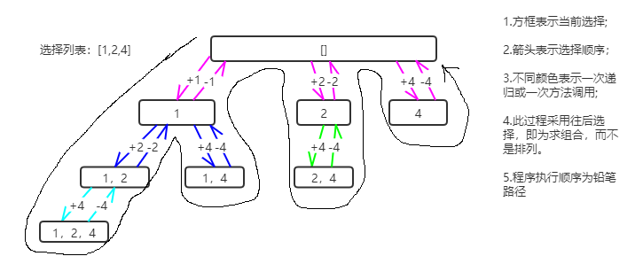

-一、二分查找

**思路很简单，细节是魔鬼。**

1、计算 mid 时需要技巧防止溢出，建议写成: **mid = left + (right - left) / 2**

2、注意while循环结束条件、left、mid、right变化

寻找目标值，返回下标

```java
int binarySearch(int[] nums, int target) {
    int left = 0;
    int right = nums.length - 1;
    while(left <= right){
        int mid = (left + right) / 2;
        if(nums[mid] == target){
            return mid;
        }else if(nums[mid] < target){
            left = mid + 1;
        }else if(nums[mid] > target){
            right = mid - 1;
        }
    }
    return -1;
}
```

- 为什么 while 循环的条件中是 <=，而不是 < ？

  答：因为初始化 right 的赋值是 nums.length - 1，即最后一个元素的索引，而不是 nums.length。这二者可能出现在不同功能的二分查找中，区别是：前者相当于两端都闭区间 [left, right]，后者相当于左闭右开区间 [left, right)，因为索引大小为 nums.length 是越界的。我们这个算法中使用的是 [left, right] 两端都闭的区间。**这个区间就是每次进行搜索的区间，我们不妨称为「搜索区间」(search space)**。 while 循环什么时候应该终止？**搜索区间为空的时候应该终止**，意味着你没得找了，就等于没找到嘛。while(left <= right)的终止条件是 left == right + 1，写成区间的形式就是 [right + 1, right]，或者带个具体的数字进去 [3, 2]，可见**这时候搜索区间为空**，因为没有数字既大于等于 3 又小于等于 2 的吧。所以这时候 while 循环终止是正确的，直接返回 -1 即可。

- 为什么 left = mid + 1，right = mid - 1？

  刚才明确了「搜索区间」这个概念，而且本算法的搜索区间是两端都闭的，即 [left, right]。那么当我们发现索引 mid 不是要找的 target 时，如何确定下一步的搜索区间呢？当然是去搜索 [left, mid - 1] 或者 [mid + 1, right] 对不对？因为 mid 已经搜索过，应该从搜索区间中去除。


#### 1、搜索旋转数组

题1之[33. 搜索旋转排序数组](https://leetcode-cn.com/problems/search-in-rotated-sorted-array/)

> 整数数组 nums 按升序排列，数组中的值 互不相同 。
>
> 在传递给函数之前，nums 在预先未知的某个下标 k（0 <= k < nums.length）上进行了 旋转，使数组变为 [nums[k], nums[k+1], ..., nums[n-1], nums[0], nums[1], ..., nums[k-1]]（下标 从 0 开始 计数）。例如， [0,1,2,4,5,6,7] 在下标 3 处经旋转后可能变为 [4,5,6,7,0,1,2] 。
>
> 给你 旋转后 的数组 nums 和一个整数 target ，如果 nums 中存在这个目标值 target ，则返回它的索引，否则返回 -1 。
>
> ```
> 输入：nums = [4,5,6,7,0,1,2], target = 0
> 输出：4
> ```

第一次做法（自己实现）：

- 首先遍历得出被旋转的个数（即有多少个元素被移动到了尾部）
- 然后根据移动个数，将原数组重新生成新数组。即排序。
- 然后在排序新数组中用二分查找法定位目标值，然后根据旋转的个数计算出原数组的下标值

```java
public int search(int[] nums, int target) {
        if(nums.length <= 1){
            return nums[0] == target ? 0 : -1;
        }
        int index = 1;
        while(index < nums.length && nums[index] > nums[index-1]){
            index++;
        }
        //被翻转了多少个，3
        int count = nums.length - index;
        int[] result = new int[nums.length];
        //native操作
        System.arraycopy(nums, index, result, 0, count);
        System.arraycopy(nums, 0, result, count, index);
        int start =0;
        int end = result.length - 1;
        while(start <= end){
            int mid = (end + start) / 2;
            if(result[mid] == target){
                return mid < count ? mid + index : mid - count;
            }else if(result[mid] < target){
                start = mid + 1;
            }else if(result[mid] > target){
                end = mid - 1;
            }
        }
        return -1;
    }
```

以上实现就是笨！！

题解后做法：**直接二分查找！**

分析：被旋转的数组二分查找时，从mid出切分，必然至少一边是有序的！如此我们在二分查找过程中，判断哪边是有序的，然后分情况缩小查找范围即可！

```java
public int search3(int[] nums, int target){
        if(nums.length <= 1){
            return nums[0] == target ? 0 : -1;
        }
        int len = nums.length;
        int start = 0;
        int end = len - 1;
        while(start <= end){
            int mid = (start + end) / 2;
            if(nums[mid] == target){
                return mid;
            }else if(nums[mid] >= nums[start]){
                //左边有序,需判断是否在左边区间内
                if(nums[start] <= target && target < nums[mid]){
                    end = mid - 1;
                }else {
                    start = mid + 1;
                }
            }else {
                //右边有序,判断是否在右侧区间内
                if(nums[mid] < target && target <= nums[end]){
                    end = mid - 1;
                }else {
                    start = mid + 1;
                }
            }
        }
        return -1;
    }
```

变形：

> 假设按照升序排序的数组在预先未知的某个点上进行了旋转。
>
> ( 例如，数组 [0,0,1,2,2,5,6] 可能变为 [2,5,6,0,0,1,2] )。
>
> 编写一个函数来判断给定的目标值是否存在于数组中。若存在返回 true，否则返回 false。
>
> 该题是以上的延伸，本题中nums数组元素可以重复。

分析二分查找法：

由于数组元素存在重复，所以仅靠`nums[mid] >= nums[start]`无法判断出左边是有序的，此时可以拆分为两个条件：**`nums[mid] > nums[start]`时左边一定有序，如果`nums[mid]==nums[start]`，此时只需要将start++即可。**

```java
public boolean search4(int[] nums, int target){
    	if(nums.length <= 1){
            return nums[0] == target;
        }
        int len = nums.length;
        int start = 0;
        int end = len - 1;
        while(start <= end){
            int mid = (start + end) / 2;
            if(nums[mid] == target){
                return true;
            }
            if(nums[mid] == nums[start]){
                start++;
                continue;
            }
            if(nums[mid] >= nums[start]){
                //左边有序,需判断是否在左边区间内
                if(nums[start] <= target && target < nums[mid]){
                    end = mid - 1;
                }else {
                    start = mid + 1;
                }
            }else {
                //右边有序,判断是否在右侧区间内
                if(nums[mid] < target && target <= nums[end]){
                    end = mid - 1;
                }else {
                    start = mid + 1;
                }
            }
        }
        return false;
    }
```

#### 2、旋转数组找最小值

> 153：假设按照升序排序的数组在预先未知的某个点上进行了旋转。例如，数组 [0,1,2,4,5,6,7] 可能变为 [4,5,6,7,0,1,2] 。
>
> 请找出其中最小的元素。
>

还是通过相同的二分查找方式，如果某一区间有序，则只需取该区间第一个，然后到另一区间搜索即可。

```java
public int findMin(int[] nums){
        int current = nums[0];
        int start = 0;
        int end = nums.length - 1;
        while(start <= end){
            int mid = (start + end) / 2;
            if(nums[mid] >= nums[start]){
                //左侧有序，只需取该区间第一个最小的值更新，然后跳到另一个区间即可
                if(nums[start] < current){
                    current = nums[start];
                }
                start = mid + 1;
            }else {
                //右侧有序
                if(nums[mid] < current){
                    current = nums[mid];
                }
                end = mid - 1;
            }
        }
        return current;
    }
}
```

旋转数组最小值变种（可重复）【154】：

> 154：假设按照升序排序的数组在预先未知的某个点上进行了旋转。
>
> ( 例如，数组 [0,1,2,4,5,6,7] 可能变为 [4,5,6,7,0,1,2] )。
>
> 请找出其中最小的元素。
>
> 注意数组中可能存在重复的元素。
>

与普通版不同的关键点还是在如果`nums[mid]==nums[start]`，此时只需要将start++即可。

```java
int current = nums[0];
        int start = 0;
        int end = nums.length - 1;
        while(start <= end){
            int mid = (start + end) / 2;
            if(nums[mid] < current){
                current = nums[mid];
            }//如果相等，start++
            if(nums[mid] == nums[start]){
                start++;
                continue;
            }
            if(nums[mid] > nums[start]){
                //左侧有序
                if(nums[start] < current){
                    current = nums[start];
                }
                start = mid + 1;
            }else {
                //右侧有序
                if(nums[mid] < current){
                    current = nums[mid];
                }
                end = mid - 1;
            }
        }
        return current;
```

#### 3、两个有序数组中查询中位数

> 给定两个大小分别为 `m` 和 `n` 的正序（从小到大）数组 `nums1` 和 `nums2`。请你找出并返回这两个正序数组的 **中位数** 。

如果直接排序后生成新数组查找，时间复杂度为O(m+n)。题目要求复杂度为O(log(m+n))。

###### 题解一之通用化成【求两个有序数组中第K小的元素】：

```
/* 主要思路：要找到第 k (k>1) 小的元素，那么就取 pivot1 = nums1[k/2-1] 和 pivot2 = nums2[k/2-1] 进行比较
 * 这里的 "/" 表示整除
 * nums1 中小于等于 pivot1 的元素有 nums1[0 .. k/2-2] 共计 k/2-1 个
 * nums2 中小于等于 pivot2 的元素有 nums2[0 .. k/2-2] 共计 k/2-1 个
 * 取 pivot = min(pivot1, pivot2)，两个数组中小于等于 pivot 的元素共计不会超过 (k/2-1) + (k/2-1) <= k-2 个
 * 这样 pivot 本身最大也只能是第 k-1 小的元素
 * 如果 pivot = pivot1，那么 nums1[0 .. k/2-1] 都不可能是第 k 小的元素。把这些元素全部 "删除"，剩下的作为新的 nums1 数组
 * 如果 pivot = pivot2，那么 nums2[0 .. k/2-1] 都不可能是第 k 小的元素。把这些元素全部 "删除"，剩下的作为新的 nums2 数组
 * 由于我们 "删除" 了一些元素（这些元素都比第 k 小的元素要小），因此需要修改 k 的值，减去删除的数的个数
 */
```

```java
//题解
public double findMedianSortedArrays(int[] nums1, int[] nums2) {
        int size = nums1.length + nums2.length;
        double k1MinValue = getNumberKMinValue(nums1, nums2, size / 2 + 1);
        if(size % 2 == 1){
            return k1MinValue;
        }else {
            double numberKMinValue = getNumberKMinValue(nums1, nums2, size / 2);
            return (numberKMinValue + k1MinValue) / 2.0;
        }

 }

/**
*表示从两个数组中查找出第k小的元素
*/
private getNumberKMinValue(int[] nums1, int[] nums2, int k){
 	int i = 0;
    int j = 0;
    while(true){
        //循环结束条件
        if(i == nums1.length){
            return nums2[j+k-1];
        }else if(j == nums2.length){
            return nums1[i+k-1];
        }
        if(k == 1){
            return Math.min(nums1[i], nums2[j]);
        }
        //正常情况，按半切分剔除,先各拿half个元素出来，取二者尾部处最小的，即能确定该值在两个数组中至少比half个元素小
        int half = k / 2;
        int newIndex1 = Math.min(i+half, nums1.length)-1;
        int newIndex2 = Math.min(j+half, nums2.length)-1;
        if(nums1[newIndex1] <= nums2[newIndex2]){
            //nums1中half处元素更小，则更新k值，且此时由于[i, half]已参与比较故需“删除”该部分即更新i值
            k -= newIndex1 - i + 1;
            i = newIndex1 + 1;
        }else{
    		k -= newIndex2 -i + 1;
            j = newIndex2 + 1;
        }
    }
}
```

###### 题解二：**划分数组**。

分析一下数组中位数（比如i处为中位数索引）的性质：

- 数组为奇数时，左边部分的元素个数len1 = 右边元素个数len2 + 1，数组为偶数时len1=len2;

- 同时左边最大的元素max(left) <= min(right)右边最小的元素

  

那么为偶数时，假如{A,B} 中的所有元素已经被划分为相同长度的两个部分，且前一部分中的元素总是小于或等于后一部分中的元素。中位数就是前一部分的最大值和后一部分的最小值的平均值：
$$
median= 

\frac{max(left\_part)+min(right\_part)}{2}
​
$$
奇数时，{A,B} 中的所有元素已经被划分为两个部分，前一部分比后一部分多一个元素，且前一部分中的元素总是小于或等于后一部分中的元素。中位数就是前一部分的最大值：

$$
median=max(left\_part)
$$
因此可以搜索数组A，根据枚举的i值去确定j值（因为i+j = (len1+len2)/2）,然后得出满足条件的median值。

```java
public double findMedianSortedArrays2(int[] nums1, int[] nums2) {
        int len1 = nums1.length;
        int len2 = nums2.length;
        int cutI = 0;
        int cutJ;
        int leftMedium = 0;
        int rightMedium = 0;
        //int leftLen = cutI + 1 + cutJ + 1; int rightLen = len1 + len2 - leftLen
        // 二者要相等，即可得等式cutI + cutJ = (len1 + len2) / 2
        //枚举cutI的值，根据cutI的值来确定cutJ的值，以满足前部分数组的最大值小于等于后部分数组的最小值
        while(cutI <= len1){
            cutJ = (len1 + len2 + 1) / 2 - cutI; //前半部分多一个元素
            //nums1数组分割后前部分的最大值
            int nums_im1 = (cutI == 0 ? Integer.MIN_VALUE : nums1[cutI - 1]);
            //nums1数组分割后后部分的最小值
            int nums_i = (cutI == len1) ? Integer.MAX_VALUE : nums1[cutI];
            //nums2数组分割后前部分的最大值
            int nums_jm1 = (cutJ == 0 ? Integer.MIN_VALUE : nums2[cutJ - 1]);
            //nums2数组分割后后部分的最小值
            int nums_j = (cutJ == len2) ? Integer.MAX_VALUE : nums2[cutJ];
            if(Math.max(nums_im1, nums_jm1) <= Math.min(nums_i, nums_j)){
                leftMedium = Math.max(nums_im1, nums_jm1);
                rightMedium = Math.min(nums_i, nums_j);
                break;
            }else {
                cutI++;
            }
        }
        return (len1 + len2) % 2 == 0 ? (leftMedium + rightMedium) / 2.0 : leftMedium;

    }
```

另外我们可以对 i 在 [0,m] 的区间上进行二分搜索，找到最大的满足 A[i−1]≤B[j] 的 ii值，就得到了划分的方法。此时，划分前一部分元素中的最大值，以及划分后一部分元素中的最小值，才可能作为就是这两个数组的中位数

```java
public double findMedianSortedArrays3(int[] nums1, int[] nums2) {
        int len1 = nums1.length;
        int len2 = nums2.length;
        int leftMedium = 0;
        int rightMedium = 0;
        int left = 0;
        int right = len1 - 1;
        //int leftLen = cutI + 1 + cutJ + 1; int rightLen = len1 + len2 - leftLen
        // 二者要相等，即可得等式cutI + cutJ = (len1 + len2) / 2
        //枚举cutI的值，根据cutI的值来确定cutJ的值，以满足前部分数组的最大值小于等于后部分数组的最小值
        while(left <= right){
            int cutI = (left + right) / 2;
            int cutJ = (len1 + len2 + 1) / 2 - cutI; //前半部分多一个元素
            //nums1数组分割后前部分的最大值
            int nums_im1 = (cutI == 0 ? Integer.MIN_VALUE : nums1[cutI - 1]);
            //nums1数组分割后后部分的最小值
            int nums_i = (cutI == len1) ? Integer.MAX_VALUE : nums1[cutI];
            //nums2数组分割后前部分的最大值
            int nums_jm1 = (cutJ == 0 ? Integer.MIN_VALUE : nums2[cutJ - 1]);
            //nums2数组分割后后部分的最小值
            int nums_j = (cutJ == len2) ? Integer.MAX_VALUE : nums2[cutJ];
            //如果nums1的前部分最大值比nums2的后部分最小值还小，说明cutI还可以尝试往后移动切分
            if(nums_im1 <= nums_j){
                leftMedium = Math.max(nums_im1, nums_jm1);
                rightMedium = Math.min(nums_i, nums_j);
                left = cutI + 1;
            }else {
                right = cutI - 1;
            }
        }
        return (len1 + len2) % 2 == 0 ? (leftMedium + rightMedium) / 2.0 : leftMedium;

    }
```

#### 4、最长连续序列

> 给定一个未排序的整数数组 nums ，找出数字连续的最长序列（不要求序列元素在原数组中连续）的长度。
>
>  进阶：你可以设计并实现时间复杂度为 O(n) 的解决方案吗？
>
> 示例 1：输入：nums = [100,4,200,1,3,2]
> 输出：4
> 解释：最长数字连续序列是 [1, 2, 3, 4]。它的长度为 4。
> 示例 2：输入：nums = [0,3,7,2,5,8,4,6,0,1]
> 输出：9

###### 双指针（自己）

自己思路，先排序，然后遍历数组用双指针统计长度。但是当前时间复杂度不符合O(n)要求。

```java
public int longestConsecutive(int[] nums) {
        if(nums.length <= 1){
            return nums.length;
        }
        Arrays.sort(nums);
        int repeat = 0; //重复次数
        int index = 0; //子序列的头元素
        int result = 1; 
        int i = 1;
        for (; i < nums.length; i++) {
            if(nums[i] == nums[i-1]){
                repeat++;//相等的只记录重复次数
                continue;
            }
            if(nums[i] - nums[i-1] == 1){
                continue;//差1的继续迭代
            }else {//否则进行记录当前最长的子序列，并重置index指针，归零重复值
                result = Math.max(result, i - index - repeat);
                index = i;
                repeat = 0;
            }
        }
        return Math.max(result, i - index - repeat); //此处注意，否则会遗漏
    }
```


###### 哈希表法

遍历数组，将每个元素存入HashSet中。然后二次遍历数组，如果该值的下一个值存在则累加次数，直到下一个值不存在为止。**关键是如果某值的上一个值存在，则无需处理该值，因为遍历到上一个值的时候会一起处理从而避免了重复处理。**

```java
public int longestConsecutive2(int[] nums) {
        Set<Integer> set = new HashSet<>();
        for (int i = 0; i < nums.length; i++) {
            set.add(nums[i]);
        }
        int result = 1;
        for (int i = 0; i < nums.length; i++) {
            int current = nums[i];
            int currentLen = 1;
            if(set.contains(current-1)){//上一个值存在，则跳过
                continue;
            }
            int temp = current;
            while(set.contains(++temp)){//下一个值存在则累加
                currentLen++;
            }
            result = Math.max(result, currentLen);
        }
        return result;
    }
```


#### 5、两数之和

> 


#### 6、三数之和

> 给你一个包含 n 个整数的数组 nums，判断 nums 中是否存在三个元素 a，b，c ，使得 a + b + c = 0 ？请你找出所有和为 0 且不重复的三元组。
>
> 注意：答案中不可以包含重复的三元组。
>
> **示例 ：**
>
> ```
> 输入：nums = [-1,0,1,2,-1,-4]
> 输出：[[-1,-1,2],[-1,0,1]]
> ```

解法：循环，然后左右夹逼法，需要注意剔除重复的组合。**由此也可以发散到求k个元素和为target的算法：即使用k-2次循环，然后最后两个元素进行左右夹逼**

```java
public List<List<Integer>> threeSum(int[] nums) {
    List<List<Integer>> result = new ArrayList<>();
    if(nums.length <= 2){
        return result;
    }
    int len = nums.length;
    Arrays.sort(nums);//排序成为有序数组
    for(int i = 0; i < nums.length - 2; i++){
        if(i > 0 && nums[i] == nums[i-1]){
            continue;//如果跟前一个i值相等，则说明遍历过组合，剔除掉
        }
        int j = i+1;//左边的遍历指针
        int k = len-1;//右边的遍历指针
        while(j < k){//开始夹逼
            int valueJ = nums[j];
            int valueK = nums[k];
            int des = nums[i]+nums[j]+nums[k];
            if(des == 0){
                result.add(Arrays.asList(nums[i], nums[j], nums[k]));
                //剔除重复，找到下一个不同的j和k
                while(j < len-1 && valueJ == nums[++j]);
                while(k > 0 && valueK == nums[--k]);
            }else if(des > 0){
                while(k > 0 && valueK == nums[--k]);//找到下一个不同的值对应的k
            }else{
                while(j < len-1 && valueJ == nums[++j]);//找到下一个不同的值对应的j
            }
        }
        return result;
    }
    
｝
```

#### 7、最接近的三数之和

> 给定一个包括 n 个整数的数组 nums 和 一个目标值 target。找出 nums 中的三个整数，使得它们的和与 target 最接近。返回这三个数的和。假定每组输入只存在唯一答案。
>
> 示例：
>
> 输入：nums = [-1,2,1,-4], target = 1
> 输出：2
> 解释：与 target 最接近的和是 2 (-1 + 2 + 1 = 2) 。

与上题解法一致。

```java
public int threeSumClosest(int[] nums, int target) {
        Arrays.sort(nums);
        int len = nums.length;
        int result = Integer.MAX_VALUE;
        for (int i = 0; i < len - 2; i++) {
            if(i > 0 && nums[i] == nums[i-1]){
                continue;
            }
            int j = i + 1;
            int k = len - 1;
            while(j < k){
                int valueJ = nums[j];
                int valueK = nums[k];
                int sum = nums[i] + nums[j] + nums[k];
                if(result == Integer.MAX_VALUE || Math.abs(sum-target) < Math.abs(result-target)){
                    result = sum;
                }
                if(sum == target){
                    break;
                }else if(sum < target){
                    while(j < len - 1 && valueJ == nums[++j]);
                }else {
                    while(k > 0 && valueK == nums[--k]);
                }
            }
        }
        return result;
    }
```

#### 8、四数之和

> 给定一个包含 n 个整数的数组 nums 和一个目标值 target，判断 nums 中是否存在四个元素 a，b，c 和 d ，使得 a + b + c + d 的值与 target 相等？找出所有满足条件且不重复的四元组。
>
> 注意：答案中不可以包含重复的四元组。
>

与三数之和解法一致，但要考虑去重的区别。

```java
public List<List<Integer>> fourSum(int[] nums, int target) {
        List<List<Integer>> result = new ArrayList<>();
        if(nums.length <= 3){
            return result;
        }
        int len = nums.length;
        Arrays.sort(nums);//排序
        for (int i = 0; i < len -3; i++) {
            if (i > 0 && nums[i] == nums[i - 1]) {//第一个数如果重复选取则跳过
                continue;
            }
            //当前第一个数选择后，如果最小的组合都大于target，则后续的没有满足条件的了，无需选择了
            if (nums[i] + nums[i + 1] + nums[i + 2] + nums[i + 3] > target) {
                break;
            }
            //当前第一个数选择后，如果最大的组合都小于target，则不用以第一个数为基础了，跳过
            if (nums[i] + nums[len - 3] + nums[len - 2] + nums[len - 1] < target) {
                continue;
            }
            for (int j = i+1; j < len-2; j++) {
                if (j > i + 1 && nums[j] == nums[j - 1]) {//去重复
                    continue;
                }
                //优化判断
                if (nums[i] + nums[j] + nums[j + 1] + nums[j + 2] > target) {
                    break;
                }
                //优化判断
                if (nums[i] + nums[j] + nums[len - 2] + nums[len - 1] < target) {
                    continue;
                }
                int m = j + 1;
                int k = len - 1;
                while(m < k){
                    int valueM = nums[m];
                    int valueK = nums[k];
                    int cur = nums[i] + nums[j] + nums[m] + nums[k];
                    if(cur == target){
                        result.add(Arrays.asList(nums[i], nums[j], nums[m], nums[k]));
                        while(m < len - 1 && valueM == nums[++m]);
                        while(k > 0 && valueK == nums[--k]);
                    }else if(cur < target){
                        while(m < len - 1 && valueM == nums[++m]);
                    }else {
                        while(k > 0 && valueK == nums[--k]);
                    }
                }
            }
        }
        return result;
    }
```

#### 9.移除数组元素

> 给你一个数组 nums 和一个值 val，你需要 原地 移除所有数值等于 val 的元素，并返回移除后数组的新长度。
>
> 不要使用额外的数组空间，你必须仅使用 O(1) 额外空间并 原地 修改输入数组。
>
> 元素的顺序可以改变。你不需要考虑数组中超出新长度后面的元素。
>

题解：不使用额外的空间，即在原数组上进行操作。可使用一个index指针记录符合条件的元素位置，在遍历过程中不断更新index值。也是双指针的运用！

```java
public int removeElement(int[] nums, int val){
        int index = 0;
        for (int i = 0; i < nums.length; i++) {
            if(nums[i] != val){
                nums[index++] = nums[i];
            }
        }
        return index;
    }
```

类似的反转链表：只需要改变链表的next指针的指向，直接将链表反转 ，而不用重新定义一个新的链表。另一种方式是先删除节点，然后头插法实现反转。

```java
public ListNode reverseNode(ListNode node){
    if(node == null || node.next == null){return node;}
    ListNode pre = null;
    ListNode cur = node;
    ListNode temp = null;
    while(cur != null){//细细体会
        temp = cur.next;
        cur.next = pre;
        pre = cur;
        cur = temp;
     
    }
}
```

#### 10.获取数组的下一个序列

> 实现获取 下一个排列 的函数，算法需要将给定数字序列重新排列成字典序中下一个更大的排列。如果不存在下一个更大的排列，则将数字重新排列成最小的排列（即升序排列）。必须 原地 修改，只允许使用额外常数空间。
>
> ```
> 输入：nums = [1,2,3]
> 输出：[1,3,2]
> ```

即获取下一个更大的数字。主要是在理解过程（即如何得到下一个排列数）：

- 首先从右边开始遍历，直到找到一个元素nums[i]<nums[i+1]，即得到一个较小值
- 然后在剩余的右边区间[i+1, len)区间从右边开始遍历，找到第一个nums[j]>nums[i]即较大值
- 交换nums[i]和nums[j]，然后对区间[i+1, len]进行升序排列，由分析可知该区间原始顺序为降序排列，即只需使用双指针算法反转该区间即可。

```java
public void getPermutation(int[] nums){
    if(nums.length <= 1){
        return;
    }
    int len = nums.length;
    int  i = len - 2;
    while(i >= 0 && nums[i] >= nums[i+1]){
        i--;
    }
    if(i != -1){
        int j = len - 1;
        while(j >= i+1 && nums[j] <= nums[i]){
            j--;
        }
        swap(nums, i, j);
    }
    reverse(nums, left, right);
}

public void reverse(int[] nums, int left, int right){
    while(left < right){
        swap(nums, left, right);
        left++;
        right--;
    }
}
public void swap(int[] nums, int i, int j){
    int temp = nums[i];
    nums[i] = nums[j];
    nums[j] = nums[i];
}
```

升级变种（第k个排列）：

> 给出集合 [1,2,3,...,n]，其所有元素共有 n! 种排列。按大小顺序列出所有排列情况，并一一标记，当 n = 3 时, 所有排列如下：
>
> "123"
> "132"
> "213"
> "231"
> "312"
> "321"
> 给定 n 和 k，返回第 k 个排列。
>
>  示例 1：
>
> 输入：n = 3, k = 3
> 输出："213"

题解：只需要套用上面求下一个排列的方法，循环k次即可。进阶的做法是利用`康托展开和逆康托展开`的方法。康托展开公式主要表示的就是在n个不同元素的全排列中, 比当前排列组合小的个数，那么也可以表示当前排列组合在n个不同元素的全排列中的名次。而逆康托展开主要用于根据排列的名次得到具体的排列数。只需要记住**排列数有个康托排列公式即可**。


类似问题：

> 给你两个 没有重复元素 的数组 nums1 和 nums2 ，其中nums1 是 nums2 的子集。
>
> 请你找出 nums1 中每个元素在 nums2 中的下一个比其大的值。
>
> nums1 中数字 x 的下一个更大元素是指 x 在 nums2 中对应位置的右边的第一个比 x 大的元素。如果不存在，对应位置输出 -1 。
>
> 示例 1:
>
> 输入: nums1 = [4,1,2], nums2 = [1,3,4,2].
> 输出: [-1,3,-1]
>
> 解释:
>     对于 num1 中的数字 4 ，你无法在第二个数组中找到下一个更大的数字，因此输出 -1 。
>     对于 num1 中的数字 1 ，第二个数组中数字1右边的下一个较大数字是 3 。
>     对于 num1 中的数字 2 ，第二个数组中没有下一个更大的数字，因此输出 -1 。

题解：可以通过**栈的单调性**来实现。即遍历nums1数组，利用栈的特性，如果当前入栈元素大于栈顶元素则栈顶元素出栈并记录栈顶元素的下一个最大值为当前入栈元素，直到栈为空或栈顶元素大于入栈元素。

```java
//num1是子集,nums2是全量
public int[] nextGreaterElement(int[] nums1, int[] nums2) {
        Map<Integer, Integer> result = new HashMap<>(nums2.length);
        Deque<Integer> stack = new ArrayDeque<>();
    //遍历nums2，通过栈的单调性记录所有元素的下一个较大值
        for (int i = 0; i < nums2.length; i++) {
            while(!stack.isEmpty() && stack.peekLast() < nums2[i]){
                result.put(stack.removeLast(), nums2[i]);
            }
            stack.offerLast(nums2[i]);
        }
    //然后获取结果
        int[] res = new int[nums1.length];
        for (int i = 0; i < nums1.length; i++) {
            res[i] = result.getOrDefault(nums1[i], -1);
        }
        return res;
    }
```

变种：

> 给定一个循环数组（最后一个元素的下一个元素是数组的第一个元素），输出每个元素的下一个更大元素。数字 x 的下一个更大的元素是按数组遍历顺序，这个数字之后的第一个比它更大的数，这意味着你应该循环地搜索它的下一个更大的数。如果不存在，则输出 -1。

```java
public int[] nextGreaterElements(int[] nums) {
        int[] result = new int[nums.length];
        Arrays.fill(result, -1);
        Deque<Integer> stack = new ArrayDeque();
        int len = nums.length;
        for (int i = 0; i < len * 2 - 1; i++) {
            while(!stack.isEmpty() && nums[stack.peekLast()] < nums[i%len]){
                result[stack.removeLast()] = nums[i%len];
            }
            stack.addLast(i % len);
        }
        return result;
    }
```

##### 知识储备：单调栈

从栈底元素到栈顶元素呈单调递增或单调递减，栈内序列满足单调性的栈。**单调栈主要运用在给你一个数组序列，在遍历数组时，需要向前查看元素的这种情况，此时将前面的元素入栈，形成单调栈。**具体再结合题目的用意，加以利用。

经典示例：

- 数组的下一个排列（如上题）
- 柱状图中最大的矩形

> ```text
> 给定 n 个非负整数，用来表示柱状图中各个柱子的高度。每个柱子彼此相邻，且宽度为 1 。
> 求在该柱状图中，能够勾勒出来的矩形的最大面积。
> 以下是柱状图的示例，其中每个柱子的宽度为 1，给定的高度为 [2,1,5,6,2,3]。
> 图中阴影部分为所能勾勒出的最大矩形面积，其面积为 10 个单位。
> 示例:
> 输入: [2,1,5,6,2,3]
> 输出: 10
> ```


按照单调栈的思路，递增时入栈，其余时计算面积并出栈，直到继续递增时入栈。面积将通过计算当前位置和栈顶元素所在位置的宽度查，再乘上元素的height值的思路来做这题，具体过程：

- 遍历数组元素，当待入栈元素a[i]大于栈顶元素a[n]时，直接入栈；
- 当待入栈元素a[i]不大于栈顶元素a[n]时，此时计算元素a[n]所参与构成的最大矩形面积；
  - 栈中元素a[n]如果存在前一个元素a[m]即不为栈底元素,则说明a[n]在区间(m, i-1]中最小的，即a[n]能构成最大面积为a[n]*(i-1-m)，计算完成后a[n]出栈，继续循环判断*
  - *栈中元素a[n]如果是栈底元素，同理说明a[n]在区间[0, i-1]即(-1, i-1]中最小的，能构成的最大面积为a[n]*(i-1-(-1))，计算完成后a[n]出栈，继续循环判断
- 为了遍历结束后能计算所有元素的各自构成的最大面积，即可以在数组元素全部入栈后，再入栈一个Integer.MIN_VALUE已确保所有元素都进行计算然后出栈。

总结：即利用栈的单调性，当待入栈元素比栈顶元素小的时候，计算栈顶元素所参与构成的面积，然后出栈，再依次比较栈顶元素，又计算又出栈。直到满足单调栈，最后全部入栈后再入栈一个Integer.MIN_VALUE触发剩余栈中元素构成面积计算。

```java
public int largestRectangleArea(int[] heights) {
        //定义队列，作为栈使用
        Deque<Integer> stack = new ArrayDeque();
        //最大矩形面积
        int area = 0;
        for (int i = 0; i < heights.length; i++) {
            //对各元素进行判断，如果栈顶元素大于等于当前待入栈元素，则计算栈顶元素所构成的最大面积然后出栈，直到栈顶元素小于当前元素或者栈为空时，对当前元素进行入栈
            while(!stack.isEmpty() && heights[stack.peek()] >= heights[i]){
                area = Math.max(area, getCurrentArea(stack, heights, i));
            }
            stack.push(i);
        }
        //数组元素全部入栈后，再将最小整数进行同样的入栈逻辑，以计算栈中所有元素各自所构成的最大面积
        while (!stack.isEmpty() && heights[stack.peek()] >= Integer.MIN_VALUE){
            area = Math.max(area, getCurrentArea(stack, heights, heights.length));
        }
        return area;
    }

    /**
    *获取当前栈顶元素所构成的最大面积，由上分析知公式为：a[n] * (i-1 -m)
    */
    public int getCurrentArea(Deque<Integer> stack, int[] nums, int index){
        Integer start = stack.pop();
        return nums[start] * (index -1 - (stack.isEmpty() ? -1 : stack.peek()));
    }
```

知识储备：队列

顶层**接口**Queue，继承了Collection接口。主要声明了6个基础方法`add、offer、remove、poll、element、peek`。Queue其拥有三个直接接口子类：

- AbstactQueue

  AbstactQueue继承自Queue，其主要重写了add、remove、element方法。重写也很简单，就是内部分别调用offer、poll、peek方法，若元素不存在则抛出异常。其下属部分常见的具体实现类大部分均为继承自AbstractQueue，实现BlockingQueue接口。

- BlockingQueue

其主要新增定义了take和put方法，由其实现可知二者为阻塞方法。常见阻塞队列实现类：ArrayBlockingQueue、SynchronousQueue、LinkedBlockingQueue、PriorityBlockingQueue、DelayQueue、BlockingDeque（双向阻塞队列）

BlockingQueue的操作可以分为下面四类：

| 操作类型 | Throws exception | Special value | Blocks         | Times out            |
| -------- | ---------------- | ------------- | -------------- | -------------------- |
| Insert   | add(e)           | offer(e)      | put(e)         | offer(e, time, unit) |
| Remove   | remove()         | poll()        | take()         | poll(time, unit)     |
| Examine  | element()        | peek()        | not applicable | not applicable       |

第一类是会抛出异常的操作，当遇到插入失败，队列为空的时候抛出异常。

第二类是不会抛出异常的操作。

第三类是会Block的操作。当Queue为空或者达到最大容量的时候。

第四类是time out的操作，在给定的时间里会Block，超时会直接返回。


- Deque

  双端队列，继承自Queue。在原有的基础上定义了xxxFirst和xxxLast方法，并且新定义了针对栈场景的push和pop方法。其常见的实现类有BlockingDeque、LinkedList。

  同样的，我们也可以将Deque的方法用下面的表格来表示，Deque的方法可以分为对头部的操作和对尾部的操作：

  | 方法类型 | Throws exception | Special value | Throws exception | Special value |
  | -------- | ---------------- | ------------- | ---------------- | ------------- |
  | Insert   | addFirst(e)      | offerFirst(e) | addLast(e)       | offerLast(e)  |
  | Remove   | removeFirst()    | pollFirst()   | removeLast()     | pollLast()    |
  | Examine  | getFirst()       | peekFirst()   | getLast()        | peekLast()    |
  和Queue的方法描述基本一致，这里就不多讲了。

  **当Deque以 FIFO (First-In-First-Out)的方法处理元素的时候，Deque就相当于一个Queue。**

  **当Deque以LIFO (Last-In-First-Out)的方式处理元素的时候，Deque就相当于一个Stack**。

  ArrayDeque类中，add/offer、remove/poll方法是针对队列的使用，即实际为addLast/offerLast和removeFirst/pollFisrt。而push和pop是针对栈的使用，实际为addFirst和removeFirst。peek方法都是peekFirst。 即使用ArrayDeque作为栈应用的话，可以使用push、pop、peek的组合！

  

  另外TransferQueue继承自BlockingQueue，为什么叫Transfer呢？因为TransferQueue提供了一个transfer的方法，生产者可以调用这个transfer方法，从而等待消费者调用take或者poll方法从Queue中拿取数据。

  还提供了非阻塞和timeout版本的tryTransfer方法以供使用。

  我们举个TransferQueue实现的生产者消费者的问题。

- ConcurrentLinkedQueue

 并发队列，通过CAS控制。


Stack类。继承自Vector类（线程安全的）。


#### 11.接雨水

> 给定 n 个非负整数表示每个宽度为 1 的柱子的高度图，计算按此排列的柱子，下雨之后能接多少雨水。
>
>  
>
> 示例 1：
>
> 输入：height = [0,1,0,2,1,0,1,3,2,1,2,1]
> 输出：6
> 解释：上面是由数组 [0,1,0,2,1,0,1,3,2,1,2,1] 表示的高度图，在这种情况下，可以接 6 个单位的雨水（蓝色部分表示雨水）。 
> 示例 2：
>
> 输入：height = [4,2,0,3,2,5]
> 输出：9

一样使用单调栈，当递减时入栈，当前入栈元素大于栈顶元素时则开始计算夹缝面积，计算完后如果栈顶元素大于当前待入栈元素则栈顶出栈，否则当前元素入栈（即当前元素所形成的夹缝计算已结束）。

```java
public int trap(int[] height) {
    	//存储下标和值
        Stack<Map.Entry<Integer, Integer>> stack = new Stack<>();
        int area = 0;
        for (int i = 0; i < height.length; i++) {
            int cur = height[i];
            int bottom = 0; //bottom表示当前应扣除的底部高度，凹陷处迭代    
            while(!stack.isEmpty() ){
                Map.Entry<Integer, Integer> top = stack.peek();//栈顶元素
                //先计算面积，如果是递减的或挨着的，面积计算为0
                area += (i - 1 - top.getKey()) * (Math.min(top.getValue(), cur) - bottom);
                bottom = stack.peek().getValue();
                if(top.getValue() > cur){
                    break;//递减入栈
                }else {
                    stack.pop();//递增时迭代计算形成的凹陷
                }
            }
            Map<Integer, Integer> map = new HashMap<>();
            map.put(i, cur);
            stack.push(map.entrySet().iterator().next());
        }
        return area;
        
    }
```

#### 12.旋转图像

> 给定一个 n × n 的二维矩阵 matrix 表示一个图像。请你将图像顺时针旋转 90 度。
>
> 你必须在 原地 旋转图像，这意味着你需要直接修改输入的二维矩阵。请不要 使用另一个矩阵来旋转图像。
>
> 
>
> ```
> 输入：matrix = [[1,2,3],[4,5,6],[7,8,9]]
> 输出：[[7,4,1],[8,5,2],[9,6,3]]
> ```

题解一：

分析得到旋转的关键等式：

```java
matrix_new[j][n - i - 1] = matrix[i][j];
```

然后交换。

题解二：

顺时针旋转  等价于 先 水平轴翻转，然后主对角线翻转。

#### 13.数组加一

> 给定一个由 整数 组成的 非空 数组所表示的非负整数，在该数的基础上加一。
>
> 最高位数字存放在数组的首位， 数组中每个元素只存储单个数字。
>
> 你可以假设除了整数 0 之外，这个整数不会以零开头。
>
> 示例 1：输入：digits = [1,2,3]
> 输出：[1,2,4]
> 解释：输入数组表示数字 123。

题解：此题如果上来就考虑将数组转换为数字，然后加1，再将数字转换为数组的话，就是极为愚蠢的。因为数字是有界，但是此题中数组明显可以表示更大的数。由此还是应该从末尾开始加一，然后依次往前迭代变动。

```java
int len = digits.length;
        int index = len-1;
        int pre = 1;//标记前一位进位情况
        while (true){
            int cur = digits[index] + pre;
            pre = cur / 10; //更新进位情况
            digits[index] = cur % 10; //更新当前位的值
            if(pre == 0){
                return digits;//如果没有进位了，直接返回
            }else {
                index--;
                if(index == -1){ //直到数组结束依然还有进位，则返回len+1长度的数组。
                    int[] result = new int[len+1];
                    result[0] = pre;
                    System.arraycopy(digits, 0, result, 1, len);
                    return result;
                }
            }
        }
```

#### 14.经典爬楼梯

其实就是一个斐波拉契数列，f(n) = f(n-1) + f(n-2)。只是需要注意的是，如果直接使用递归的话，会产生很多重复计算，因为相比较而言迭代的效率更高。迭代算法如下：

```java
public int climbStairs(int n){
        if(n <= 2){
            return n;
        }
        int first = 1;
        int second = 2;
        int result = 0;
        for (int i = 3; i <= n; i++) {
                result = first + second;
                first = second;
                second = result;
        }
        return result;
    }

//对比递归算法
public int climbStairs2(int n){
    if(n <= 2){
        return n;
    }
 	return climbStairs2(n-1) + climbStairs2(n-2);   
 ｝
```

变形：

> 数组的每个下标作为一个阶梯，第 i 个阶梯对应着一个非负数的体力花费值 cost[i]（下标从 0 开始）。
>
> 每当你爬上一个阶梯你都要花费对应的体力值，一旦支付了相应的体力值，你就可以选择向上爬一个阶梯或者爬两个阶梯。
>
> 请你找出达到楼层顶部的最低花费。在开始时，你可以选择从下标为 0 或 1 的元素作为初始阶梯。
>
> 示例 1：输入：cost = [10, 15, 20]
> 输出：15
> 解释：最低花费是从 cost[1] 开始，然后走两步即可到阶梯顶，一共花费 15 。

其实都是一样的，需要找出迭代规律：f(n) = min(f(n-1), f(n-2))。另外就是理解题意，题意是指如果爬到这n步楼梯，如果你不继续爬了，就不需要消耗第n步的值。所以当前第n步的最低消耗是min(f(n-1), f(n-2))，但是第n+1步的消耗是min(f(n)+cost[n], f(n-1))。此外，按题目应该爬到n+1处才算结束。

```java
public int minCostClimbingStairs(int[] cost) {
        int len = cost.length;
        if(len <= 1){
            return 0;
        }
        if(len == 2){
            return Math.min(cost[0], cost[1]);
        }
        int first = cost[0]; //10
        int second = cost[1]; // 15
        int result = 0;
        for (int i = 2; i < len; i++) {
            result = Math.min(first, second);
            first = second;
            second = result + cost[i];
        }
        return Math.min(first, second);
    }
```

#### 15.分糖果

> 老师想给孩子们分发糖果，有 N 个孩子站成了一条直线，老师会根据每个孩子的表现，预先给他们评分。
>
> 你需要按照以下要求，帮助老师给这些孩子分发糖果：
>
> 每个孩子至少分配到 1 个糖果。
> 评分更高的孩子必须比他两侧的邻位孩子获得更多的糖果。
> 那么这样下来，老师至少需要准备多少颗糖果呢？
>
> 来源：力扣（LeetCode）难度困难？

自我分析：类似于上面的单调栈的分析，如果数组直方图一直递增，那么满足条件的只需要糖果依次加一即可。一旦遇到开始下降（即当前孩子B小于前置孩子A）时，为满足最少糖果直接将该孩子B的糖果置为1，继续遍历，如果连续遇到更小的孩子C，则往前调整所得糖果（B此时应改为2）以满足条件。总结：递增时从当前位依次加一，出现递减时，在该递减区间调整糖果！

```java
 public int candy(int[] rates){
        int[] result = new int[rates.length];
        result[0] = 1;
        for (int i = 1; i < rates.length; i++) {
            if(rates[i] > rates[i-1]){
                result[i] = result[i-1] + 1;
            }else {
                result[i] = 1;
                //此时需要向左调整result值
                int idx = i-1;
                while(idx >= 0 && rates[idx] > rates[idx+1] && result[idx] <= result[idx+1] ){
                    result[idx] = result[idx] + 1;
                    idx--;
                }
            }
        }
        return Arrays.stream(result).sum();
    }
```


#### 16.找出单独的数字

> 给定一个非空整数数组，除了某个元素只出现一次以外，其余每个元素均出现两次。找出那个只出现了一次的元素。
>
> 说明：你的算法应该具有线性时间复杂度。 你可以不使用额外空间来实现吗？
>
> 示例 1:
>
> 输入: [2,2,1]
> 输出: 1

异或（xor）是一个数学运算符。它应用于逻辑运算。异或的数学符号为“⊕”，计算机符号为“xor”。
二进制下异或运算法则：
1 xor 1=0
0 xor 0=0
1 xor 0=1
0 xor 1=1
因此十进制下相同数字异或结果为0，数字a与0异或结果仍为原来的数字a。
另外有：

a ⊕ a = 0
a ⊕ b = b ⊕ a
a ⊕ b ⊕ c = a ⊕ (b ⊕ c) = (a ⊕ b) ⊕ c;
a ⊕ b ⊕ a = b.
因此本题中异或全部的元素的结果就是那个只出现1次的元素。

```java
public int singleNumber(int[] nums) {
        int result = 0;
        for (int i = 0; i < nums.length; i++) {
            result = result ^ nums[i];
        }
        return result;
    }
```

#### 17.找出单独的数字Ⅱ

> 给定一个非空整数数组，除了某个元素只出现一次以外，其余每个元素均出现三次。找出那个只出现了一次的元素。
>
> 说明：你的算法应该具有线性时间复杂度。 你可以不使用额外空间来实现吗？
>
> 示例 1:
>
> 输入: [2,2,1,2]
> 输出: 1

**位运算解法：答案的第 i个二进制位就是数组中所有元素的第 i个二进制位之和除以 3 的余数。**

```java
public int getSingle(int[] nums){
    int result = 0;
    //int一共32位
    for (int i = 0; i < 32; i++) {
        int total = 0;
        //每个元素的第i位之和
        for (int item : nums){
            total += (item >> i) & 1;
        }
        //分析可知，其他元素该位之和一定是3的倍数，即目标元素第i位为0，最终mod3为0，否则为1。设置返回结果的对应位
        if(total % 3 != 0){
            result |= (1 << i);
        }
    }
    return result;
}
```

#### 18.翻转链表

> 给你单链表的头节点 `head` ，请你反转链表，并返回反转后的链表。
>
> 示例：
>
> 输入：1->2->3->4
>
> 输出：4->3->2->1

分析，使用双指针进行迭代。

```java
public ListNode reverse(ListNode head){
    ListNode first = null;
    ListNode second = head;
    while(second != null){
        ListNode temp = second.next;
        second.next = first;
        first = second;
        second = temp;
    }
    return head;
}
```

#### 19.翻转指定区间链表

> 给你单链表的头指针 head 和两个整数 left 和 right ，其中 left <= right 。请你反转从位置 left 到位置 right 的链表节点，返回 反转后的链表 。
>
> 示例 1：
>
> 输入：head = [1,2,3,4,5], left = 2, right = 4
> 输出：[1,4,3,2,5]

分析：第一种解法：借鉴上题，可以先找到区间后进行同样翻转；然后再将翻转部分与首尾未翻转部分进行连接。【解答有误，m,n为下标而不是值】

```java
public ListNode reverseBetween(ListNode head, int m, int n){
    ListNode first = null;
    ListNode second = head;
    ListNode start = null;
    ListNode end = null;
    int step = 1;
    while(true){
        if(second.val == m){//翻转开始区间
            start = first;//start记录翻转区间第一个节点的前节点
            end = second;
            step = 2;
        }else if(first != null && first.val == n){
            step = 3;//翻转区间结束
            //second为外部尾节点
            break;
        }
        ListNode temp = second.next;
        if(step == 2){//step为2表示需要翻转或表示已进入翻转区间，此时翻转
           second.next = first;
        }
        first = second;//往后迭代
        second = temp;
    }
    //调整start为翻转部分外部相邻的一个元素, end为翻转部分内部最后一个元素
    if(start != null){
        start.next = first;
    }
    if(end != null){
        end.next = second;
    }
    return head;
}
```

第二种解法：遍历的同时采用头插法进行依次翻转。比如序列【3-> 5->6->8->1->2->9】，翻转区间为2到6。首先将第三位元素【6】取出来（即此时将元素5指向元素8，..5->8..），然后将元素【6】头插法到第一位元素【3】之后（即变成3-> 6->5->8->1->2->9）且后节点设置为【5】，依次操作直到翻转区间结束。

```java
public ListNode reverseBetween(ListNode head, int left, int right){
    ListNode dummyNode = new ListNode(-1);
    dummyNode.next = head;
    ListNode pre = dummyNode; //前节点
    ListNode cur = null;
    //定位pre节点
    for (int i = 1; i < left; i++) {
        pre = pre.next;
    }
    cur = pre.next; //开始区间待处理节点

    for (int i = 0; i < right - left; i++) {
        //tempPre为待处理节点的前节点，tempNext为待处理节点的后节点
        ListNode tempNext = cur.next;
        //区间头节点
        cur.next = tempNext.next;
        pre.next = tempNext;
        tempNext.next = pre.next;
        cur = cur.next;
    }
    return dummyNode.next;

}
```

#### 20.删除排序链表中的重复元素

> 存在一个按升序排列的链表，给你这个链表的头节点 `head` ，请你删除所有重复的元素，使每个元素 **只出现一次** 。
>
> 返回同样按升序排列的结果链表。

自己解法：创建一个新链表存储结果，遍历原链表，不同的则加入新链表，相同则继续迭代。主要指针的迭代！灵感来源于删除重复数组。

```java
public ListNode removeDuplicate(ListNode head){
        ListNode dummyNode = new ListNode(Integer.MIN_VALUE);
        dummyNode.next = head;
        ListNode uniqueNode = dummyNode;
        ListNode item = dummyNode;
        while(item != null && item.next != null){
            if(item.val != item.next.val){
                //移植
                uniqueNode.next = item.next;
                uniqueNode = uniqueNode.next;
            }
            item = item.next;
        }
    //尤其注意！！！由于uniqueNode作为结果指针，所以最后停留的位置就是结果链表的尾节点，后面的直接舍弃
        uniqueNode.next = null;
        return dummyNode.next;
    }
```

自己琢磨出的最优题解(用时超过100%)：直接在原链表上迭代同时进行修改！！

```java
public ListNode removeDuplicate(ListNode head){
        if(head == null){
            return null;
        }
        ListNode item = head; //item是遍历用的节点指针
        while(item != null && item.next != null){
            //当前item节点值和后继节点值一样时，此时删除后继节点，并继续判断，一定continue!!!
            if(item.val == item.next.val){
                item.next = item.next.next;
                continue;
            }
            //值不一样时再移动item指针，继续迭代判断
            item = item.next;
        }
        return head;
    }
```


#### 21.删除排序链表中的重复元素Ⅱ

> 存在一个按升序排列的链表，给你这个链表的头节点 head ，请你删除链表中**所有**存在数字重复情况的节点，只保留原始链表中 没有重复出现 的数字。
>
> 返回同样按升序排列的结果链表。
>

解析，由于要删除全部重复的数字，可借鉴上题中第一种解法，遍历原链表，只有当某元素与前一个元素和后一个元素都不同时才能计入最后结果链表。

> ```java
> public ListNode removeAllDuplicate(ListNode head){
>     ListNode result = new ListNode(Integer.MIN_VALUE); //结果链表
>     ListNode dummy = result; //结果链表的构建指针，即会往后一直添加节点
>     ListNode item = head; //遍历原链表的指针
>     ListNode preItem = dummy; //存储当前遍历节点的前节点的指针
>     while(item != null){
>         //当前元素不等于前一个且不等于后一个，此时添加到结果链表中，更新构建指针
>         if(item.val != preItem.val && (item.next == null || item.next.val != item.val)){
>             dummy.next = item;
>             dummy = dummy.next;
>         }
>         //继续遍历下一个节点
>         preItem = item;
>         item = item.next;
>     }
>     //尤其注意！！！由于dummy作为结果指针，所以最后停留的位置就是结果链表的尾节点，后面的直接舍弃
>     dummy.next = null;
>     return result.next;
> }
> ```

#### 22.求链表倒数第k个元素

相当简单，就是指定两个指针，第一个指针先移动k个，然后开始一起移动两个指针，当第一个指针到达尾部时，第二个指针的位置就是倒数第k个元素。

```java
public ListNode removeNthNode(ListNode head, int n) {
    ListNode dummy = new ListNode(Integer.MIN_VALUE);
    dummy.next = head;
    ListNode first = dummy;
    ListNode second = dummy;
    for (int i = 0; i < n; i++) {
        second = second.next;
    }
    while(second != null){
        second = second.next;
        first = first.next;
    }
    return first;
}
```

#### 23.两两交换节点

> 给定一个链表，两两交换其中相邻的节点，并返回交换后的链表。
>
> **你不能只是单纯的改变节点内部的值**，而是需要实际的进行节点交换。
>
> ```
> 输入：head = [1,2,3,4]
> 输出：[2,1,4,3]
> ```

第一种：（**迭代**）自己分析，其实针对链表交换两个节点，需要三个指针（pre，first，second）即可，然后迭代。

```java
public ListNode swapPairs(ListNode head){
    if(head == null || head.next == null){
        return head;
    }
    ListNode dummy = new ListNode(Integer.MIN_VALUE);
    dummy.next = head;
    ListNode pre = dummy;
    ListNode first = head;
    ListNode second = head.next;
    ListNode temp = head;
    while(second != null){
        temp = second.next;
        pre.next = second;
        second.next = first;
        first.next = temp;
        pre = first;
        first = temp;
        second = temp == null ? null : temp.next;
    }
    return dummy.next;
}
```

第二种：（**递归**）可以通过递归的方式实现两两交换链表中的节点。

- 递归的终止条件是链表中没有节点，或者链表中只有一个节点，此时无法进行交换。

- 如果链表中至少有两个节点，则在两两交换链表中的节点之后，原始链表的头节点变成新的链表的第二个节点，原始链表的第二个节点变成新的链表的头节点。链表中的其余节点的两两交换可以递归地实现。

- 用 head 表示原始链表的头节点，新的链表的第二个节点，用 newHead 表示新的链表的头节点，原始链表的第二个节点，则原始链表中的其余节点的头节点是 newHead.next。令 head.next = swapPairs(newHead.next)，表示将其余节点进行两两交换，交换后的新的头节点为 head 的下一个节点。然后令 newHead.next = head，即完成了所有节点的交换。最后返回新的链表的头节点 newHead。

  ```java
  public ListNode swapPairs2(ListNode head){
      if(head == null || head.next == null){
          return head;
      }
      ListNode newHead = head.next;
      head.next = swapPairs2(newHead.next);
      newHead.next = head;
      return head;
  }
  ```

#### 24.链表的深度复制

> 给你一个长度为 n 的链表，每个节点包含一个额外增加的随机指针 random ，该指针可以指向链表中的任何节点或空节点。
>
> 构造这个链表的 深拷贝。 深拷贝应该正好由 n 个 全新 节点组成，其中每个新节点的值都设为其对应的原节点的值。新节点的 next 指针和 random 指针也都应指向复制链表中的新节点，并使原链表和复制链表中的这些指针能够表示相同的链表状态。复制链表中的指针都不应指向原链表中的节点 。
>
> 例如，如果原链表中有 X 和 Y 两个节点，其中 X.random --> Y 。那么在复制链表中对应的两个节点 x 和 y ，同样有 x.random --> y 。
>
> 返回复制链表的头节点。
>

递归实现：

```java
private HashMap<Node, Node> visitedNode = new HashMap<>();
public Node copyRandomList(Node head) {
    if(head == null){
        return null;
    }
    if(visitedNode.containsKey(head)){
        return visitedNode.get(head);
    }
    Node current = new Node(head.val);
    visitedNode.put(current, current);
    current.next = copyRandomList(head.next);
    current.random = copyRandomList(head.random);
    return current;
}
```

#### 25.环形链表

> 给定一个链表，判断链表中是否有环。
>
> 如果链表中有某个节点，可以通过连续跟踪 next 指针再次到达，则链表中存在环。 为了表示给定链表中的环，我们使用整数 pos 来表示链表尾连接到链表中的位置（索引从 0 开始）。 如果 pos 是 -1，则在该链表中没有环。注意：pos 不作为参数进行传递，仅仅是为了标识链表的实际情况。
>
> 如果链表中存在环，则返回 true 。 否则，返回 false 。

自己想法：递归实现，也可以不用递归，直接遍历实现。该实现方式特意返回了下标值。

```java
private HashMap<ListNode, Integer> existNode = new HashMap<>();
public boolean hasCycle(ListNode head) {
    return helper(head, 0) != -1;
}

public Integer helper(ListNode node, Integer index){
    if(node == null){
        return -1;
    }
    existNode.put(node, index);
    if(existNode.containsKey(node.next)){
        return existNode.get(node.next);
    }
    return helper(node.next, index + 1);
}
```

更优解：**设置两个指针，一个快，一个慢，快的指针每次走两步，慢的指针每次走一步，如果两个指针相遇就说明有环！**

```java
public Boolean detectCycle(ListNode head) {
    if (head == null || head.next == null) {
        return false;
    }
    ListNode slow = head;
    ListNode fast = head.next;
    while (slow != fast) {
        if (fast == null || fast.next == null) {
            return false;
        }
        slow = slow.next;
        fast = fast.next.next;
    }
    return true;
}
```

该方法其实是《Floyd 判圈算法》，可以解决特定问题，比如：

1. 判断是否有环

​	使用两个指针slow和fast。两个指针都从链表的起始处S开始。slow每次向后移动一步，fast每次向后移动两步。若在fast到达链表尾部前slow与fast相遇了，就说明链表有环。这里可以简单的证明一下：反证法，假如没有环，那么slow永远追不上fast，那么在fast到达链表尾部前slow不会fast相遇了。若相遇了，链表就有环。

2. 计算环的长度

   当slow和fast相遇时，slow和fast必定在环上，所以只要让一者不动，另一者走一圈直到相遇，走过的节点数就是环的长度。

3. 寻找环的起点

   ​	

   ​	如图所示，A表示环的起点，B表示两个指针相遇的点，设AB=n, SA=m。设环的长度为L。
    假设slow走过的节点数为d[slow]，那么有：
    d[slow]= m + n + a*L        a为slow绕过的环的圈数。 因为fast速度为slow的两倍，所以相同时间走过的节点数为slow的两倍，所以有： 2*d[slow] = m + n + b*L    b为fast绕过的环的圈数。 两者做差有 : d[slow]= (b-a)*L。
    所以可知，fast和slow走过的距离是环的整数倍。
    所以必有m+n=L，（因为slow在走到B时候与fast相遇），此时可以从B到A逆时针距离也为m。
    所以此时让slow回到起点S，，fast仍然在B。
    让两个指针以每次一步的速度往前走，当走了m步时，可发现slow和fast正好都在A处，即是环的起点。


故变种：找到环形链表时返回对应节点。稍加改造即可。**但需要注意的是上述求环的起始节点的推理是快慢指针均从head处开始走，不然等式不成立！！！但如果只是求是否有环的话则不影响，因为只要有环始终会相遇！**

解法一：普通递归，Map校验

```java
private HashMap<ListNode, ListNode> existNode = new HashMap<>();
public ListNode detectCycle(ListNode head) {
    if(head == null){
        return null;
    }
    existNode.put(head, head);
    if(existNode.containsKey(head.next)){
        return existNode.get(head.next);
    }
    return detectCycle(head.next);
}
```

解法二：Floyd判圈算法

```java
public ListNode detectCycle(ListNode head){
    if(head == null){
        return null;
    }
    ListNode low = head;
    ListNode fast = head; //fast只能与low同一起点
    int step = 1;
    while(fast != low || step == 1){
        if(fast == null || fast.next == null){
            return null;
        }
        step++;
        fast = fast.next.next;
        low = low.next;
    }
    System.out.println("相遇节点值为"+fast.val);
    //此时两者相遇，重置low指针到head处，fast一次走一个节点
    low = head;
    while(low != fast){
        System.out.println("此时慢节点为" + low.val);
        System.out.println("此时快节点为" + fast.val);
        low = low.next;
        fast = fast.next;
    }
    System.out.println("环起始节点值为"+fast.val);
    return fast;
}
```

#### 26.实现LRU缓存

第一种方式：利用LinkedHashMap

```java
class Cache{
    private MyLinkedHashMap<Integer, Integer> map;
        class MyLinkedHashMap<K, V> extends LinkedHashMap<K, V>{
            private int capacity;
            public MyLinkedHashMap(int capacity){
                super(16, 0.75f, true); //accessOrder设置为true，才会访问后移动节点
                this.capacity = capacity;
            }
            @Override
            protected boolean removeEldestEntry(Map.Entry eldest) {
                return super.size() > capacity;//设置删除条件
            }
        }
        public LRUCache(int capacity) {
            this.map = new MyLinkedHashMap(capacity);
        }

        public int get(int key) {
            return map.containsKey(key) ? map.get(key) : -1;
        }

        public void put(int key, int value) {
            map.put(key, value);
        }
}
```

第二种方式：参考上述源码后自行实现。

```java
static class LRUCache{
    
    private int capacity;
    private Map<Integer, MyNode<Integer, Integer>> map;//主要用于O（1）获取

    private MyLinkedList<Integer, Integer> list; //记录顺序

    public LRUCache(int capacity) {
        this.capacity = capacity;
        this.map = new HashMap<>(capacity);
        this.list = new MyLinkedList<>();
    }

    public int get(int key) {
        if(map.containsKey(key)){
            MyNode<Integer, Integer> node = map.get(key);
            list.removeNode(node);
            list.addLast(node);//此处node是引用，必须跟map中一致，最开始此处出现bug就是因为new了一个node，没有用map.get返回的
            return node.v;
        }
        return -1;
    }

    public void put(int key, int value) {
        if(map.containsKey(key)){
            MyNode<Integer, Integer> node = map.get(key);
            node.v = value;
            list.removeNode(node);
            list.addLast(node);
        }else {
            if(map.size() >= capacity){
                map.remove(list.head.next.k);
                list.removeNode(list.head.next);
            }
            MyNode node = list.addLast(new MyNode(key,value));
            map.put(key, node);
        }

    }
	//链表的内部其实就是一个首尾指针
    public class MyLinkedList<K, V>{
        MyNode<K, V> head;
        MyNode<K, V> tail;

        public MyLinkedList(){//设置一个哑节点，编程艺术，方便很多事情！
            head = tail = new MyNode<>(null, null);
        }

        public MyNode addLast(MyNode node){
            tail.next = node;
            node.pre = tail;
            tail = node;
            return node;
        }

        public void removeNode(MyNode<K, V> item){
            if(tail == item){
                tail = tail.pre;
                tail.next = null;
                item.pre = null;
            }else{
                item.pre.next = item.next;
                item.next.pre = item.pre;
                item.pre = null;
                item.next = null;
            }
        }

    }

    public class MyNode<K,V>{
        K k;
        V v;
        MyNode<K,V> pre;
        MyNode<K,V> next;

        public MyNode(K k, V v){
            this.k = k;
            this.v = v;
        }

    }
}
```

### 字符串专题

#### 27.验证回文字符串

> 给定一个字符串，验证它是否是回文串，只考虑字母和数字字符，可以忽略字母的大小写。
>
> 说明：本题中，我们将空字符串定义为有效的回文串。
>
> 示例 1:
>
> 输入: "A man, a plan, a canal: Panama"
> 输出: true

解法：首尾双指针。

```java
public boolean isPalindrome(String s) {
    int left = 0;
    int right = s.length()-1;
    while(left < right){
        if(!Character.isLetterOrDigit(s.charAt(left))) {
            left++;
        }else if(!Character.isLetterOrDigit(s.charAt(right))){
            right--;
        }else 			if(!String.valueOf(s.charAt(left)).equalsIgnoreCase(String.valueOf(s.charAt(right)))){
            return false;
        }else {
            left++;
            right--;
        }
    }
    return true;
}
```

升级：最长回文子串

> 给你一个字符串 s，找到 s 中最长的回文子串。
>
>  示例 1：
>
> 输入：s = "babad"
> 输出："bab"
> 解释："aba" 同样是符合题意的答案。

第一种解法：动态规划

首先对于动态规划，我们必须理清楚由小问题不断复杂到大问题之间的**状态转移方程**，如果P(i,j)表示字符串[i,j]区间是否为回文字符串，则有P(i,j) = P(i+1,j-1) & s[i]==s[j]。然后，对于动态规划问题，我们要确定**边界条件**，上面的所有讨论是建立在子串长度大于 2 的前提之上的，我们还需要考虑动态规划中的边界条件，即子串的长度为 1 或 2。对于长度为 1 的子串，它显然是个回文串；对于长度为 2 的子串，只要它的两个字母相同，它就是一个回文串。因此我们就可以写出动态规划的边界条件：P(i,i) = true和P(i, i+1) = s[i]==s[i+1]。

注意：在状态转移方程中，我们是从长度较短的字符串向长度较长的字符串进行转移的，因此一定要注意动态规划的循环顺序。

到此，我们可以进行实现了，**但是要特别注意的是，计算P(i, j)时要确保P(i+1,j-1)已经进行过计算，否则会导致错误结果。附上自己实现的错误问题：**

```java
public String longestPalindrome(String s){
        int len = s.length();
        boolean[][] result = new boolean[len][len];//初始化一个二维数组存储[i，j]是否回文
        for (int i = 0; i < len; i++) {
            result[i][i] = true;//[i,i]一个元素时肯定是回文子串
        }

        //此处有问题，因为判断时[i+1,j-1]为初始值即还没有判断过导致[i,j]判定为false
//        for (int i = 0; i < len-1; i++) {
//            for (int j = i+1; j < len; j++) {
//                boolean current = s.charAt(i) == s.charAt(j);
//                if(i + 1 > j - 1){
//                    result[i][j] = current;
//                }else{
//                    result[i][j] = result[i+1][j-1] && current;
//                }
//            }
//        }
        int start = 0;
        int end = 0;
        int subLen = 1;
    	//计算P(i, j)时要确保P(i+1,j-1)已经进行过计算，故我们可以按子串长度进行循环，而不是像上面的错误情况，简单的循环导致错误结果
        for (int L = 2; L < len; L++) {
            for (int i = 0; i < len - 1; i++) {
                int j = L + i - 1;//长度L和起始i确定后，j也随之确定
                if(j > len - 1){//j值超出范围直接结束，即表示当前i的所有固定L长子串已遍历完
                    break;
                }
                boolean current = result[i+1][j-1] && s.charAt(i) == s.charAt(j);
                result[i][j] = current;//记录结果，如果更大则更新回文子串最大值
                if(current && L > subLen){
                    start = i;
                    end = j;
                    subLen = L;
                }
            }
        }
        return s.substring(start, end+1);
    }
```

第二种解法：中心扩展。

由上可知，状态转移方程P(i,j) = P(i+1,j-1) & s[i]==s[j]，即我们可以考虑从每个元素开始向两边扩展，扩展条件就是两侧元素是否相等！但是需要注意的是，起始边界条件（即第一次扩展时候我们要注意到奇偶问题，即先用当前元素进行扩展，然后用当前元素加第二个元素作为起始一起扩展）有两种。方法二的本质即为：我们枚举所有的「回文中心」并尝试「扩展」，直到无法扩展为止，此时的回文串长度即为此「回文中心」下的最长回文串长度。我们对所有的长度求出最大值，即可得到最终的答案。

自己的疏忽写法【错误有好几处】：

```java
public String longestPalindrome2(String s){
    int len = s.length();
    if(len < 2){
        return s;
    }
    int start = 0;
    int end = 0;
    int subLen = 1;
    //错误部分：该种写法只考虑到奇数回文，即xxxaxxx此种扩展，未注意到xxxaaxxx此种扩展！
    for (int i = 1; i < len-1; i++) {
        int left = i-1;
        int right = i+1;
        while(left >= 0 && right < len && s.charAt(left) == s.charAt(right)){
            if(right - left + 1 > subLen){
                start = left;
                end = right;
                subLen = right - left + 1;
            }
            left--;
            right++;
        }
    }
    return s.substring(start, end+1);
}
```

正确解法为：

```java
public String longestPalindrome2(String s){
    int len = s.length();
    if(len < 2){
    	return s;
    }
    int start = 0;
    int end = 0;
    int subLen = 1;
    for (int i = 0; i < len; i++) {
        int one = expandPalindrome(s, i, i);//奇扩展
        int two = expandPalindrome(s, i, i + 1); //偶扩展
        int maxLen = Math.max(one, two);
        if(maxLen > subLen){
        subLen = maxLen;
        // start =  one >= two ? i - (maxLen-1)/2 : i-(maxLen-2)/2;
        start =  i - (maxLen-1)/2;//java中除法特性，等价于上面注释部分，当区分奇偶时直接减1后除法，若为奇数不影响，若为偶数则少1。
        end =  i + maxLen/2;
    	}
    }
    return s.substring(start, end+1);
}
    
//从left和right处分别向两边扩展，计算最大回文字符串长度
public int expandPalindrome(String s, int left, int right){
    while(left >= 0 && right < s.length() && s.charAt(left) == s.charAt(right)){
        left--;
        right++;
    }//细节：注意此处跳出循环后，left和right的值都是经过了一次额外变化，故应剔除掉，减去2
    return right - left + 1 - 2;
}
```

#### 28.子串匹配

> 实现 strStr() 函数。
>
> 给你两个字符串 haystack 和 needle ，请你在 haystack 字符串中找出 needle 字符串出现的第一个位置（下标从 0 开始）。如果不存在，则返回  -1 。
>

暴力匹配很简单，但需要学习KMP算法，该算法优化了暴力匹配，其实就避免了一些重复匹配，消除了主串指针的回溯。

KMP详解：https://www.zhihu.com/question/21923021

那么，它是怎样来消除回溯的呢？就是因为它提取并运用了**部分匹配**的信息！即记录模式串P的next数组。

next数组是对于模式串而言的。P 的 next 数组定义为：next[i] 表示 P[0] ~ P[i] 这一个子串，使得 **前k个字符**恰等于**后k个字符** 的最大的k（即[0,i]区间首尾部分相同的长度）. 特别地，k不能取i+1（因为这个子串一共才 i+1 个字符，自己肯定与自己相等，就没有意义了）。

得到next数组之后，当模式串与主串匹配的过程中，出现不一致时（如位置j），可以直接将上一次主串匹配位置往后移动next[j-1]个继续匹配，从而避免了一部分重复匹配。

附录：获取字符串的next数组

第一种自我解法，暴力获取，因为确定[0,i]区间的next[i]最大为i（因为区间总长才i+1），即用i依次递减校验得到最大next[i]。

```java
public int[] getNextArr(String str){
    int[] result = new int[str.length()];
    result[0] = 0;
    for (int i = 1; i < str.length(); i++) {
        int k = i; //k表示多少个，而字符串下标从0开始
        while(k > 0 && !str.substring(0, k).equals(str.substring(i-k+1, i+1))){
            k--;
        }
        result[i] = k;
    }
    return result;
}
```

第二种解法：递归的方式，已知next[i-1]，此时计算next[i]如果后一位str[next[i-1]] == str[i]，则直接加1即可。但是如果不同的时候，此时分析需要慢慢画图理解，由于区间[0, next[i-1]]与当前i位置前(next[i-1])个元素相同，即只需要缩小比较范围到[0,str[next[i-2]]]，然后比较str[next[i-2]]  == str[i]，如果等则next[i] = next[i-2]+1，继续递归直到0！上面KMP算法链接中有详细说明！

```java
public int[] getNextArr2(String str){
    int[] result = new int[str.length()];
    result[0] = 0;
    int now = 0;//now指针表示相同部分首部的后一位
    int i = 1; //遍历指针
    while(i < str.length()){
        if(str.charAt(now) == str.charAt(i)){
            result[i] = now + 1;//相同则直接加一
            i++;//迭代下一个元素
            now++;//相同部分的指针也得加一
        }else if(now == 0){
            result[i] = 0;//now为0说明该元素已经迭代到第一位了，则结束该元素迭代，继续下一位
            i++;
        }else{
            now = result[now-1];//缩小now值，然后对该元素继续迭代匹配now和i位置的值
        }
    }
    return result;
}
```

完整的KMP算法实现：

```java
public int strStr(String haystack, String needle) {
    if("".equals(needle)){
        return 0;
    }
    int[] next = getNextArr2(needle);
    int sLen = haystack.length();
    int pLen = needle.length();
    int s = 0;//S源字符串指针
    int p = 0;//P模式串指针
    while(s <= sLen){//结束条件为s遍历完
        if(p == pLen){//表示此事P已经完全匹配
            return s - pLen;
        }else if(s == sLen){//表示S已遍历完
            return -1;
        }
        //核心逻辑，如果当前位相同，则各自取下一位匹配
        if(haystack.charAt(s) == needle.charAt(p)){
            s++;
            p++;
        }else if(p != 0){//如果当前位不同而P指针不是初始位置（即第一个字符就不同）,此时回退S指针且跳过相同的字符数（next数组记载）的下一个位置，P指针回退且跳过相同字符
            s = (s-p) + next[p-1] + 1;
            p = next[p-1];
        }else {//当前位不同且P处于第一个字符位置（即第一个字符就不同）
            s++;
        }
    }
    return -1;
}
```

#### 29.字符串转整数

> 请你来实现一个 myAtoi(string s) 函数，使其能将字符串转换成一个 32 位有符号整数（类似 C/C++ 中的 atoi 函数）。
>
> 函数 myAtoi(string s) 的算法如下：
>
> 读入字符串并丢弃无用的前导空格
> 检查下一个字符（假设还未到字符末尾）为正还是负号，读取该字符（如果有）。 确定最终结果是负数还是正数。 如果两者都不存在，则假定结果为正。
> 读入下一个字符，直到到达下一个非数字字符或到达输入的结尾。字符串的其余部分将被忽略。
> 将前面步骤读入的这些数字转换为整数（即，"123" -> 123， "0032" -> 32）。如果没有读入数字，则整数为 0 。必要时更改符号（从步骤 2 开始）。
> 如果整数数超过 32 位有符号整数范围 [−231,  231 − 1] ，需要截断这个整数，使其保持在这个范围内。具体来说，小于 −231 的整数应该被固定为 −231 ，大于 231 − 1 的整数应该被固定为 231 − 1 。
> 返回整数作为最终结果。
> 注意：
>
> 本题中的空白字符只包括空格字符 ' ' 。
> 除前导空格或数字后的其余字符串外，请勿忽略 任何其他字符。

自己第一种解法：遍历字符串，按照条件进行逻辑处理。注意的地方就是如何判断越界，开始result*10+num去比较不好处理，但是可以通过(Integer.MAX_VALUE - num)/10去和result反向比较！

> ```java
> public int myAtoi(String s) {
>     int result = 0;
>     String str = s.trim();
>     int index = 0;
>     boolean negative = false;
>     while(index < str.length()){
>         char item = str.charAt(index);
>         if(index == 0 && (item == '+' || item == '-')){
>             negative = item == '-';
>         }else if(Character.isDigit(item)){
>             //判断是否超界，通过MAX_VALUE/10
>             int numericValue = Character.getNumericValue(item);//字符转数据方法
>             int remain = negative ? (Integer.MIN_VALUE + numericValue)/10 : (Integer.MAX_VALUE - numericValue) / 10;
>             if(Math.abs(remain) < result){
>                 System.out.println("数字超限截断");//直接返回最大或最小值
>                 return negative ? Integer.MIN_VALUE : Integer.MAX_VALUE;
>             }else {
>                 result = result*10 + numericValue;
>             }
>         }else {
>             break;
>         }
>         index++;
>     }
>     return negative ? -result : result;
> }
> ```

注意：以下判断是否溢出并不适用于该题(比如x+y=r)，因为以下方法需要确认x和y，此时得到x=result*10的时候可能就发生了越界，故若实在要用下方法则应该先判断乘法溢出，然后再判断加法溢出，就变得冗余了。

附录：除了这种方式还有更简单的方式判断溢出吗？其实Java中的Math.addExact()和subtractExact方法已经实现过了，源码如下：

```java
//加法，各加数分别与结果异或，再&，如果小于0则溢出
public static int addExact(int x, int y) {
    int r = x + y;
    // HD 2-12 Overflow iff both arguments have the opposite sign of the result
    if (((x ^ r) & (y ^ r)) < 0) {
        throw new ArithmeticException("integer overflow");
    }
    return r;
}
//减法溢出与加法一致，各元素分别与结果异或，再&，如果小于0则溢出
public static int subtractExact(int x, int y) {
        int r = x - y;
        // HD 2-12 Overflow iff the arguments have different signs and
        // the sign of the result is different than the sign of x
        if (((x ^ y) & (x ^ r)) < 0) {
            throw new ArithmeticException("integer overflow");
        }
        return r;
}
//int的乘法溢出，先转化为long相乘，将结果强转为int后看本身是否发生变化。
public static int multiplyExact(int x, int y) {
        long r = (long)x * (long)y;
        if ((int)r != r) {
            throw new ArithmeticException("integer overflow");
        }
        return (int)r;
}
//long的乘法溢出，与int乘法不一样！
public static long multiplyExact(long x, long y) {
        long r = x * y;
        long ax = Math.abs(x);
        long ay = Math.abs(y);
        if (((ax | ay) >>> 31 != 0)) {
            // Some bits greater than 2^31 that might cause overflow
            // Check the result using the divide operator
            // and check for the special case of Long.MIN_VALUE * -1
           if (((y != 0) && (r / y != x)) ||
               (x == Long.MIN_VALUE && y == -1)) {
                throw new ArithmeticException("long overflow");
            }
        }
        return r;
    }

```

**原理: 只有两个相同符号的整数相加的时候才会溢出，一正一负相加不会溢出，溢出后得到的结果符号一定与原值的符号相反。所以只需要判断符号位即可，如果溢出了，则两个异或的符号都会是1，此时与运算后符号位也为1，所以值小于0！**

异或的规则是相同为0，不同为1，利用这个原理，将用运算符算出来的r与x和y分别异或，然后看符号位。

例如：假设两个数都为正数，则两个数的符号位都为0，假设这两个数相加以后，如果溢出，则两个异或运算得到的数值符号位都是1，再将两个数运算得到的值相与，如果符号位不同，那么两个括号得到的数值符号位都是1(小于0)。而与运算又是只有1&1才是1，有一个为0都是0。所以只要溢出，无论是正溢出负溢出，(x ^ r) & (y ^ r)计算出的结果符号位都为1(数值小于0)。

第二种解法：**状态机！**忘了以前实现计算机的时候咩？对于涉及复杂的流程以及条件情况，可以梳理出状态转移关系。


附录：关于DFA(deterministic finite automaton)确定有限自动机, 每次输入都会引起状态的改变或者不变。再次输入一个值，状态又会改变。我们把所有状态罗列出来，每次输入都改变他的状态。如果最后的状态是合法的，那么证明这个输入符合条件。

解题思路：

1.先画出状态转移图

2.对照状态转移图转换为二维列表

​	第一列都是对应状态，第一行都是所有可能输入值，内部就是状态变化值。

3.代码实现二维列表

例题：一个仅有ab的字符串，要求b需要成对出现，否则不合法。就是`(a|bb)*`正则的匹配。我们可以用dfa来做这个题。

1.首先状态转移图如下：


三个状态，状态1为正常状态，状态2为中间状态，状态3位异常状态。状态1时输入a，状态不变，输入b时转移到中间状态2，状态2时输入b则回到状态1，输入a时转移到异常状态3。状态3时输入任何都是异常状态。将图转换为表为：

| \\   | a    | b    |
| ---- | ---- | ---- |
| 1    | 1    | 2    |
| 2    | 3    | 1    |
| 3    | 3    | 3    |

代码实现：通用实现都可以定义一个状态管理类，一个state字段表示当前状态，然后存储每种状态下对应各种输入的转移值。

```java
public boolean validStr(String str) {
    StrState strState = new StrState();
    int index = 0;
    while(index < str.length()){
        int result = strState.input(str.charAt(index));
        if(result == 3){
            return false;
        }else {
            index++;
        }
    }
    return true;
}

class StrState {
    private int state;
    private Map<Integer, int[]> transfer = new HashMap() {
        {
            put(1, new int[]{1, 2});
            put(2, new int[]{3, 1});
            put(3, new int[]{3, 3});
        }
    };

    public StrState(){
        state = 1;
    }

    public int input(char item){
        if(item == 'a'){
            state = transfer.get(state)[0];
        }else {
            state = transfer.get(state)[1];
        }
        return state;
    }
}
```

故到此，此题使用状态机的解法如下：

转移表格

| /         | number | +/-  | other |
| --------- | ------ | ---- | ----- |
| 1(就绪)   | 3      | 2    | 4     |
| 2（符号） | 3      | 4    | 4     |
| 3（数字） | 3      | 4    | 4     |
| 4（结束） | 4      | 4    | 4     |

实现代码：

```java
public int myAtoi2(String s) {
    AlphaState alphaState = new AlphaState();
    int index = 0;
    s = s.trim();
    while(index < s.length()){
        char item = s.charAt(index);
        alphaState.get(item);
        if("finish".equals(alphaState.state)){
            break;
        }
        index++;
    }
    return (int)(alphaState.sign * alphaState.ans);
}
class AlphaState{
    private int sign; //结果的符号
    private long ans; //结果的数值
    private String state; //状态以及转移map
    private Map<String, String[]> transferMap = new HashMap(){
        {
             put("ready", new String[]{"number", "sign", "finish"});
             put("sign", new String[]{"number", "finish", "finish"});
             put("number", new String[]{"number", "finish", "finish"});
             put("finish", new String[]{"finish", "finish", "finish"});
        }
    };

    public AlphaState(){
        this.state = "ready";
    }

    private void get(char item){
        state = transferMap.get(state)[input(item)];
        if("number".equals(state)){
            ans = ans * 10 + item - '0';
            ans = sign == 1 ? Math.min(ans, (long) Integer.MAX_VALUE) : Math.min(ans, -(long) Integer.MIN_VALUE);
        }else if("sign".equals(state)){
            sign = item == '+' ? 1 : -1;
        }
    }

    public int input(char item){
        if(Character.isDigit(item)){
            return 0;
        }else if(item == '+' || item == '-'){
            return 1;
        }else {
            return 2;
        }
    }
}
```

#### 30.实现正则表达式匹配[困难]

> 给你一个字符串 s 和一个字符规律 p，请你来实现一个支持 '.' 和 '*' 的正则表达式匹配。
>
> '.' 匹配任意单个字符
> '*' 匹配零个或多个前面的那一个元素
> 所谓匹配，是要涵盖 整个 字符串 s的，而不是部分字符串。
>
> 示例：
>
>  输入：s = "aa" p = "a*"
> 输出：true
> 解释：因为 '*' 代表可以匹配零个或多个前面的那一个元素, 在这里前面的元素就是 'a'。因此，字符串 "aa" 可被视为 'a' 重复了一次。
>
> 输入：s = "ab" p = ".*"
> 输出：true
> 解释：".*" 表示可匹配零个或多个（'*'）任意字符（'.'）。
>
> 输入：s = "aab" p = "c*a*b"
> 输出：true
> 解释：因为 '*' 表示零个或多个，这里 'c' 为 0 个, 'a' 被重复一次。因此可以匹配字符串 "aab"。

大问题化解成小问题，难点关键在于**状态转移方程**的确立。

自我归纳一下：首先模式串p可分为两种情况，一种是特定字母或点号匹配（此时直接比较即可），一种是*号匹配（此时需要纳入前一个字母形成组合去匹配，如（a\*））。在第二种情况下，又存在两种匹配情况，一种是【a\*】直接丢弃即不匹配，此时p[i, j] 等价于p[i, j-2]的匹配。一种是一次或多次匹配，此时p[i, j]的匹配等价于p[i-1, j]（注意此处不好理解，可以认为既然是一次或多次匹配，那么s[i]和s[i-1]肯定是一样的，则p[i,j]和p[i-1, j]的匹配可以等价！）

最终的状态方程为（f[i, j]表示s的前i个字符和p的前j个字符的匹配情况，看下面分析时候把=号视为等价更好理解）：

- 当p[j]不为\*号时：

  **f[i, j] = f[i-1, j-1] && s[i] == p[j]**

- 当p[j]为\*时：

  - 当s[i] == p[j-1]时：

    ​	此时说明当前f[i, j]的匹配可以等价于f[i-1,j]的匹配（s[i]字符不是第一次出现且使用上了\*号做匹配）或者f[i, j-2]的匹配(此时未使用上\*号做匹配，即只使用了单字符匹配)。故此：

    **f[i, j] =  f[i-1,j] || f[i, j-2]**

  - 当s[i]  ！= p[j-1]时：

    说明f[i, j]的匹配肯定百分百用不上\*号的，所以此时f[i, j]的匹配结果不就等价于f[i, j-2]的匹配结果嘛！

    **f[i, j] = f[i, j-2]**

题目本身的细节提问：在上面的状态转移方程中，如果字符串 pp 中包含一个「字符 + 星号」的组合（例如 a\*），那么在进行状态转移时，会先将 a 进行匹配（当 p[j]为 a 时），再将 a* \*作为整体进行匹配（当 p[j] 为 * 时）。然而，在题目描述中，我们必须将 a\* 看成一个整体，因此将 a 进行匹配是不符合题目要求的。看来我们进行了额外的状态转移，这样会对最终的答案产生影响吗？**答案是不会，当 j 指向 '*' 时， f[i,j]只与f[i,j-2]和f[i-1,j]有关, 跳过了 f[i, j-1]。即要么作为一个整体影响，要么丢弃不构成影响。**


```yaml
以一个例子详解动态规划转移方程：
S = abbbbc
P = ab*d*c
1. 当 i, j 指向的字符均为字母（或 '.' 可以看成一个特殊的字母）时，
   只需判断对应位置的字符即可，
   若相等，只需判断 i,j 之前的字符串是否匹配即可，转化为子问题 f[i-1][j-1].
   若不等，则当前的 i,j 肯定不能匹配，为 false. 
       f[i-1][j-1]   i
            |        |
   S [a  b  b  b  b][c] 
   
   P [a  b  *  d  *][c]
                     |
                     j 

2. 如果当前 j 指向的字符为 '*'，则不妨把类似 'a*', 'b*' 等的当成整体看待。
   看下面的例子
            i
            |
   S  a  b [b] b  b  c  
   
   P  a [b  *] d  *  c
            |
            j
   
   注意到当 'b*' 匹配完 'b' 之后，它仍然可以继续发挥作用。
   因此可以只把 i 前移一位，而不丢弃 'b*', 转化为子问题 f[i-1][j]:
   
         i
         | <--
   S  a [b] b  b  b  c  
   
   P  a [b  *] d  *  c
            |
            j
   
   另外，也可以选择让 'b*' 不再进行匹配，把 'b*' 丢弃。
   转化为子问题 f[i][j-2]:

            i
            |
   S  a  b [b] b  b  c  
    
   P [a] b  *  d  *  c
      |
      j <--

```

```java
public boolean isMatch(String s, String p) {
    boolean[][] result = new boolean[s.length()+1][p.length()+1];
    result[0][0] = true;
    for (int i = 0; i <= s.length(); i++) {
        for (int j = 1; j <= p.length(); j++) {
            if(p.charAt(j-1) == '*'){
                result[i][j] = result[i][j-2];
                if(matches(s, p, i, j-1)){
                    result[i][j] |= result[i-1][j];
                }
            }else{
                if(matches(s, p, i, j)){
                    result[i][j] = result[i-1][j-1];
                }
            }
        }
    }
    return result[s.length()][p.length()];
}

//s的前i个字符和p的前j个字符进行匹配
public boolean matches(String s, String p, int i, int j){
    if(i == 0){
        return false;
    }
    if(p.charAt(j-1) == '.'){
        return true;
    }
    return s.charAt(i-1) == p.charAt(j-1);
}
```

#### 31、阿拉伯数字与罗马数字互转

> Given an integer, convert it to a roman numeral.
> Input is guaranteed to be within the range from 1 to 3999.

关键在于掌握规则：取余和除法。

```java
public String intToRoman(int number){
    int[] radix = new int[]{1000, 900, 500, 400, 100, 90,50, 40, 10, 9, 5, 4, 1};
    String[] symbol = new String[]{"M", "CM", "D", "CD", "C", "XC","L", "XL", "X", "IX", "V", "IV", "I"};
    StringBuilder result = new StringBuilder();
    for (int i = 0; i < radix.length; i++) {
        int times = number / radix[i];
        while(times-- > 0){
            result.append(symbol[i]);
        }
        number = number % radix[i];
    }
    return result.toString();
}
```

罗马数字转阿拉伯数字：小的字符在大的字符前，表示应该减去小字符

```java
public int romanToInt(String roman){
    Map<Character, Integer> initMap = new HashMap<>();
    initMap.put('M', 1000);
    initMap.put('D', 500);
    initMap.put('C', 100);
    initMap.put('L', 50);
    initMap.put('X', 10);
    initMap.put('V', 5);
    initMap.put('I', 1);
    int result = 0;
    for (int i = 0; i < roman.length(); i++) {
        if(i > 0 && initMap.get(roman.charAt(i)) > initMap.get(roman.charAt(i-1))){
            //由于遍历到小字符i-1时已执行加法，故此时补偿减去2倍
            result += initMap.get(roman.charAt(i)) - 2*initMap.get(roman.charAt(i-1));
        }else {
            result += initMap.get(roman.charAt(i));
        }
    }
    return result;
}
```

#### 32、简化路径

> ```
> 给你一个字符串 path ，表示指向某一文件或目录的 Unix 风格 绝对路径 （以 '/' 开头），请你将其转化为更加简洁的规范路径。
> 在 Unix 风格的文件系统中，一个点（.）表示当前目录本身；此外，两个点（..）表示将目录切换到上一级（指向父目录）
> 两者都可以是复杂相对路径的组成部分。任意多个连续的斜杠（即，'//'）都被视为单个斜杠 '/' 。
> 对于此问题，任何其他格式的点（例如，'...'）均被视为文件/目录名称。
> 请注意，返回的 规范路径 必须遵循下述格式：
> 始终以斜杠 '/' 开头。
> 两个目录名之间必须只有一个斜杠 '/' 。
> 最后一个目录名（如果存在）不能 以 '/' 结尾。
> 此外，路径仅包含从根目录到目标文件或目录的路径上的目录（即，不含 '.' 或 '..'）。
> 返回简化后得到的 规范路径 。
> ```

第一种：使用状态转移图解决。

```java
public String simplifyPath(String path){
    SimplePath util = new SimplePath();
    util.state = 1;
    for (int i = 0; i < path.length(); i++) {
        util.get(path.charAt(i));
    }
    util.get('/');
    return util.result.length() > 0 ? util.result.toString() : "/";
}

class SimplePath{
    private Integer state;
    private StringBuilder result = new StringBuilder();
    private String temp;
    Map<Integer, List<Integer>> transfer = new HashMap(){{
        put(1, Arrays.asList(1, 2, 3));
        put(2, Arrays.asList(1, 2, 2));
        put(3, Arrays.asList(1, 2, 4));
        put(4, Arrays.asList(1, 2, 2));
    }};

    public void get(char item){
        int inputType = getInput(item);
        //当前类型为/则需要结算，否则只记录
        if(inputType == 0){
            if(state == 2){
                //下一个目录
                result.append("/").append(temp);
            }else if(state == 4){
                //两个点，回到上一个目录
                if(result.lastIndexOf("/") != -1){
                    result.delete(result.lastIndexOf("/"), result.length());
                }
            }
            temp = "";
        }else {
            temp += item;
        }
        state = transfer.get(state).get(inputType);
    }

    public int getInput(char item){
        switch (item){
            case '/':
                return 0;
            case '.':
                return 2;
            default:
                return 1;
        }
    }
}
```

#### 33、[ 最长有效括号](https://leetcode-cn.com/problems/longest-valid-parentheses/)

> 给你一个只包含 `'('` 和 `')'` 的字符串，找出最长有效（格式正确且连续）括号子串的长度。

感慨：理解问题的本质和总结出变化规律或者边界条件。各方法如下：

- 栈

  类似这种需要回溯前者找个某个值的场景，当然首先想到的就是使用栈的方式。分析：栈里全是左括号，当遇到左括号时候直接入栈当前index，遇到右括号的时候就需要计算长度了，如果栈不为空，则栈顶左括号出栈，此时的长度即为当前index-栈顶index+1。如果栈为空的时候，此时就需要注意了，有可能前面已经匹配过元素了，此时需要设置一个lastIdx变量用来标记上一次匹配开始的地方，初始化为-1，当遇到右括号入栈且栈为空（即不可能有效的情况）,重置lastIdx值。

  ```java
  public int longestValidParentheses(String str){
  	int sum = 0, lastIdx = -1;
      Deque stack = new ArrayDeque();
      for (int i = 0; i < str.toCharArray().length; i++) {
          char item = str.charAt(i);
          if(item == '('){ 
              stack.push(i);
          }else{
              if(stack.isEmpty){
                  lastIdx = i; //此处其实可以优化为入栈i值，即除了入栈左括号的idx也入栈该情况的值，然后就可以出栈后取栈顶元素计算。
              }else{
                  stack.pop();
                  if(stack.isEmpty()){
                      sum = Math.max(sum, i - lastIndex);
                  }else{
                      sum = Math.max(sum, i - stack.peek());
                  }
              }
              
          }
      }
  ｝
  ```

- 动态规划的方式

  动态规划的关键主要在于确定【子问题】！该题我们可以使用dp[i]表示**以i位置字符结尾的（即子串包含该位置）有效长度。**一个好的子问题太重要啦，此时我们就是往后规划了，如果i位置是左括号，此时肯定无效直接dp[i] 为0；如果i位置是右括号，此时需要看i-1位置处是否为左括号，即`xxx()`模式，此时dp[i] = dp[i-2]+2;若i-1位置是右括号，即`xxx))`模式，再计算位置i-dp[i-1]-1处的值是否是左括号，如果不是则dp[i]为0，如果是则dp[i] = dp[i-1]+dp[i-dp[i-1]-2]+2。

  ```java
   public int longestValidParentheses2(String s){
          int[] dp = new int[s.length()];
          int sum = 0;
          for (int i = 1; i < s.toCharArray().length; i++) {
              char item = s.charAt(i);
              if(item == '('){
                  dp[i] = 0;
              }else { //右括号结尾
                  if(s.charAt(i-1) == '('){
                      dp[i] = (i - 2 >= 0 ? dp[i-2] : 0) + 2;
                  }else {
                    if(i - dp[i - 1] - 1 >= 0 && s.charAt(i - dp[i - 1] - 1) == '('){
                      dp[i] = dp[i-1] + 2 + (i - dp[i - 1] - 2 >= 0 ? dp[i - dp[i - 1] - 2] : 0);
                      }
                  }
              }
              sum = Math.max(sum, dp[i]);
          }
          return sum;
      }
  ```

  

- 两个计数指针的方式

  一个left指针和一个right指针，从左到右遍历，遇到左括号就left+1，遇到右括号则right+1。如果left与right相等（这之前left永远>right，此种肯定合规的），此时计算长度。如果一旦出现right>left，此种肯定无效，则重置两变量为0后继续遍历。但是！！！此时会遗漏一种情况，那就是遍历结束后都left>right，如`((()`。解决该问题，我们可以从右到左再遍历一遍，判断条件也相反即可。

  ```java
  public int longestValidParentheses3(String s){
          int left = 0, right = 0, sum = 0;
          for (int i = 0; i < s.toCharArray().length; i++) {
              char item = s.charAt(i);
              if(item == '('){ left++;}
              if(item == ')'){ right++;}
              if(left == right){
                  sum = Math.max(sum, 2*left);
              }else if(right > left){//不合法的情况
                  left = right = 0;
              }
          }
          left = right = 0;
          //解决遗漏问题
          for (int i = s.toCharArray().length - 1; i >= 0; i--) {
              char item = s.charAt(i);
              if(item == '('){ left++;}
              if(item == ')'){ right++;}
              if(left == right){
                  sum = Math.max(sum, 2*right);
              }else if(left > right){//不合法的情况
                  left = right = 0;
              }
          }
          return sum;
      }
  ```

  

### 关于树

解题逻辑总结出来两种主流：一种是递归、一种是通过栈的方式迭代。（先序的时候先读的肯定是最左子节点）

#### 34.遍历方式

1.前序遍历

- 递归方式

  ```java
  public List<Integer> preorderTraversal(TreeNode root) {
          List<Integer> result = new ArrayList<>();
          helper(root, result);
          return result;
      }
  
      public void helper(TreeNode node, List<Integer> list){
          if(node == null){
              return;
          }
          list.add(node.val);
          helper(node.left, list);
          helper(node.right, list);
      }
  ```

- 迭代方式

  ```java
  public List<Integer> preorderTraversal(TreeNode root){
          List<Integer> res = new ArrayList<Integer>();
          if (root == null) {
              return res;
          }
          Deque<TreeNode> stack = new ArrayDeque<>();
          TreeNode node = root; //引用，防止root改变
      	//条件
          while (!stack.isEmpty() || node != null) {
              //记录父节点的值，入栈，前序遍历则一直穷尽左子节点
              while (node != null) {
                  res.add(node.val);
                  stack.push(node);
                  node = node.left;
              }
              if(!stack.isEmpty()){
                  //左子节点穷尽后，出栈即为最左的子节点，然后获取该节点的右节点
                  node = stack.pop();
                  node = node.right;
              }
          }
          return res;
  
      }
  ```

  上面方式不好理解，可以看下面的方式，自写的，通过控制入栈顺序实现指定的出栈顺序

  ```java
  public List<Integer> preorderTraversal2(TreeNode root){
      List<Integer> res = new ArrayList<Integer>();
      if (root == null) {
          return res;
      }
      Deque<TreeNode> stack = new ArrayDeque<>();
      stack.push(root);
      while(!stack.isEmpty()){
          TreeNode node = stack.pop();
          res.add(node.val);//先序遍历读父节点
          if(node.right != null){//右节点先入
              stack.push(node.right);
          }
          if(node.left != null){
              stack.push(node.left);
          }
      }
      return res;
  }
  ```

2.中序遍历

- 递归方式

  

  ```java
  public List<Integer> preorderTraversal(TreeNode root) {
          List<Integer> result = new ArrayList<>();
          helper(root, result);
          return result;
      }
  public void helper(TreeNode node, List<Integer> list){
      if(node == null){
          return;
      }
      helper(node.left, list);
      list.add(node.val);//只有此处不一样
      helper(node.right, list);
  }
  ```

- 栈的方式

  ```java
  public List<Integer> inorderTraversal1(TreeNode root){
      List<Integer> res = new ArrayList<Integer>();
      if (root == null) {
          return res;
      }
      Deque<TreeNode> stack = new ArrayDeque<>();
      TreeNode node = root;
      while(!stack.isEmpty() || node != null){
          while(node != null){
              stack.push(node);
              node = node.left;
          }
          if (!stack.isEmpty()){
              TreeNode pop = stack.pop();
              res.add(pop.val);//只有此处不一样
              node = pop.right;
          }
      }
      return res;
  }
  ```

3.后续遍历

- 递归方式

  ```java
  public List<Integer> preorderTraversal(TreeNode root) {
          List<Integer> result = new ArrayList<>();
          helper(root, result);
          return result;
      }
  public void helper(TreeNode node, List<Integer> list){
      if(node == null){
          return;
      }
      helper(node.left, list);
      
      helper(node.right, list);
      list.add(node.val);//只有此处不一样
  }
  ```

  

- 栈的方式

```java
public List<Integer> postOrderTraversal1(TreeNode root){
        List<Integer> res = new ArrayList<Integer>();
        if (root == null) {
            return res;
        }
        Deque<TreeNode> stack = new ArrayDeque<>();
        TreeNode prev = null; //pre记录上一个出栈的节点，如果pre等于当前节点的右节点，说明可以记录当前节点，因为他的右节点刚被读取
        TreeNode node = root;
        while (node != null || !stack.isEmpty()) {
            //左节点全部入栈
            while (node != null) {
                stack.push(node);
                node = node.left;
            }
            //出栈一个
            node = stack.pop();
            //什么时候入栈，什么时候记录节点！如果有右节点则继续入栈
            if (node.right == null || node.right == prev) {
                res.add(node.val);
                prev = node;
                node = null; //继续出栈
            } else {//有右节点，则再次入栈
                stack.push(node);//表示此刻不能读取该节点，重新入栈
                node = node.right;
            }
        }
        return res;
    }
```

4、层序遍历

- 递归的方式，主要注意level的计数技巧

  ```java
  public List<List<Integer>> levelOrderTraversal1(TreeNode root){
          if (root == null) {
              return result;
          }
          handler(root, 0);
          return result;
  }
  //结果集变量，也可放入参数中
  private List<List<Integer>> result = new ArrayList<>();
  //level用来标记第几层，0开始
  public void handler(TreeNode node, int level){
      if(node == null){
          return;
      }
      //由于level是0开始，若此时跟size相等，说明该层结果还没初始化，初始化
      if(level == result.size()){
          result.add(new ArrayList<>());
      }
      //放入该层的值，并且递归下一层
      result.get(level).add(node.val);
      if(node.left != null){
          handler(node.left, level + 1);
      }
      if(node.right != null){
          handler(node.right, level + 1);
      }
  }
  ```

- 迭代的方式

  ```java
  public List<List<Integer>> levelOrderTraversal2(TreeNode root){
          List<List<Integer>> res = new ArrayList<>();
          if (root == null){
              return res;
          }
      	//关于队列的使用，使用offer(等价addLast)和poll（等价removeFisrt）更显专业
          Deque<TreeNode> queue = new LinkedList<>();
          queue.addLast(root);
          while(!queue.isEmpty()){
              List<Integer> levelData = new ArrayList<>(queue.size());
              int levelSize = queue.size();//此处不能用levelData.size作为循环条件，你懂撒
              for (int i = 0; i < levelSize; i++) {
                  TreeNode pop = queue.removeFirst();
                  levelData.add(pop.val);
                  if(pop.left != null){
                      queue.addLast(pop.left);
                  }
                  if(pop.right != null){
                      queue.addLast(pop.right);
                  }
              }
              res.add(levelData);
          }
          return res;
      }
  ```

  关于树的遍历总结规律：

- **先序遍历树某颗树的第一个一定是该树的根节点**

- **中序遍历中根节点左边是左子树、右边是右子树**

- **后序遍历中某颗树的最后一个一定是该树的根节点**
                                                      

#### 35.比较两棵树是否相同

```java
public boolean isSameTree(TreeNode p, TreeNode q){
        if(p == null && q == null){
            return true;
        }
        if(p == null || q == null){
            return false;
        }
        return p.val == q.val && isSameTree(p.left, q.left) && isSameTree(p.right, q.right);
    }
```

比较两颗树是否对称：

```java
public boolean isSymmetric(TreeNode root){
        if(root == null){
            return true;
        }
        return handler(root.left, root.right);
    }

    public boolean handler(TreeNode p, TreeNode q){
        if(p == null && q == null){
            return true;
        }
        if(p == null || q == null){
            return false;
        }
        return p.val == q.val && handler(p.left, q.right) && handler(p.right, q.left);
    }
```

#### 36、验证是否是平衡二叉树

即验证是否每个节点的子树的高度差不超过1，该问题简单，但是主要注意的是过程中进行**剪枝**！！附上自实现和答案差别，细品。

```java
public boolean isBalanced(TreeNode root) {
//        if(root == null){
//            return true;
//        }
//        if(Math.abs(balanceDepth(root.left) - balanceDepth(root.right)) > 1){
//            return false;
//        }
//        return isBalanced(root.left) && isBalanced(root.right);
        return balanceDepth(root) >= 0;
    }

    public int balanceDepth(TreeNode node){
        if(node == null){
            return 0;
        }
        //        return Math.max(dep(node.left), dep(node.right)) + 1;
        int depLeft = balanceDepth(node.left);
        int depRight = balanceDepth(node.right);
        //剪枝操作
        if(depLeft < 0 || depRight < 0 || Math.abs(depLeft-depRight) > 1){
            return -1;
        }
        return Math.max(depLeft, depRight) + 1;
    }
```

#### 37.二叉树展开为链表（哈哈）

> 给你二叉树的根结点 root ，请你将它展开为一个单链表：
>
> 展开后的单链表应该同样使用 TreeNode ，其中 right 子指针指向链表中下一个结点，而左子指针始终为 null 。
> 展开后的单链表应该与二叉树 先序遍历 顺序相同。

分析：关键理解前序遍历顺序。第一种方式当然可以先前序遍历顺序得出List，然后针对每个元素调整左右指针。但是这样空间复杂度变成了O(n)。如果要达到O(1)的空间复杂度，则必须在原链表上调整。由于是前序遍历顺序，可以知道某节点的右子树肯定在左子树所有节点之后，如果该节点有左子树，那么我们可以将该节点的右子树全部移到该节点的左子树中的最右边的节点，然后将左子树移动该节点的右节点位置，然后继续操作下一个右节点（如果该节点没有左子树，则继续迭代该节点的下一个右节点），然后一直到遍历所有节点为止。

```java
public void flatten(TreeNode root) {
        if(root == null){
            return;
        }
        TreeNode node = root;
        while(true){
            //一直找到有左子树的节点
            while(node != null && node.left == null){
                node = node.right;
            }
            //表示遍历结束
            if(node == null){
                break;
            }
            //将该节点的右子树放到左子树最右边节点的右节点为止，该节点左子树为null
            TreeNode temp = node.right;
            TreeNode mostRightNode = getMostRightNode(node.left);
            node.right = node.left;
            node.left = null;
            mostRightNode.right = temp;
            //迭代下一个右节点
            node = node.right;
        }
    }

    /**
     * 获取该节点的最右边节点
     * @param node
     * @return
     */
    public TreeNode getMostRightNode(TreeNode node){
        TreeNode item = node;
        while(item != null && item.right != null){
            item = item.right;
        }
        return item;
    }


//同上，改成递归版本
public void flatten2(TreeNode root) {
        if(root == null){
            return;
        }
        flatten2(root.left);//操作左子树
        flatten2(root.right);//操作右子树
        if(root.left == null){
            return;
        }
        TreeNode temp = root.right;
        TreeNode mostRightNode = getMostRightNode(root.left);
        root.right = root.left;
        root.left = null;
        mostRightNode.right = temp;
    }
```

#### 38.填充每个节点的下一个右侧节点指针 II

> 给定一个二叉树
>
> struct Node {
>   int val;
>   Node *left;
>   Node *right;
>   Node *next;
> }
> 填充它的每个 next 指针，让这个指针指向其下一个右侧节点。如果找不到下一个右侧节点，则将 next 指针设置为 NULL。
>
> 初始状态下，所有 next 指针都被设置为 NULL。
>
>  进阶：
>
> 你只能使用常量级额外空间。
> 使用递归解题也符合要求，本题中递归程序占用的栈空间不算做额外的空间复杂度。

分析可知：其实就是把树的每一层使用next指针联系起来，即可通过层序遍历，然后对每层的节点从前到后依次连接即可。

高阶方式：其实，一旦在某层的节点之间建立了 next 指针，那这层节点实际上形成了一个链表。因此，如果先去建立某一层的 next 指针，再去遍历这一层，就无需再使用队列了。

基于该想法，提出降低空间复杂度的思路：如果第 i层节点之间已经建立 next 指针，就可以通过 next 指针访问该层的所有节点，同时对于每个第 i层的节点，我们又可以通过它的left 和 right 指针知道其第 i+1 层的孩子节点是什么，所以遍历过程中就能够按顺序为第i+1 层节点建立 next 指针。

```java
class Solution {
    //全局变量last指向上一个遍历的节点，用来形成下一层的链表结构。nextStart记录下一层的第一个节点，用来标记下次循环开始
    Node last = null, nextStart = null;
    public Node connect(Node root) {
        if (root == null) {
            return null;
        }
        Node start = root;
        while (start != null) {
            last = null; //每次循环后记得重置变量值
            nextStart = null;
            //通过next指针循环该层，并通过last形成下层节点的next链表结构
            for (Node p = start; p != null; p = p.next) {
                if (p.left != null) {
                    handle(p.left);
                }
                if (p.right != null) {
                    handle(p.right);
                }
            }
            //迭代下一层
            start = nextStart;
        }
        return root;
    }

    public void handle(Node p) {
        //形成链表
        if (last != null) {
            last.next = p;
        } 
        //标记起始位置
        if (nextStart == null) {
            nextStart = p;
        }
        //移动last指针到最后一个节点
        last = p;
    }
}
```

#### 39.从前序与中序遍历序列构造二叉树

> 给定一棵树的前序遍历 `preorder` 与中序遍历  `inorder`。请构造二叉树并返回其根节点。

总结：前序遍历第一个为根节点，在中序遍历中根节点左边为左子树、右边为右子树。对于任意一颗树而言，前序遍历的形式总是

`[ 根节点, [左子树的前序遍历结果], [右子树的前序遍历结果] ]`
即根节点总是前序遍历中的第一个节点。而中序遍历的形式总是

`[ [左子树的中序遍历结果], 根节点, [右子树的中序遍历结果] ]`

- 递归方式，先找出根节点，然后得出左子树的前序和中序遍历以及右子树的前序和中序遍历，递归构建树。

  ```java
  public TreeNode buildTree(int[] preorder, int[] inorder) {
          if(preorder.length == 0){
              return null;
          }
          if(preorder.length == 1){
              return new TreeNode(preorder[0]);
          }
          int headValue = preorder[0]; //根节点
      	//拆分的数组：0左子树中序、1右子树中序、2左子树前序，3右子树前序
          int[][] next = handleArray(preorder, inorder, headValue);
          TreeNode root = new TreeNode(headValue);
      	//递归求解
          if(next[2].length > 0 && next[0].length > 0){
              root.left = buildTree(next[2], next[0]);
          }
          if(next[3].length > 0 && next[1].length > 0){
              root.right = buildTree(next[3], next[1]);
          }
          return root;
      }
  	//就是简单的拆分数组
      public int[][] handleArray(int[] preorder, int[] inorder, int headValue){
          int[][] result = new int[4][];
  
          int i = 0;
          while(inorder[i] != headValue){
              i++;
          }
          int[] leftInorder = Arrays.copyOf(inorder, i);
          int[] rightInorder = Arrays.copyOfRange(inorder, i+1, inorder.length);
          result[0] = leftInorder;
          result[1] = rightInorder;
  
          int[] leftPreOrder = Arrays.copyOfRange(preorder, 1, leftInorder.length+1);
          int[] rightPreOrder = Arrays.copyOfRange(preorder, leftInorder.length+1, preorder.length);
          result[2] = leftPreOrder;
          result[3] = rightPreOrder;
          return result;
      }
  ```

- 迭代的方式（顺序技巧）

   明确：

  - 如果一个颗树没有右节点，那么他的前序遍历和中序遍历顺序正好相反；
  - 前序前n个元素是从根节点开始取左节点，一直到最左节点；中序遍历刚好是这部分的倒序，
          同时在其中插入右节点（位置处在其父节点与父的父节点之间）
           在前序遍历中两个连续的节点，如果x在y前面，则只有两种情况：
      - y是x的直接左儿子
      - y是x或者x的某个父节点的右子节点，如果x没有右儿子，就向上回溯，直到遇到第一个有右儿子
          （且 x不在它的右儿子的子树中）的节点p，则y就是p的右儿子。

  我们归纳出上述例子中的算法流程：

- 我们用一个栈和一个指针辅助进行二叉树的构造。初始时栈中存放了根节点（前序遍历的第一个节点），指针指向中序遍历的第一个节点；
- 我们依次枚举前序遍历中除了第一个节点以外的每个节点。如果 index 恰好指向栈顶节点，那么我们不断地弹出栈顶节点并向右移动 index，并将当前节点作为最后一个弹出的节点的右儿子；如果 index 和栈顶节点不同，我们将当前节点作为栈顶节点的左儿子；
- 无论是哪一种情况，我们最后都将当前的节点入栈，最后得到的二叉树即为答案。

```java
public TreeNode buildTree2(int[] preorder, int[] inorder) {
    if (preorder == null || preorder.length == 0) {
        return null;
    }
    Deque<TreeNode> stack = new ArrayDeque<>();
    int index = 0;
    TreeNode root = new TreeNode(preorder[0]);
    stack.push(root);
    for (int i = 1; i < preorder.length; i++) {
        int item = preorder[i];
        TreeNode node = new TreeNode(item);
        if(stack.peek().val != inorder[index]){
            //说明该节点不是最左侧节点，即该节点为上一个节点的左儿子，直接入栈
            stack.peek().left = node;
        }else {
            //等于中序标记元素，说明当前待处理item肯定为上一个前序元素或其某祖先的右儿子，则开始寻找其父节点
            //当前栈顶元素（前序中元素）不等于中序遍历元素时，即此时中间插入了右节点
            TreeNode pre = null;
            while(!stack.isEmpty() && stack.peek().val == inorder[index]){
                pre = stack.pop();
                index++;
            }
            pre.right = node;

        }
        stack.push(node);
    }
    return root;
}
```

扩展：

> 根据一棵树的中序遍历与后序遍历构造二叉树。

- 递归的方式都一样

- 迭代

  此处迭代其实还是依照的上述过程。但是需要做一次转化：

  - 如果将中序遍历反序，则得到反向的中序遍历，即每次遍历右孩子，再遍历根节点，最后遍历左孩子。
  - 如果将后序遍历反序，则得到反向的前序遍历，即每次遍历根节点，再遍历右孩子，最后遍历左孩子。

  如此一来，就跟上面一样，只不过上面是先根节点然后左节点，此处是先根节点再右节点。思维转换一下！

  ```java
  public TreeNode buildTree3(int[] postorder, int[] inorder) {
          if (postorder == null || postorder.length == 0) {
              return null;
          }
          Deque<TreeNode> stack = new ArrayDeque<>();
          int index = inorder.length - 1;
          TreeNode root = new TreeNode(postorder[postorder.length-1]);
          stack.push(root);
          for (int i = postorder.length - 2; i >= 0; i--) {
              int item = postorder[i];
              TreeNode node = new TreeNode(item);
              if(stack.peek().val != inorder[index]){
                  //说明该节点不是最右侧节点，即该节点为上一个节点的右儿子，直接入栈
                  stack.peek().right = node;
              }else {
                  TreeNode pre = null;
                  while(!stack.isEmpty() && stack.peek().val == inorder[index]){
                      pre = stack.pop();
                      index--;
                  }
                  pre.left = node;
  
              }
              stack.push(node);
          }
          return root;
      }
  ```

  #### 40.不同的二叉查找树

  > 给你一个整数 `n` ，求恰由 `n` 个节点组成且节点值从 `1` 到 `n` 互不相同的 **二叉搜索树** 有多少种？返回满足题意的二叉搜索树的种数。

 认真分析啊！！树本身就是一个递归模型，分析的时候一颗树可以拆分成一个顶点和加两棵树看待！！

以某一个元素为根的树的个数等于左子树的个数*右子树的个数。这不就是公式出来了嘛！基于本题，以i为根节点的树的个数，就是左子树[0,1,...,i-1]的个数 X 右子树[i+1, i+2, ..., n]的个数。对应的状态方程为：
$$
f(n) = \sum^n_{k=1}f(k-1)f(n-k)
$$
迭代就完事！

```java
//递归方式
public int numTrees(int n){
        if(n <= 1){
            return 1;
        }
        if(n == 2){
            return n;
        }
        int result = 0;
    	//可以把i理解成是第几个节点做根节点，这样左边就是i-1个节点，右边就是n-i个节点
        for (int i = 1; i <= n ; i++) {
            result += numTrees(i-1) * numTrees(n-i);
        }
        return result;
}
//迭代方式
public int numTrees2(int n){
        Map<Integer, Integer> result = new HashMap<>(n);
        result.put(0, 1);
        result.put(1, 1);
        result.put(2, 2);
    	//从3到n迭代出对应的值
        for (int i = 3; i <= n; i++) {
            int temp = 0;
            //依次计算。j为第几个元素做为根节点
            for (int j = 1; j <= i; j++) {
                temp += result.get(j-1) * result.get(i-j);
            }
            result.put(i, temp);
        }
        return result.get(n);
    }
```

扩展：

> 给你一个整数 `n` ，请你生成并返回所有由 `n` 个节点组成且节点值从 `1` 到 `n` 互不相同的不同 **二叉搜索树** 。可以按 **任意顺序** 返回答案。

主要注意，如果单纯计算个数，则直接左右子树两边递归即可。但是由于形成树，需要带入数字范围，并设置节点的val值。

```java
public List<TreeNode> generateTrees(int n){
    return generateTreeHelper(1, n);
}

public List<TreeNode> generateTreeHelper(int start, int end){
    List<TreeNode> result = new ArrayList<>();
    if(start > end){
        result.add(null);
        return result;
    }
    for (int i = start; i <= end; i++) {
        List<TreeNode> left = generateTreeHelper(start, i - 1);
        List<TreeNode> right = generateTreeHelper(i + 1, end);
        for (TreeNode leftItem : left) {
            for (TreeNode rightItem : right) {
                TreeNode node = new TreeNode(i);
                node.left = leftItem;
                node.right = rightItem;
                result.add(node);
            }
        }
    }
    return result;

}
```

#### 40.验证是否是平衡搜索二叉树（犯错）

> 给你一个二叉树的根节点 root ，判断其是否是一个有效的二叉搜索树。
>
> 有效 二叉搜索树定义如下：
>
> 节点的左子树只包含 小于 当前节点的数。
> 节点的右子树只包含 大于 当前节点的数。
> 所有左子树和右子树自身必须也是二叉搜索树。

过程中犯错点：只考虑到每个节点的左儿子小于节点值，节点值小于右儿子值，很愚蠢。需要整体有序！如果根据题意规划出一个好的递归方式很重要，我们可以带入参数条件！

```java
 public boolean isValidBST(TreeNode root) {
        return isValid(root, Integer.MIN_VALUE, Integer.MAX_VALUE);
    }

    public boolean isValid(TreeNode node, int lower, int upper){
        if(node == null){
            return true;
        }
        return node.val > lower && node.val < upper && isValid(node.left, lower, node.val)
                && isValid(node.right, node.val, upper);
    }
```

#### 41、有序数组转换为高度平衡二叉树

> 给你一个整数数组 nums ，其中元素已经按 升序 排列，请你将其转换为一棵 高度平衡 二叉搜索树。
>
> 高度平衡 二叉树是一棵满足「每个节点的左右两个子树的高度差的绝对值不超过 1 」的二叉树。
>

使用二分法就ok，递归完成！

```java
public TreeNode sortedArrayToBST(int[] nums){
        if(nums.length == 0){
            return null;
        }
        if(nums.length == 1){
            return new TreeNode(nums[0]);
        }
        int index = nums.length / 2;
        TreeNode root = new TreeNode(nums[index]);
        root.left = sortedArrayToBST(Arrays.copyOfRange(nums, 0 , index));
        root.right = sortedArrayToBST(Arrays.copyOfRange(nums, index+1 , nums.length));
        return root;
}
```

#### 42.有序链表转换二叉搜索树

> 给定一个单链表，其中的元素按升序排序，将其转换为高度平衡的二叉搜索树。
>
> 本题中，一个高度平衡二叉树是指一个二叉树每个节点 的左右两个子树的高度差的绝对值不超过 1。
>

思路是一样的！

```java
public TreeNode sortedListToBST(ArrayTest.ListNode head) {
        Map<Integer, Integer> map = new HashMap<>();
        ArrayTest.ListNode node = head;
        int index = 0;
        while(node != null){
            map.put(index, node.val);
            index++;
            node = node.next;
        }
        return helper(map, 0, index-1);

    }


    public TreeNode helper(Map<Integer, Integer> map, int start, int end){
        if(start > end){
            return null;
        }
        int index = (start + end) / 2;
        TreeNode root = new TreeNode(map.get(index));
        //在[start, index-1]范围构建左子树
        root.left = helper(map, start, index-1);
        //在[index+1， end]范围构建左子树
        root.right = helper(map, index+1, end);
        return root;
    }
```

#### 43.树的路径之和

> 给你二叉树的根节点 root 和一个表示目标和的整数 targetSum ，判断该树中是否存在 根节点到叶子节点 的路径，这条路径上所有节点值相加等于目标和 targetSum 。
>
> 叶子节点 是指没有子节点的节点。
>

```java
public boolean hasPathSum(TreeNode root, int sum){
        if(sum < 0){
            return false;
        }
        if(root == null && sum == 0){
            return true;
        }
        return hasPathSum(root.left, sum - root.val) || hasPathSum(root.right, sum-root.val);
    }
```

#### 44.树的路径之和Ⅱ

> 给你二叉树的根节点 root 和一个整数目标和 targetSum ，找出所有 从根节点到叶子节点 路径总和等于给定目标和的路径。
>
> 叶子节点 是指没有子节点的节点。
>

使用回溯算法进行穷举！

自己实现：

```java
public List<List<Integer>> hasPathSum1(TreeNode root, int sum){
        backtrack(Arrays.asList(root), sum, new LinkedList<>());
        return path;
    }
	//存储最终路径
    List<List<Integer>> path = new ArrayList<>();
	//nodes表示下一次可选择的路径，sum为还剩余的值，temp记录当前选择路径且不需要情况，因为有撤销操作
    void backtrack(List<TreeNode> nodes, int sum, LinkedList<Integer> temp){

        if(nodes == null && nodes.size() == 0 && sum == 0){
            path.add(new LinkedList<>(temp));
        }
        for (int i = 0; i < nodes.size(); i++) {
            TreeNode cur = nodes.get(i);
            temp.add(cur.val);
            List<TreeNode> next = new ArrayList<>();
            if(cur.left != null){next.add(cur.left);}
            if(cur.right != null){next.add(cur.right);}
            backtrack(next, sum - cur.val, temp);
            temp.removeLast();
        }
    }
```

题解版本：

**当前选择路径存在queue中，不需要清空，因为回溯算法中有撤销选择操作！**不同角度会简化很多。

```java
	List<List<Integer>> ret = new LinkedList<List<Integer>>();
    Deque<Integer> queue = new LinkedList<Integer>();

    public List<List<Integer>> pathSum(TreeNode root, int targetSum) {
        dfs(root, targetSum);
        return ret;
    }

    public void dfs(TreeNode root, int targetSum) {
        if (root == null) {
            return;
        }
        queue.offerLast(root.val);
        targetSum -= root.val;
        if (root.left == null && root.right == null && targetSum == 0) {
            ret.add(new LinkedList<Integer>(queue));
        }
        dfs(root.left, targetSum);
        dfs(root.right, targetSum);
        queue.pollLast();
    }
```

关于回溯算法，经典的问题就是求全排列和八皇后，就是通过不断的选择，达到条件则记录，然后往下迭代，最后撤销上一次选择来实现穷举！参考：https://www.cnblogs.com/dreamyu/p/13210713.html
某种程度上说，动态规划的暴力求解阶段就是回溯算法。只是有的问题具有重叠子问题性质，可以用 dp table 或者备忘录优化，将递归树大幅剪枝，这就变成了动态规划。而今天的两个问题，都没有重叠子问题，也就是回溯算法问题了，复杂度非常高是不可避免的。

#### 45.招行笔试题

> 给定一个数组nums，元素个数1<=n<=24，可能重复，问和为24的子集个数有多少个？

用回溯法解决。

```java
private List<LinkedList<Integer>> result = new ArrayList<>();
private int count = 0;

public static void main(String[] args) {
    Revolution test = new Revolution();
    System.out.println(test.handle(new int[]{1, 1, 2, 22, 23}, 24));
}
public int handle(int[] nums, int target){

    LinkedList<Integer> linkedList = new LinkedList<>();
    helper(nums, target, 0, linkedList);
    return count;
}

public void helper(int[] nums, int target, int start, LinkedList<Integer> temp){
    //符合条件记录
    Integer curSum = temp.stream().reduce(Integer::sum).orElse(0);
    if(curSum == target){
        count++;
        temp.stream().forEach(item -> System.out.print(item + "\t"));
        System.out.println();
        result.add(temp);
    }else if(curSum > target){
        return;
    }

    for (int i = start; i < nums.length; i++) {
        temp.addLast(nums[i]);
        helper(nums, target, i+1, temp);
        temp.removeLast();
    }
}
```

#### 45.二叉树中的最大路径和

> 路径 被定义为一条从树中任意节点出发，沿父节点-子节点连接，达到任意节点的序列。同一个节点在一条路径序列中 至多出现一次 。该路径 至少包含一个 节点，且不一定经过根节点。
>
> 路径和 是路径中各节点值的总和。
>
> 给你一个二叉树的根节点 root ，返回其 最大路径和 。
>

```java
private int maxSum;
    public int maxPathSum(TreeNode root) {
        maxSum = Integer.MIN_VALUE;
        dfsSum(root);
        return 0;
    }

    /**
     * 该节点能参与构成的最大值
     * @param root
     * @return
     */
    private int dfsSum(TreeNode root) {
        if(root == null){
            return 0;
        }
        int lSum = dfsSum(root.left);
        int rSum = dfsSum(root.right);
        int sum = root.val;
        if(lSum > 0){
            sum += lSum;
        }
        if(rSum > 0){
            sum += rSum;
        }
        maxSum = Math.max(maxSum, sum);
        return Math.max(rSum, lSum) > 0 ? Math.max(rSum, lSum) + root.val : root.val;
    }
```

#### 46.设置next指针

> 填充每个下一个指针以指向其下一个右节点。如果没有下一个右节点，则下一个指针
>
> 应设置为NULL。最初，所有下一个指针都设置为NULL。
>
> 注:
>
> •您只能使用恒定的额外空间。
>
> •你可以假设它是一个完美的二叉树（即，所有的叶子都在同一个层次上，每个父母
>
> 有两个子节点）。填充每个下一个指针以指向其下一个右节点。如果没有下一个右节点，则下一个指针
>
> 应设置为NULL。
>
> 最初，所有下一个指针都设置为NULL。
>
> 注:
>
> •您只能使用恒定的额外空间。
>
> •你可以假设它是一个完美的二叉树（即，所有的叶子都在同一个层次上，每个父母
>
> 他有两个孩子）。
>
> 示例：
>
> 输入参数：
>     1
>    / \
>    2 3
>  / \ / \
> 4 5 6 7
> 调用后的结构：
>        1 -> NULL
>     /      \
>   2   ->  3 -> NULL
>  /  \       /  \
> 4->5->6->7 -> NULL

```java
public void connect(TreeLinkNode root){
        connectHelper(root, null);
    }
    public void connectHelper(TreeLinkNode node, TreeLinkNode sibling){
        if(node != null){
            node.next = sibling;
            connectHelper(node.left, node.right);
            if(sibling != null){
                connectHelper(node.right, sibling.left);
            }else {
                connectHelper(node.right, null);
            }
        }
    }

class TreeLinkNode {
        int val;
        TreeLinkNode left, right, next;
        TreeLinkNode(int x) {
            this.val = x;
            this.left = null;
            this.right = null;
            this.next = null;
        }
    }
```

#### 47.计算树从根节点到各子节点的和

> 给你一个二叉树的根节点 root ，树中每个节点都存放有一个 0 到 9 之间的数字。
> 每条从根节点到叶节点的路径都代表一个数字：
>
> 例如，从根节点到叶节点的路径 1 -> 2 -> 3 表示数字 123 。
> 计算从根节点到叶节点生成的 所有数字之和 。
>
> 叶节点 是指没有子节点的节点。
>
> 输入：root = [1,2,3]
> 输出：25
> 解释：
> 从根到叶子节点路径 1->2 代表数字 12
> 从根到叶子节点路径 1->3 代表数字 13
> 因此，数字总和 = 12 + 13 = 25

```java
private int sum = 0;
    public int sumNumbers(TreeNode root) {
        if(root != null){
            leafSumHelper(root, 0);
        }
        return sum;
    }

    public void leafSumHelper(TreeNode node, int cur){
        if(node.left == null && node.right == null){
            sum += (cur*10 + node.val);
        }else {
            if(node.left != null){
                leafSumHelper(node.left, cur*10 + node.val);
            }
            if(node.right != null){
                leafSumHelper(node.right, cur*10 + node.val);
            }
        }
    }
```

#### 48.合并两个有序数组

> 给你两个按 非递减顺序 排列的整数数组 nums1 和 nums2，另有两个整数 m 和 n ，分别表示 nums1 和 nums2 中的元素数目。
>
> 请你 合并 nums2 到 nums1 中，使合并后的数组同样按 非递减顺序 排列。
>
> 注意：最终，合并后数组不应由函数返回，而是存储在数组 nums1 中。为了应对这种情况，nums1 的初始长度为 m + n，其中前 m 个元素表示应合并的元素，后 n 个元素为 0 ，应忽略。nums2 的长度为 n 。

第一种，遍历两个数组，依次填充到新数组中。

```java
public void merge1(int[] nums1, int m, int[] nums2, int n) {
        int[] temp = Arrays.copyOf(nums1, m);
        int first = 0;
        int second = 0;
        int[] result = new int[m+n];
        int index = 0;
        while(first < m || second < n){
            if(first >= m){
                result[index++] = nums2[second++];
            }else if(second >= n){
                result[index++] = temp[first++];
            }else if(temp[first] <= nums2[second]){
                result[index++] = temp[first++];
            }else {
                result[index++] = nums2[second++];
            }
        }
    }
```

第二种，很明显就是插入排序的问题啊！将第二个数组中元素依次插入到第一个数组中合适位置。

```java
public void merge(int[] nums1, int m, int[] nums2, int n) {
        for (int i = 0; i < nums2.length; i++) {
            int temp = nums2[i];
            int j = m -1 + i;
            while(j >= 0 && nums1[j] > temp){
                nums1[j+1] = nums1[j];
                j--;
            }
            nums1[j+1] = temp;
        }
    }
```

#### 49.合并有序链表

> 将两个升序链表合并为一个新的 **升序** 链表并返回。新链表是通过拼接给定的两个链表的所有节点组成的。

跟上面第一种类似：

```java
 public ListNode mergeTwoLists(ListNode l1, ListNode l2) {
        ListNode head = new ListNode(-1, null);
        ListNode dummy = head;
        ListNode first = l1;
        ListNode second = l2;
        while(first != null || second != null){
            if(first == null){
                dummy.next = second;
                second = second.next;
            }else if(second == null){
                dummy.next = first;
                first = first.next;
            }else if(first.val > second.val){
                dummy.next = second;
                second = second.next;
            }else {
                dummy.next = first;
                first = first.next;
            }
            dummy = dummy.next;
        }
        return head.next;
    }
```

#### 50.合并k个有序链表

> 给你一个链表数组，每个链表都已经按升序排列。
>
> 请你将所有链表合并到一个升序链表中，返回合并后的链表。

分治法！！跟归并排序很相似！！

已知上题中合并两个有序链表的方法`mergeTwoLists(ListNode l1, ListNode l2)`。此时合并k个只需要拆分即可，因为**合**的方法已经实现，只需要**分**的方法即可。

```java
public ListNode mergeKLists(ListNode[] lists) {
        if(lists.length == 0){
            return null;
        }
        if(lists.length == 1){
            return lists[0];
        }
        int middle = lists.length / 2;
        ListNode[] left = Arrays.copyOf(lists, middle);
        ListNode[] right= Arrays.copyOfRange(lists, middle, lists.length);
        return mergeTwoLists(mergeKLists(left), mergeKLists(right));
  }
```

附上归并排序的方式：

```java
public int[] guiBingSort(int[] nums){
    if(nums.length <= 1){
        return nums;
    }else{
        int mid = nums.length / 2;
        int[] left = Arrays.copyOfRange(nums, 0, mid);
        int[] right = Arrays.copyOfRange(nums, mid, nums.length);
        return merge(guiBingSort(left), guiBingSort(right));
    }
    
}

//合并两个有序数组
public int[] merge(int[] left, int[] right){
    int[] result = new int[left.length+right.length];//结果数组
    int index = 0; //结果数组下标
    int i = 0; //left遍历下标
    int j = 0;//right遍历下标
    //只要left或right有一个未全部遍历则循环遍历
    while(i < left.length || j < right.length){
        if(i >= left.length){ //left遍历完，说明只剩right有序元素，直接填充result
            result[index++] = right[j++];
        }else if(j >= right.length){//同理
            result[index++] = left[i++];
        }else if(left[i] < right[j]){ //即两个数组都没有遍历完，则比较当前元素大小，谁小谁先填充
            result[index++] = left[i++];
        }else{
            result[index++] = right[j++];
        }
    }
    return result;
}
```

#### 51.对链表进行插入排序

> 对链表进行插入排序。
>
> 插入排序的动画演示如上。从第一个元素开始，该链表可以被认为已经部分排序（用黑色表示）。
> 每次迭代时，从输入数据中移除一个元素（用红色表示），并原地将其插入到已排好序的链表中。
>
>  插入排序算法：
>
> 插入排序是迭代的，每次只移动一个元素，直到所有元素可以形成一个有序的输出列表。
> 每次迭代中，插入排序只从输入数据中移除一个待排序的元素，找到它在序列中适当的位置，并将其插入。
> 重复直到所有输入数据插入完为止。

该问题看着很简单，但是自己实现的时候错误了很多次。分析原因，主要还是逻辑混乱，指针之间的变化相互影响。正确题解应该设置一个lastSortNode指针一直指向已有序链表最后一个节点，然后迭代的节点始终都是lastSortNode的下一个节点。这样就不会错。自己错误的原因是

```java
public ListNode insertionSortList(ListNode head) {
        ListNode dummy = new ListNode(Integer.MIN_VALUE, head);
        ListNode lastSortNode = head;
        ListNode cur = head.next;
        while (cur != null){
            if(cur.val >= lastSortNode.val){
                lastSortNode = lastSortNode.next;
            }else {
                ListNode insertPosition = dummy;
                while(insertPosition.next.val <= cur.val){
                    insertPosition = insertPosition.next;
                }
                lastSortNode.next = cur.next;
                cur.next = insertPosition.next;
                insertPosition.next = cur;
            }
            cur = lastSortNode.next;
        }
        return dummy.next;
    }
```

#### 52.缺失的第一个正数

> 给你一个未排序的整数数组 nums ，请你找出其中没有出现的最小的正整数。
>
> 请你实现时间复杂度为 O(n) 并且只使用常数级别额外空间的解决方案。
>
>
> 示例 1：
>
> 输入：nums = [1,2,0]
> 输出：3

**注意题目中复杂度的要求！**

方式一：自己实现，递归筛选[10\*cycle,10\*(cycle+1)]范围的数字，该解法不符合时间复杂度。

```java
public int firstMissingPositive(int[] nums) {
        return helper(nums, 0);
    }

    /**
     *
     * @param nums
     * @param cycle
     * @return
     */
    public int helper(int[] nums, int cycle){
        int start = 10 * cycle; // 1 , 10 ,100
        int end = 10 * (cycle+1);
        int[] array = Arrays.stream(nums).filter(item -> item >= start && item < end)
                .map(item -> item - start).distinct().sorted().toArray();
        int len = end - start; // 10
        if(array.length == len){
            return helper(nums, cycle+1);
        }else {
            //表示出现在此轮
            int i = 0;
            int index = 0;
            for (; index < array.length && i < len; i++) {
                if(array[index] != i){
                    if(cycle == 0 && i == 0){
                        continue;
                    }
                    break;
                }
                index++;
            }
            if(cycle == 0 && i == 0){
                return 1;
            }else if(cycle == 0 && i == 10){
                return helper(nums, cycle+1);
            }else {
                return i + start;
            }
        }
    }
```

第二种，巧妙的很呀！对于长度为N的数组，那么其结果要么出现在[1,N]中，要么就是N+1。所以细品下述过程：

- 遍历数组，将为负数的元素值变更为N+1；
- 遍历数组，对元素值nums[i]（应取绝对值，因为可能被变负数），则将数组对应的index=nums[i]-1位置变负数，即标记index+1的元素出现过。
- 遍历数组，第一个正数元素对应的下标index+1即为结果。

```java
public int firstMissingPositive1(int[] nums) {
        int len = nums.length;
        for (int i = 0; i < len; i++) {
            if(nums[i] <= 0){
                nums[i] = len + 1;
            }
        }
        for (int i = 0; i < len; i++) {
            int num = Math.abs(nums[i]);
            if(num <= len){
                nums[num-1] = - Math.abs(nums[num-1]);
            }
        }
        for (int i = 0; i < len; i++) {
            if(nums[i] > 0){
                return i+1;
            }
        }
        return len + 1;
    }
```

第三种：置换的方式。试想长度为N的数组，那么其结果要么出现在[1,N]中，要么就是N+1。如果我们把数组中每个在[1,N]之间的元素通过交换都放到其对应位置上，操作完成后，第一个下标位置不为应出现的元素即为缺失的结果。

```java
public int firstMissingPositive2(int[] nums) {
    int len = nums.length;
    for (int i = 0; i < len; i++) {
        //nums[i] != nums[nums[i]-1]防止死循环
        while (nums[i] > 0 && nums[i] <= len && nums[i] != nums[nums[i]-1]){
            int temp = nums[i];
            nums[i] = nums[temp -1];
            nums[temp-1] = temp;
        }
    }
    for (int i = 0; i < len; i++) {
        if(nums[i] != i+1){
            return i+1;
        }
    }
    return len+1;
}
```

#### 53.颜色分类

> 给定一个包含红色、白色和蓝色，一共 n 个元素的数组，原地对它们进行排序，使得相同颜色的元素相邻，并按照红色、白色、蓝色顺序排列。
>
> 此题中，我们使用整数 0、 1 和 2 分别表示红色、白色和蓝色。
>
>  示例 1：
>
> 输入：nums = [2,0,2,1,1,0]
> 输出：[0,0,1,1,2,2]

注意**原地**二字！

第一种，这种知道元素的值确定范围，计数排序很方便。但是需要扫描二遍，不符合要求。

```java
public void sortColors(int[] nums) {
        int[] count = new int[3];
        for (int i = 0; i < nums.length; i++) {
            count[nums[i]]++;
        }
        for (int i = 0, index = 0; i < count.length; i++) {
            for (int j = 0; j < count[i]; j++) {
                nums[index++] = i;
            }
        }
    }
```

第二种：可以设置red和blue两个指针记录下一次各自颜色出现的位置，然后遍历数组，对红蓝颜色进行安置。

```java
public void sortColors1(int[] nums) {
    //red表示下一个0开始的位置，blue表示下一个2开始的位置
    int red = 0, blue = nums.length-1;
    //注意结束条件，技巧
    for (int i = 0; i < blue + 1;) {
        if(nums[i] == 0){
            int temp = nums[red];
            nums[red] = nums[i];
            nums[i] = temp;
            red++;
            i++;
        }else if(nums[i] == 2){
            int temp = nums[blue];
            nums[blue] = nums[i];
            nums[i] = temp;
            blue--;
        }else {
            i++;
        }
    }

}
```

第三种：利用快速排序的方式！一次排序后基准pivot左边都小于，右边都大于。如此的话，可以先按0基准排序，然后按1基准排序即可。如此可以推广到n种颜色。

```java
public void sortColors2(int[] nums) {
        quick2(nums,  0);
        System.out.println(nums.toString());
        quick2(nums,  1);
        System.out.println(nums.toString());
}
//此方式是自己钻研了原始快排很久琢磨出来的，快排都是取第一个元素为基准，此时为指定值为基准
public void quick2(int[] nums, int pivot){
        int index = 0;
        for (int i = index; i < nums.length; i++) {
            if(nums[i] <= pivot){
                if(nums[i] != nums[index]){
                    int temp = nums[index];
                    nums[index] = nums[i];
                    nums[i] = temp;
                }
                index++;
            }
        }
    }

//附录上原始快排,左右开始选择
 public int quick(int[] nums, int left, int right){
        int pivot = nums[left];
        while(left < right){
            //右边选择一个小于基准的，赋值给左边
            while(left < right && nums[right] >= pivot){
                right--;
            }
            nums[left] = nums[right];
            //左右选择一个大于基准的，赋值给右边
            while(left < right && nums[left] <= pivot){
                left++;
            }
            nums[right] = nums[left];
        }
       //把基准值赋值给left位置处
        nums[left] = pivot;
        return left;
    }
	//该方式是用index记录下一个小于基准值的插入位置。类似双指针!
    public int quick1(int[] nums, int left, int right){
        int pivot = nums[left];
        int index = left+1;
        for (int i = index; i < right; i++) {
            if(nums[i] <= pivot){
                int temp = nums[index];
                nums[index] = nums[i];
                nums[i] = temp;
                index++;
            }
        }
        nums[left] = nums[index-1];
        nums[index-1] = pivot;
        return index-1;
    }
```

#### 54.求子集

> 给你一个整数数组 nums ，数组中的元素 互不相同 。返回该数组所有可能的子集（幂集）。
>
> 解集 不能 包含重复的子集。你可以按 任意顺序 返回解集。
>
>  示例 1：
>
> 输入：nums = [1,2,3]
> 输出：[[],[1],[2],[1,2],[3],[1,3],[2,3],[1,2,3]]

第一种：迭代法子集枚举。原序列中的每个数字 a[i]的状态可能有两种，即「在子集中」和「不在子集中」。我们用 1 表示「在子集中」，0 表示不在子集中，那么每一个子集可以对应一个长度为 n 的 0/1 序列，第 i 位表示 a [i]
是否在子集中。

```java
public List<List<Integer>> subset1(int[] nums){
        List<List<Integer>> result = new ArrayList<>();
        int count = 1 << nums.length; //2的n次方
        for (int i = 0; i < count; i++) {
            List<Integer> cur = new ArrayList<>();
            for (int j = 0; j < nums.length; j++) {
                if(((i >> j) & 1) == 1){
                    cur.add(nums[j]);
                }
            }
            result.add(cur);
        }
        return result;
    }
```

第二种：**回溯法**。

模板如下：

```java
void backtrack(...):
    for 选择 in 选择列表:
        做选择
        backtrack(...)
        撤销选择
```

```java
private List<List<Integer>> subList = new ArrayList<>();
public List<List<Integer>> subset(int[] nums){
    subHelper(nums, 0, new LinkedList());
    return subList;
}

public void subHelper(int[] nums, int start, LinkedList temp){
    subList.add(new ArrayList<>(temp));
    for (int i = start; i < nums.length; i++) {
        temp.addLast(nums[i]);
        subHelper(nums, i+1, temp);
        temp.removeLast();
    }
}
```

#### 55.求有重复元素的子集

> 给你一个整数数组 nums ，其中可能包含重复元素，请你返回该数组所有可能的子集（幂集）。
>
> 解集 不能 包含重复的子集。返回的解集中，子集可以按 任意顺序 排列。
>

此题跟上题区别就是可能有重复元素。

第一种：通过位运算迭代枚举。需要搞清楚的是什么情况下会重复需要剔除掉。**在选择当前元素时（即当前元素确定被选择），如果当前元素与前一个元素相等，且前一个元素没有被选择时，那么此时的选择结果肯定是重复的。**

```java
public List<List<Integer>> subsetsWithDup(int[] nums) {
         List<List<Integer>> result = new ArrayList<>();
        int count = 1 << nums.length;
         Arrays.sort(nums);
        for (int i = 0; i < count; i++) {
            boolean flag = true;
            List<Integer> cur = new ArrayList<>();
            for (int j = 0; j < nums.length; j++) {
                if(((i >> j) & 1) == 1){
                    //剔除部分，此时需要剔除，表示cur的结果应丢弃！
                    if(j > 0 && nums[j] == nums[j-1] && ((i >> (j-1)) & 1) == 0){
                        flag = false;
                        break;
                    }
                    cur.add(nums[j]);
                }
            }
            if(flag){
                result.add(cur);
            }
        }
        return result;
    }
```

第二种：回溯算法，该过程主要考虑什么时候去重。下面是没有重复元素时的筛选过程：



当有重复元素时：


整个过程需要思考，去重后的完整代码为：

```java
private List<List<Integer>> subListWithDup = new ArrayList<>();
public List<List<Integer>> subsetsWithDup(int[] nums){
    Arrays.sort(nums);
    subHelperWithDup(nums, 0, new LinkedList(), false);
    return subListWithDup;
}
//choosePre表示是否选择了前一个元素，如果选择了就continue，即不再选择本元素且不进行后续该分支下的继续选择(该分支后续递归)
public void subHelperWithDup(int[] nums, int start, LinkedList temp, boolean choosePre){
    subListWithDup.add(new ArrayList<>(temp));
    for (int i = start; i < nums.length; i++) {
        if(i > 0 && nums[i] == nums[i-1] && !choosePre){
            continue;
        }
        temp.addLast(nums[i]);
        choosePre = true;
        subHelperWithDup(nums, i+1, temp, choosePre);
        temp.removeLast();
        choosePre = false;
    }
}
```

#### 56.求数组的全排列

> 给定一个不含重复数字的数组 nums ，返回其 所有可能的全排列 。你可以 按任意顺序 返回答案。
>
>  示例 1：
>
> 输入：nums = [1,2,3]
> 输出：[[1,2,3],[1,3,2],[2,1,3],[2,3,1],[3,1,2],[3,2,1]]

全排列问题，典型的回溯。上面求子集，也是回溯，只不过是组合问题。

```java
List<List<Integer>> res = new LinkedList<>();
    public List<List<Integer>> permute(int[] nums) {
    // 记录「路径」
        LinkedList<Integer> track = new LinkedList<>();
        backtrack(nums, track);
        return res;
    }

    void backtrack(int[] nums, LinkedList<Integer> track) {
    // 触发结束条件
    if (track.size() == nums.length) {
        res.add(new LinkedList(track));
        return;
    }
 
    for (int i = 0; i < nums.length; i++) {
        // 排除不合法的选择
        if (track.contains(nums[i]))
            continue;
        // 做选择
        track.add(nums[i]);
        // 进入下一层决策树
        backtrack(nums, track);
        // 取消选择
        track.removeLast();
    }
}
```

#### 57.求数组不重复的排列

> 给定一个可包含重复数字的序列 `nums` ，**按任意顺序** 返回所有不重复的全排列。

在上题的基础上进行剪枝去重。分析一下，树枝的重复与前几题类似，对于一个有序数组，在选择当前元素时（即当前元素确定被选择），如果当前元素与前一个元素相等，且前一个元素没有被选择时，那么此时的选择结果肯定是重复的。

```java
 List<List<Integer>> res = new LinkedList<>();
    public List<List<Integer>> permuteUnique(int[] nums) {
        Arrays.sort(nums);
        // 记录「路径」
        LinkedList<Integer> track = new LinkedList<>();
        permutation(nums, track, new ArrayList<>());
        return res;
    }
	//chooseIdx记录选择的元素下标
    void permutation(int[] nums, LinkedList<Integer> track, ArrayList<Integer> chooseIdx) {
        // 触发结束条件
        if (track.size() == nums.length) {
            res.add(new LinkedList(track));
            return;
        }

        for (int i = 0; i < nums.length; i++) {
            // 排除不合法的选择
            if (chooseIdx.contains(i) || (i > 0 && nums[i]== nums[i-1] && !chooseIdx.contains(i-1)))
                continue;
            // 做选择
            track.add(nums[i]);
            chooseIdx.add(i);
            // 进入下一层决策树
            permutation(nums, track, chooseIdx);
            // 取消选择
            track.removeLast();
            chooseIdx.remove(chooseIdx.size()-1);
        }
    }
```

更优雅点的做法就是维护一个visit数组记录当前下标被选择的情况。

```java
	boolean[] visit; //记录被访问情况
    List<List<Integer>> res = new LinkedList<>();
    public List<List<Integer>> permuteUnique(int[] nums) {
        // 记录「路径」
        Arrays.sort(nums);
        visit = new boolean[nums.length];
        LinkedList<Integer> track = new LinkedList<>();
        permutation(nums, track);
        return res;
    }

    void permutation(int[] nums, LinkedList<Integer> track) {
        // 触发结束条件
        if (track.size() == nums.length) {
            res.add(new LinkedList(track));
            return;
        }

        for (int i = 0; i < nums.length; i++) {
            // 排除不合法的选择
            if (visit[i] || (i > 0 && nums[i]== nums[i-1] && !visit[i-1]))
                continue;
            // 做选择
            track.add(nums[i]);
            visit[i] = true;
            // 进入下一层决策树
            permutation(nums, track);
            // 取消选择
            track.removeLast();
            visit[i] = false;
        }
    }
```

#### 58.单词接龙（BFS）

> 字典 wordList 中从单词 beginWord 和 endWord 的 转换序列 是一个按下述规格形成的序列：
>
> 序列中第一个单词是 beginWord 。
> 序列中最后一个单词是 endWord 。
> 每次转换只能改变一个字母。
> 转换过程中的中间单词必须是字典 wordList 中的单词。
> 给你两个单词 beginWord 和 endWord 和一个字典 wordList ，找到从 beginWord 到 endWord 的 最短转换序列 中的 单词数目 。如果不存在这样的转换序列，返回 0。
>
>
> 示例 1：
>
> 输入：beginWord = "hit", endWord = "cog", wordList = ["hot","dot","dog","lot","log","cog"]
> 输出：5
> 解释：一个最短转换序列是 "hit" -> "hot" -> "dot" -> "dog" -> "cog", 返回它的长度 5。

题解：本题要求的是最短转换序列的长度，看到最短首先想到的就是**广度优先搜索**。想到广度优先搜索自然而然的就能想到图，但是本题并没有直截了当的给出图的模型，因此我们需要把它**抽象成图的模型**。

- 首先为了方便表示，我们先给每一个单词标号，即给每个单词分配一个 id。创建一个由单词 word 到 id 对应的映射 wordId，并将 beginWord 与 wordList 中所有的单词都加入这个映射中。之后我们检查 endWord 是否在该映射内，若不存在，则输入无解。我们可以使用哈希表实现上面的映射关系。

- 然后我们需要建图，依据朴素的思路，我们可以枚举每一对单词的组合，判断它们是否恰好相差一个字符，以判断这两个单词对应的节点是否能够相连。但是这样效率太低，我们可以优化建图。

  ​	具体地，我们可以创建虚拟节点。对于单词 hit，我们创建三个虚拟节点 \*it、h\*t、hi\*，并让 hit 向这三个虚拟节点分别连一条边即可。如果一个单词能够转化为 hit，那么该单词必然会连接到这三个虚拟节点之一。对于每一个单词，我们枚举它连接到的虚拟节点，把该单词对应的 id 与这些虚拟节点对应的 id 相连即可。

- 最后我们将起点加入队列开始广度优先搜索，当搜索到终点时，我们就找到了最短路径的长度。注意因为添加了虚拟节点，所以我们得到的距离为实际最短路径长度的两倍。同时我们并未计算起点对答案的贡献，所以我们应当返回距离的一半再加一的结果。

```java
    //存储 word-id的对应关系，id从0开始，即给节点编号
    private Map<String, Integer> wordId = new HashMap<>();
    //存储每个word有多少相邻的边连接节点的id集合
    private List<List<Integer>> edge = new ArrayList<>();
    int nodeNum = 0;
    public int ladderLength(String beginWord, String endWord, List<String> wordList) {
        for (String s : wordList) {
            init(s);
        }
        init(beginWord);
        if(!wordId.containsKey(endWord)){
            return 0;
        }
        //dis表示从beginWord出发到每个下标（一个下标对应一个节点）对应的变换次数
        int[] dis = new int[nodeNum];
        Arrays.fill(dis, Integer.MAX_VALUE);
        int beginId = wordId.get(beginWord), endId = wordId.get(endWord);
        //自己到自己的变换次数当然为0次
        dis[beginId] = 0;
        //广度优先搜索采用队列
        Deque<Integer> queue = new ArrayDeque<>();
        queue.offer(beginId);
        while (!queue.isEmpty()){
            Integer pollId = queue.poll();
            if(pollId.equals(endId)){
                return dis[endId]/2 + 1;
            }
            //遍历当前节点的相邻节点，如果等于Integer.MAX_VALUE，则节点是第一次访问
            List<Integer> list = edge.get(pollId);
            for (Integer edgeId : list) {
                if(dis[edgeId] == Integer.MAX_VALUE){
                    //表示该节点未访问过
                    dis[edgeId] = dis[pollId] + 1;
                    queue.offer(edgeId);
                }
            }
        }
        return 0;

    }

    public void init(String word){
        addWord(word);
        Integer id1 = wordId.get(word);
        //处理edge
        char[] array = word.toCharArray();
        for (int i = 0; i < array.length; i++) {
            char temp = array[i];
            array[i] = '*';
            String newWord = new String(array);
            addWord(newWord);
            Integer id2 = wordId.get(newWord);
            //初始化对应edge
            edge.get(id1).add(id2);
            edge.get(id2).add(id1);
            array[i] = temp;
        }
    }

    private void addWord(String word) {
        //添加map
        if(!wordId.containsKey(word)){
            //初始化
            wordId.put(word, nodeNum++);
            edge.add(new ArrayList<>());
        }
    }
```

