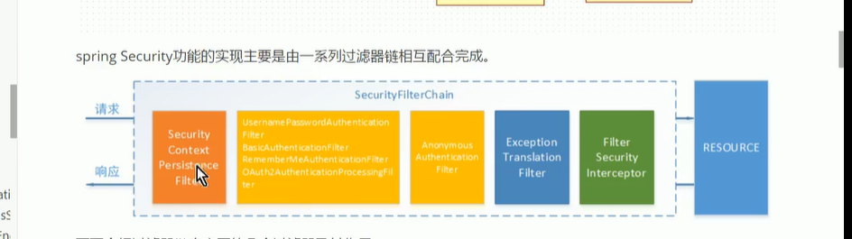
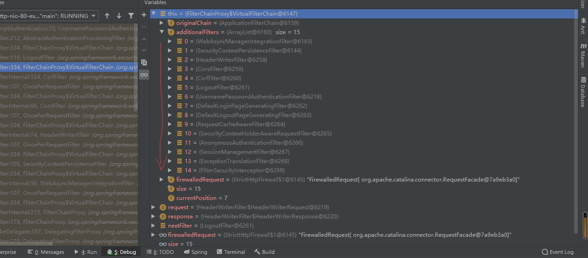
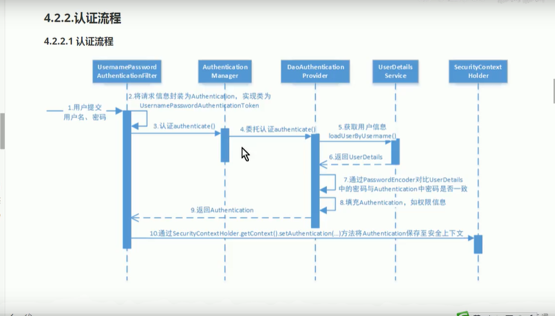
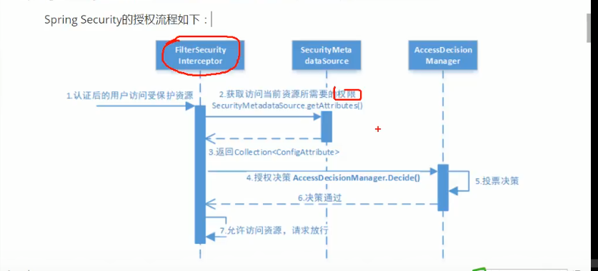

认证：校验用户是否为合法用户。

授权：校验合法用户是否有操作某项资源的权限。

会话保持（避免有效期内重复认证）的方式：

- 基于session的方式

  用户认证成功后，服务端存储session并返回客户端sessionId，客户端存储到cookie中，后续客户端请求都带上sessionId即可。该方式由Servlet规范制定，服务端需要存储session占据空间，且客户端需要支持cookie。该种方式servlet容器已实现，用户可通过HttpSession的API进行运用。

- 基于token的方式

  用户认证成功，服务端返回客户端token，客户端可根据需要存储在cookie或者localStorage中，每次请求时携带token，服务端解析校验即可。该方式服务端不需要存储token，并且不限制客户端的存储方式。

授权的数据模型：
可以简单理解为WHO对WHAT进行HOW操作

- WHO：即主体Subject，一般是用户
- WHAT：即资源Resource。
- HOW：即某某权限Permission，规定用户对资源的权限操作。

常见的关系模型，一般为用户表、用户-角色中间表、角色表、角色与权限中间表、权限表。这种其实是将资源和权限表整合到一张权限表中。

RBAC模型：

- 基于角色的访问控制（Role-Based Access Control）

  该方式判断是否有权限时，需要判断主体是否有该角色（如user.hasRole(xx)），但是当新增角色也有该权限时，则需要调整代码(user.hasRole(xx,yy))，可扩展性差

- 基于资源的访问控制（Resource-Based Access Control）

  直接判断主体有无该权限，跳过角色。（伪代码：user.hasPermission(xxx)）可扩展性强。

  

SpringSecurity提供了账户密码登录、退出、会话管理等功能，我们只需要配置即可使用。我们提供一个UserDetailService的实现类、PasswordEncoder加密类、配置安全拦截器（即重写WebSecurityConfigurerAdapter#的configure方法）即可。

SpringSecurity是通过FilterChainPorxy过滤器链来对请求进行处理，FilterChainPorxy只是一个代理，真正起作用的是FilterChainPorxy中SecurityFilterChain所包含的各个Filter，这些Filter被spring容器管理，是SpringSecurity的核心，但是他们并不直接处理认证和授权，而是AuthenticationManager类负责认证，AccessDecisionManager负责授权。



- SecurityContextPersistenceFilter是整个拦截器链的入口和出口（也就是第一个和最后一个拦截器），会在请求开始时从配置好的SecurityContextRepository中获取SecurityContext，然后把它设置给SecurityContextHolder。在请求完成后将SecurityContextHolder中获取SecurityContext再保存到SecurityContextRepository，同时清除SecurityContextHolder中的SecurityContext。
- UsernamePasswordAuthenticationFilter处理账户密码认证，其内部还有针对登录成功和失败的AuthenticationSuccessHandler和AuthenticationFailHandler，可根据需求重写。
- FilterSecurityInterceptor使用AccessDecisionManager进行授权。
- ExceptionTranslationFilter能够不说FilterChain所有的异常，但他只会处理两类异常即AuthenticationException和AccessDeinedException，其他的异常直接抛出。



```java
FilterChain具体为：[org.springframework.security.web.context.request.async.WebAsyncManagerIntegrationFilter@220c9a63, 
org.springframework.security.web.context.SecurityContextPersistenceFilter@57e388c3, 
org.springframework.security.web.header.HeaderWriterFilter@47c7a9e5, 
org.springframework.web.filter.CorsFilter@55b5cd2b, 
org.springframework.security.web.csrf.CsrfFilter@3135bf25, 
org.springframework.security.web.authentication.logout.LogoutFilter@71a3e05c, 
org.springframework.security.web.authentication.UsernamePasswordAuthenticationFilter@7b1e5e55, 
org.springframework.security.web.authentication.ui.DefaultLoginPageGeneratingFilter@4091b9c3, 
org.springframework.security.web.authentication.ui.DefaultLogoutPageGeneratingFilter@40bb4f87, 
org.springframework.security.web.savedrequest.RequestCacheAwareFilter@21bd128b, 
org.springframework.security.web.servletapi.SecurityContextHolderAwareRequestFilter@55fdf7f9, 
org.springframework.security.web.authentication.AnonymousAuthenticationFilter@51a651c1, 
org.springframework.security.web.session.SessionManagementFilter@4ed9f7b1, 
org.springframework.security.web.access.ExceptionTranslationFilter@64da6cbd, 
org.springframework.security.web.access.intercept.FilterSecurityInterceptor@1b482cbf]
```

第一步：FilterChainProxy的内部实现类VirtualFilterChain的doFilter方法

```java
@Override
   public void doFilter(ServletRequest request, ServletResponse response)
         throws IOException, ServletException {
      if (currentPosition == size) {
         if (logger.isDebugEnabled()) {
            logger.debug(UrlUtils.buildRequestUrl(firewalledRequest)
                  + " reached end of additional filter chain; proceeding with original chain");
         }
         // Deactivate path stripping as we exit the security filter chain
         this.firewalledRequest.reset();

         originalChain.doFilter(request, response);
      }
      else {
         currentPosition++; //记录当前过滤器的下标，并找到过滤器链中该过滤器，然后直接过滤方法

         Filter nextFilter = additionalFilters.get(currentPosition - 1);

         if (logger.isDebugEnabled()) {
            logger.debug(UrlUtils.buildRequestUrl(firewalledRequest)
                  + " at position " + currentPosition + " of " + size
                  + " in additional filter chain; firing Filter: '"
                  + nextFilter.getClass().getSimpleName() + "'");
         }
		//执行此处时会跳转到OncePerRequestFilter类的doFilter方法
         nextFilter.doFilter(request, response, this);
      }
   }
}
```

第二步：OncePerRequestFilter类的doFilter方法，关键代码为`doFilterInternal`

```java
@Override
public final void doFilter(ServletRequest request, ServletResponse response, FilterChain filterChain)
      throws ServletException, IOException {

   if (!(request instanceof HttpServletRequest) || !(response instanceof HttpServletResponse)) {
      throw new ServletException("OncePerRequestFilter just supports HTTP requests");
   }
   HttpServletRequest httpRequest = (HttpServletRequest) request;
   HttpServletResponse httpResponse = (HttpServletResponse) response;

   String alreadyFilteredAttributeName = getAlreadyFilteredAttributeName();
   boolean hasAlreadyFilteredAttribute = request.getAttribute(alreadyFilteredAttributeName) != null;

   if (hasAlreadyFilteredAttribute || skipDispatch(httpRequest) || shouldNotFilter(httpRequest)) {

      // Proceed without invoking this filter...
      filterChain.doFilter(request, response);
   }
   else {
      // Do invoke this filter...
      request.setAttribute(alreadyFilteredAttributeName, Boolean.TRUE);
      try {
          //此处调用真正的过滤器进行操作
         doFilterInternal(httpRequest, httpResponse, filterChain);
      }
      finally {
         // Remove the "already filtered" request attribute for this request.
         request.removeAttribute(alreadyFilteredAttributeName);
      }
   }
}

```

第三步：具体过滤器执行完毕后，又再次调用FilterChainPorxy的doFilter方法，迭代到下一个过滤器执行。以CorsFilter为例，这些过滤器执行完毕后都会再次调用filterChain的过滤方法

```java
@Override
protected void doFilterInternal(HttpServletRequest request, HttpServletResponse response,
      FilterChain filterChain) throws ServletException, IOException {

   if (CorsUtils.isCorsRequest(request)) {
      CorsConfiguration corsConfiguration = this.configSource.getCorsConfiguration(request);
      if (corsConfiguration != null) {
         boolean isValid = this.processor.processRequest(corsConfiguration, request, response);
         if (!isValid || CorsUtils.isPreFlightRequest(request)) {
            return;
         }
      }
   }
	//继续调用FilterChain的过滤方式，迭代到下一个
   filterChain.doFilter(request, response);
}
```

附：OncePerRequestFilter类，确保每个请求只会执行一次的过滤器。因为由于不同的分派类型（DispatcherType#REQUEST和DispatcherType#ASYNC）会有多线程。


具体认证流程：



在执行到UsernamePasswordAuthenticationFilter中调用doFilter方法，内部又调用自己的attemptAuthentication方法：

```java 
public Authentication attemptAuthentication(HttpServletRequest request,
      HttpServletResponse response) throws AuthenticationException {
   if (postOnly && !request.getMethod().equals("POST")) {
      throw new AuthenticationServiceException(
            "Authentication method not supported: " + request.getMethod());
   }
//获取用户传入的账户密码
   String username = obtainUsername(request);
   String password = obtainPassword(request);
   if (username == null) {
      username = "";
   }
   if (password == null) {
      password = "";
   }
   username = username.trim();
//此时创建UsernamePasswordAuthenticationToken对象，然后委托给AuthenticationManager去验证
   UsernamePasswordAuthenticationToken authRequest = new UsernamePasswordAuthenticationToken(
         username, password);

   // Allow subclasses to set the "details" property
   setDetails(request, authRequest);

   return this.getAuthenticationManager().authenticate(authRequest);
}
```

最终是通过DaoAuthenticationProvider类#retrieveUser方法获取用户（内部调用userDetailsService().loadUserByUsername），然后调用additionalAuthenticationChecks方法，在该方法内部通过passwordEncoder.matches方法进行密码验证。

关于AuthenticationProvider

其是一个接口，持有authenticate和support两个方法，authenticate方法实现了认证过程，参数和返回都是Authentication对象，只不过认证通过之后会为其组装权限等信息。SpringSecurity内部维护了一个List<AuthenticationProvider>用于各种方式认证，不同的Provider对应不同的认证方式，其support方法就是来表明自己支持的认证方式。

```java
public interface AuthenticationProvider {
	Authentication authenticate(Authentication authentication)
			throws AuthenticationException;
    
    boolean supports(Class<?> authentication);
 ｝
```

拿DaoAuthenticationProvider举例，其基类中support方法表面只有当参数是UsernamePasswordAuthenticationToken类型时即web提交用户名密码时才能使用其进行认证。

```java
public boolean supports(Class<?> authentication) {
   return (UsernamePasswordAuthenticationToken.class
         .isAssignableFrom(authentication));
}
```


授权

基于web（即url）的授权和基于方法的授权都是通过accessDecisionManager来决策的。基于web授权的处理拦截器是FilterSecurityInterceptor，基于方法的处理拦截器是MethodSecurityInterceptor。这两个拦截都是实现了accessDecisionManager的抽象类AbstractDecisionManager类。

基于方法的授权需开启注解@EnableGlobalMethodSecurity(securedEnabled=true, prePostEnabled=true)。然后即可通过方法上注解@Secure或者@PreAuthorize或者@PostAuthorize指定方法需要的权限。



FilterSecurityInterceptor类也是FIleChain中的一个过滤器，位于最后一个位置。其源码如下：

```java
public void doFilter(ServletRequest request, ServletResponse response,
      FilterChain chain) throws IOException, ServletException {
   FilterInvocation fi = new FilterInvocation(request, response, chain);
   invoke(fi);
}

public void invoke(FilterInvocation fi) throws IOException, ServletException {
		if ((fi.getRequest() != null)
				&& (fi.getRequest().getAttribute(FILTER_APPLIED) != null)
				&& observeOncePerRequest) {
			// 如果该过滤器已经应用过这次请求并且user wants us to observe
			// once-per-request handling, 此时不用再次执行
			fi.getChain().doFilter(fi.getRequest(), fi.getResponse());
		}
		else {
			// 如果该请求是第一次被调用，则需要进行安全校验
			if (fi.getRequest() != null && observeOncePerRequest) {
				fi.getRequest().setAttribute(FILTER_APPLIED, Boolean.TRUE);
			}
			//调用基类AbstractSecurityInterceptor前置工作
			InterceptorStatusToken token = super.beforeInvocation(fi);

			try {
				fi.getChain().doFilter(fi.getRequest(), fi.getResponse());
			}
			finally {
				super.finallyInvocation(token);
			}
			//后置清理工作
			super.afterInvocation(token, null);
		}
	}
//其父类的beforeInvocation方法，已省去非核心部分
protected InterceptorStatusToken beforeInvocation(Object object) {
		
		//通过SecurityMetadataSource获取资源所要求的的权限
		Collection<ConfigAttribute> attributes = this.obtainSecurityMetadataSource()
				.getAttributes(object);
		//已认证则获取认证信息，未认证则进行认证
		Authentication authenticated = authenticateIfRequired();
		// 尝试授权，decide为核心方法
		try {
			this.accessDecisionManager.decide(authenticated, object, attributes);
		}catch (AccessDeniedException accessDeniedException) {
			publishEvent(new AuthorizationFailureEvent(object, attributes, authenticated,accessDeniedException));
			throw accessDeniedException;
		}
		//发送事件
		if (publishAuthorizationSuccess) {
			publishEvent(new AuthorizedEvent(object, attributes, authenticated));
		}

		// Attempt to run as a different user
		Authentication runAs = this.runAsManager.buildRunAs(authenticated, object,
				attributes);

		if (runAs == null) {
			// no further work post-invocation
			return new InterceptorStatusToken(SecurityContextHolder.getContext(), false,attributes, object);
		}
		else {
			SecurityContext origCtx = SecurityContextHolder.getContext();
		SecurityContextHolder.setContext(SecurityContextHolder.createEmptyContext());
			SecurityContextHolder.getContext().setAuthentication(runAs);
			// need to revert to token.Authenticated post-invocation
			return new InterceptorStatusToken(origCtx, true, attributes, object);
		}
	}
```

AccessDecisionManager的decide过程是采用**投票**的方式来确定是否有访问权限。其有三个实现类：

- AffirmativeBased

  这是spring security的默认实现。其逻辑是：

  - 只要AccessDecisionVoter有一个投出了赞成票则通过
  - 全部投弃权票也通过
  - 如果没人投赞成票，且只要有一个投反对票就抛出AccessDeniedException

- ConsensusBased

  - 如果赞成票大于反对票就通过
  - 如果返回票大于赞成票则抛异常
  - 如果赞成票与反对票相等，则根据属性allowIfEqualGrantedDeniedDecisions的值来决策
  - 如果全都弃权了，则根据属性allowIfAllAbstainDecisions决策

- UnanimousBased

决策过程是通过投票决定的，三个类都有一个方法：

```java
public ConsensusBased(List<AccessDecisionVoter<? extends Object>> decisionVoters) {
   super(decisionVoters);
}
public interface AccessDecisionVoter<S> {

	int ACCESS_GRANTED = 1;
	int ACCESS_ABSTAIN = 0;
	int ACCESS_DENIED = -1;
    ...
}
```

// 禁用session，适用于REST API方式，每次请求都必须验证
sessionManagement().sessionCreationPolicy(SessionCreationPolicy.STATELESS);


Oauth是分布式认证协议。

1. 授权服务

   包含对接入端以及登入用户的合法性进行校验及颁发token等，下面是配置一个认证服务必须要实现的endpoints:

   - AuthorizationEndpoint服务用于认证请求。默认url为`/oauth/authorize`
   - TokenEndpoint服务用于令牌的请求，即获取token。默认url为`/oauth/token`

   配置方法：

   继承AuthorizationServerConfigurerAdapter，实现3个configurer方法：

   ``` 
   @Configuration
   @EnableAuthorizationServer
   public class AuthorizationServerConfiguration extends AuthorizationServerConfigurerAdapter {
   	//配置客户端详情服务
   	@Override
   	public void configure(ClientDetailsServiceConfigurer clients) throws Exception 		{
   		// 自定义clientDetails配置
   		clients.withClientDetails(ssoClientDetailsService());
   	}
   	//配置令牌端点的访问约束
   	@Override
   	public void configure(AuthorizationServerSecurityConfigurer security) {
   		security.passwordEncoder(passwordEncoder)
   				//
   				.allowFormAuthenticationForClients()
   				// 替换client认证
   				.addObjectPostProcessor(objectPostProcessor);
   		Object value = ReflectionUtils.getFieldValue(security, "realm");
   		objectPostProcessor.setRealm(value.toString());
   	}
   	//配置token的访问端点（可理解为终端url入口）和令牌服务
   	@Override
   	public void configure(AuthorizationServerEndpointsConfigurer endpoints) {
   		endpoints.setClientDetailsService(ssoClientDetailsService());
   		// 认证管理器,此设置用于oauth密码模式
   		endpoints.authenticationManager(authenticationManager)
   				// token service
   				.tokenServices(tokenServices())
   				//
   				.requestFactory(oauth2RequestFactory())
   				//
   				.authorizationCodeServices(authorizationCodeService)
   				// 认证状态存储
   				.approvalStore(approvalStore())
   				// 用户信息来源
   				.userDetailsService(userDetailsService)
   				// token 生成器,顺序放后面
   				.tokenGranter(compositeTokenGranter())
   				// token认证支持 post
   				.allowedTokenEndpointRequestMethods(HttpMethod.POST)
   				//
   				.exceptionTranslator(new OAuth2WebResponseExceptionTranslator());
   		// 替换默认的oauth认证器
   		objectPostProcessor = new ClientCredentialsTokenEndpointFilterObjectPostProcessor(endpoints);
   	}
   
   ｝
   ```

2. 资源服务

   包含对资源的保护功能，以及对非法请求进行拦截，对token进行解析鉴权等，下面的过滤器用于实现Oauth2.0的资源服务：

   - Oauth2AuthenticationProcessingFilter用来对token进行解析鉴权（这个是@EnableResourceServer自动增加的）
   - 验证token即TokenService，如果认证和授权是一个服务，则使用DefaultTokenService类即可，在其中可设置token的存储、解析、验证等工作;如果认证和授权是分开的，则使用RemoteTokenService通过http的方式来解码令牌，且授权服务必须暴露/oautyh/check_token端点。

   配置方式：实现ResouceServerConfigurerAdapter的两个configure方法

   ```java
   @Order(1)
   @Configuration
   @EnableResourceServer
   public class ResourceServerConfiguration extends ResourceServerConfigurerAdapter {
   
      private AjaxResourceServerAuthenticationEntryPoint authenticationEntryPoint = new AjaxResourceServerAuthenticationEntryPoint();
   
      private AjaxResourceServerAccessDeniedHandler accessDeniedHandler = new AjaxResourceServerAccessDeniedHandler();
   
      @Autowired
      private ClientDetailsService clientDetailsService;
   
      @Autowired
      private JwtAccessTokenConverter jwtAccessTokenConverter;
   
      @Autowired
      private OauthSecurityProperties properties;
   
      @Autowired
      private UserTokenManager userTokenManager;
   
      @Override
      public void configure(ResourceServerSecurityConfigurer resources) throws Exception {
         resources.resourceId("jwell-sso").stateless(true).accessDeniedHandler(accessDeniedHandler)
               //
               .authenticationEntryPoint(authenticationEntryPoint)
               //
               .tokenServices(tokenServices())
               //
               .addObjectPostProcessor(new OAuth2AuthenticationProcessingFilterObjectPostProcessor());
      }
   
      public DefaultTokenServices tokenServices() {
         DefaultTokenServices defaultTokenServices = new DefaultTokenServices();
         defaultTokenServices.setTokenEnhancer(jwtAccessTokenConverter);
         defaultTokenServices.setClientDetailsService(clientDetailsService);
         defaultTokenServices.setTokenStore(new ResourceServerJwtTokenStore(userTokenManager, jwtAccessTokenConverter));
         defaultTokenServices.setSupportRefreshToken(true);
         defaultTokenServices.setReuseRefreshToken(false);
         return defaultTokenServices;
      }
   
      @Override
      public void configure(HttpSecurity http) throws Exception {
         Set<String> permitAllPaths = properties.getPermitAllPaths();
         Set<String> ignorePaths = properties.getIgnorePaths();
         ignorePaths.addAll(permitAllPaths);
         // 支持http获取key信息
         http.cors().and()
               //
               .csrf().disable().httpBasic().and()
               // 添加oauthclient认证器
               .userDetailsService(new ClientDetailsUserDetailsService(clientDetailsService))
               //
               .sessionManagement()
               // 无状态session
               .sessionCreationPolicy(SessionCreationPolicy.STATELESS)
               // /** 路径需要授权访问
               .and().requestMatchers().antMatchers("/v1/**")
               //
               .and().authorizeRequests()
               // 开放路径
               .antMatchers(ignorePaths.toArray(new String[]{})).permitAll()
               //
               .anyRequest().authenticated()
               //
               .and().exceptionHandling()
               // 401 处理
               .authenticationEntryPoint(authenticationEntryPoint)
               // 403处理
               .accessDeniedHandler(accessDeniedHandler);
      }
   
   }
   ```

3. 四种模式

   - 授权码模式
     通常用于第三方应用授权，不会泄露用户名密码给客户端，先/oauth/authorize重定向返回code,然后/oauth/token返回密码。

   - 密码模式
     一般用于自己内部应用，因为此时会泄露账户名密码给客户端，/oauth/token后直接返回token

   - 简化模式
     一般用于没有后台程序的第三方，即直接把token返回到前端页面地址上

   - 客户端模式

     通过client_id和secret直接获取token，此方式最简单但最不安全，需要完全信任客户端

4. JWT令牌

   - 说明

     JWT是一种简洁的，自包含的协议，用于通信双方传递json，传递的信息可以经过HMAC或者RSA公私钥进行数字签名。

     如果授权服务和资源服务不在一起时，每次授权需要调用RemoteTokenService校验令牌，此时如果访问量大会造成性能影响。JWT就可以解决此类问题，因为JWT本身就包含了用户相关的信息，客户每次携带token访问资源服务时就可以不用发往认证服务校验，资源服务本身就可以根据事先约定的算法进行解析校验。

   - 构成

     分成三部分，每部分以点号隔开：

     - Header
       头部信息包括加密算法和令牌类型，如下：

       ```javascript
       {
           "alg": "RS256",
           "typ": "JWT"
       }
       ```

     - Payload
       中间部分也是json，存放的是自定义的信息，不建议存储敏感信息

       ```javascript
       {
           "userInfo": {
               "userName": "scott",
               "registFromAppId": "jwell-sso"
           },
           "grant_type": "password",
           "user_name": "scott",
           "scope": ["all"],
           "exp": 3738047772,
           "jti": "627bcae2-13b5-412d-a604-2fc9a683205e",
           "client_id": "jwell-ecommerce"
       }
       ```

     - Signature
       第三部分是签名部分，用于防止jwt内容被篡改。此部分也可不生成。生成算法示例为：

       ```java
       HMACSHA256(base64UrlEncode(Header) + "." +base64UrlEncode(Payload)， secret)
       ```

   - 

   

