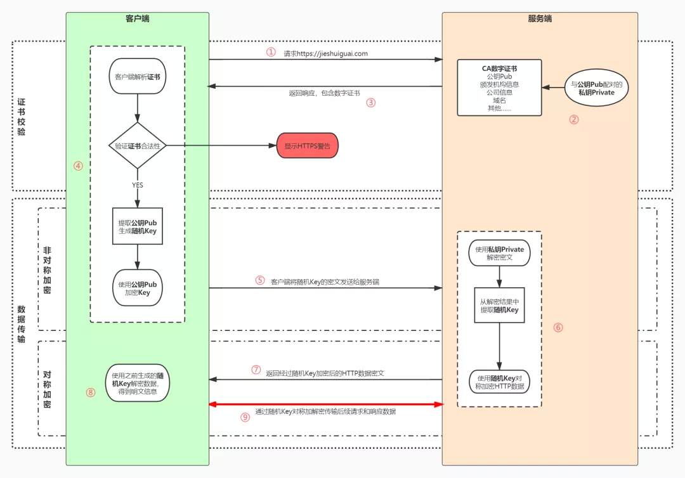

​    序列号seq：占4个字节，用来标记数据段的顺序，TCP把连接中发送的所有数据字节都编上一个序号，第一个字节的编号由本地随机产生；给字节编上序号后，就给每一个报文段指派一个序号；序列号seq就是这个报文段中的第一个字节的数据编号。

​    确认号ack：占4个字节，期待收到对方下一个报文段的第一个数据字节的序号；序列号表示报文段携带数据的第一个字节的编号；而确认号指的是期望接收到下一个字节的编号；因此当前报文段最后一个字节的编号+1即为确认号。

​    确认ACK：占1位，仅当ACK=1时，确认号字段才有效。ACK=0时，确认号无效

​    同步SYN：连接建立时用于同步序号。当SYN=1，ACK=0时表示：这是一个连接请求报文段。若同意连接，则在响应报文段中使得SYN=1，ACK=1。因此，SYN=1表示这是一个连接请求，或连接接受报文。SYN这个标志位只有在TCP建产连接时才会被置1，握手完成后SYN标志位被置0。

​    终止FIN：用来释放一个连接。FIN=1表示：此报文段的发送方的数据已经发送完毕，并要求释放运输连接

​    PS：ACK、SYN和FIN这些大写的单词表示标志位，其值要么是1，要么是0；ack、seq小写的单词表示序号。

###  

| 字段 | 含义                                                         |
| ---- | ------------------------------------------------------------ |
| URG  | 紧急指针是否有效。为1，表示某一位需要被优先处理              |
| ACK  | 确认号是否有效，一般置为1。                                  |
| PSH  | 提示接收端应用程序立即从TCP缓冲区把数据读走。                |
| RST  | 对方要求重新建立连接，复位。                                 |
| SYN  | 请求建立连接，并在其序列号的字段进行序列号的初始值设定。建立连接，设置为1 |
| FIN  | 希望断开连接。                                               |

### 三次握手过程理解

 

第一次握手：建立连接时，客户端发送syn包（syn=x）到服务器，并进入**SYN_SENT**状态，等待服务器确认；SYN：同步序列编号（Synchronize Sequence Numbers）。

第二次握手：服务器收到syn包，必须确认客户的SYN（ack=x+1），同时自己也发送一个SYN包（syn=y），即SYN+ACK包，此时服务器进入**SYN_RECV**状态；

第三次握手：客户端收到服务器的SYN+ACK包，向服务器发送确认包ACK(ack=y+1），此包发送完毕，客户端和服务器进入**ESTABLISHED**（TCP连接成功）状态，完成三次握手。

### 四次挥手过程理解 

1）客户端进程发出连接释放报文，并且停止发送数据。释放数据报文首部，FIN=1，其序列号为seq=u（等于前面已经传送过来的数据的最后一个字节的序号加1），此时，客户端进入FIN-WAIT-1（终止等待1）状态。 TCP规定，FIN报文段即使不携带数据，也要消耗一个序号。
2）服务器收到连接释放报文，发出确认报文，ACK=1，ack=u+1，并且带上自己的序列号seq=v，此时，服务端就进入了CLOSE-WAIT（关闭等待）状态。TCP服务器通知高层的应用进程，客户端向服务器的方向就释放了，这时候处于半关闭状态，即客户端已经没有数据要发送了，但是服务器若发送数据，客户端依然要接受。这个状态还要持续一段时间，也就是整个CLOSE-WAIT状态持续的时间。
3）客户端收到服务器的确认请求后，此时，客户端就进入FIN-WAIT-2（终止等待2）状态，等待服务器发送连接释放报文（在这之前还需要接受服务器发送的最后的数据）。
4）服务器将最后的数据发送完毕后，就向客户端发送连接释放报文，FIN=1，ack=u+1，由于在半关闭状态，服务器很可能又发送了一些数据，假定此时的序列号为seq=w，此时，服务器就进入了LAST-ACK（最后确认）状态，等待客户端的确认。
5）客户端收到服务器的连接释放报文后，必须发出确认，ACK=1，ack=w+1，而自己的序列号是seq=u+1，此时，客户端就进入了TIME-WAIT（时间等待）状态。注意此时TCP连接还没有释放，必须经过2∗∗MSL（最长报文段寿命）的时间后，当客户端撤销相应的TCB后，才进入CLOSED状态。
6）服务器只要收到了客户端发出的确认，立即进入CLOSED状态。同样，撤销TCB后，就结束了这次的TCP连接。可以看到，服务器结束TCP连接的时间要比客户端早一些。

###  常见面试题

【问题1】为什么连接的时候是三次握手，关闭的时候却是四次握手？

答：因为当Server端收到Client端的SYN连接请求报文后，可以直接发送SYN+ACK报文。其中ACK报文是用来应答的，SYN报文是用来同步的。但是关闭连接时，当Server端收到FIN报文时，很可能并不会立即关闭SOCKET，所以只能先回复一个ACK报文，告诉Client端，"你发的FIN报文我收到了"。只有等到我Server端所有的报文都发送完了，我才能发送FIN报文，因此不能一起发送。故需要四步握手。

【问题2】为什么TIME_WAIT状态需要经过2MSL(最大报文段生存时间)才能返回到CLOSE状态？

答：虽然按道理，四个报文都发送完毕，我们可以直接进入CLOSE状态了，但是我们必须假象网络是不可靠的，有可以最后一个ACK丢失。所以TIME_WAIT状态就是用来重发可能丢失的ACK报文。在Client发送出最后的ACK回复，但该ACK可能丢失。Server如果没有收到ACK，将不断重复发送FIN片段。所以Client不能立即关闭，它必须确认Server接收到了该ACK。Client会在发送出ACK之后进入到TIME_WAIT状态。Client会设置一个计时器，等待2MSL的时间。如果在该时间内再次收到FIN，那么Client会重发ACK并再次等待2MSL。所谓的2MSL是两倍的MSL(Maximum Segment Lifetime)。MSL指一个片段在网络中最大的存活时间，2MSL就是一个发送和一个回复所需的最大时间。如果直到2MSL，Client都没有再次收到FIN，那么Client推断ACK已经被成功接收，则结束TCP连接。

【问题3】为什么不能用两次握手进行连接？

答：3次握手完成两个重要的功能，既要双方做好发送数据的准备工作(双方都知道彼此已准备好)，也要允许双方就初始序列号进行协商，这个序列号在握手过程中被发送和确认。

​       现在把三次握手改成仅需要两次握手，死锁是可能发生的。作为例子，考虑计算机S和C之间的通信，假定C给S发送一个连接请求分组，S收到了这个分组，并发 送了确认应答分组。按照两次握手的协定，S认为连接已经成功地建立了，可以开始发送数据分组。可是，C在S的应答分组在传输中被丢失的情况下，将不知道S 是否已准备好，不知道S建立什么样的序列号，C甚至怀疑S是否收到自己的连接请求分组。在这种情况下，C认为连接还未建立成功，将忽略S发来的任何数据分 组，只等待连接确认应答分组。而S在发出的分组超时后，重复发送同样的分组。这样就形成了死锁。

【问题4】如果已经建立了连接，但是客户端突然出现故障了怎么办？

TCP还设有一个保活计时器，显然，客户端如果出现故障，服务器不能一直等下去，白白浪费资源。服务器每收到一次客户端的请求后都会重新复位这个计时器，时间通常是设置为2小时，若两小时还没有收到客户端的任何数据，服务器就会发送一个探测报文段，以后每隔75秒钟发送一次。若一连发送10个探测报文仍然没反应，服务器就认为客户端出了故障，接着就关闭连接。

DoS（拒绝服务）：不是DOS操作系统，造成DoS的攻击行为被称为DoS攻击，它的目的是使得计算机或者网络我无法提供正常服务。最常见的DOS攻击有计算机网络带宽攻击和连通性的攻击，如SYN攻击。

DDoS（分布式拒绝服务）；这个的攻击借助于客户/服务器技术，将多个计算机联合起来作为一个攻击平台，对一个或者是多个目标发动攻击，从而成倍的提高就裁决服务攻击的威力。

防范方法：1、比如降低SYN timeout时间，使得主机尽快释放半连接的占用；2、采用SYN cookie设置，如果短时间内收到了某个IP的重复SYN请求，我们就认为受到了攻击。我们合理的采用防火墙设置等外部网络也可以进行拦截。

## 协议

### http1.0

​	HTTP 1.0需要使用keep-alive参数来告知服务器端要建立一个长连接（而HTTP1.1默认支持长连接）。

HTTP是基于TCP/IP协议的，创建一个TCP连接是需要经过三次握手的,有一定的开销，如果每次通讯都要重新建立连接的话，对性能有影响。因此最好能维持一个长连接，可以用个长连接来发多个请求。

### http1.1

1. 默认支持长连接
2. HTTP 1.1支持只发送header信息(不带任何body信息)，如果服务器认为客户端有权限请求服务器，则返回100，否则返回401。客户端如果接受到100，才开始把请求body发送到服务器。（这样当服务器返回401的时候，客户端就可以不用发送请求body了，节约了带宽。）
3. HTTP1.0是没有host域的，HTTP1.1才支持这个参数。现在可以web server例如tomat，设置虚拟站点是非常常见的，也即是说，web server上的多个虚拟站点可以共享同一个ip和端口。

​	另外HTTP还**支持传送内容的一部分**。这样当客户端已经有一部分的资源后，只需要跟服务器请求另外的部分资源即可。这是支持文件断点续传的基础。

### http2.0

1. **多路复用：**使用了多路复用的技术，做到同一个连接并发处理多个请求，而且并发请求的数量比HTTP1.1大了好几个数量级。（当然HTTP1.1也可以多建立几个TCP连接，来支持处理更多并发的请求，但是创建TCP连接本身也是有开销的）
2. **数据压缩：**HTTP2.0使用HPACK算法对header的数据进行压缩，这样数据体积小了，在网络上传输就会更快。（http1.1不支持header数据的压缩）
3. **服务器推送：**当我们对支持HTTP2.0的web server请求数据的时候，服务器会顺便把一些客户端需要的资源一起推送到客户端，免得客户端再次创建连接发送请求到服务器端获取。这种方式非常合适加载静态资源。

## https

HTTPS（HyperText Transfer Protocol Secure）超文本传输安全协议，数据通信仍然是HTTP，但利用**SSL/TLS加密数据包**。SSL（Secure Sockets Layer）安全套接层和TLS（Transport Layer Security）传输层安全协议其实是**一套东西**。

1. 用户在浏览器发起HTTPS请求（如 https://www.mogu.com/），默认使用服务端的443端口进行连接；
2. HTTPS需要使用一套**CA数字证书**，证书内会附带一个**公钥Pub**，而与之对应的**私钥Private**保留在服务端不公开；
3. 服务端收到请求，返回配置好的包含**公钥Pub**的证书给客户端；
4. 客户端收到**证书**，校验合法性，主要包括是否在有效期内、证书的域名与请求的域名是否匹配，上一级证书是否有效（递归判断，直到判断到系统内置或浏览器配置好的根证书），如果不通过，则显示HTTPS警告信息，如果通过则继续；
5. 客户端生成一个用于对称加密的**随机Key**，并用证书内的**公钥Pub**进行加密，发送给服务端；
6. 服务端收到**随机Key**的密文，使用与**公钥Pub**配对的**私钥Private**进行解密，得到客户端真正想发送的**随机Key**；
7. 服务端使用客户端发送过来的**随机Key**对要传输的HTTP数据进行对称加密，将密文返回客户端；
8. 客户端使用**随机Key**对称解密密文，得到HTTP数据明文；
9. 后续HTTPS请求使用之前交换好的**随机Key**进行对称加解密。

> 注意，严格来讲，私钥并不能用来加密，只能用作签名使用，这是由于密码学中生成公钥私钥时对不同变量的数学要求是不同的，因此公钥私钥抵抗攻击的能力也不同，在实际使用中不可互换。签名的功能在HTTPS里也有用到，下文中会说明。

> 至于为何不用两对公私钥进行双向加解密，最主要的原因是**非对称加解密耗时要远大于对称加解密**，对性能有很大损耗，大家的使用体验很差。

#### CA颁发机构

依然考虑**中间人攻击**的情况，非对称加密的算法都是**公开**的，所有人都可以自己生成一对公钥私钥。

当服务端向客户端返回公钥A1的时候，中间人将其**替换**成自己的公钥B1传送给浏览器。

而浏览器此时一无所知，傻乎乎地使用公钥B1加密了密钥K发送出去，又被**中间人截获**，中间人利用自己的私钥B2解密，得到密钥K，再使用服务端的公钥A1加密传送给服务端，完成了通信链路，而服务端和客户端毫无感知。

出现这一问题的核心原因是**客户端无法确认收到的公钥是不是真的是服务端发来的**。为了解决这个问题，互联网引入了一个公信机构，这就是CA。

服务端在使用HTTPS前，去经过认证的CA机构申请颁发一份**数字证书**，数字证书里包含有证书持有者、证书有效期、公钥等信息，服务端将证书发送给客户端，客户端校验证书身份和要访问的网站身份确实一致后再进行后续的加密操作。

但是，如果中间人也聪明一点，**只改动了证书中的公钥部分**，客户端依然不能确认证书**是否被篡改**，这时我们就需要一些防伪技术了。

前面说过，非对称加密中一般公钥用来加密，私钥用来解密，虽然私钥加密理论上可行，但由于数学上的设计这么做并不适合，那么私钥就只有解密这个功能了么？

私钥除了解密外的真正用途其实还有一个，就是**数字签名**，其实就是一种防伪技术，只要有人篡改了证书，那么数字签名必然校验失败。具体过程如下

1. CA机构拥有自己的一对公钥和私钥
2. CA机构在颁发证书时对证书明文信息进行哈希
3. 将哈希值用私钥进行**加签**，得到数字签名

##### 明文数据和数字签名组成证书，传递给客户端。

1. 客户端得到证书，分解成明文部分Text和数字签名Sig1
2. 用CA机构的公钥进行**解签**，得到Sig2（由于CA机构是一种公信身份，因此在系统或浏览器中会内置CA机构的证书和公钥信息）
3. 用证书里声明的哈希算法对明文Text部分进行哈希得到H
4. 当自己计算得到的哈希值T与**解签**后的Sig2**相等**，表示证书可信，**没有被篡改**

这时，签名是由CA机构的私钥生成的，中间人篡改信息后无法拿到CA机构的私钥，保证了证书可信。

在这个过程中，系统或浏览器中内置的CA机构的证书和公钥成为了至关重要的环节，这也是CA机构公信身份的证明，如果系统或浏览器中没有这个CA机构，那么客户端可以不接受服务端传回的证书，显示HTTPS警告。

实际上CA机构的证书是一条信任链，A信任B，B信任C，以**掘金的证书**为例，掘金向RapidSSL申请一张证书，而RapidSSL的CA身份是由DigiCert Global根CA认证的，构成了一条信任链。

各级CA机构的私钥是绝对的私密信息，一旦CA机构的私钥泄露，其公信力就会一败涂地。之前就有过几次**CA机构私钥泄露**，引发信任危机，各大系统和浏览器只能纷纷吊销内置的对应CA的根证书。