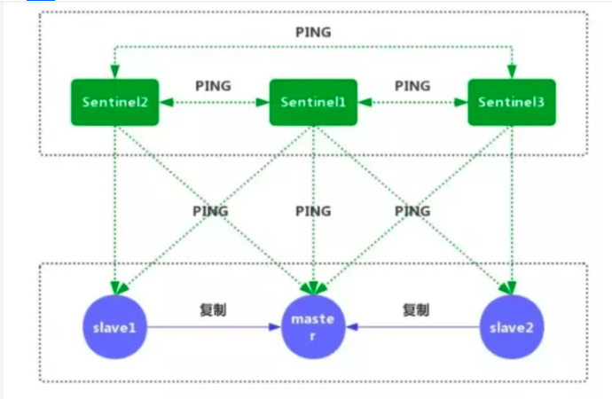

redis

摘自文章<https://www.cnblogs.com/MouseDong/p/11134039.html>

### redis特性：

- 单进程单线程模式，采用队列模式将并发访问变为串行访问
- 基于内存运行，性能高效
- 支持分布式，理论上可以无限扩展
- key-value存储系统
- 开源的使用ANSI C语言编写、遵守BSD协议、支持网络、可基于内存亦可持久化的日志型、Key-Value数据库，并提供多种语言的API

### 底层数据结构：

Redis的五大数据类型也称五大数据对象；Redis自己构建了一个对象系统**redisObject**；这个对象系统包含了五大数据对象，字符串对象（string）、列表对象（list）、哈希对象（hash）、集合（set）对象和有序集合对象（zset）；而这五大对象的底层数据编码可以用命令OBJECT ENCODING来进行查看。

**redisObject结构**

[](javascript:void(0);)

```
1 typedef struct redisObject {
2     // 类型
3     unsigned type:4;
4     // 编码
5     unsigned encoding:4;
6     // 指向底层实现数据结构的指针
7     void *ptr;
8     // ...
9 } robj;
```

[](javascript:void(0);)

redis是以键值对存储数据的，所以对象又分为键对象和值对象，即存储一个key-value键值对会创建两个对象，键对象和值对象。

键对象总是一个字符串对象，而值对象可以是五大对象中的任意一种。

- - type属性存储的是对象的类型，也就是我们说的 string、list、hash、set、zset中的一种，可以使用命令 TYPE key 来查看。
  - encoding属性记录了队形所使用的编码，即这个对象底层使用哪种数据结构实现。


表中列出了底层编码常量及对应的OBJECT ENCODING 命令（如object encoding key）的输出，前三项都是字符串结构

我们在存入key-value键值对时并不会指定对象的encoding，而是Redis会根据不统的使用场景来为一个对象设置不同的编码，可以达到节约内存、加快访问速度等目的。

如图所示：


#### 字符串对象（string）:

​	底层数据结构实现为简单动态字符串（SDS）和直接存储，**但其编码方式可以是int、raw或者embstr，区别在于内存结构的不同**。

- 在Redis中，存储long、double类型的浮点数是先转换为字符串再进行存储的。
- raw与embstr编码效果是相同的，不同在于内存分配与释放，raw两次，embstr一次。
- embstr内存块连续，能更好的利用缓存在来的优势
- int编码和embstr编码如果做追加字符串等操作，满足条件下会被转换为raw编码；embstr编码的对象是只读的，一旦修改会先转码到raw。

#### 列表对象(list)：

​	列表对象的编码可以是ziplist和linkedlist之一。列表对象编码转换：

- 列表对象使用ziplist编码需要满足两个条件：**一是所有字符串长度都小于64字节，二是元素数量小于512，不满足任意一个都会使用linkedlist编码。**
- 两个条件的数字可以在Redis的配置文件中修改，list-max-ziplist-value选项和list-max-ziplist-entries选项。
- 图中StringObject就是上一节讲到的字符串对象，字符串对象是唯一个在五大对象中作为嵌套对象使用的。

#### 哈希对象（hash）:

​	哈希对象的编码可以是ziplist和hashtable之一。哈希对象编码转换：

- - 哈希对象使用ziplist编码需要满足两个条件：一是所有键值对的键和值的字符串长度都小于64字节；二是键值对数量小于512个；不满足任意一个都使用hashtable编码。
  - 以上两个条件可以在Reids配置文件中修改hash-max-ziplist-value选项和hash-max-ziplist-entries选项。

#### 集合对象（Set）:

​	集合对象的编码可以是intset和hashtable之一。集合对象编码转换：

- 集合对象使用intset编码需要满足两个条件：一是所有元素都是整数值；二是元素个数小于等于512个；不满足任意一条都将使用hashtable编码。
- 以上第二个条件可以在Redis配置文件中修改et-max-intset-entries选项。

#### 有序集合对象（zset）:

​	有序集合的编码可以是ziplist和skiplist之一。

skiplist编码的有序集合对象底层实现是跳跃表和字典两种；每个跳跃表节点都保存一个集合元素，并按分值从小到大排列；节点的object属性保存了元素的成员，score属性保存分值；字典的每个键值对保存一个集合元素，字典的键保存元素的成员，字典的值保存分值。


- **为何skiplist编码要同时使用跳跃表和字典实现？**
  - 跳跃表优点是有序，但是查询分值复杂度为O(logn)；字典查询分值复杂度为O(1) ，但是无序，所以结合连个结构的有点进行实现。
  - 虽然采用两个结构但是集合的元素成员和分值是共享的，两种结构通过指针指向同一地址，不会浪费内存。


有序集合编码转换：

- 有序集合对象使用ziplist编码需要满足两个条件：一是所有元素长度小于64字节；二是元素个数小于128个；不满足任意一条件将使用skiplist编码。
- 以上两个条件可以在Redis配置文件中修改zset-max-ziplist-entries选项和zset-max-ziplist-value选项。

#### 数据结构总结

在Redis的五大数据对象中，string对象是唯一个可以被其他四种数据对象作为内嵌对象的；

列表（list）、哈希（hash）、集合（set）、有序集合（zset）底层实现都用到了压缩列表结构，并且使用压缩列表结构的条件都是在元素个数比较少、字节长度较短的情况下；

四种数据对象使用压缩列表的优点：

（1）节约内存，减少内存开销，Redis是内存型数据库，所以一定情况下减少内存开销是非常有必要的。

（2）减少内存碎片，压缩列表的内存块是连续的，并分配内存的次数一次即可。

（3）压缩列表的新增、删除、查找操作的平均时间复杂度是O(N)，在N再一定的范围内，这个时间几乎是可以忽略的，并且N的上限值是可以配置的。

（4）四种数据对象都有两种编码结构，灵活性增加。

### redis为什么是单线程的

​	Redis是基于内存的操作，CPU不是Redis的瓶颈，Redis的瓶颈最有可能是机器内存的大小或者网络带宽。既然单线程容易实现，而且CPU不会成为瓶颈，那就顺理成章地采用单线程的方案了（毕竟采用多线程会有很多麻烦！）。

### **Redis是单线程的，但Redis为什么这么快？**

1、完全基于内存，绝大部分请求是纯粹的内存操作，非常快速。数据存在内存中，类似于HashMap，HashMap的优势就是查找和操作的时间复杂度都是O(1)；

2、数据结构简单，对数据操作也简单，Redis中的数据结构是专门进行设计的；

3、采用单线程，避免了不必要的上下文切换和竞争条件，也不存在多进程或者多线程导致的切换而消耗 CPU，不用去考虑各种锁的问题，不存在加锁释放锁操作，没有因为可能出现死锁而导致的性能消耗；

4、使用多路I/O复用模型，非阻塞IO；**这里“多路”指的是多个网络连接，“复用”指的是复用同一个线程**

5、使用底层模型不同，它们之间底层实现方式以及与客户端之间通信的应用协议不一样，Redis直接自己构建了VM 机制 ，因为一般的系统调用系统函数的话，会浪费一定的时间去移动和请求；

### redis持久化：

RDB：快照形式是直接把内存中的数据保存到一个 dump 的文件中，定时保存，保存策略。AOF：把所有的对 Redis 的服务器进行修改的命令都存到一个文件里，命令的集合。Redis 默认是快照 RDB 的持久化方式。

当 Redis 重启的时候，它会优先使用 AOF 文件来还原数据集，因为 AOF 文件保存的数据集通常比 RDB 文件所保存的数据集更完整。但是相对的，AOF文件也很大。

 RDB 工作原理：当 Redis 需要做持久化时，Redis 会 fork 一个子进程，子进程将数据写到磁盘上一个临时 RDB 文件中。当子进程完成写临时文件后，将原来的 RDB 替换掉，这样的好处是可以 copy-on-write。

### redis事务：

事务命令：MULTI、EXEC、DISCARD、WATCH、UNWATCH。流程如下：


MULTI：用于标记事务块的开始。Redis会将后续的命令逐个放入队列中，然后才能使用EXEC命令原子化地执行这个命令序列；

EXEC：在一个事务中执行所有先前放入队列的命令，然后恢复正常的连接状态。

**当使用WATCH命令时，只有当受监控的键没有被修改时，EXEC命令才会执行事务中的命令**，这种方式利用了检查再设置（CAS）的机制，但是不同的是可以防止ABA问题。

DISCARD：清除所有先前在一个事务中放入队列的命令，然后恢复正常的连接状态。如果使用了WATCH命令，那么DISCARD命令就会将当前连接监控的所有键取消监控。

WATCH：当某个事务需要按条件执行时，就要使用这个命令将给定的键设置为受监控的。

UNWATCH：清除所有先前为一个事务监控的键。如果你调用了EXEC或DISCARD命令，那么就不需要手动调用UNWATCH命令。

错误处理：

两种错误类型：1放到队列中时错误检查失败；2.执行时失败

对于第一类错误，在Redis 2.6.5版本之前，在客户端调用了EXEC命令之后，Redis还是会运行这个出错的事务，执行已经成功放入事务队列的命令，而不会关心先前发生的错误。从2.6.5版本开始，服务器会记住事务积累命令期间发生的错误。然后，**Redis会拒绝执行这个事务**，在运行EXEC命令之后，便会返回一个错误消息。最后，Redis会自动丢弃这个事务。

对于第二类错误，在调用EXEC命令之后发生的事务错误，**Redis不会进行任何特殊处理：在事务运行期间，即使某个命令运行失败，所有其他的命令也将会继续执行。**

为什么redis事务不支持回滚呢？

因为只有语法错误的时候，命令才会执行失败，这是程序的缺陷。

### redis主从复制：

Redis主从复制可以根据是否是全量分为全量同步和增量同步。

**全量同步**
Redis全量复制一般发生在Slave初始化阶段，这时Slave需要将Master上的所有数据都复制一份。

**增量同步**
Redis增量复制是指Slave初始化后开始正常工作时主服务器发生的写操作同步到从服务器的过程。 
增量复制的过程主要是主服务器每执行一个写命令就会向从服务器发送相同的写命令，从服务器接收并执行收到的写命令。

**Redis主从同步策略**
主从刚刚连接的时候，进行全量同步；全同步结束后，进行增量同步。当然，如果有需要，slave 在任何时候都可以发起全量同步。redis 策略是，无论如何，首先会尝试进行增量同步，如不成功，要求从机进行全量同步。

Redis可以使⽤主从同步，从从同步。第⼀次同步时，主节点做⼀次bgsave，并同时将后续修改操作记
录到内存buffer，待完成后将RDB⽂件全量同步到复制节点，复制节点接受完成后将RDB镜像加载到内
存。加载完成后，再通知主节点将期间修改的操作记录同步到复制节点进⾏重放就完成了同步过程。后
续的增量数据通过AOF⽇志同步即可，有点类似数据库的binlog。

### 缓存雪崩、缓存击穿、缓存穿透

详细链接：<https://www.cnblogs.com/xichji/p/11286443.html>

- 缓存穿透：key对应的数据在数据源并不存在，每次针对此key的请求从缓存获取不到，请求都会到数据源，从而可能压垮数据源。比如用一个不存在的用户id获取用户信息，不论缓存还是数据库都没有，若黑客利用此漏洞进行攻击可能压垮数据库。**解决方案是：1、缓存空值；2、布隆过滤器判断、3在接⼝层增加校验，⽐如⽤户鉴权校验，参数做校验，不合法的参数直接代码Return**

- 缓存击穿：key对应的数据存在，但在redis中过期，此时若有大量并发请求过来，这些请求发现缓存过期一般都会从后端DB加载数据并回设到缓存，这个时候大并发的请求可能会瞬间把后端DB压垮。

  解决方案：**使用互斥锁(mutex key)**（还有一种就是设置热点数据永不过期）

  业界比较常用的做法，是使用mutex。简单地来说，就是在缓存失效的时候（判断拿出来的值为空），不是立即去load db，而是先使用缓存工具的某些带成功操作返回值的操作（比如Redis的SETNX或者Memcache的ADD）去set一个mutex key，当操作返回成功时，再进行load db的操作并回设缓存；否则，就重试整个get缓存的方法。

  SETNX，是「SET if Not eXists」的缩写，也就是只有不存在的时候才设置，可以利用它来实现锁的效果。

  ```
  public String get(key) {
        String value = redis.get(key);
        if (value == null) { //代表缓存值过期
            //设置3min的超时，防止del操作失败的时候，下次缓存过期一直不能load db
        if (redis.setnx(key_mutex, 1, 3 * 60) == 1) {  //代表设置成功
                 		  value = db.get(key);
                        redis.set(key, value, expire_secs);
                        redis.del(key_mutex);
                } else {  //这个时候代表同时候的其他线程已经load db并回设到缓存了，这时候重试获取缓存值即可
                        sleep(50);
                        get(key);  //重试
                }
            } else {
                return value;      
            }
   }
  ```

- 缓存雪崩：当缓存服务器重启或者大量缓存集中在某一个时间段失效，这样在失效的时候，也会给后端系统(比如DB)带来很大压力。解决方案：

  ​	缓存崩溃的解决方法，这里提出了三种方案：使用锁或队列、设置过期标志更新缓存、为key设置不同的缓存失效时间，还有一种被称为“二级缓存”的解决方法。

  - 使用锁或队列：若发现缓存失效，则对key进行加锁，双重检查锁后查询数据库，但加锁排队只是为了减轻数据库的压力，并没有提高系统吞吐量。
  - 做二级缓存，或者双缓存策略： A1为原始缓存，A2为拷贝缓存，A1失效时，可以访问A2，A1缓存失效时间设置为短期，A2设置为长期。
  - 设置过期标志更新缓存：对于缓存key设置时超时时间为t1，同时设置一个helperKey超时时间t2小于t1，当查询key的数据时通过helperKey的情况进行缓存维护。
  - 设置不同的过期时间，让缓存失效的时间点尽量均匀。比如在批量往 Redis 存数据的时候，把每个 Key 的失效时间都加个随机值。

⼀般避免以上情况发⽣我们从三个时间段去分析下：
事前：Redis ⾼可⽤，主从+哨兵，Redis cluster，避免全盘崩溃。
事中：本地 ehcache 缓存 + Hystrix **限流**+降级，避免** MySQL** 被打死。
事后：Redis 持久化 RDB+AOF，⼀旦重启，⾃动从磁盘上加载数据，快速恢复缓存数据。
好处：
数据库绝对不会死，**限流组件确保了每秒只有多少个请求能通过**。 只要数据库不死，就是说，对⽤户来
说，3/5 的请求都是可以被处理的。 只要有 3/5 的请求可以被处理，就意味着你的系统没死，对⽤户来
说，可能就是点击⼏次刷不出来⻚⾯，但是多点⼏次，就可以刷出来⼀次。

## Pipeline介绍

Pipeline指的是管道技术，指的是客户端允许将多个请求依次发给服务器，过程中而不需要等待请求的回复，在最后再一并读取结果即可。
当client 使用pipelining 发送命令时，redis server必须将部分请求放到队列中（使用内存），执行完毕后一次性发送结果，如果发送的命令很多的话，建议对返回的结果加标签，当然这也会增加使用的内存。

Redis的pipeline(管道)功能在命令行中没有，但redis是支持pipeline的。 由于网络开销延迟，就算redis server端有很强的处理能力，也会由于收到的client消息少，而造成吞吐量小。

Pipeline在某些场景下非常有用，比如有多个command需要被'及时的'提交，而且他们对相应结果没有互相依赖，对结果响应也无需立即获得，那么pipeline就可以充当这种'批处理'的工具；而且在一定程度上，可以较大的提升性能，**性能提升的原因主要是TCP连接中减少了'交互往返'的时间**。

 

Pipeline 与批量操作比较

| 命令   | N个命令操作                       | 1次pipeline(n个命令)            |
| ------ | --------------------------------- | ------------------------------- |
| 总时间 | n次网络交互时间 + n次命令执行时间 | 1次网络交互时间+n次命令执行时间 |
| 数据量 | 1条命令                           | n条命令                         |

 

假如有1万次操作，一次网络交互的时长为5ms,一次命令执行时长为0.1ms

批量操作所需总时长为:5*10000 + 0.1*10000 = 51秒                                  #不考虑返回数据量大小的情况

pipeline(每次100)所需要总时长为：5*(10000/100) + 0.1*10000 = 1.5秒    #不考虑返回数据量大小的情况

 

### pipeline与原生的M操作的区别

M 操作也是类似 pipeline，将多个命令一次执行，一次发送出去，节省网络时间。对比如下:

1.**M操作在Redis队列中是一个原子操作，pipeline不是原子操作**

2.pipeline与M操作都会将数据顺序的传送顺序地返回（redis 单线程）

3.M 操作一个命令对应多个键值对，而Pipeline是多条命令


#  

### pipeline注意事项


1.每次pipeline携带数量不推荐过大，否则会影响网络性能;

2.pipeline每次只能作用在一个Redis节点上;


### 适用场景


​       有些系统可能对可靠性要求很高，每次操作都需要立马知道这次操作是否成功，是否数据已经写进redis了，那这种场景就不适合。有的系统，可能是批量的将数据写入redis，允许一定比例的写入失败，那么这种场景就可以使用了，比如10000条一下进入redis，可能失败了2条无所谓，后期有补偿机制就行了，比如短信群发这种场景，如果一下群发10000条，按照第一种模式去实现，那这个请求过来，要很久才能给客户端响应，这个延迟就太长了，如果客户端请求设置了超时时间5秒，那肯定就抛出异常了，而且本身群发短信要求实时性也没那么高，这时候用pipeline最好了。

## redis主从介绍

#### 主从复制过程：

- 从节点执行slaveof[masterIP][masterPort]，保存主节点信息
- 从节点中的定时任务发现主节点信息，建立和主节点的socket连接
- 从节点发送Ping信号，主节点返回Pong，两边能互相通信
- 连接建立后，主节点将所有数据发送给从节点（数据同步）
- 主节点把当前的数据同步给从节点后，便完成了复制的建立过程。接下来，主节点就会持续的把写命令发送给从节点，保证主从数据一致性。

#### Redis主从复制会存在以下问题：

- 一旦主节点宕机，从节点晋升为主节点，同时需要修改应用方的主节点地址，还需要命令所有从节点去复制新的主节点，整个过程需要人工干预。
- 主节点的写能力受到单机的限制。
- 主节点的存储能力受到单机的限制。
- 原生复制的弊端在早期的版本中也会比较突出，比如：redis复制中断后，从节点会发起psync。此时如果同步不成功，则会进行全量同步，主库执行全量备份的同时，可能会造成毫秒或秒级的卡顿。

所以用哨兵解决以上问题。

#### 哨兵的功能

Redis Sentinel（哨兵）主要功能包括主节点存活检测、主从运行情况检测、自动故障转移、主从切换。Redis Sentinel最小配置是一主一从。

Redis的Sentinel系统可以用来管理多个Redis服务器，该系统可以执行以下四个任务：

- **监控：**不断检查主服务器和从服务器是否正常运行。
- **通知：**当被监控的某个redis服务器出现问题，Sentinel通过API脚本向管理员或者其他应用程序发出通知。
- **自动故障转移：**当主节点不能正常工作时，Sentinel会开始一次自动的故障转移操作，它会将与失效主节点是主从关系的其中一个从节点升级为新的主节点，并且将其他的从节点指向新的主节点，这样人工干预就可以免了。
- **配置提供者：**在Redis Sentinel模式下，客户端应用在初始化时连接的是Sentinel节点集合，从中获取主节点的信息。

#### 哨兵的原理



1、每个Sentinel节点都需要定期执行以下任务：每个Sentinel以每秒一次的频率，向它所知的主服务器、从服务器以及其他的Sentinel实例发送一个PING命令。（如上图）

2、如果一个实例距离最后一次有效回复PING命令的时间超过`down-after-milliseconds`所指定的值，那么这个实例会被Sentinel标记为主观下线。

3、如果一个主服务器被标记为主观下线，那么正在监视这个服务器的所有Sentinel节点，要以每秒一次的频率确认主服务器的确进入了主观下线状态。

4、如果一个主服务器被标记为主观下线，并且有足够数量的Sentinel（至少要达到配置文件指定的数量）在指定的时间范围内同意这一判断，那么这个主服务器被标记为客观下线。

5、一般情况下，每个Sentinel会以每10秒一次的频率向它已知的所有主服务器和从服务器发送INFO命令，当一个主服务器被标记为客观下线时，Sentinel向下线主服务器的所有从服务器发送INFO命令的频率，会从10秒一次改为每秒一次。

6、Sentinel和其他Sentinel协商客观下线的主节点的状态，如果处于SDOWN状态，则投票自动选出新的主节点，将剩余从节点指向新的主节点进行数据复制。

7、当没有足够数量的Sentinel同意主服务器下线时，主服务器的客观下线状态就会被移除。当主服务器重新向Sentinel的PING命令返回有效回复时，主服务器的主观下线状态就会被移除。

## Redis集群介绍

Redis 集群是一个提供在**多个Redis间节点间共享数据**的程序集。3.0以后的功能。

Redis集群并不支持处理多个keys的命令,因为这需要在不同的节点间移动数据,从而达不到像Redis那样的性能,在高负载的情况下可能会导致不可预料的错误.

​	Redis 集群通过分区来提供**一定程度的可用性**,在实际环境中当某个节点宕机或者不可达的情况下继续处理命令. Redis 集群的优势:

- 自动分割数据到不同的节点上。
- 整个集群的部分节点失败或者不可达的情况下能够继续处理命令。

### Redis 集群的数据分片

Redis 集群**没有使用一致性hash**, 而是引入了 **哈希槽**的概念.

Redis 集群有**16384**个哈希槽,每个key通过CRC16校验后对16384取模来决定放置哪个槽.集群的每个节点负责一部分hash槽,举个例子,比如当前集群有3个节点,那么:

- 节点 A 包含 0 到 5500号哈希槽.
- 节点 B 包含5501 到 11000 号哈希槽.
- 节点 C 包含11001 到 16384号哈希槽.

​	这种结构很容易添加或者删除节点. 比如如果我想新添加个节点D, 我需要从节点 A, B, C中得部分槽到D上. 如果我想移除节点A,需要**将A中的槽移到B和C节点上**,然后将没有任何槽的A节点从集群中移除即可. 由于从一个节点将哈希槽移动到另一个节点并不会停止服务,所以无论添加删除或者改变某个节点的哈希槽的数量都不会造成集群不可用的状态.

**这个跟哈希一致性很相似**。区别在于：它**预先分配好**真实节点管理的哈希槽（`slot`），并存储管理起来，我们可以预先知道哪个master主机拥有哪些哈希槽（`slot`）,这里总数是16384。

### 集群方案选择

| Redis Cluster | 官方提供的集群方案                                           | 采用预先分片（PreSharding），即哈希槽方式，存储在每一个master节点上 | 没有proxy代理层，客户端可以连接集群中的任意master节点 | 提供客户端命令`redis-cli --cluster reshard ip port`按哈希槽迁移指定节点的数据 |
| ------------- | ------------------------------------------------------------ | ------------------------------------------------------------ | ----------------------------------------------------- | ------------------------------------------------------------ |
| codis         | 豌豆荚开源的redis代理中间件，修改了redis源码 [https://github.com/CodisLabs/...](https://github.com/CodisLabs/codis) | 采用预先分片（PreSharding），即哈希槽方式，存储在ZooKeeper上 | 集群部署，部署相对复杂                                | 支持数据热迁移                                               |

- Redis Cluster ：一般生产环境量不大，且采用 `Spring` 提供的 `RedisTemplate` 之类封装好的 fat client ，可以采用
- redis6.0后，官方也推出Redis Cluster的proxy方案 （[https://github.com/RedisLabs/...](https://github.com/RedisLabs/redis-cluster-proxy)），只是尚为新，且处于beta阶段（2020.5处于1.0beta版本），不成熟。但未来可期，毕竟是官方支持的。
- 目前如果生产环境量大，但尚无研发能力，可以选用 codis

### Redis 集群的主从复制模型

为了使在部分节点失败或者大部分节点无法通信的情况下集群仍然可用，所以集群使用了主从复制模型,每个节点都会有N-1个复制品.

在我们例子中具有A，B，C三个节点的集群,在没有复制模型的情况下,如果节点B失败了，那么整个集群就会以为缺少5501-11000这个范围的槽而不可用.

然而如果在集群创建的时候（或者过一段时间）我们为每个节点添加一个从节点A1，B1，C1,那么整个集群便有三个master节点和三个slave节点组成，这样在节点B失败后，集群便会选举B1为新的主节点继续服务，整个集群便不会因为槽找不到而不可用了

不过当B和B1 都失败后，集群是不可用的.

### Redis 一致性保证

Redis 并不能保证数据的**强一致性**. 这意味这在实际中集群在特定的条件下可能会丢失写操作.

第一个原因是因为集群是用了**异步复制**. 写操作过程:

- 客户端向主节点B写入一条命令.
- 主节点B自己写入，然后向客户端回复命令状态.
- 主节点将写操作复制给他得从节点 B1, B2 和 B3.

主节点对命令的复制工作发生在返回命令回复之后， 因为如果每次处理命令请求都需要等待复制操作完成的话， 那么主节点处理命令请求的速度将极大地降低 —— 我们必须在性能和一致性之间做出权衡。 注意：Redis 集群可能会在将来提供同步写的方法。 Redis 集群另外一种可能会丢失命令的情况是集群出现了网络分区， 并且一个客户端与至少包括一个主节点在内的少数实例被孤立。

举个例子 假设集群包含 A 、 B 、 C 、 A1 、 B1 、 C1 六个节点， 其中 A 、B 、C 为主节点， A1 、B1 、C1 为A，B，C的从节点， 还有一个客户端 Z1 假设集群中发生网络分区，那么集群可能会分为两方，大部分的一方包含节点 A 、C 、A1 、B1 和 C1 ，小部分的一方则包含节点 B 和客户端 Z1 .

Z1仍然能够向主节点B中写入, 如果网络分区发生时间较短,那么集群将会继续正常运作,如果分区的时间足够让大部分的一方将B1选举为新的master，那么Z1写入B中得数据便丢失了.

注意， 在网络分裂出现期间， 客户端 Z1 可以向主节点 B 发送写命令的最大时间是有限制的， 这一时间限制称为节点超时时间（node timeout）， 是 Redis 集群的一个重要的配置选项：

## RDB和AOF

那如果突然机器掉电会怎样？
	取决于AOF⽇志sync属性的配置，如果不要求性能，在每条写指令时都sync⼀下磁盘，就不会丢失数
据。但是在⾼性能的要求下每次都sync是不现实的，⼀般都使⽤定时sync，⽐如1s1次，这个时候最多
就会丢失1s的数据。
对⽅追问RDB的原理是什么？
	你给出两个词汇就可以了，fork和cow。fork是指redis通过创建⼦进程来进⾏RDB操作，cow指的是
copy on write，⼦进程创建后，⽗⼦进程共享数据段，⽗进程继续提供读写服务，写脏的⻚⾯数据会逐
渐和⼦进程分离开来。

#### RDB优缺点：

优点：

​	他会⽣成多个数据⽂件，每个数据⽂件分别都代表了某⼀时刻Redis⾥⾯的数据，这种⽅式，有没有觉
得很适合做冷备，完整的数据运维设置定时任务，定时同步到远端的服务器，⽐如阿⾥的云服务，这样
⼀旦线上挂了，你想恢复多少分钟之前的数据，就去远端拷⻉⼀份之前的数据就好了。**RDB对Redis的性能影响⾮常⼩，是因为在同步数据的时候他只是fork了⼀个⼦进程去做持久化的，⽽且他在数据恢复的时候速度⽐AOF来的快。**
缺点：
​	RDB都是快照⽂件，都是默认五分钟甚⾄更久的时间才会⽣成⼀次，这意味着你这次同步到下次同步这
**中间五分钟的数据都很可能全部丢失掉**。AOF则最多丢⼀秒的数据，数据完整性上⾼下⽴判。还有就是RDB在⽣成数据快照的时候，**如果⽂件很⼤，客户端可能会暂停⼏毫秒甚⾄⼏秒**，你公司在做秒杀的时候他刚好在这个时候fork了⼀个⼦进程去⽣成⼀个⼤快照，哦豁，出⼤问题。

#### AOF优缺点：

优点：

​	上⾯提到了，RDB五分钟⼀次⽣成快照，但是AOF是⼀秒⼀次去通过⼀个后台的线程fsync 操作，那
最多丢这⼀秒的数据。AOF在对⽇志⽂件进⾏操作的时候是以append-only 的⽅式去写的，他只是追加的⽅式写数据，⾃然就少了很多磁盘寻址的开销了，写⼊性能惊⼈，⽂件也不容易破损。AOF的⽇志是通过⼀个叫⾮常可读的⽅式记录的，这样的特性就适合做灾难性数据误删除的紧急恢复了，⽐如公司的实习⽣通过flushall清空了所有的数据，只要这个时候后台重写（当AOF文件很大时会触发）还没发⽣，你⻢上拷⻉⼀份AOF⽇志⽂件，把最后⼀条flushall命令删了就完事了。

缺点：

​	⼀样的数据，**AOF⽂件⽐RDB还要⼤**。AOF开启后，Redis⽀持写的QPS会⽐RDB⽀持写的要低，他不是每秒（间隔通过fsync配置）都要去异步刷新⼀次⽇志嘛fsync，当然即使这样性能还是很⾼，我记得ElasticSearch也是这样的，异步刷新缓存区的数据去持久化，为啥这么做呢，不直接来⼀条怼⼀条呢，那我会告诉你这样性能可能低到没办法⽤的，⼤家可以思考下为啥哟。

​	

## 缓存一致性问题

1. 如何更新缓存中的数据，也就是说，
   - 我是先更新缓存中的数据再更新数据库的数据；
   - 还是修改数据库中的数据再更新缓存中的数据

这就是我们经常会在面试遇到的问题，数据库的数据和缓存中的数据如何达到一致性？首先，可以肯定的是， redis中的数据和数据库中的数据不可能保证事务性达到统一的，这个是毫无疑问的，所以在实际应用中，我们都 是基于当前的场景进行权衡降低出现不一致问题的出现概率。

2. 更新缓存还是删除缓存

   更新缓存表示数据不但会写入到数据库，还会同步更新缓存； 而让缓存失效是表示只更新数据库中的数据，然后删 除缓存中对应的key。那么这两种方式怎么去选择？这块有一个衡量的指标。

   - 如果更新缓存的**代价很小**，那么可以先更新缓存，这个代价很小的意思是我不需要很复杂的计算去获得最新的 余额数字。
   -  如果是更新缓存的代价很大，意味着需要通过多个接口调用和数据查询才能获得最新的结果，那么可以先淘汰 缓存。淘汰缓存以后后续的请求如果在缓存中找不到，自然去数据库中检索。

3. 先操作数据库还是先操作缓存？

   当客户端发起事务类型请求时，假设我们以让缓存失效作为缓存的的处理方式，那么又会存在两个情况，

   - 先更新数据库再让缓存失效
   -  先让缓存失效，再更新数据库

   前面我们讲过，**更新数据库和更新缓存这两个操作，是无法保证原子性的**，所以我们需要根据当前业务的场景的容 忍性来选择。也就是如果出**现不一致的情况下，哪一种更新方式对业务的影响最小，就先执行影响最小的方案** 。

   一定要看的链接：https://zhuanlan.zhihu.com/p/347181685

   删除缓存有两种方式：

   先删除缓存，再更新数据库。解决方案是使用延迟双删。
   先更新数据库，再删除缓存。解决方案是消**息队列或者其他 binlog 同步**，就是通过MQ的重试机制保证删除缓存成功，引入消息队列会带来更多的问题，并不推荐直接使用。

## 你了解最经典的KV、DB读写模式么？

最经典的缓存+数据库读写的模式，就是 **Cache Aside Pattern**

- 读的时候，先读缓存，缓存没有的话，就读数据库，然后取出数据后放入缓存，同时返回响应。
- 更新的时候，**先更新数据库，然后再删除缓存**。该种方式应该改为：**先删除缓存，再更新数据库**。原因：假如先更新数据库，再淘汰缓存，**假如缓存淘汰失败**，那么后面的请求都会得到脏数据，直至缓存过期。假如先淘汰缓存再更新数据库，如果数据库更新失败，只会产生一次缓存miss，相比较而言，后者对业务影响更小一点。另外，如果有并发的问题（A删除了缓存，但是写入数据库期间B重新加载了旧值到缓存）导致重新缓存了旧值，则可以采用**延时双删策略**，即A先删除缓存，然后更新数据库，然后睡眠指定时间如1秒，再次删除缓存。

为什么是删除，而不是更新。

- 有时候缓存并不是查询一次DB就能得出来，可能需要进行复杂计算
- 利用懒加载思想，让它到需要被使用的时候再重新计算，防止一些冷数据避免反复更新

## Redis 的线程模型了解么？ 

**Redis** 内部使用文件事件处理器 `file event handler`，这个文件事件处理器是单线程的，所以 **Redis** 才叫做单线程的模型。它采用 IO 多路复用机制同时监听多个 **Socket**，根据 **Socket** 上的事件来选择对应的事件处理器进行处理。

文件事件处理器的结构包含 4 个部分：

- 多个 **Socket**
- IO 多路复用程序
- 文件事件分派器
- 事件处理器（连接应答处理器、命令请求处理器、命令回复处理器）

多个 **Socket** 可能会并发产生不同的操作，每个操作对应不同的文件事件，但是 IO 多路复用程序会监听多个 **Socket**，会将 **Socket** 产生的事件放入队列中排队，事件分派器每次从队列中取出一个事件，把该事件交给对应的事件处理器进行处理。

## Redis集群下的分布式锁

在分布式版本的算法里我们假设我们有N个Redis master节点，这些节点都是完全独立的，我们不用任何复制或者其他隐含的分布式协调算法。我们已经描述了如何在单节点环境下安全地获取和释放锁。因此我们理所当然地应当用这个方法在每个单节点里来获取和释放锁。在我们的例子里面我们把N设成5，这个数字是一个相对比较合理的数值，因此我们需要在不同的计算机或者虚拟机上运行5个master节点来保证他们大多数情况下都不会同时宕机。一个客户端需要做如下操作来获取锁：

1、获取当前时间（单位是毫秒）。

2、轮流用相同的key和随机值在N个节点上请求锁，在这一步里，客户端在每个master上请求锁时，会有一个和总的锁释放时间相比小的多的超时时间。比如如果锁自动释放时间是10秒钟，那每个节点锁请求的超时时间可能是5-50毫秒的范围，这个可以防止一个客户端在某个宕掉的master节点上阻塞过长时间，如果一个master节点不可用了，我们应该尽快尝试下一个master节点。

3、客户端计算第二步中获取锁所花的时间，只有当客户端在大多数master节点上成功获取了锁（在这里是3个），而且总共消耗的时间不超过锁释放时间，这个锁就认为是获取成功了。

4、如果锁获取成功了，那现在锁自动释放时间就是最初的锁释放时间减去之前获取锁所消耗的时间。

5、如果锁获取失败了，不管是因为获取成功的锁不超过一半（N/2+1)还是因为总消耗时间超过了锁释放时间，客户端都会到每个master节点上释放锁，即便是那些他认为没有获取成功的锁。


基于Redis的Redisson红锁`RedissonRedLock`对象实现了[Redlock](http://redis.cn/topics/distlock.html)介绍的加锁算法。该对象也可以用来将多个`RLock`对象关联为一个红锁，每个`RLock`对象实例可以来自于不同的Redisson实例。

