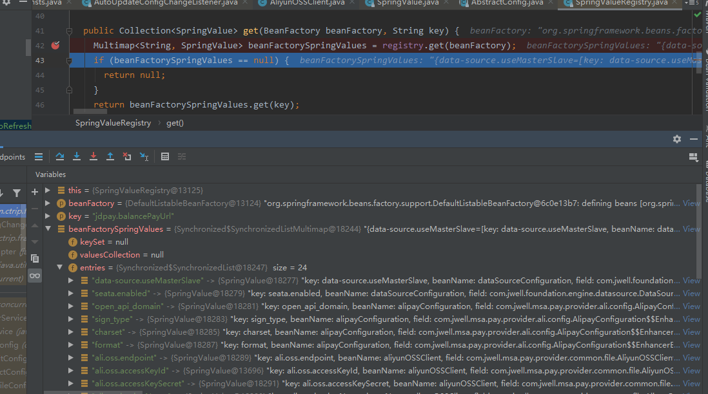
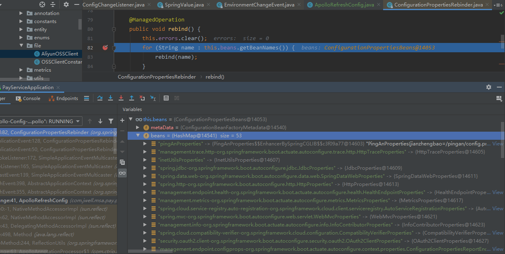

ctrl+shift+alt+u

##### 一.wait()释放锁，sleep()不释放锁（抱着锁睡觉）。

​	wait/notify还必须与synchronized配合使用（condition的await和siginal也一样必须在lock中使用），否则执行时会抛出`IllegalMonitorStateException`异常，并由于没有同步控制还有可能出现`Lost Wake-Up Problem`即丢失唤醒问题，即调用notify时还没有调用wait，即必须`先等待后唤醒，线程才能够被唤醒`。但是对于LockSupport类的park和unpark方法而言，则不需要必须在同步块中执行，即可完成单纯的阻塞和唤醒功能，并且无需保证阻塞和唤醒的顺序（因为LockSupport内部实现中与每个使用它的线程都有一个许可（permit）关联，permit相当于0和1的开关，park和unpark其实是修改该字段（只能为0或1）来控制阻塞与唤醒），但是多次调用unprk方法并不能累积permit）。

关于park和unpark的形象理解：线程阻塞需要消耗凭证（permit），且这个凭证最多只有一个。

调用park方法时：

- 如果有凭证，则会直接消耗掉这个凭证然后正常退出；
- 如果无凭证，就必须阻塞等待unpark方法发放凭证；

调用unpark方法时：

- 会发放一个凭证，但凭证最多只有一个，累加无效，即多次unpark也只有一个凭证，park一次就消耗完毕。

```java
 private Node addConditionWaiter() {
            if (!isHeldExclusively())
                throw new IllegalMonitorStateException(); //即调用await方法时必须该线程已经持有锁
     ...}
```

##### 二、Lambda表达式初次使用耗时慢的问题

来源：https://blog.csdn.net/weixin_40834464/article/details/107874710


- 经测试并非是JIT问题。（设置-Djava.complier=NONE来关闭JIT）
- 匿名内部类在编译阶段会多出一个类，而`Lambda`不会，它仅会多生成一个函数
- 该函数会在运行阶段，会通过`LambdaMetafactory`工厂来生成一个class，进行后续的调用

***为什么Lamdba要如此实现？***

匿名内部类有一定的缺陷：

- 编译器为每个匿名内部类生成一个新的类文件，生成许多类文件是不可取的，因为每个类文件在使用之前都需要加载和验证，这会影响应用程序的启动性能，加载可能是一个昂贵的操作，包括磁盘I/O和解压缩JAR文件本身。
- 如果lambdas被转换为匿名内部类，那么每个lambda都有一个新的类文件。由于每个匿名内部类都将被加载，它将占用JVM的元空间，如果JVM将每个此类匿名内部类中的代码编译为机器码，那么它将存储在代码缓存中。
- 此外，这些匿名内部类将被实例化为单独的对象。因此，匿名内部类会增加应用程序的内存消耗。
- 最重要的是，从一开始就选择使用匿名内部类来实现lambdas，这将限制未来lambda实现更改的范围，以及它们根据未来JVM改进而演进的能力。

​	**显然，lambda表达式的首次初始化开销。正如注释中已经提到的，lambda表达式的类是在运行时生成的，而不是从类路径加载的。然而，生成类并不是速度变慢的原因。毕竟，生成一个结构简单的类比从外部源加载相同的字节还要快。内部类也必须加载。但是，当应用程序以前没有使用lambda表达式时，甚至必须加载用于生成lambda类的框架（Oracle当前的实现在幕后98使用ASM）。这是导致十几个内部使用的类（而不是lambda表达式本身）减速、加载和初始化的真正原因。**

***结论***

- 导致 foreach 测试时数据不正常的罪魁祸首是：`Lambda表达式`
- `Lambda表达式` 在应用程序中首次使用时，需要额外加载ASM框架，因此需要更多的编译，加载的时间
- `Lambda表达式`的底层实现并非匿名内部类的语法糖，而是其优化版
- foreach 的底层实现其实和增强 for循环没有本质区别，一个是外部迭代器，一个是内部迭代器而已
- 通过 foreach + Lambda 的写法，效率并不低，只不过需要提前进行`预热(加载框架)`

##### 三、关于VarHandle变量句柄

​	从java9开始，在`java.util.concurrent`包中对变量的同步访问基本上都由`Unsafe`改为`VarHandle`。`Unsafe` 是不建议开发者直接使用的，因为 `Unsafe` 所操作的并不属于Java标准，会容易带来一些安全性的问题。JDK9 之后，官方推荐使用 `java.lang.invoke.Varhandle` 来替代 `Unsafe` 大部分功能，对比 `Unsafe` ，`Varhandle` 有着相似的功能，但会更加安全，并且，在并发方面也提高了不少性能。

​	变量句柄（VarHandle）是对于一个变量的强类型引用，或者是一组参数化定义的变量族，包括了静态字段、非静态字段、数组元素等，VarHandle支持不同访问模型下对于变量的访问，包括简单的read/write访问，volatile read/write访问，以及CAS访问。

VarHandle相比于传统的对于变量的并发操作具有巨大的优势，在JDK9引入了VarHandle之后，JUC包中对于变量的访问基本上都使用VarHandle，比如AQS中的CLH队列中使用到的变量等。

一、获取Varhandle方式汇总

VarHandle通过`MethodHandles`的`lookup()`方法创建，`Lookup`是`MethodHandles`的内部类，位于`java.lang.invoke`包中，它是一个用于创建方法和变量句柄的工厂。

- `MethodHandles.privateLookupIn(class, MethodHandles.lookup())`获取访问私有变量的Lookup
- `MethodHandles.lookup()` 获取访问protected、public的Lookup
- `findVarHandle`：用于创建对象中非静态字段的`VarHandle`。接收参数有三个，第一个为接收者的class对象，第二个是字段名称，第三个是字段类型。
- `findStaticVarHandle`：用于创建对象中静态字段的`VarHandle`，接收参数与`findVarHandle`一致。
- `unreflectVarHandle`：通过反射字段`Field`创建`VarHandle`。
- `MethodHandles.arrayElementVarHandle(int[].class)` 获取管理数组的 Varhandle

##### 四、关于AQS

​	前三个方法为lock()内部实现，后两个方法为unlock()内部实现。

​	1.tryAcquire()

​		尝试获取锁、非公平锁与公平锁唯一区别就是公平锁会判断同步队列是否为空，不为空则直接返回false;

​	2.addWaitor()

​		若tryAcquire失败则加入同步队列，且若队列为空会进行初始化一个新Node作为head节点，然后将当前节点加入队列尾部。

​	3.acquireQueued()

​		在无线循环体中先执行tryAcquired，若仍然false则将该节点的前驱pre节点（如果）的waitStatus置为-1（Node.SIGNAL表示需等待被唤醒）并且park该节点对应线程。

​	4.tryRelease()

​		state减1，将当前占用线程置为null。

​	5.unparkSuccessor()

​		当释放后，如果head节点存在且waitStatus不为0时（正常应为-1），此时从队列尾部开始找到某节点，当该节点前置节点为null或者前置节点等于head节点时，进行unpark唤醒该节点。

##### 五、AOP

源码分析：https://blog.csdn.net/shenchaohao12321/article/details/85392040

常用注解：

@Before

@After

@AfterReturning

@AfterThrowing

@Round:

spring4(springboot1)执行顺序：

- 正常： Round前 ->Before->(具体方法)->Round后->After->AfterReturning
- 异常： Round前 ->Before->After->AfterThrowing

spring5(springboot2)执行顺序：

- 正常： Round前 ->Before->(具体方法)->AfterReturning->After->Round后
- 异常： Round前 ->Before->AfterThrowing->After

底层原理：ProxyFactoryBean MethodInterceptor


使用ProxyFactoryBean来进行AOP，ProxyFactoryBean的属性如下：

1. target属性：指明要代理的目标类 ，这个目标类实现了上面proxyInterfaces属性指定的接口。
2. proxyInterfaces属性：指明要代理的接口。
3. interceptorNames属性：指明要在代理的目标类中添加的功能，即advice 。
4. proxyTargetClass属性：，如果这个属性被设定为“true”，说明 ProxyFactoryBean要代理的不是接口类，而是要使用CGLIB方式来进行代理。默认值为false,如果是要代理的是接口就采用JDK进行动态代理,如果要代理的不是接口类就采用cglib代理

**JDK和CGLib动态代理区别**

**JDK动态代理：**利用拦截器(拦截器必须实现InvocationHanlder)加上反射机制生成一个实现代理接口的匿名类，
在调用具体方法前调用InvokeHandler来处理。

**CGLib动态代理：**利用ASM开源包，对代理对象类的class文件加载进来，通过修改其字节码生成子类来处理。

**何时使用JDK和CGLib：**

1）如果目标对象实现了接口，默认情况下会采用JDK的动态代理实现AOP。

2）如果目标对象实现了接口，可以强制使用CGLIB实现AOP。

3）如果目标对象没有实现了接口，必须采用CGLIB库，Spring会自动在JDK动态代理和CGLIB之间转换。

**如何强制使用CGLib实现AOP：**

1）添加CGLIB库(aspectjrt-xxx.jar、aspectjweaver-xxx.jar、cglib-nodep-xxx.jar)

2）在Spring配置文件中加入<aop:aspectj-autoproxy proxy-target-class="true"/>

**JDK动态代理和CGLib字节码生成的区别：**

1）JDK动态代理只能对实现了接口的类生成代理，而不能针对类。

2）CGLIB是针对类实现代理，主要是对指定的类生成一个子类，覆盖其中的方法，
并覆盖其中方法实现增强，但是因为采用的是继承，所以该类或方法最好不要声明成final，
对于final类或方法，是无法继承的。

**Spring如何选择用JDK还是CGLib：**

）当Bean实现接口时，Spring就会用JDK的动态代理。

2）当Bean没有实现接口时，Spring使用CGlib是实现。

3）可以强制使用CGlib（在spring配置中加入<aop:aspectj-autoproxy proxy-target-class="true"/>）

##### 六、AspectJ和Spring AOP的区别？

相信作为Java开发者我们都很熟悉Spring这个框架，在spring框架中有一个主要的功能就是AOP，提到AOP就往往会想到AspectJ，下面我对AspectJ和Spring AOP作一个简单的比较：

1、Spring AOP

- 基于动态代理来实现，默认如果使用接口的，用JDK提供的动态代理实现，如果是方法则使用CGLIB实现
- Spring AOP需要依赖IOC容器来管理，并且只能作用于Spring容器，使用纯Java代码实现
- 在性能上，由于Spring AOP是基于动态代理来实现的，在容器启动时需要生成代理实例，在方法调用上也会增加栈的深度，使得Spring AOP的性能不如AspectJ的那么好

2、AspectJ

- AspectJ来自于Eclipse基金会
- AspectJ属于静态织入，通过修改代码来实现，有如下几个织入的时机：
  - 编译期织入（Compile-time weaving）： 如类 A 使用 AspectJ 添加了一个属性，类 B 引用了它，这个场景就需要编译期的时候就进行织入，否则没法编译类 B。
  - 编译后织入（Post-compile weaving）： 也就是已经生成了 .class 文件，或已经打成 jar 包了，这种情况我们需要增强处理的话，就要用到编译后织入。
  - 类加载后织入（Load-time weaving）： 指的是在加载类的时候进行织入，要实现这个时期的织入，有几种常见的方法。1、自定义类加载器来干这个，这个应该是最容易想到的办法，在被织入类加载到 JVM 前去对它进行加载，这样就可以在加载的时候定义行为了。2、在 JVM 启动的时候指定 AspectJ 提供的 agent：`-javaagent:xxx/xxx/aspectjweaver.jar`。

- AspectJ可以做Spring AOP干不了的事情，它是AOP编程的完全解决方案，Spring AOP则致力于解决企业级开发中最普遍的AOP（方法织入）。而不是成为像AspectJ一样的AOP方案
- 因为AspectJ在实际运行之前就完成了织入，所以说它生成的类是没有额外运行时开销的

3、对比总结

下表总结了 Spring AOP 和 AspectJ 之间的关键区别:


##### 七、循环依赖

1、场景：spring默认的singleton模式（必须是属性注入）是支持循环依赖的，prototype模式（即使是属性注入）不支持循环依赖会报错；set注入支持循环依赖，但是构造器注入不支持循环依赖，会报错BeanCurrentlyInCreationException。

2、spring三级缓存解决：

```jav
public class DefaultSingletonBeanRegistry extends SimpleAliasRegistry implements SingletonBeanRegistry {	
	/** Cache of singleton objects: bean name to bean instance. */
	private final Map<String, Object> singletonObjects = new ConcurrentHashMap<>(256);

	/** Cache of singleton factories: bean name to ObjectFactory. */
	private final Map<String, ObjectFactory<?>> singletonFactories = new HashMap<>(16);

	/** Cache of early singleton objects: bean name to bean instance. */
	private final Map<String, Object> earlySingletonObjects = new HashMap<>(16);
```

只有单例的Bean才会放到三级缓存中，通过提前暴露自己解决循环依赖；原型模式的Bean每次获取都新建，不会放入三级缓存。(Spring启动的核心方法是refresh方法)

三个对象

- singletonObject:一级缓存（ConcurrentHashMap），存放经历了完整生命周期的bean对象
- earlySingletonObject:二级缓存（HashMap），存放早期暴露出来的Bean对象，但还未完成属性填充
- singletonFactories:三级缓存（HashMap），存放可以生成Bean的工厂

四个方法

- getSingleton
- doCreateBean
- populateBean
- addSingleton

##### 八、Redis分布式锁

- 5种基本数据类型：string（分布式锁）、hash（购物车）、list（任务队列、订阅等）、set（抽奖、点赞、集合运算如共同认识的人等）、zset（热搜、热度排序）
- BitMap、HyperLogLog、地理空间（geospatial)

关于BitMap，参考https://www.cnblogs.com/54chensongxia/p/13794391.html

redis事务（效果跟Lua脚本一样，但更建议Lua脚本）：MULTI（开启事务）、EXEC（提交事务）、DISCARD（丢弃队列中的命令集合）、WATCH、UNWATCH。

**redis分布式锁**

- redisson优点和缺点

优点：

      1. Redisson 通过 Watch Dog 机制很好的解决了锁的续期问题。
      2. 和 Zookeeper 相比较，Redisson 基于 Redis 性能更高，适合对性能要求高的场景。
      3. 通过 Redisson 实现分布式可重入锁，比原生的 `SET mylock userId NX PX milliseconds` + lua 实现的效果更好些，虽然基本原理都一样，但是它帮我们屏蔽了内部的执行细节。
      4. 在等待申请锁资源的进程等待申请锁的实现上也做了一些优化，减少了无效的锁申请，提升了资源的利用率。

 缺点：

   1、使用 Redisson 实现分布式锁方案最大的问题就是如果你对某个 Redis Master 实例完成了加锁，此时 Master 会异步复制给其对应的 slave 实例。但是这个过程中一旦 Master 宕机，主备切换，slave 变为了 Master。接着就会导致，客户端 2 来尝试加锁的时候，在新的 Master 上完成了加锁，而客户端 1 也以为自己成功加了锁，此时就会导致多个客户端对一个分布式锁完成了加锁，这时系统在业务语义上一定会出现问题，导致各种脏数据的产生。所以这个就是 Redis Cluster 或者说是 Redis Master-Slave 架构的主从异步复制导致的 Redis 分布式锁的最大缺陷（**在 Redis Master 实例宕机的时候，可能导致多个客户端同时完成加锁**）（后面有Redission红锁可以解决）

- RedissonRedLock

RedLock是基于redis实现的分布式锁，RedLock算法思想，意思是不能只在一个redis实例上创建锁，应该是在多个redis实例上创建锁，**n / 2 + 1**，必须在大多数redis节点上都成功创建锁，才能算这个整体的RedLock加锁成功，避免说仅仅在一个redis实例上加锁而带来的问题。

**Redisson实现RedLock的原理**

Redisson中有一个MultiLock的概念，可以将多个锁合并为一个大锁，对一个大锁进行统一的申请加锁以及释放锁而Redisson中实现RedLock就是基于MultiLock 去做的，实现原理其实很简单，RedissonRedLock 继承自RedissonMultiLock，调用lock()方法时，遍历所有的Redis客户端，然后依次加锁，最后统计成功的次数来判断是否加锁成功。


**Redis过期删除策略**

redis如果不设置最大内存大小或者设置为0，在64位操作系统中默认无限制最大内存，32位默认3GB内存。如果超过maxmemory且没有设置MAXMEMORY POLICY(缓存过期策略)则会报错OOM。

过期策略三种：

- 定时删除：过期立刻删除，但是对CPU不友好
- 惰性删除：过期不删除，等到下次访问该key时才删除或者执行flushdb，对内存不友好（可能会造成内存泄露）
- 定期删除：每隔一段时间执行一次抽查部分key删除。

以上三种都会有风险，故需要内存淘汰策略来兜底！

淘汰策略八种：

\1. noeviction：当内存使用超过配置的时候会返回错误，不会驱逐任何键

\2. allkeys-lru：加入键的时候，如果过限，首先通过LRU算法驱逐最久没有使用的键

\3. volatile-lru：加入键的时候如果过限，首先从设置了过期时间的键集合中驱逐最久没有使用的键

\4. allkeys-random：加入键的时候如果过限，从所有key随机删除

\5. volatile-random：加入键的时候如果过限，从过期键的集合中随机驱逐

\6. volatile-ttl：从配置了过期时间的键中驱逐马上就要过期的键

\7. volatile-lfu：从所有配置了过期时间的键中驱逐使用频率最少的键

\8. allkeys-lfu：从所有键中驱逐使用频率最少的键

**注意**：Redis中的LRU与常规的LRU实现并不相同，常规LRU会准确的淘汰掉队头的元素，但是Redis的LRU并不维护队列，只是根据配置的策略要么从所有的key中随机选择N个（N可以配置）要么从所有的设置了过期时间的key中选出N个键，然后再从这N个键中选出最久没有使用的一个key进行淘汰。

**LRU的核心就是 哈希链表** 

- java中的LinkedHashMap：天生可作为LRU算法

##### 九、类加载机制

双亲委派模型的好处
1. 基于双亲委派模型规定的这种带有优先级的层次性关系，虚拟机运⾏程序时就能够避免类的重复加
  载。当⽗类类加载器已经加载过类时，如果再有该类的加载请求传递到⼦类类加载器，⼦类类加载器执
  ⾏loadClass ⽅法，然后委托给⽗类类加载器尝试加载该类，但是⽗类类加载器执⾏Class<?> c
  = findLoadedClass(name); 检查该类是否已经被加载过这⼀阶段就会检查到该类已经被加载过，
  直接返回该类，⽽不会再次加载此类。

2. 双亲委派模型能够避免核⼼类篡改。⼀般我们描述的核⼼类是rt.jar、tools.jar 这些由启动类加
  载器加载的类，这些类库在⽇常开发中被⼴泛运⽤，如果被篡改，后果将不堪设想。
  假设我们⾃定义了⼀个java.lang.Integer 类，与好处1⼀样的流程，当加载类的请求传递到启动
  类加载器时，启动类加载器执⾏findLoadedClass(String) ⽅法发现java.lang.Integer 已经被
  加载过，然后直接返回该类，加载该类的请求结束。虽然避免核⼼类被篡改这⼀点的原因与避免类
  的重复加载⼀致，但这还是能够作为双亲委派模型的好处之⼀的。

  

  

双亲委派模型的不⾜
       这⾥所说的不⾜也可以理解为打破双亲委派模型，当双亲委派模型不满⾜⽤户需求时，⾃然是
由于其不⾜之处，也就促使⽤户将其打破。这⾥描述的也就是打破双亲委派模型的三种⽅式。

1. 由于历史原因（ ClassLoader 类在 JDK1.0 时就已经存在，⽽双亲委派模型是在 JDK1.2 之后才引
  ⼊的），在未引⼊双亲委派模型时，⽤户⾃定义的类加载器需要继承java.lang.ClassLoader 类并
  重写loadClass() ⽅法，因为虚拟机在加载类时会调
  ⽤ClassLoader#loadClassInternal(String) ，⽽这个⽅法（源码如下）会调⽤⾃定义类加载重
  写的loadClass() ⽅法。⽽在引⼊双亲委派模型后， ClassLoader#loadClass ⽅法实际就是双亲委派模型的实现，如果重写了此⽅法，相当于打破了双亲委派模型。为了让⽤户⾃定义的类加载器也遵从双亲委派模型， JDK新增了findClass ⽅法，⽤于实现⾃定义的类加载逻辑。

2. 由于双亲委派模型规定的层次性关系，导致⼦类类加载器加载的类能访问⽗类类加载器加载的类，
  ⽽⽗类类加载器加载的类⽆法访问⼦类类加载器加载的类。为了让上层类加载器加载的类能够访问
  下层类加载器加载的类，或者说让⽗类类加载器委托⼦类类加载器完成加载请求，JDK 引⼊了线程
  上下⽂类加载器contextClassLoader（值被设置为AppClassLoader），藉由它来打破双亲委派模型的屏障。

3. 当⽤户需要程序的动态性，⽐如代码热替换、模块热部署等时，双亲委派模型就不再适⽤，类加载
  器会发展为更为复杂的⽹状结构。
  线程

4. tomcat等web容器：

  ​	Tomcat是web容器，每个web容器可能需要部署多个应用如A和B，都依赖同一个jar，但是版本不一样。此时默认的双亲委派机制是不能多次加载同样的类，所以tomcat提供了隔离机制，为每个容器单独提供一个自定义的加载器WebappClassLoader（继承WebappClassLoaderBase，再继承UrlClassLoader）并重写了loadClass机制，使其不遵守双亲委派约定，每个应用先加载本身目录下的class文件，找不到时再交给CommonClassLoader加载，这与双亲委派机制正好相反。

5. OSGI等模块化技术的应用

SPI 在 JDBC 中的应⽤
我们知道 Java 提供了⼀些SPI(Service Provider Interface) 接⼝，它允许服务商编写具体的代码逻
辑来完成该接⼝的功能。但是 Java 提供的 SPI 接⼝是在核⼼类库中，由启动类加载器加载的，⼚商实现的具体逻辑代码是在classpath 中，是由应⽤类加载器加载的，⽽启动类加载器加载的类⽆法访问应⽤类加载器加载的类，
也就是说启动类加载器⽆法找到 SPI 实现类，单单依靠双亲委派模型就⽆法实现 SPI 的功能了，所以**线**
**程上下⽂类加载器**应运⽽⽣。

​	在 Java 提供的 SPI 中我们最常⽤的可能就属 JDBC 了，下⾯我们就以 JDBC 为例来看⼀下线程上下⽂
类加载器如何打破双亲委派模型。

```java
public class DriverManager {
        static {
            loadInitialDrivers();
            println("JDBC DriverManager initialized");
        }

        private static void loadInitialDrivers() {
            String drivers;
            // 省略代码：⾸先读取系统属性 jdbc.drivers
            // 通过 SPI 加载 classpath 中的驱动类
            AccessController.doPrivileged(new PrivilegedAction<Void>() {
                public Void run() {
                    // ServiceLoader 类是 SPI 加载的⼯具类
                    ServiceLoader<Driver> loadedDrivers =
                            ServiceLoader.load(Driver.class);
                    Iterator<Driver> driversIterator =
                            loadedDrivers.iterator();
                    try {
                        while (driversIterator.hasNext()) {
                            driversIterator.next();
                        }
                    } catch (Throwable t) {
                        // Do nothing
                    }
                    return null;
                }
            });
            // 省略代码：使⽤应⽤类加载器继续加载系统属性 jdbc.drivers 中的驱动类
        }
    }
```

​	从上⾯的代码中可以看到，程序时通过调⽤ServiceLoader.load(Driver.class) ⽅法来完成⾃动加载
classpath 路径中具体的所有实现了Driver.class 接⼝的⼚商实现类，⽽在ServiceLoader.load() ⽅
法中，就是获取了当前线程上下⽂类加载器，并将它传递下去，将它作为类加载器去实现加载逻辑的。

​	**JDK 默认加载当前类的类加载器去加载当前类所依赖且未被加载的类，⽽ServiceLoader 类位于java.util 包下，⾃然是由启动类加载器完成加载，⽽⼚商实现的具体驱动类是位于 classpath 下，启动类加载器⽆法加载 classpath ⽬录的类，⽽如果加载具体驱动类的类加载器变成了应⽤类加载器，那么就可以完成加载了。**

​	也就是说，通过DriverManager 类的静态⽅法，实现了由ServiceLoader 类触发加载位于classpath
的⼚商实现的驱动类。前⽂已经说过， ServiceLoader 类位于java.util 包中，是由启动类加载器加
载的，⽽由启动类加载器加载的类竟然实现了"委派"应⽤类加载器去加载驱动类，这⽆疑是与双亲委派
机制相悖的。⽽实现这个功能的，就是线程上下⽂类加载器。

##### 十、java内存模型与jvm内存模型区别

- JVM内存分区具体指的是JVM中运行时数据区的分区。
- JMM是一种**规范**，是抽象的概念，目的是解决由于多线程并发编程通过内存共享进行通信时，存在的本地内存数据不一致、编译器会对代码指令重排序、处理器会对代码乱序执行等带来的问题，即保证内存共享的正确性（可见性、有序性、原子性）。更恰当说JMM描述的是一组规范，围绕原子性，有序性、可见性，通过这组规范控制程序中各个变量在共享数据区域和私有数据区域的访问方式。

##### 十一、构造器builder模式

用builder模式，用在
1、5个或者5个以上的成员变量
2、参数不多，但是在未来，参数会增加

```java
public final class Result {

    private String A;
    private String B;

    private Result(Builder builder) {
        this.A = builder.A;
        this.B = builder.B;
    }

	public static Builder builder() {
        return new Builder();
    }


public static final class Builder {

        private String A;
        private String B;

        public Builder setA(String A) {
            this.A = A;
            return this; //必须要返回，才可以链式调用
        }

        public Builder setB(String B) {
            this.B = B;
            return this;
        }

        public Result build() {
            return new Result(this);
        }
    
    public static void main(String[] args){
        Result obj = Result.builder().setA("1").setB("2").build();
    }
		
    }
```


JDK中构造器模式类

- java.lang.stringbuilder#append()
- java.lang.stringbuffer#append()
- java.sql.preparedstatement
- javax.swing.grouplayout.group#addcomponent()

##### 十二、一致性hash问题

常见的余数hash算法存在当有服务器上下线的时候，大量缓存数据重建的问题。所以提出了一致性哈希算法：
1. 首先求出服务器（节点）的哈希值，并将其配置到0～2^32的圆（continuum）上。

2. 然后采用同样的方法求出存储数据的键的哈希值，并映射到相同的圆上。

3. 然后从数据映射到的位置开始顺时针查找，将数据保存到找到的第一个服务器上。如果超过2^32仍然找不到服务器，就会保存到第一台服务器上。

  ​	一致性哈希算法对于节点的增减都只需重定位环空间中的一小部分数据，具有较好的容错性和可扩展性。一致性哈希算法在服务节点太少时，容易因为节点分部不均匀而造成数据倾斜问题，此时必然造成大量数据集中到Node A上，而只有极少量会定位到Node B上。为了解决这种数据倾斜问题，一致性哈希算法引入了虚拟节点机制，即对每一个服务节点计算多个哈希，每个计算结果位置都放置一个此服务节点，称为虚拟节点。具体做法可以在服务器ip或主机名的后面增加编号来实现。例如，可以为每台服务器计算三个虚拟节点，于是可以分别计算 “Node A#1”、“Node A#2”、“Node A#3”、“Node B#1”、“Node B#2”、“Node B#3”的哈希值，于是形成六个虚拟节点：同时数据定位算法不变，只是多了一步虚拟节点到实际节点的映射，例如定位到“Node A#1”、“Node A#2”、“Node A#3”三个虚拟节点的数据均定位到Node A上。这样就解决了服务节点少时数据倾斜的问题。

##### 十三、分布式缓存

1. 缓存无底洞
   	使用分布式后（无论是客户端一致性哈性、redis-cluster、codis），批量操作比如批量获取多个key(例如redis的mget操作)，通常需要从不同实例(在不同网络分区)获取key值，相比于单机批量操作只涉及到一次网络操作，分布式批量操作会涉及到多次网络io。

https://www.cnblogs.com/zhangliang1726/p/12068680.html记得看！！

##### 十四、关于TargetSource

 	TargetSource（目标源）是被代理的target（目标对象）实例的来源。TargetSource被用于获取当前MethodInvocation（方法调用）所需要的target（目标对象），这个target通过反射的方式被调用（如：method.invode(target,args)）。**换句话说，proxy（代理对象）代理的不是target，而是TargetSource，这点非常重要！！！**

​	通常情况下，一个proxy（代理对象）只能代理一个target，每次方法调用的目标也是唯一固定的target。但是，如果让proxy代理TargetSource，可以使得每次方法调用的target实例都不同（当然也可以相同，这取决于TargetSource实现）。这种机制使得方法调用变得灵活，可以扩展出很多高级功能，如：target pool（目标对象池）、hot swap（运行时目标对象热替换），等等。

​        接下来要说的另外一点，可能会颠覆你的既有认知：TargetSource组件本身与SpringIoC容器无关，换句话说，target的生命周期不一定是受spring容器管理的，我们以往的XML中的AOP配置，只是对受容器管理的bean而言的，我们当然可以手动创建一个target，同时使用Spring的AOP框架（而不使用IoC容器）。

##### 十五、回滚git提交

1. 使用git log找到1的commit id:5653712d
2. 使用git revert head命令或者git revert 5653712d本地回滚
3. 但是报错了：
   
   由于commit5653712d是一个**合并提交**，和普通 commit 的不同之处在于 merge commit 包含两个 parent commit，代表该 merge commit 是从哪两个 commit 合并过来的。直接使用 git revert ，git 也不知道到底要撤除哪一条分支上的内容，这时需要指定一个 parent number 标识出"主线"，主线的内容将会保留，而另一条分支的内容将被 revert。
4. revert merge commit有一些不同，这时需要添加-m选项以代表这次revert 的是一个 merge commit。
   使用git show命令可以查看 commit 的详细信息如下图：


这代表该 merge commit 是从 e22a0e3 和 f2c74c6 两个 commit 合并过来的。
而常规的 commit 则没有 Merge 行:


5. 如上面的例子中，从 git show 命令的结果中可以看到，merge commit 的 parent 分别为 e22a0e3 和 f2c74c6，其中 e22a0e3 代表 master 分支，f2c74c6 代表 develop 分支。我们可以在master分支上使用git log查看提交日志：


从上图可以看到e22a0e3代表master分支上的父提交。需要注意的是 -m 选项接收的参数是一个数字，数字取值为 1 和 2，也就是 Merge 行里面列出来的第一个还是第二个。

6. 我们要revert develop分支上的内容，即保留主分支master，应该设置主分支为主线，操作如下：

```
git revert -m 1 5653712d
```

1. 有冲突的话，处理冲突，然后commit和push

##### 十六、关于校验异常

1、处理Get请求中 使用@Valid 验证路径中请求实体校验失败后抛出的异常是BindException

2、处理请求参数格式错误 @RequestParam上validate或者List集合参数失败后抛出的异常是javax.validation.ConstraintViolationException

3、处理请求参数格式错误 @RequestBody上validate失败后抛出的异常是MethodArgumentNotValidException异常。

##### 十七、关于ThreadLocal以及其内存泄露问题

1、ThreadLocal是线程私有，内部通过ThreadLocalMap（内部维持一个Entry[]）进行存储，key为ThreadLocal对象，value为用户传入。ThreadLocalMap 看名字大致可以知道是类似于 HashMap的数据结构；但是有一个重要的区别是，**HashMap 使用拉链法解决哈希冲突，而 ThreadLocalMap 是使用线性探测法解决哈希冲突**。

自我归纳：在一个类中声明ThreadLocal对象，当调用get/set等方法时，源码先是获取当前线程的ThreadLocal.ThreadLocalMap类型的属性threadlocal，然后再获取对应值。

```java
public T get() {
    Thread t = Thread.currentThread();
    ThreadLocalMap map = getMap(t); //其源码就一句：return t.threadLocals;
    if (map != null) {
        ThreadLocalMap.Entry e = map.getEntry(this);
        if (e != null) {
            @SuppressWarnings("unchecked")
            T result = (T)e.value;
            return result;
        }
    }
    return setInitialValue();
}
```

需要注意：ThreadLocalMap内部的Entry继承自extends WeakReference<ThreadLocal<?>>，WeakReference 表示当传入的 **referent**（这里就是 ThreadLocal 自身），变成弱引用的时候（即没有强引用指向他的时候）；下一次 GC 将自动回收弱引用；这里没有传入 ReferenceQueue，也就代表不能集中监测回收已弃用的 Entry，而需要再次访问到对应的位置时才能检测到，具体内容下面还有讲到，注意这也是和 WeakHashMap 最大的两个区别之一；


从上图中可以看出，threadLocalMap使用ThreadLocal的弱引用作为key（为何不是强引用：当hreadLocalMap的key为强引用回收ThreadLocal时，因为ThreadLocalMap还持有ThreadLocal的强引用，如果没有手动删除，ThreadLocal不会被回收，导致Entry内存泄漏。即如果是强引用会导致由于ThreadLocalMap持有引用而ThreadLocal无法被删除），如果一个ThreadLocal不存在外部**强引用**时，Key(ThreadLocal)势必会被GC回收，这样就会导致ThreadLocalMap中key为null， 而value还存在着强引用，只有thead线程退出以后,value的强引用链条才会断掉。

但如果当前线程再迟迟不结束的话，这些key为null的Entry的value就会一直存在一条强引用链：

> Thread Ref -> Thread -> ThreaLocalMap -> Entry -> value

永远无法回收，造成内存泄漏。

###### 总结

一个threadLocal对于一个线程只能存放一个值，如果要一个线程要存放多个值就要创建多个threadLocal。（这里起初很容易误解成多个线程共享同一个threadLocalMap，key为线程，这样的话每个线程只能存放一个值，实际不是这样的。）

由于Thread中包含变量ThreadLocalMap，因此ThreadLocalMap与Thread的生命周期是一样长，如果都没有手动删除对应key，都会导致内存泄漏。

但是使用**弱引用**可以多一层保障：弱引用ThreadLocal不会内存泄漏，**对应的value在下一次ThreadLocalMap调用set(),get(),remove()的时候会被清除。因为方法结尾都会调用expungeStaleEntry方法。**

```text
//清理key为null的元素
            expungeStaleEntry(i);
```

**因此，ThreadLocal内存泄漏的根源是：由于ThreadLocalMap的生命周期跟Thread一样长，如果没有手动删除对应key就会导致内存泄漏，而不是因为弱引用。**

###### ThreadLocal正确的使用方法

- 每次使用完ThreadLocal都调用它的remove()方法清除数据
- **将ThreadLocal变量定义成private static，这样就一直存在ThreadLocal的强引用，也就能保证任何时候都能通过ThreadLocal的弱引用访问到Entry的value值，进而清除掉** 。

###### ThreadLocal使用场景

- 隔离多线程同步问题：如SimpleDataFormat的同步问题

- Spring实现事务隔离也是使用的ThreadLocal:

  ​	Spring采⽤Threadlocal的⽅式，来保证单个线程中的数据库操作使⽤的是同⼀个数据库连接，同时，采
  ⽤这种⽅式可以使业务层使⽤事务时不需要感知并管理connection对象，通过传播级别，巧妙地管理多
  个事务配置之间的切换，挂起和恢复

- 我在项⽬中存在⼀个线程经常遇到**横跨若⼲⽅法**调⽤，需要传递的对象，也就是上下⽂（Context），
  它是⼀种状态，经常就是是⽤户身份、任务信息等，就会存在过渡传参的问题。使⽤到类似责任链模式，给每个⽅法增加⼀个context参数⾮常麻烦，⽽且有些时候，如果调⽤链有⽆法修改源码的第三⽅库，对象参数就传不进去了，所以我使⽤到了ThreadLocal去做了⼀下改造，这样只需要在调⽤前在ThreadLocal中设置参数，其他地⽅get⼀下就好了。

2、Thread类有两个属性threadLocal和inheritedThreadLocal，类型都是ThreadLocal.ThreadLocalMap。其中inheritedThreadLocal可以实现子类去访问父类变量，**因为在Thread的构造方法中有init调用，此时会初始化子线程inheritedThreadLocal的值。**但是对于线程池来讲有一个关于该属性bug的地方，因为池里面的线程是复用的（其目的就是为了节省创建线程的开销），当主线程两次设置inheritedThreadLocal值时，如果随后创建的任务都是被同一个子线程执行，那么该子线程可能inheritedThreadLocal值仅是第一次设置的值。

3、ThreadLocal初始化

可以为Java ThreadLocal设置一个初始值，该值将在第一次调用get()时使用：

- 创建一个ThreadLocal子类，该子类覆盖initialValue()方法:

  ```java
  //为Java ThreadLocal变量指定初始值的第一种方法是创建ThreadLocal的子类，该子类覆盖了它的initialValue()方法。
  //创建ThreadLocal子类的最简单方法是直接在创建ThreadLocal变量的地方创建一个匿名子类。下面是建匿名子类的示例，
  //该子类覆盖了initialValue()方法
  private ThreadLocal myThreadLocal = new ThreadLocal<String>() {
      @Override protected String initialValue() {
          return String.valueOf(System.currentTimeMillis());
      }
  };
  //注意，不同的线程仍然会看到不同的初始值。每个线程将创建自己的初始值。
  //只有当从initialValue()方法返回完全相同的对象时，所有线程才会看到相同的对象。
  //但是，首先使用ThreadLocal的全部意义在于避免不同的线程看到相同的实例
  ```

- 创建具有Supplier接口实现的ThreadLocal。

```java
//为Java ThreadLocal变量指定初始值的第二种方法是使用其内部的静态工厂方法(Supplier)，将Supplier接口实现作为参数传递。
//这个Supplier实现为ThreadLocal提供初始值。
//下面是一个使用其withInitial()静态工厂方法创建ThreadLocal的示例，该方法传递一个简单的供应商实现作为参数
ThreadLocal<String> threadLocal = ThreadLocal.withInitial(new Supplier<String>() {
    @Override
    public String get() {
        return String.valueOf(System.currentTimeMillis());
    }
});
//Java8 lambda表达式的写法
ThreadLocal threadLocal = ThreadLocal.withInitial(
        () -> { return String.valueOf(System.currentTimeMillis()); } );
//还可以更短
ThreadLocal threadLocal3 = ThreadLocal.withInitial(
        () -> String.valueOf(System.currentTimeMillis()) );
```

附录：关于Netty的FastThreadLocal实现：

完全兼容ThreadLocal。

```java
public FastThreadLocalThread(Runnable target) {
        super(FastThreadLocalRunnable.wrap(target));//从而包装构造了FastThreadLocalRunnable对象。包装后FastThreadLocalRunnable在执行完之后都会调用FastThreadLocal.removeAll();
        cleanupFastThreadLocals = true;
    }
```

故FastThreadLocal不再使用ObjectCleaner处理泄漏，如果使用FastThreadLocal就不要使用普通线程，而应该构建FastThreadLocalThread，因为这样会在包装后自动清理key-value。而不是像ThreadLocal那样为了防止内存泄露需要finally {ThreadLocal对象.removeAll();}。但是如果还是使用普通线程，则速度性能并无明显变化，且仍需手动remove。


3、针对于线程池**ThreadPoolExecutor**

详细链接：https://blog.csdn.net/sinat_32504127/article/details/105294271值得一看

3.1	任务调度

​	所有任务的调度都是由execute方法完成的，这部分完成的工作是：检查现在线程池的运行状态、运行线程数、运行策略，决定接下来执行的流程，是直接申请线程执行，或是缓冲到队列中执行，亦或是直接拒绝该任务。其执行过程如下：

- 首先检测线程池运行状态，如果不是RUNNING，则直接拒绝，线程池要保证在RUNNING的状态下执行任务。
- 如果workerCount < corePoolSize，则创建并启动一个线程来执行新提交的任务。
- 如果workerCount >= corePoolSize，且线程池内的阻塞队列未满，则将任务添加到该阻塞队列中。
- 如果workerCount >= corePoolSize && workerCount < maximumPoolSize，且线程池内的阻塞队列已满，则创建并启动一个线程来执行新提交的任务。
- 如果workerCount >= maximumPoolSize，并且线程池内的阻塞队列已满, 则根据拒绝策略来处理该任务, 默认的处理方式是直接抛异常。

3.2任务缓冲

​	线程池的本质是对任务和线程的管理，而做到这一点最关键的思想就是将任务和线程两者解耦，不让两者直接关联，才可以做后续的分配工作。线程池中是以生产者消费者模式，通过一个阻塞队列来实现的。阻塞队列缓存任务，工作线程从阻塞队列中获取任务。

3.3任务申请

​	由任务分配部分可知，任务的执行有两种可能：一种是任务直接由新创建的线程执行。另一种是线程从任务队列中获取任务然后执行，执行完任务的空闲线程会再次去从队列中申请任务再去执行。**第一种情况仅出现在线程初始创建的时候，第二种是线程获取任务绝大多数的情况。**

线程需要从任务缓存模块中不断地取任务执行，帮助线程从阻塞队列中获取任务，实现线程管理模块和任务管理模块之间的通信。这部分策略由getTask方法实现，getTask这部分进行了多次判断，为的是控制线程的数量，使其符合线程池的状态。如果线程池现在不应该持有那么多线程，则会返回null值。工作线程Worker会不断接收新任务去执行，而当工作线程Worker接收不到任务的时候，就会开始被回收。

3.4任务拒绝

​	任务拒绝模块是线程池的保护部分，线程池有一个最大的容量，当线程池的任务缓存队列已满，并且线程池中的线程数目达到maximumPoolSize时，就需要拒绝掉该任务，采取任务拒绝策略，保护线程池。

##### 十八、Copy-On-Write

在说明Linux下的copy-on-write机制前，我们首先要知道两个函数：`fork()`和`exec()`。需要注意的是`exec()`并不是一个特定的函数, 它是**一组函数的统称**, 它包括了`execl()`、`execlp()`、`execv()`、`execle()`、`execve()`、`execvp()`。

Linux下**init进程是所有进程的爹**(相当于Java中的Object对象),Linux的进程都通过init进程或init的子进程fork(vfork)出来的。fork()会产生一个和父进程完全相同的子进程(除了pid)。

如果按**传统**的做法，会**直接**将父进程的数据拷贝到子进程中，拷贝完之后，父进程和子进程之间的数据段和堆栈是**相互独立的**。但是，以我们的使用经验来说：往往子进程都会执行`exec()`来做自己想要实现的功能。

- 所以，如果按照上面的做法的话，创建子进程时复制过去的数据是没用的(因为子进程执行`exec()`，原有的数据会被清空)

既然很多时候复制给子进程的数据是无效的，于是就有了Copy On Write这项技术了，原理也很简单：

- fork创建出的子进程，**与父进程共享内存空间**。也就是说，如果子进程**不对内存空间进行写入操作的话，内存空间中的数据并不会复制给子进程**，这样创建子进程的速度就很快了！(不用复制，直接引用父进程的物理空间)。
- 并且如果在fork函数返回之后，子进程**第一时间**exec一个新的可执行映像，那么也不会浪费时间和内存空间了。

Copy On Write技术**实现原理：**

> fork()之后，kernel把父进程中所有的内存页的权限都设为read-only，然后子进程的地址空间指向父进程。当父子进程都只读内存时，相安无事。当其中某个进程写内存时，CPU硬件检测到内存页是read-only的，于是触发页异常中断（page-fault），陷入kernel的一个中断例程。中断例程中，kernel就会**把触发的异常的页复制一份**，于是父子进程各自持有独立的一份。

Copy On Write技术**好处**是什么？

- COW技术可**减少**分配和复制大量资源时带来的**瞬间延时**。
- COW技术可减少**不必要的资源分配**。比如fork进程时，并不是所有的页面都需要复制，父进程的**代码段和只读数据段都不被允许修改，所以无需复制**。

Copy On Write技术**缺点**是什么？

- 如果在fork()之后，父子进程都还需要继续进行写操作，**那么会产生大量的分页错误(页异常中断page-fault)**，这样就得不偿失。

###### 1、linux的cow

- fork出的子进程共享父进程的物理空间，当父子进程**有内存写入操作时**，read-only内存页发生中断，**将触发的异常的内存页复制一份**(其余的页还是共享父进程的)。
- fork出的子进程功能实现和父进程是一样的。如果有需要，我们会用`exec()`把当前进程映像替换成新的进程文件，完成自己想要实现的功能。

###### 2、Redis的COW

- Redis在持久化时，如果是采用BGSAVE命令或者BGREWRITEAOF的方式，那Redis会**fork出一个子进程来读取数据，从而写到磁盘中**。此时父进程和子进程共享同一份数据地址，当某key写操作发生时，会复制一份数据给父进程供修改，不影响子进程的持久化操作！
- 而在**rehash阶段上，写操作是无法避免**的。所以Redis在fork出子进程之后，**将负载因子阈值提高**，尽量减少写操作，避免不必要的内存写入操作，最大限度地节约内存。

###### 3、文件系统的COW

Copy-on-write在对数据进行修改的时候，**不会直接在原来的数据位置上进行操作**，而是重新找个位置修改，这样的好处是一旦系统突然断电，重启之后不需要做Fsck。好处就是能**保证数据的完整性，掉电的话容易恢复**。

- 比如说：要修改数据块A的内容，先把A读出来，写到B块里面去。如果这时候断电了，原来A的内容还在！

###### 4、java里cow

如CopyOnWriteArrayList和CopyOnWriteArraySet类。

##### 十九、SimpleDateFormat的线程不安全问题(ThreadLocal)

之前我们上线后发现部分⽤户的⽇期居然不对了，排查下来是SimpleDataFormat 的锅，当时我们使⽤
SimpleDataFormat的parse()⽅法，内部有⼀个Calendar对象，调⽤SimpleDataFormat的parse()⽅法会
先调⽤Calendar.clear（），然后调⽤Calendar.add()，如果⼀个线程先调⽤了add()然后另⼀个线程⼜调
⽤了clear()，这时候parse()⽅法解析的时间就不对了。

```
protected Calendar calendar; //calendar对象的声明在DateFormat类的属性，所以是多线程之间共享的
```

可以看到，多个线程之间共享变量calendar，并修改calendar。因此在多线程环境下，当多个线程同时使用相同的SimpleDateFormat对象（如static修饰）的话，如调用format方法时，多个线程会同时调用calender.setTime方法，导致time被别的线程修改，因此线程是不安全的。

此外，parse方法也是线程不安全的，parse方法实际调用的是CalenderBuilder的establish来进行解析，其方法中主要步骤不是原子操作。

解决方案：

　　1、将SimpleDateFormat定义成局部变量

　　2、 加一把线程同步锁：synchronized(lock)

　　3、使用ThreadLocal，每个线程都拥有自己的SimpleDateFormat对象副本。如：

```java
/**
 * SimpleDateFormat线程安全测试
 */
public class SimpleDateFormatTest {
        private static final ThreadLocal<SimpleDateFormat> THREAD_LOCAL = ThreadLocal.withInitial(()-> new SimpleDateFormat("yyyy-MM-dd HH:mm:ss"));
    //    private SimpleDateFormat simpleDateFormat = new SimpleDateFormat("yyyy-MM-dd HH:mm:ss");
    ThreadPoolExecutor poolExecutor = new ThreadPoolExecutor(10, 100, 1, TimeUnit.MINUTES, new LinkedBlockingQueue<>(1000), new MyThreadFactory("SimpleDateFormatTest"));

    public void test() {
        while (true) {
            poolExecutor.execute(new Runnable() {
                @Override
                public void run() {
                    SimpleDateFormat simpleDateFormat = THREAD_LOCAL.get();
                    if (simpleDateFormat == null) {
                        simpleDateFormat = new SimpleDateFormat("yyyy-MM-dd HH:mm:ss");
                    }
                    String dateString = simpleDateFormat.format(new Date());
                    try {
                        Date parseDate = simpleDateFormat.parse(dateString);
                        String dateString2 = simpleDateFormat.format(parseDate);
                        System.out.println(dateString.equals(dateString2));
                    } catch (ParseException e) {
                        e.printStackTrace();
                    } finally {
                        local.remove(); //好孩子！！！每次使用完threadLocal删除以免内存泄露
                    }
                }
            });
        }
    }
}
```

##### 二十、异或的意思

英文为exclusive OR，exclusive本意就是【排他性】，【或】的维恩图如下：


【异或(exclusive OR)】则不同，**不允许共存的情况，需要排除相同的部分**，维恩图如下：

故【异或】可以应用到很多方面，如找寻两张照片不同之处。


那如果我们在两个圈的基础上再加一个新圈：


异或一下就能得到：


所以当我们用一个新圈来异或已有的圈，就相当于在做一个反色操作。故也可以解释为什么a⊕b⊕a=b交换a，b值。

###### 异或的应用

- 使某些特定的位翻转（**0异或任何数不变，1异或任何数取反**）

　　例如对数10100001的第2位和第3位翻转，则可以将该数与00000110进行按位异或运算。

　　10100001^00000110 = 10100111

- 实现两个值的交换，而不必使用临时变量。

　　例如交换两个整数a=10100001，b=00000110的值，可通过下列语句实现：

　　a = a^b； 　　//a=10100111

　　b = b^a； 　　//b=10100001

　　a = a^b； 　　//a=00000110

​	异或可以实现两个变量的交换而不需要中间变量。即a⊕b⊕a=b交换a，b值的人（⊕表示异或）

 假设有两个数A=a和B=b，我们要不依靠第三个变量交换它们。

首先把B加到A上。

```java
A = A + B = a + b
```

然后A现在就是a和b的和。B仍然是b。所以我们现在要让B变为a就是：

```java
B = A - B = a + b - b = a
```

然后我们让A变成b：

```java
A = A - B = a + b - a = b
```

这样就完成了，这就是原理。

- 在汇编语言中经常用于将变量置零：

　　xor a，a

- 快速判断两个值是否相等

　　举例1： 判断两个整数a，b是否相等，则可通过下列语句实现：

　　return （（a ^ b） == 0）

- **异或的无进位加法**的特性可应用到两数相加
  a与b两数相加时，可以拆分为`两数异或的无进位和`与`两数与的进位数（通过与方法求进位数时需要左移一位，因为是向前一位进位）`的和。举例：

  ```math
  a=5=101
  b=3=011
  a^b值为：
  1 0 1
  0 1 1
  --------
  1 1 0  -> 即无进位加法结果
  
  此时a & b 值为：
  1 0 1
  0 1 1
  ---------
  0 0 1  ->由于当前位是向左进位，即需左移一位得到0 1 0
  然后继续对110和010进行异或得到无进位和1 0 0，得到进位结果0 1 0左移为1 0 0
  继续对100和100异或得到000，进位结果1000（左移一位）
  最后对000和1000异或后结果1000，进位结果为0000，此时表示没有进位，即1000为最终的计算结果！
  
  ```

  


##### 二十一、为何Hashtable不允许空值，而HashMap可以

Hashtable 是不允许键或值为 null 的，HashMap 的键值则都可以为 null。因为Hashtable在我们put 空值或者get空值的时候会直接抛空指针异常，但是HashMap却做了特殊处理。如果使用null键，hashtable需要key调用hashCode方法和equals方法，null不行。如果你使用null值，就会使得其无法判断对应的key是不存在还是为空（单线程可以通过contain(key）来对key是否存在进行判断，但是多线程不行，因为无法确保contain和get是原子操作，ConcurrentHashMap同理。）

Hashtable的源码提供两种遍历方式：iterator和enumeration.

​	从源码可以看出，**Iterator除了能读取集合的数据之外，也能数据进行删除操作；而Enumeration只能读取集合的数据，而不能对数据进行修改**。

​	**Iterator支持fail-fast机制，而Enumeration不支持fail-fast机制**。Enumeration 是JDK 1.0添加的接口。使用到它的函数包括Vector、Hashtable等类，这些类都是JDK 1.0中加入的。Iterator是JDK1.2添加的接口，Iterator是基于Enumeration实现的，同时Iterator支持fail-fast机制，所以Iterator遍历集合时会比Enumeration遍历集合慢一些。

Hashtable和HashMap的不同点：

- **实现方式不同**：Hashtable 继承了 Dictionary类，而 HashMap 继承的是 AbstractMap 类。

  Dictionary 是 JDK 1.0 添加的，貌似没人用过这个，我也没用过。

- **初始化容量不同**：HashMap 的初始容量为：16，Hashtable 初始容量为：11，两者的负载因子默认都是：0.75。

- **扩容机制不同**：当现有容量大于总容量 * 负载因子时，HashMap 扩容规则为当前容量翻倍，Hashtable 扩容规则为当前容量翻倍 + 1。

- **迭代器不同**：**HashMap 中的 Iterator 迭代器是 fail-fast 的，而 Hashtable 的 Enumerator 不是 fail-fast 的。**

  所以，迭代时当其他线程改变了HashMap 的结构，如：增加、删除元素，将会抛出ConcurrentModificationException 异常，而 Hashtable 则不会。

**快速失败（fail—fast）**是java集合中的一种机制， 在用迭代器遍历一个集合对象时，如果遍历过程中对集合对象的内容进行了修改（增加、删除、修改），则会抛出Concurrent Modification Exception。

> 他的原理是啥？

迭代器在遍历时直接访问集合中的内容，并且在遍历过程中使用一个 modCount 变量。

集合在被遍历期间如果内容发生变化，就会改变modCount的值。

每当迭代器使用hashNext()/next()遍历下一个元素之前，都会检测modCount变量是否为expectedmodCount值，是的话就返回遍历；否则抛出异常，终止遍历。

**Tip**：这里异常的抛出条件是检测到 modCount！=expectedmodCount 这个条件。如果集合发生变化时修改modCount值刚好又设置为了expectedmodCount值，则异常不会抛出。

因此，不能依赖于这个异常是否抛出而进行并发操作的编程，这个异常只建议用于检测并发修改的bug。

> 说说他的场景？

java.util包下的集合类都是快速失败的，不能在多线程下发生并发修改（迭代过程中被修改）算是一种安全机制吧。

**Tip**：**安全失败（fail—safe）**java.util.concurrent包下的容器都是安全失败，可以在多线程下并发使用，并发修改。也就是说安全失败是指在遍历中如果被其他线程修改了，只是会返回错误的数据，但是不会报错。

##### 二十二、sumbit和execute的区别

1. **execute()方法用于提交不需要返回值的任务，所以无法判断任务是否被线程池执行成功与否；**
2. **submit()方法用于提交需要返回值的任务。线程池会返回一个 Future 类型的对象，通过这个 Future 对象可以判断任务是否执行成功**，并且可以通过 `Future` 的 `get()`方法来获取返回值，`get()`方法会阻塞当前线程直到任务完成，而使用 `get（long timeout，TimeUnit unit）`方法则会阻塞当前线程一段时间后立即返回，这时候有可能任务没有执行完。

`Runnable`自Java 1.0以来一直存在，但`Callable`仅在Java 1.5中引入,目的就是为了来处理`Runnable`不支持的用例。**Runnable 接口**不会返回结果或抛出检查异常，但是**`Callable` 接口**可以。所以，如果任务不需要返回结果或抛出异常推荐使用 **Runnable 接口**，这样代码看起来会更加简洁。

不建议用Executors 创建线程池对象，原因如下：

- **FixedThreadPool 和 SingleThreadExecutor** ：允许请求的队列长度为 Integer.MAX_VALUE ，可能堆积大量的请求，从而导致OOM。
- **CachedThreadPool 和 ScheduledThreadPool** ：允许创建的线程数量为 Integer.MAX_VALUE ，可能会创建大量线程，从而导致OOM。

##### 二十三、Transactional注解以及失效情况

###### 1、@Transactional注解可以作用于哪些地方？

@Transactional 可以作用在接口、类、类方法。

作用于类：当把@Transactional 注解放在类上时，表示所有该类的public方法都配置相同的事务属性信息。

作用于方法：当类配置了@Transactional，方法也配置了@Transactional，方法的事务会覆盖类的事务配置信息。

作用于接口：不推荐这种使用方法，因为一旦标注在Interface上并且配置了Spring AOP 使用CGLib动态代理，将会导致@Transactional注解失效

###### 2、@Transactional注有哪些属性？

- propagation属性

  propagation 代表事务的传播行为，默认值为 Propagation.REQUIRED，其他的属性信息如下：

  Propagation.REQUIRED：如果当前存在事务，则加入该事务，如果当前不存在事务，则创建一个新的事务。( 也就是说如果A方法和B方法都添加了注解，在默认传播模式下，A方法内部调用B方法，会把两个方法的事务合并为一个事务 ）

  Propagation.SUPPORTS：如果当前存在事务，则加入该事务；如果当前不存在事务，则以非事务的方式继续运行。

  Propagation.MANDATORY：如果当前存在事务，则加入该事务；如果当前不存在事务，则抛出异常。

  Propagation.REQUIRES_NEW：重新创建一个新的事务，如果当前存在事务，暂停当前的事务。( 当类A中的 a 方法用默认Propagation.REQUIRED模式，类B中的 b方法加上采用 Propagation.REQUIRES_NEW模式，然后在 a 方法中调用 b方法操作数据库，然而 a方法抛出异常后，b方法并没有进行回滚，因为Propagation.REQUIRES_NEW会暂停 a方法的事务 )

  Propagation.NOT_SUPPORTED：以非事务的方式运行，如果当前存在事务，暂停当前的事务。

  Propagation.NEVER：以非事务的方式运行，如果当前存在事务，则抛出异常。

  Propagation.NESTED ：和 Propagation.REQUIRED 效果一样。

- isolation 属性

  isolation ：事务的隔离级别，默认值为 Isolation.DEFAULT。

  Isolation.DEFAULT：使用底层数据库默认的隔离级别。

  Isolation.READ_UNCOMMITTED

  Isolation.READ_COMMITTED

  Isolation.REPEATABLE_READ

  Isolation.SERIALIZABLE

- timeout属性

  timeout ：事务的超时时间，默认值为 -1。如果超过该时间限制但事务还没有完成，则自动回滚事务。

- readOnly属性

  readOnly ：指定事务是否为只读事务，默认值为 false；为了忽略那些不需要事务的方法，比如读取数据，可以设置 read-only 为 true。

- rollbackFor属性

  rollbackFor ：用于指定能够触发事务回滚的异常类型，可以指定多个异常类型。

- noRollbackFor属性

  noRollbackFor：抛出指定的异常类型，不回滚事务，也可以指定多个异常类型。

###### 3.@Transactional失效场景

- @Transactional 应用在非 public 修饰的方法上

  如果Transactional注解应用在非public 修饰的方法上，Transactional将会失效。

  之所以会失效是因为在Spring AOP 代理时，如上图所示 TransactionInterceptor （事务拦截器）在目标方法执行前后进行拦截，DynamicAdvisedInterceptor（CglibAopProxy 的内部类）的 intercept 方法或 JdkDynamicAopProxy 的 invoke 方法会间接调用
  AbstractFallbackTransactionAttributeSource的
  computeTransactionAttribute 方法，获取Transactional 注解的事务配置信息。

  ```text
  protected TransactionAttribute computeTransactionAttribute(Method method,
      Class<?> targetClass) {
          // Don't allow no-public methods as required.
          if (allowPublicMethodsOnly() && !Modifier.isPublic(method.getModifiers())) {
          return null;
  }
  ```

  此方法会检查目标方法的修饰符是否为 public，不是 public则不会获取@Transactional 的属性配置信息。

  注意：protected、private 修饰的方法上使用 @Transactional 注解，虽然事务无效，但不会有任何报错，这是我们很容犯错的一点。

- @Transactional 注解属性 propagation 设置错误

  这种失效是由于配置错误，若是错误的配置以下三种 propagation，事务将不会发生回滚。

  TransactionDefinition.PROPAGATION_SUPPORTS：如果当前存在事务，则加入该事务；如果当前没有事务，则以非事务的方式继续运行。
  TransactionDefinition.PROPAGATION_NOT_SUPPORTED：以非事务方式运行，如果当前存在事务，则把当前事务挂起。
  TransactionDefinition.PROPAGATION_NEVER：以非事务方式运行，如果当前存在事务，则抛出异常。

- @Transactional 注解属性 rollbackFor 设置错误

  rollbackFor 可以指定能够触发事务回滚的异常类型。Spring默认抛出了未检查unchecked异常（继承自 RuntimeException 的异常）或者 Error才回滚事务；其他异常不会触发回滚事务。如果在事务中抛出其他类型的异常，但却期望 Spring 能够回滚事务，就需要指定rollbackFor属性。

- 同一个类中方法调用，导致@Transactional失效 

  开发中避免不了会对同一个类里面的方法调用，比如有一个类Test，它的一个方法A，A再调用本类的方法B（不论方法B是用public还是private修饰），但方法A没有声明注解事务，而B方法有。则外部调用方法A之后，方法B的事务是不会起作用的。这也是经常犯错误的一个地方。

  ```java
  //@Transactional
      @GetMapping("/test")
      private Integer A() throws Exception {
          CityInfoDict cityInfoDict = new CityInfoDict();
          cityInfoDict.setCityName("2");
          /**
           * B 插入字段为 3的数据
           */
          this.insertB();
          /**
           * A 插入字段为 2的数据
           */
          int insert = cityInfoDictMapper.insert(cityInfoDict);
  
          return insert;
      }
  
      @Transactional()
      public Integer insertB() throws Exception {
          CityInfoDict cityInfoDict = new CityInfoDict();
          cityInfoDict.setCityName("3");
          cityInfoDict.setParentCityId(3);
  
          return cityInfoDictMapper.insert(cityInfoDict);
      }
  ```

  那为啥会出现这种情况？其实这还是由于使用Spring AOP代理造成的，因为只有当事务方法被当前类以外的代码调用时，才会由Spring生成的代理对象来管理。

- 异常被你的 catch“吃了”导致@Transactional失效

  这种情况是最常见的一种@Transactional注解失效场景，

  ```java
  @Transactional
      private Integer A() throws Exception {
          int insert = 0;
          try {
              CityInfoDict cityInfoDict = new CityInfoDict();
              cityInfoDict.setCityName("2");
              cityInfoDict.setParentCityId(2);
              /**
               * A 插入字段为 2的数据
               */
              insert = cityInfoDictMapper.insert(cityInfoDict);
              /**
               * B 插入字段为 3的数据
               */
              b.insertB();
          } catch (Exception e) {
              e.printStackTrace();
          }
      }
  ```

  如果B方法内部抛了异常，而A方法此时try catch了B方法的异常，那这个事务就不能正常回滚了。因为当ServiceB中抛出了一个异常以后，ServiceB标识当前事务需要rollback。但是ServiceA中由于你手动的捕获这个异常并进行处理，ServiceA认为当前事务应该正常commit。此时就出现了前后不一致，也就是因为这样，抛出了前面的UnexpectedRollbackException异常。

  spring的事务是在调用业务方法之前开始的，业务方法执行完毕之后才执行commit or rollback，事务是否执行取决于是否抛出runtime异常。如果抛出runtime exception 并在你的业务方法中没有catch到的话，事务会回滚。

  在业务方法中一般不需要catch异常，如果非要catch一定要抛出throw new RuntimeException()，或者注解中指定抛异常类型@Transactional(rollbackFor=Exception.class)，否则会导致事务失效，数据commit造成数据不一致，所以有些时候try catch反倒会画蛇添足。

- 数据库引擎不支持事务

  这种情况出现的概率并不高，事务能否生效数据库引擎是否支持事务是关键。常用的MySQL数据库默认使用支持事务的innodb引擎。一旦数据库引擎切换成不支持事务的myisam，那事务就从根本上失效了

##### 二十四、IOC与DI关系

- IoC 是设计思想，DI 是具体的实现方式；
- IoC 是理论，DI 是实践；

从而实现对象之间的解藕。

**当然，IoC 也可以通过其他的方式来实现，而 DI 只是 Spring 的选择。**

IoC 和 DI 也并非 Spring 框架提出来的，Spring 只是应用了这个设计思想和理念到自己的框架里去。

##### 二十五、序列化

**静态变量不管是不是transient关键字修饰，都不会被序列化**

因为静态变量在全局区,本来流里面就没有写入静态变量,我打印静态变量当然会去全局区查找,而我们的序列化是写到磁盘上的，所以JVM查找这个静态变量的值，是从全局区查找的，而不是磁盘上。

##### 二十六、函数式接口

JDK8中都添加了@FunctionalInterface注解。

1、该注解只能标记在"**有且仅有一个抽象方法**"的**接口**上。

2、JDK8接口中的静态方法和默认方法，都不算是抽象方法。

3、接口默认继承java.lang.Object，所以如果接口显示声明覆盖了Object中方法，那么也不算抽象方法。

```java
// 正确的函数式接口
@FunctionalInterface
public interface TestInterface {
    // 抽象方法
    public void sub();
    // java.lang.Object中的方法不是抽象方法,覆盖了Object中方法
    public boolean equals(Object var1);
    // default不是抽象方法
    public default void defaultMethod(){
 
    }
    // static不是抽象方法
    public static void staticMethod(){
 
    }
```

4、该注解不是必须的，如果一个接口符合"函数式接口"定义，那么加不加该注解都没有影响。加上该注解能够更好地让编译器进行检查。如果编写的不是函数式接口，但是加上了@FunctionInterface，那么编译器会报错。

##### 二十七、CPU密集型 vs IO密集型

我们可以把任务分为计算密集型和IO密集型。

计算密集型任务的特点是要进行大量的计算，消耗CPU资源，比如计算圆周率、对视频进行高清解码等等，全靠CPU的运算能力。这种计算密集型任务虽然也可以用多任务完成，但是任务越多，花在任务切换的时间就越多，CPU执行任务的效率就越低，所以，要最高效地利用CPU，计算密集型任务同时进行的数量应当等于CPU的核心数。

计算密集型任务由于主要消耗CPU资源，因此，代码运行效率至关重要。Python这样的脚本语言运行效率很低，完全不适合计算密集型任务。对于计算密集型任务，最好用C语言编写。

第二种任务的类型是IO密集型，涉及到网络、磁盘IO的任务都是IO密集型任务，这类任务的特点是CPU消耗很少，任务的大部分时间都在等待IO操作完成（因为IO的速度远远低于CPU和内存的速度）。对于IO密集型任务，任务越多，CPU效率越高，但也有一个限度。常见的大部分任务都是IO密集型任务，比如Web应用。


**设置线程池时的最大线程数就需要用到以上调优方式！**

##### 二十八、Fork/Join

特点：工作窃取

##### 二十九、BeanUtils属性拷贝对比

分别执行1000、10000、100000、1000000次耗时数(毫秒):

| 工具名称             | 执行1000次耗时 | 10000次 | 100000次 | 1000000次 |
| -------------------- | -------------- | ------- | -------- | --------- |
| Apache BeanUtils     | 390ms          | 854ms   | 1763ms   | 8408ms    |
| Apache PropertyUtils | 26ms           | 221ms   | 352ms    | 2663ms    |
| spring BeanUtils     | 39ms           | 315ms   | 373ms    | 949ms     |
| Cglib BeanCopier     | 64ms           | 144ms   | 171ms    | 309ms     |

结果表明，**Cglib 的 BeanCopier 的拷贝速度是最快的**，即使是百万次的拷贝也只需要 10 毫秒！ 相比而言，最差的是 Commons 包的 BeanUtils.copyProperties 方法，100 次拷贝测试与表现最好的 Cglib 相差**400 倍**之多。百万次拷贝更是出现了**2600 倍的性能差异！**

为什么Commons包的BeanUtils的copyProperties性能差？

查看源码，我们会发现 CommonsBeanUtils 主要有以下几个耗时的地方：

- 输出了大量的**日志**调试信息
- 重复的对象**类型检查**

除性能外，还有另一个坑：

在进行属性拷贝时，低版本CommonsBeanUtils 为了解决Date为空的问题会导致为目标对象的**原始类型的包装类属性赋予初始值**，如 Integer 属性默认赋值为 0，尽管你的来源对象该字段的值为 null。

这个在我们的**包装类属性为 null 值时有特殊含义的场景**，非常容易踩坑！例如搜索条件对象，一般 null 值表示该字段不做限制，而 0 表示该字段的值必须为0。

##### 三十、Spring Bean的生命周期

类名 ->   生成对象都是调用的无参构造方法反射  ->   原始对象    ->   填充属性（依赖注入）-> 初始化前(PostConstruct注解)->初始化（Initializing注解，处理afterPropertiesSet之类的方法）-> 初始化后（比如此时若需要AOP代理则会生成代理对象,此时最终的Bean其实是代理对象）   -> 最终的Bean。


另外，终于生成的代理对象（如果需要）虽然类型是原类型如UserService，但是代理对象的内部属性为null，调用时是去调用真实对象的属性。从上面流程就可以看出来，生成代理对象后并没有对代理对象进行依赖注入赋值。

```java
class UserService{
    private OrderService orderService;
    public UserService(){System.out.println(1);}
    public UserService(OrderService orderService){
        this.orderService = orderService；
        System.out.println(2);
    }
}//以上获取Bean对象的时候，输出为1，即调用的默认无参构造。如果去掉无参构造，则获取Bean会报错初始化失败。当然也并不是一个类必须要无参构造方法，也可以通过AutoWired实现，比如：

class UserService{
    private OrderService orderService;
    public UserService(OrderService orderService1，OrderService orderService2）{
        System.out.println(1);}
    @Autowired                 
    public UserService(OrderService orderService){
        this.orderService = orderService；
        System.out.println(2);
    }
}//此时注解在哪个构造，方法上就执行哪个构造方法，如果不加注解，spring就不知道用哪一个，加注解就相当于告诉它用哪一个，但如果多个方法都加则也会报错。但是如果只有一个构造器，都不加注解会被默认调用

//关于单例Bean,并不是说同一个类型的对象只有一个，如下面两种方式容器中会生成两个同类型的不同单例对象。     @Component                
 class OrderService{
     
  }       
                      
 public class SynergyServiceApplication {

    public static void main(String[] args) {
        SpringApplication.run(SynergyServiceApplication.class);
    }

    @Bean
    public OrderService orderService1() {
        return new OrderService();
    }
 ｝
```


源码分析：在**DefaultListableBeanFactory**的父类**AbstractAutowireCapableBeanFactory**中有方法doCreateBean方法


Bean初始化源码：

```java
//该方法主要是初始化和BeanPostProcessor
protected Object initializeBean(final String beanName, final Object bean, @Nullable RootBeanDefinition mbd) {
   if (System.getSecurityManager() != null) {
      AccessController.doPrivileged((PrivilegedAction<Object>) () -> {
         invokeAwareMethods(beanName, bean);
         return null;
      }, getAccessControlContext());
   }
   else {
       //执行aware方法
      invokeAwareMethods(beanName, bean);
   }

   Object wrappedBean = bean;
   if (mbd == null || !mbd.isSynthetic()) {
       ///初始化前
      wrappedBean = applyBeanPostProcessorsBeforeInitialization(wrappedBean, beanName);
   }

   try {
       //初始化
      invokeInitMethods(beanName, wrappedBean, mbd);
   }
   catch (Throwable ex) {
      throw new BeanCreationException(
            (mbd != null ? mbd.getResourceDescription() : null),
            beanName, "Invocation of init method failed", ex);
   }
   if (mbd == null || !mbd.isSynthetic()) {
       //初始化后，BeanPostProcessor处理，此时若需要则生成aop
      wrappedBean = applyBeanPostProcessorsAfterInitialization(wrappedBean, beanName);
   }

   return wrappedBean;
}
//初始化后方法处理，主要关注下面的AbstractAutoProxyCreator(BeanPostProcessor的子类），该类进行aop代理对象的生成
public Object applyBeanPostProcessorsAfterInitialization(Object existingBean, String beanName)
			throws BeansException {

		Object result = existingBean;
		for (BeanPostProcessor processor : getBeanPostProcessors()) {
			Object current = processor.postProcessAfterInitialization(result, beanName);
			if (current == null) {
				return result;
			}
			result = current;
		}
		return result;
	}

//AbstractAutoProxyCreator类的wrapIfNecessary方法
protected Object wrapIfNecessary(Object bean, String beanName, Object cacheKey) {
    	//当前targetSourcedBeans里存在该Bean，表示在实例化之前就产生代理对象
		if (StringUtils.hasLength(beanName) && this.targetSourcedBeans.contains(beanName)) {
			return bean;
		}
    //当前这个Bean不需要代理
		if (Boolean.FALSE.equals(this.advisedBeans.get(cacheKey))) {
			return bean;
		}
    //判断当前Bean需不需要进行AOP，比如当前Bean类型是Point、Advice、Advisor等那就不需要AOP
		if (isInfrastructureClass(bean.getClass()) || shouldSkip(bean.getClass(), beanName)) {
			this.advisedBeans.put(cacheKey, Boolean.FALSE);
			return bean;
		}

		// 如果需要则创建代理对象，该步是获取当前Bean所有匹配上的advices
		Object[] specificInterceptors = getAdvicesAndAdvisorsForBean(bean.getClass(), beanName, null);
		if (specificInterceptors != DO_NOT_PROXY) {
			this.advisedBeans.put(cacheKey, Boolean.TRUE);
			Object proxy = createProxy(
					bean.getClass(), beanName, specificInterceptors, new SingletonTargetSource(bean));
			this.proxyTypes.put(cacheKey, proxy.getClass());
			return proxy;
		}

		this.advisedBeans.put(cacheKey, Boolean.FALSE);
		return bean;
	}


//aop创建代理对象方法
protected Object createProxy(Class<?> beanClass, @Nullable String beanName,
			@Nullable Object[] specificInterceptors, TargetSource targetSource) {

		if (this.beanFactory instanceof ConfigurableListableBeanFactory) {
			AutoProxyUtils.exposeTargetClass((ConfigurableListableBeanFactory) this.beanFactory, beanName, beanClass);
		}

		ProxyFactory proxyFactory = new ProxyFactory();
		proxyFactory.copyFrom(this);

		if (!proxyFactory.isProxyTargetClass()) {
			if (shouldProxyTargetClass(beanClass, beanName)) {
				proxyFactory.setProxyTargetClass(true);
			}
			else {
				evaluateProxyInterfaces(beanClass, proxyFactory);
			}
		}

		Advisor[] advisors = buildAdvisors(beanName, specificInterceptors);
		proxyFactory.addAdvisors(advisors);
		proxyFactory.setTargetSource(targetSource);
		customizeProxyFactory(proxyFactory);

		proxyFactory.setFrozen(this.freezeProxy);
		if (advisorsPreFiltered()) {
			proxyFactory.setPreFiltered(true);
		}

		return proxyFactory.getProxy(getProxyClassLoader());
	}
```

关于同类方法中的事务为何无效：

当执行事务方法test时，是代理对象在执行，先判断注解，然后创建数据库连接，使用被代理对象调用test方法。但是当执行到a方法时，并不是代理对象在调用而是被代理对象自己调用，不会去包装，所以导致a的事务无效。

```java
@Transactional
public void test(){
    a();
}

@Transactional
public void a(){
    
}
```

##### 三十一、Spring小记

1. 创建Bean的方式

   - xml或者常用注解（需配置ComponentScan扫描，且该注解可以指定excludeFilter和includeFilter或自定义Filter）

   - 通过在注解类上（如@Configuration）标记Import注解引入具体的class（id默认为全类名），也可以自定义ImportSelector或ImportBeanDefinitionRegistar

   - 通过FactoryBean的方式，将自实现的FactoryBean注入到容器中，但实际获取的对象为其内部getObject方法返回的对象

     ```java
     @Bean
     public FactoryBean myFactoryBean(){
         return new MyFactoryBean();
     }
     
     class MyFactoryBean{
     	@Override
         public Object getObject(){
             return new Color();
         }
     }
     application.getBean("myFactoryBean")//“myFactoryBean”的bean对象类型的时候实际为Color类型；
      application.getBean("&myFactoryBean")//加个&符号获取的bean对象类型就变成了FactoryBean类型，这是源码BeanFactory（最底层容器）中定义的前缀。
     
     ```

2. Bean的生命周期

   - 注解指定initMethod和destoryMethod

     注意的是singleton时会启动就调用创建和初始化方法，容器关闭调用销毁方法。但protoType时启动不会创建和初始化，而是获取对象时才创建和初始化，而销毁方法容器关闭也不会调用。

   - InitializingBean接口的afterPropertiesSet方法、以及DisposableBean的destroy方法

   - @PostConstruct注解。@PreDestroy注解

   - BeanPostProcessor接口，后置处理器。有两个postProcessBeforeInitialization和postProcessAfterInitialization方法。源码得知postProcessBeforeInitialization该方法是在对象实例被创建和属性赋值，且在任何初始化方法（如InitializingBean和init）之前被调用；postProcessAfterInitialization是在所有初始化方法执行结束后调用。
     

3.自动装配

3.1.Autowired(spring规范)

 -	按类型装配，如果找到多个，再将属性的名称跟容器bean的id进行匹配。同时可以使用Qualifier注解明确指定要装配的组件id而不是使用属性名
 -	自动装配默认都是必须有值，否则抛错。可以更改Autowired注解中的required值为false即可复制null
 -	可以在Bean上使用@Primary注解可以用spring装配时使用首选的bean，此时按类型状态都会装配首选bean，跟其属性名称无关（即在没有明确指定id的情况下），当然也可以用Qualifier明确指定要装配的组件

3.2Resource（java规范）

-	默认按名称装配，不支持Primary注解和required属性

3.3@Inject（java规范）

- 功能跟autowired一样，只不过需要导入jar包

4.如果在自定义组件中要使用Spring底层组件的功能，如ApplicationContext等，可以直接实现xxxAware接口。

5.关于@ControllerAdvice注解

​	在Spring里，我们可以使用@ControllerAdvice来声明一些全局性的东西，最常见的是结合@ExceptionHandler注解用于全局异常的处理。

@ControllerAdvice是在类上声明的注解，其用法主要有三点：

- @ExceptionHandler注解标注的方法：用于捕获Controller中抛出的不同类型的异常，从而达到异常全局处理的目的；
- @InitBinder注解标注的方法：用于请求中注册自定义参数的解析，从而达到自定义请求参数格式的目的；
- @ModelAttribute注解标注的方法：表示此方法会在执行目标Controller方法之前执行 。

```java
// 这里@RestControllerAdvice等同于@ControllerAdvice + @ResponseBody
@RestControllerAdvice
public class GlobalHandler {
    private final Logger logger = LoggerFactory.getLogger(GlobalHandler.class);
    // 这里@ModelAttribute("loginUserInfo")标注的modelAttribute()方法表示会在Controller方法之前
    // 执行，返回当前登录用户的UserDetails对象
    @ModelAttribute("loginUserInfo")
    public UserDetails modelAttribute() {
        return (UserDetails) SecurityContextHolder.getContext().getAuthentication().getPrincipal();
    }
    // @InitBinder标注的initBinder()方法表示注册一个Date类型的类型转换器，用于将类似这样的2019-06-10
    // 日期格式的字符串转换成Date对象
    @InitBinder
    protected void initBinder(WebDataBinder binder) {
        SimpleDateFormat dateFormat = new SimpleDateFormat("yyyy-MM-dd");
        dateFormat.setLenient(false);
        binder.registerCustomEditor(Date.class, new CustomDateEditor(dateFormat, false));
    } 
    // 这里表示Controller抛出的MethodArgumentNotValidException异常由这个方法处理
    @ExceptionHandler(MethodArgumentNotValidException.class)
    public Result exceptionHandler(MethodArgumentNotValidException e) {
        Result result = new Result(BizExceptionEnum.INVALID_REQ_PARAM.getErrorCode(),
                BizExceptionEnum.INVALID_REQ_PARAM.getErrorMsg());
        logger.error("req params error", e);
        return result;
    }
    // 这里表示Controller抛出的BizException异常由这个方法处理
    @ExceptionHandler(BizException.class)
    public Result exceptionHandler(BizException e) {
        BizExceptionEnum exceptionEnum = e.getBizExceptionEnum();
        Result result = new Result(exceptionEnum.getErrorCode(), exceptionEnum.getErrorMsg());
        logger.error("business error", e);
        return result;
    }
    // 这里就是通用的异常处理器了,所有预料之外的Exception异常都由这里处理
    @ExceptionHandler(Exception.class)
    public Result exceptionHandler(Exception e) {
        Result result = new Result(1000, "网络繁忙,请稍后再试");
        logger.error("application error", e);
        return result;
    }

}
```

实现原理见：https://zhuanlan.zhihu.com/p/73087879

就是DispacherServlet对象在创建时会初始化一系列的对象：

```java
public class DispatcherServlet extends FrameworkServlet {
    // ......
	protected void initStrategies(ApplicationContext context) {
		initMultipartResolver(context);
		initLocaleResolver(context);
		initThemeResolver(context);
		initHandlerMappings(context);
		initHandlerAdapters(context);
		initHandlerExceptionResolvers(context);
		initRequestToViewNameTranslator(context);
		initViewResolvers(context);
		initFlashMapManager(context);
	}
    // ......
}
```

initHandlerAdapters(context)方法会取得所有实现了HandlerAdapter接口的bean并保存起来，其中就有一个类型为RequestMappingHandlerAdapter的bean，这个bean就是@RequestMapping注解能起作用的关键，这个bean在应用启动过程中会获取所有被@ControllerAdvice注解标注的bean对象做进一步处理。经过这里处理之后，@ModelAttribute和@InitBinder就能起作用了。

initHandlerExceptionResolvers(context)方法，方法会取得所有实现了HandlerExceptionResolver接口的bean并保存起来，其中就有一个类型为ExceptionHandlerExceptionResolver的bean，这个bean在应用启动过程中会获取所有被@ControllerAdvice注解标注的bean对象做进一步处理。当Controller抛出异常时，DispatcherServlet通过ExceptionHandlerExceptionResolver来解析异常，而ExceptionHandlerExceptionResolver又通过ExceptionHandlerMethodResolver 来解析异常， ExceptionHandlerMethodResolver 最终解析异常找到适用的@ExceptionHandler标注的方法

##### 三十二、log4j中的MDC

slf4j除了trace、debug、info、warn、error这几个日志接口外，还可以配合MDC将数据写入日志。换句话说MDC也是用来记录日志的，但它的使用方式与使用日志接口不同。

MDC从使用方式上有些不同,我对它的理解是MDC可以将一个处理线程中**你想体现在日志文件中的数据**统一管理起来，**根据你的日志文件配置决定是否输出**。也就是说你可以自己指定日志中输出的内容，然后配置文件中配置输出格式。

　　比如以下但不限于以下场景可以考虑使用MDC来达到目的

1. 我们想在日志中体现请求用户IP地址
2. 用户使用http客户端的user-agent
3. 记录一次处理线程的日志跟踪编号(这个编号目的是为了查询日志方便，结合grep命令能根据跟踪编号将本次的处理日志全部输出)

org.slf4j.MDC一般用AOP或Filter或Interceptor这类工具配合使用，获得你希望输出到日志的变量并调用。实现步骤如下：

1. 定义过滤器，在请求中通过MDC.put(key, value)方法放入指定的值，结束时候清除。
2. 将过滤器注入容器中，并设置拦截所有请求。

```java
public class MdcConstants {//定义想加入日志的变量Key

   private MdcConstants() {

   }

   /**
    * 请求头中traceid
    */
   public static final String REQUEST_TRACE_ID_KEY = "x-traceid";

   public static final String TRACE_ID_KEY = "traceId";

   public static final String URI_KEY = "uri";

   public static final String CLIENT_IP = "clientIp";

}
```

```java
//定义Filter，
public class LoggerMDCFilter implements Filter {

   @Override
   public void init(FilterConfig filterConfig) throws ServletException {

   }

   @Override
   public void doFilter(ServletRequest request, ServletResponse response, FilterChain chain) throws IOException, ServletException {
      // 初始化mdc
      insertIntoMDC(request);
      try {
         chain.doFilter(request, response);
      } finally {
         // 移除Mdc值,防止下次请求取到错误值
         clearMdc();
      }
   }

   @Override
   public void destroy() {
      clearMdc();
   }

   public void insertIntoMDC(ServletRequest request) {
      HttpServletRequest req = (HttpServletRequest) request;
      String globalMsgId = req.getHeader(MdcConstants.REQUEST_TRACE_ID_KEY);
      if (StringUtils.isBlank(globalMsgId)) {
         globalMsgId = UuidUtils.generate32UUID();
      }
      MDC.put(MdcConstants.TRACE_ID_KEY, globalMsgId);
      // uri_key
      String requestUri = StringUtils.join(req.getRequestURI(), " ", req.getMethod());
      MDC.put(MdcConstants.URI_KEY, requestUri);
      // 客户端id
      MDC.put(MdcConstants.CLIENT_IP, IPUtils.getIpAddr(req));
   }
    
   public void clearMdc() {
      MDC.remove(MdcConstants.TRACE_ID_KEY);
      MDC.remove(MdcConstants.URI_KEY);
      MDC.remove(MdcConstants.CLIENT_IP);
   }

}
```

```java
@Configuration //注册配置类，并加入过滤器
public class EngineConfiguration {

   @Bean
   public FilterRegistrationBean loggerMDCFilter() {
      FilterRegistrationBean registrationBean = new FilterRegistrationBean();
      // 要注册的过滤器
      registrationBean.setFilter(new LoggerMDCFilter());
      // 要过滤的URL
      registrationBean.addUrlPatterns("/*");
      registrationBean.setOrder(Ordered.HIGHEST_PRECEDENCE);
      return registrationBean;
   }
}
```

##### 三十三、关于Apollo的自动刷新

apollo支持配置自动刷新功能，其背后原理。

1. 当使用apollo默认配置时，此时@ConfigurationProperties的配置更改不生效即不能自动刷新。

对于@Value注解和@ConfigurationProperties的配置更改时：AutoUpdateConfigChangeListener类。

```java
public class AutoUpdateConfigChangeListener implements ConfigChangeListener{
  private static final Logger logger = LoggerFactory.getLogger(AutoUpdateConfigChangeListener.class);
 //...省略不相关代码

  @Override //修改时会回调该方法
  public void onChange(ConfigChangeEvent changeEvent) {
    Set<String> keys = changeEvent.changedKeys();//获取变更的key
    if (CollectionUtils.isEmpty(keys)) {
      return;
    }
    for (String key : keys) {
      // 1.检查是否是密切相关的key，注意此处容器中的SpringValue对象只有被@Value注解的属性的对应对象，而对于@ConfigurationProperties的对象根本不会包含在其中，所以当@ConfigurationProperties的属性值发生变化时，此处会返回null导致不能进行更新
      Collection<SpringValue> targetValues = springValueRegistry.get(beanFactory, key);
      if (targetValues == null || targetValues.isEmpty()) {
        continue;
      }

      // 2. 修改变更后的值
      for (SpringValue val : targetValues) {
        updateSpringValue(val);
      }
    }
  }

  private void updateSpringValue(SpringValue springValue) {
    try {
      //此处主要做类型转换
      Object value = resolvePropertyValue(springValue);
      //进入修改操作
      springValue.update(value);
    } catch (Throwable ex) {
      logger.error("Auto update apollo changed value failed, {}", springValue.toString(), ex);
    }
  }

  /**
   */
  private Object resolvePropertyValue(SpringValue springValue) {
    // value will never be null, as @Value and @ApolloJsonValue will not allow that
    Object value = placeholderHelper
        .resolvePropertyValue(beanFactory, springValue.getBeanName(), springValue.getPlaceholder());

    if (springValue.isJson()) {
      value = parseJsonValue((String)value, springValue.getGenericType());
    } else {
      if (springValue.isField()) {
        // org.springframework.beans.TypeConverter#convertIfNecessary(java.lang.Object, java.lang.Class, java.lang.reflect.Field) is available from Spring 3.2.0+
        if (typeConverterHasConvertIfNecessaryWithFieldParameter) {
          value = this.typeConverter
              .convertIfNecessary(value, springValue.getTargetType(), springValue.getField());
        } else {
          value = this.typeConverter.convertIfNecessary(value, springValue.getTargetType());
        }
      } else {
        value = this.typeConverter.convertIfNecessary(value, springValue.getTargetType(),
            springValue.getMethodParameter());
      }
    }

    return value;
  }
}
```

```java
//#附上SpringValue类的update方法，可知就是通过反射改变参数值，不需要重新初始化bean
public void update(Object newVal) throws IllegalAccessException, InvocationTargetException {
  if (isField()) {
    injectField(newVal);
  } else {
    injectMethod(newVal);
  }
}

private void injectField(Object newVal) throws IllegalAccessException {
  Object bean = beanRef.get();
  if (bean == null) {
    return;
  }
  boolean accessible = field.isAccessible();
  field.setAccessible(true);
  field.set(bean, newVal);
  field.setAccessible(accessible);
}

private void injectMethod(Object newVal)
    throws InvocationTargetException, IllegalAccessException {
  Object bean = beanRef.get();
  if (bean == null) {
    return;
  }
  methodParameter.getMethod().invoke(bean, newVal);
}
```



2. 自实现自动刷新

官网如是说：**需要注意的是，`@ConfigurationProperties`如果需要在Apollo配置变化时自动更新注入的值，需要配合使用[EnvironmentChangeEvent](https://cloud.spring.io/spring-cloud-static/spring-cloud.html#_environment_changes)或[RefreshScope](https://cloud.spring.io/spring-cloud-static/spring-cloud.html#_refresh_scope)。相关代码实现，可以参考apollo-use-cases项目中的[ZuulPropertiesRefresher.java](https://github.com/ctripcorp/apollo-use-cases/blob/master/spring-cloud-zuul/src/main/java/com/ctrip/framework/apollo/use/cases/spring/cloud/zuul/ZuulPropertiesRefresher.java#L48)和apollo-demo项目中的[SampleRedisConfig.java](https://github.com/ctripcorp/apollo/blob/master/apollo-demo/src/main/java/com/ctrip/framework/apollo/demo/spring/springBootDemo/config/SampleRedisConfig.java)以及[SpringBootApolloRefreshConfig.java](https://github.com/ctripcorp/apollo/blob/master/apollo-demo/src/main/java/com/ctrip/framework/apollo/demo/spring/springBootDemo/refresh/SpringBootApolloRefreshConfig.java)[883](https://github.com/ctripcorp/apollo/blob/6d50ca881a6afb2766725bdb3c09c14d450cc12f/docs/zh/usage/java-sdk-user-guide.md#L883)
[884](https://github.com/ctripcorp/apollo/blob/6d50ca881a6afb2766725bdb3c09c14d450cc12f/docs/zh/usage/java-sdk-user-guide.md#L884)**

- 使用EnvironmeneChangeEvent方式
  自定义配置类，使用@ApolloConfigChangeListener定义监听处理方法，当配置有变更的时候，使用applicationContext.pushEvent推送EnvironmentChangeEvent事件。

  ```java
  @EnableApolloConfig
  @Component //必须注入容器
  public class ApolloRefreshConfig implements ApplicationContextAware {
      private static final Logger logger = LoggerFactory.getLogger(ApolloRefreshConfig.class);
      private ApplicationContext applicationContext;
  
      @ApolloConfigChangeListener
      public void onChange(ConfigChangeEvent changeEvent) {
          logger.info("before refresh");
          for (String changedKey : changeEvent.changedKeys()) {
              logger.info("changedKey:{} value:{}", changedKey, changeEvent.getChange(changedKey));
              ConfigChange configChange = changeEvent.getChange(changedKey);
              configChange.getOldValue();
          }
          // 更新相应的bean的属性值，主要是存在@ConfigurationProperties注解的bean
          this.applicationContext.publishEvent(new EnvironmentChangeEvent(changeEvent.changedKeys()));
          logger.info("after refresh");
      }
  
      @Override
      public void setApplicationContext(ApplicationContext applicationContext) throws BeansException {
          this.applicationContext = applicationContext;
      }
  }
  ```

  然后只要实现了`ApplicationListener<EnvironmentChangeEvent>`接口的类都会触发处理事件，主要是ConfigurationPropertiesRebinder类中处理方式即为unbind全部bean，先卸载，然后重新初始化。

  ```java
  /**
   * Listens for {@link EnvironmentChangeEvent} and rebinds beans that were bound to the
   * {@link Environment} using {@link ConfigurationProperties
   * <code>@ConfigurationProperties</code>}. When these beans are re-bound and
   * re-initialized, the changes are available immediately to any component that is using
   * the <code>@ConfigurationProperties</code> bean.
   *
   * @see RefreshScope for a deeper and optionally more focused refresh of bean components.
   * @author Dave Syer
   *
   */
  @Component
  @ManagedResource
  public class ConfigurationPropertiesRebinder
        implements ApplicationContextAware, ApplicationListener<EnvironmentChangeEvent> {
      //注意此处beans的类型！！！
  	private ConfigurationPropertiesBeans beans;
  
     public ConfigurationPropertiesRebinder(ConfigurationPropertiesBeans beans) {
        this.beans = beans;
     }
  
      //触发该方法处理事件
     @ManagedOperation
     public void rebind() {
        this.errors.clear();
        for (String name : this.beans.getBeanNames()) {
           rebind(name);
        }
     }
  	//先销毁再初始化
     @ManagedOperation
     public boolean rebind(String name) {
        if (!this.beans.getBeanNames().contains(name)) {
           return false;
        }
        if (this.applicationContext != null) {
           try {
              Object bean = this.applicationContext.getBean(name);
              if (AopUtils.isAopProxy(bean)) {
                 bean = ProxyUtils.getTargetObject(bean);
              }
              if (bean != null) {//先销毁再初始化
                 this.applicationContext.getAutowireCapableBeanFactory()
                       .destroyBean(bean);
                 this.applicationContext.getAutowireCapableBeanFactory()
                       .initializeBean(bean, name);
                 return true;
              }
           }
           catch (RuntimeException e) {
              this.errors.put(name, e);
              throw e;
           }
           catch (Exception e) {
              this.errors.put(name, e);
              throw new IllegalStateException("Cannot rebind to " + name, e);
           }
        }
        return false;
     }
  
     @ManagedAttribute
     public Set<String> getBeanNames() {
        return new HashSet<>(this.beans.getBeanNames());
     }
  	//触发入口
     @Override
     public void onApplicationEvent(EnvironmentChangeEvent event) {
        if (this.applicationContext.equals(event.getSource())
              // Backwards compatible
              || event.getKeys().equals(event.getSource())) {
           rebind();
        }
     }
  
  }
  ```

  另外，此处的this.beans全部为**ConfigurationProperties注解的bean**。也就是重新加载的只有带属性的配置Bean！

  

  当收到EnvironmentChangeEvent事件后执行rebind方法。在该类中的beans是通过构造函数传过来的，接下来先查看这个对象是如何被构造的。

  ```java
  public class ConfigurationPropertiesRebinderAutoConfiguration implements ApplicationContextAware, SmartInitializingSingleton {
    @Bean
    @ConditionalOnMissingBean(search = SearchStrategy.CURRENT)
    public static ConfigurationPropertiesBeans configurationPropertiesBeans() {
      return new ConfigurationPropertiesBeans();
    }
  
    @Bean
    @ConditionalOnMissingBean(search = SearchStrategy.CURRENT)
    public ConfigurationPropertiesRebinder configurationPropertiesRebinder(ConfigurationPropertiesBeans beans) {
      ConfigurationPropertiesRebinder rebinder = new ConfigurationPropertiesRebinder(beans);
      return rebinder;
    }
  }
  ```

  在这个自动配置类中创建了
  ConfigurationPropertiesRebinder并且将ConfigurationPropertiesBeans 注入。ConfigurationPropertiesBeans是个BeanPostProcessor处理器。

  ```java
  @Component
  public class ConfigurationPropertiesBeans
        implements BeanPostProcessor, ApplicationContextAware {
  
     private ConfigurationBeanFactoryMetadata metaData;
  
     private Map<String, Object> beans = new HashMap<String, Object>();
  
     private ConfigurableListableBeanFactory beanFactory;
  
     private String refreshScope;
  
     private boolean refreshScopeInitialized;
  
     private ConfigurationPropertiesBeans parent;
  
     @Override
     public void setApplicationContext(ApplicationContext applicationContext)
           throws BeansException {
        //...
     }
  
     @Override
     public Object postProcessBeforeInitialization(Object bean, String beanName)
           throws BeansException {
        if (isRefreshScoped(beanName)) {
           return bean;
        }//判断是否是ConfigurationProperties注解标记的类，是则放入beans中
        ConfigurationProperties annotation = AnnotationUtils
              .findAnnotation(bean.getClass(), ConfigurationProperties.class);
        if (annotation != null) {
           this.beans.put(beanName, bean);
        }
        else if (this.metaData != null) {
           annotation = this.metaData.findFactoryAnnotation(beanName,
                 ConfigurationProperties.class);
           if (annotation != null) {
              this.beans.put(beanName, bean);
           }
        }
        return bean;
     }
  
     private boolean isRefreshScoped(String beanName) {
        if (this.refreshScope == null && !this.refreshScopeInitialized) {
           this.refreshScopeInitialized = true;
           for (String scope : this.beanFactory.getRegisteredScopeNames()) {
              if (this.beanFactory.getRegisteredScope(
                    scope) instanceof org.springframework.cloud.context.scope.refresh.RefreshScope) {
                 this.refreshScope = scope;
                 break;
              }
           }
        }
        if (beanName == null || this.refreshScope == null) {
           return false;
        }
        return this.beanFactory.containsBeanDefinition(beanName) && this.refreshScope
              .equals(this.beanFactory.getBeanDefinition(beanName).getScope());
     }
  
     @Override
     public Object postProcessAfterInitialization(Object bean, String beanName)
           throws BeansException {
        return bean;
     }
  
     public Set<String> getBeanNames() {
        return new HashSet<String>(this.beans.keySet());
     }
  
  }
  ```

  在isRefreshScoped方法中遍历注册的所有Scope并且判断是否是有RefreshScope，先从注册的所有Scope中查找RefreshScope，如果没有返回false，如果是则返回true。如果isRefreshScoped方法返回的false，就判断当前Bean是否有@ConfigurationProperties注解，如果有就会被包装成
  ConfigurationPropertiesBean存入当前的beans集合中（当有refresh发生时会重新绑定这些bean）。接下来继续进入到上面的ConfigurationPropertiesRebinder#rebind方法中。

  rebind方法中会对所有带有@ConfigurationProperties注解的类进行刷新，rebind方法中会对bean进行销毁和初始化。

- 使用refreshScope方式，直接调用refreshAll方法，无需自己推送事件

  ```java
  @EnableApolloConfig
  @Component 
  public class ApolloRefreshConfig {
      private static final Logger logger = LoggerFactory.getLogger(ApolloRefreshConfig.class);
      @Autowired
      private RefreshScope refreshScope;
  
      @ApolloConfigChangeListener(ConfigConsts.NAMESPACE_APPLICATION)
      public void onChange(ConfigChangeEvent changeEvent) {
          logger.info("before refresh");
          for (String changedKey : changeEvent.changedKeys()) {
              logger.info("changedKey:{} value:{}", changedKey, changeEvent.getChange(changedKey));
              ConfigChange configChange = changeEvent.getChange(changedKey);
              configChange.getOldValue();
          }
          refreshScope.refreshAll();//调用refreshScope对象的freshAll方法
          logger.info("after refresh");
      }
  }
  ```

总结：当触发了refresh后，所有的带有@ConfigurationProperties注解的Bean都会自动的刷新并不需要@RefreshScope注解。**而有@RefreshScope注解的一般在应用在非配置类上，有成员属性使用@Value注解的。**

附录：Apollo的配置缓存问题。

自己遇到修改了Local文件并指定该环境激活，但是配置依然毫无变化，后面得知Apollo的客户端会对拉取的配置进行缓存，缓存地址为`/opt/data`。代码如下，该类位于apollo-client包下的ConfigUtil类：

```java
public String getDefaultLocalCacheDir() {
  String cacheRoot = getCustomizedCacheRoot();

  if (!Strings.isNullOrEmpty(cacheRoot)) {
    return cacheRoot + File.separator + getAppId();
  }
  //获取默认的缓存路径
  cacheRoot = isOSWindows() ? "C:\\opt\\data\\%s" : "/opt/data/%s";
  return String.format(cacheRoot, getAppId());
}
```


##### 三十四、java中的表达式

- `#{name}`常用取值 
- `#{name:default}`为三目运算符的简写，即name不为null时取值name，否则取default
- `#{list?.name}`表安全保证避免空指针，当对象list不为null时取其name属性，否则直接返回null
- 调用静态方法静态属性：#{T(java.lang.Math).PI}

