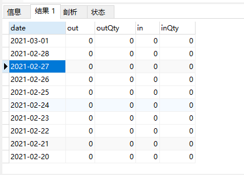
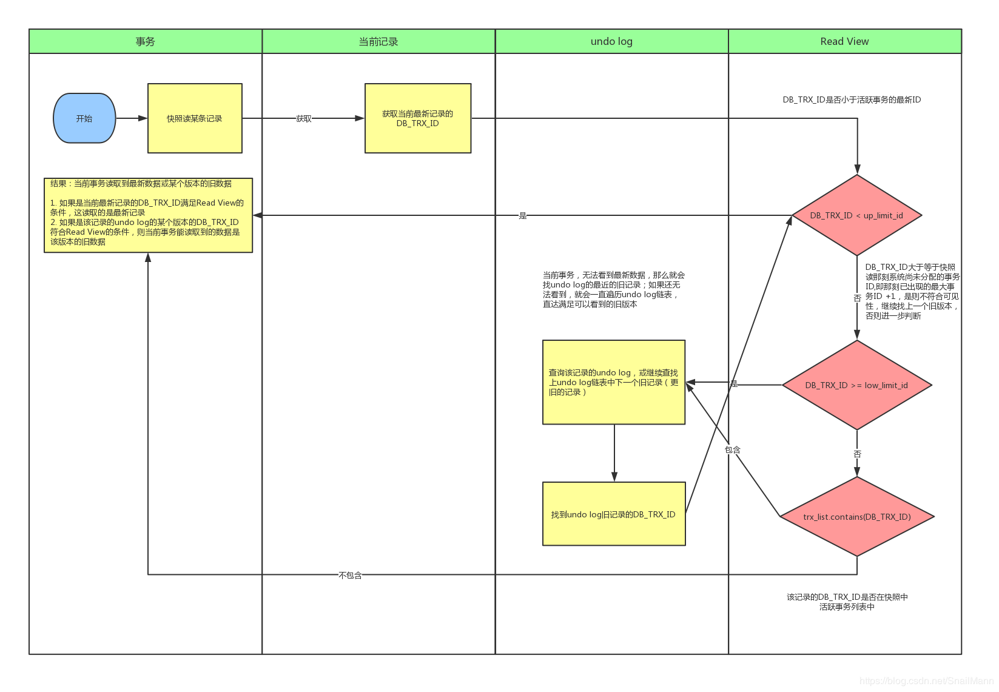

数据库Mysql知识点

### 一、模糊查询优化

https://mp.weixin.qq.com/s/ygvuP35B_sJAlBHuuEJhfg

在开发过程中，经常会碰到一些业务场景，需要以完全模糊匹配的方式查找数据，就会想到用 `like %xxx%` 或者 `like %xxx` 的方式去实现，而且即使列上有选择率很高的索引，也不会被使用。**因为%在前！**

在MySQL中可以通过ICP特性，全文索引，基于生成列索引解决这类问题，下面就从索引条件下推ICP，全文索引，基于生成列索引及如何利用它们解决模糊匹配的SQL性能问题。

示例：假设有用户表`users01(id, name, nickname, phone, create_time)`，表中数据有11W。**由于ICP只能用于二级索引**，故在name,nickname列上创建复合索引`idx_name_nickname(name,nickname)`，分析SQL语句`select * from users01 where name = 'Lyn' and nickname like '%SK%'`在ICP关闭和开启下的执行情况。

**Extra显示的索引扫描方式**

- using where：查询使用索引的情况下，需要回表去查询所需的数据。
- using index condition：查询使用了索引，但是需要回表查询数据。
- using index：查询使用覆盖索引的时候会出现。
- using index & using where：查询使用了索引，但是需要的数据都在索引列中能找到，不需要回表查询数据。

#### ICP

​	**MySQL 5.6开始支持ICP（Index Condition Pushdown），不支持ICP之前，当进行索引查询时，首先根据索引来查找数据，然后再根据where条件来过滤，扫描了大量不必要的数据，增加了数据库IO操作。**

​	**在支持ICP后，MySQL在取出索引数据的同时，判断是否可以进行where条件过滤，将where的部分过滤操作放在存储引擎层提前过滤掉不必要的数据，减少了不必要数据被扫描带来的IO开销。在某些查询下，可以减少Server层对存储引擎层数据的读取，从而提供数据库的整体性能。**

#### 模糊匹配改写优化（覆盖索引）

​	在开启ICP特性后，对于条件`where name = 'Lyn' and nickname like '%SK%'` 可以利用复合索引 `(name,nickname)` 减少不必要的数据扫描，提升SQL性能。但对于 `where nickname like '%SK%'` 完全模糊匹配查询能否利用ICP特性提升性能？首先创建nickname上单列索引 `idx_nickname`。

​	辅助索引idx_nickname(nickname)内部是包含主键id的，等价于(id，nickname)的复合索引，尝试利用覆盖索引特性将SQL改写为 `select Id from users01 where nickname like '%SK%'` 。

```sql
|  1 | SIMPLE      | users01 | NULL       | index | NULL          | idx_nickname | 83      | NULL | 114543 |    11.11 | Using where; Using index |
```

从执行计划看到，`type=index，Extra=Using where; Using index`，索引全扫描，但是需要的数据都在索引列中能找到，不需要回表。利用这个特点，将原始的SQL语句先获取主键id，然后通过id跟原表进行关联，分析其执行计划。

```sql
select  * from users01 a , (select id from users01 where nickname like '%SK%') b where a.id = b.id;
```

```sql
|  1 | SIMPLE      | users01 | NULL       | index  | PRIMARY       | idx_nickname | 83      | NULL            | 114543 |    11.11 | Using where; Using index |

|  1 | SIMPLE      | a       | NULL       | eq_ref | PRIMARY       | PRIMARY      | 4       | test.users01.id |      1 |   100.00 | NULL                     |
```

从执行计划看，走了索引idx_nickname，不需要回表访问数据，执行时间从60ms降低为40ms，type = index 说明没有用到ICP特性，但是可以利用 `Using where; Using index` 这种索引扫描不回表的方式减少资源开销来提升性能。

#### 全文索引

MySQL 5.6开始支持全文索引，可以在变长的字符串类型上创建全文索引，来加速模糊匹配业务场景的DML操作。它是一个inverted index（反向索引），创建 `fulltext index` 时会自动创建6个 `auxiliary index tables`（辅助索引表），同时支持索引并行创建，并行度可以通过参数 `innodb_ft_sort_pll_degree` 设置，对于大表可以适当增加该参数值。

删除全文索引的表的数据时，会导致辅助索引表大量delete操作，InnoDB内部采用标记删除，将已删除的DOC_ID都记录特殊的FTS_*_DELETED表中，但索引的大小不会减少，需要通过设置参数`innodb_optimize_fulltext_only=ON` 后，然后运行OPTIMIZE TABLE来重建全文索引。

**两种检索模式**

- IN NATURAL LANGUAGE MODE：默认模式，以自然语言的方式搜索，AGAINST('看风' IN NATURAL LANGUAGE MODE ) 等价于`AGAINST('看风')`。

- IN BOOLEAN MODE：布尔模式，表是字符串前后的字符有特殊含义，如查找包含SK，但不包含Lyn的记录，可以用+，-符号。

  `AGAINST('+SK -Lyn' in BOOLEAN MODE)`;

对表users01的nickname添加支持中文分词的全文索引

``` sql
mysql>alter table users01 add fulltext index idx_full_nickname(nickname) with parser ngram;
//InnoDB默认的全文索引parser非常合适于Latin，因为Latin是通过空格来分词的。但对于像中文，日文和韩文来说，没有这样的分隔符。一个词可以由多个字来组成，所以我们需要用不同的方式来处理。在MySQL 5.7.6中我们能使用一个新的全文索引插件来处理它们：n-gramparser.N-gram parser是默认加载到MySQL中并可以直接使用的。我们只需要在DDL中创建全文索引时使用WITH PARSER ngram。比如，下面的SQL语句在MySQL 5.7.6及更高版本上可以运行。
```

对于SQL语句后面的条件 `nickname like '%看风%'` 默认情况下，CBO是不会选择走nickname索引的，该写SQL为全文索引匹配的方式：**match(nickname) against('看风')**。

```sql
mysql>explain select * from users01 where match(nickname) against('看风');
|  1 | SIMPLE      | users01 | NULL       | fulltext | idx_full_nickname | idx_full_nickname | 0       | const |    1 |   100.00 | Using where; Ft_hints: sorted |
```

使用了全文索引的方式查询，type=fulltext，同时命中全文索引 `idx_full_nickname`，从上面的分析可知，在MySQL中，对于完全模糊匹配%%查询的SQL可以通过全文索引提高效率。

#### 生成列

MySQL 5.7开始支持生成列，生成列是由表达式的值计算而来，有两种模式：VIRTUAL和STORED，如果不指定默认是VIRTUAL。

- **VIRTUAL**生成列用于复杂的条件定义，能够简化和统一查询，不占用空间，访问列是会做计算。
- **STORED**生成列用作物化缓存，对于复杂的条件，可以降低计算成本，占用磁盘空间。
- 支持辅助索引的创建，分区以及生成列可以模拟函数索引。
- 不支持存储过程，用户自定义函数的表达式，`NONDETERMINISTIC`的内置函数，如NOW()， RAND()以及不支持子查询

关于使用：

```sql
#添加基于函数reverse的生成列reverse_nickname
mysql>alter table users01 add reverse_nickname varchar(200) generated always as (reverse(nickname));
#查看生成列信息
mysql>show columns from users01;
| reverse_nickname | varchar(200) | YES  |     | NULL              | VIRTUAL GENERATED | #虚拟生成列
```

对于where条件后的 `like '%xxx'` 是无法利用索引扫描，可以利用MySQL 5.7的生成列模拟函数索引的方式解决，具体步骤如下：

1. **利用内置reverse函数将like '%风云'反转为like '云风%'，基于此函数添加虚拟生成列。**
2. **在虚拟生成列上创建索引。**
3. **将SQL改写成通过生成列like reverse('%风云')去过滤，走生成列上的索引。**

添加虚拟生成列并创建索引。

```sql
mysql>alter table users01 add reverse_nickname varchar(200) generated always as (reverse(nickname));
mysql>alter table users01 add index idx_reverse_nickname(reverse_nickname);
#SQL执行计划
|  1 | SIMPLE      | users01 | NULL       | range | idx_reverse_nickname | idx_reverse_nickname | 803     | NULL |    1 |   100.00 | Using where |
```

可以看到对于 `like '%xxx'` 无法使用索引的场景，可以通过基于生成列的索引方式解决。

#### 总结

上述介绍了索引条件下推ICP特性，全文索引以以及生成列特性，利用这些特性可以对模糊匹配 `like %xxx%` 或 `like %xxx` 的业务SQL进行优化，可以有效降低不必要的数据读取，减少IO扫描以及CPU开销，提高服务的稳定性。

### 二、数据库基础

#### 结构图


##### 连接器

​	他负责跟客户端建立链接、获取权限、维持和管理连接。

​	链接的时候会经过TCP握手，然后身份验证，然后我们输入用户名密码就好了。

​	验证ok后，我们就连上了这个MySQL服务了，但是这个时候我们处于空闲状态。

​	**show processlist**命令可以查看空闲列表，其中的Command列显示为**Sleep**的这一行，就表示现在系统里面有一个空闲连接。这里需要注意的是，我们数据库的客户端太久没响应，连接器就会自动断开了，这个时间参数是**wait_timeout**控制住的，默认时长为8小时。

​	**断开后重连的时候会报错，如果你想再继续操作，你就需要重连了。**

##### 分析器

​	词法分析和语法分析

##### 优化器

​	优化就比较简单了，因为我们建立表可能会建立很多索引，优化有一步就是要确认使用哪个索引，比如使用你的主键索引，联合索引还是什么索引更好。

还有就是对执行顺序进行优化，条件那么多，先查哪个表，还是先关联，会出现很多方案，最后由优化器决定选用哪种方案。

##### 执行器

​	最终进行权限校验，并执行sql。


### 三、数据库调优


#### 先explain查看执行计划

#### 排除缓存干扰

​	如果我们当前的MySQL版本支持缓存而且我们又开启了缓存，那每次请求的查询语句和结果都会以key-value的形式缓存在内存中的，大家也看到我们的结构图了，一个请求会先去看缓存是否存在，不存在才会走解析器。

​	缓存失效比较频繁的原因就是，只要我们一对表进行更新，那这个表所有的缓存都会被清空，其实我们很少存在不更新的表，特别是我之前的电商场景，可能静态表可以用到缓存，但是我们都走大数据离线分析，缓存也就没用了。

**mysql8时已经废弃了查询缓存这个功能！**

| id   | select_type | table | type  | possible_keys | key     | key_len | ref   | rows | Extra       |
| ---- | ----------- | ----- | ----- | ------------- | ------- | ------- | ----- | ---- | ----------- |
| 1    | SIMPLE      | p     | const | PRIMARY       | PRIMARY | 8       | const | 1    | Using index |

- select_type：常用的有 SIMPLE 简单查询，UNION 联合查询，SUBQUERY 子查询等。
- table：要查询的表
- possible_keys：可选择的索引
- key：实际使用的索引
- rows：扫描的行数
- type：索引查询类型，经常用到的索引查询类型：
  - const：使用主键或者唯一索引进行查询的时候只有一行匹配 。（还有system，这是一个 const type 的特殊情况）
  - ref：使用非唯一索引 
  - eq_ref：触发条件：在进行联接查询的，使用主键或者唯一索引并且只匹配到一行记录的时候
  - range：使用主键、单个字段的辅助索引、多个字段的辅助索引的最后一个字段进行范围查询
  -  index：和all的区别是扫描的是索引树 
  - all：扫描全表

#### const

**触发条件：在使用主键或者唯一索引进行查询的时候只有一行匹配。**

行数rows只是一个接近的数字，不是完全正确的，索引也不一定就是走最优的，是可能走错的。

行数错误的原因是：MySQL中数据的单位都是页，MySQL又采用了采样统计的方法，采样统计的时候，InnoDB默认会选择N个数据页，统计这些页面上的不同值，得到一个平均值，然后乘以这个索引的页面数，就得到了这个索引的基数。我们数据是一直在变的，所以索引的统计信息也是会变的，会根据一个阈值，重新做统计。

至于MySQL索引可能走错也很好理解，如果走A索引要扫描100行，B所有只要20行，但是他可能选择走A索引，你可能会想MySQL是不是有病啊，其实不是的。

一般走错都是因为优化器在选择的时候发现，走A索引没有额外的代价，比如走B索引并不能直接拿到我们的值，还需要回到主键索引才可以拿到，多了一次回表的过程，这个也是会被优化器考虑进去的。

他发现走A索引不需要回表，没有额外的开销，所有他选错了。

如果是上面的统计信息错了，那简单，我们**用analyze table tablename 就可以重新统计索引信息了**，所以在实践中，如果你发现explain的结果预估的rows值跟实际情况差距比较大，可以采用这个方法来处理。

还有一个方法就是force index强制走正确的索引，或者优化SQL，最后实在不行，可以新建索引，或者删掉错误的索引。

#### 覆盖索引

##### 回表查询

InnoDB中普通索引的B+树的叶子节点上存储的是主键值，所以定位数据时需要扫描两次树才能最终获取到数据，这就是回表查询。

##### 覆盖索引

如果一个索引包含（或者说覆盖）所有需要查询的字段的值，我们就称之为“覆盖索引“。不是所有类型的索引都可以成为覆盖索引。覆盖索引必须要存储索引列的值，**而哈希索引、空间索引和全文索引等都不存储索引列的值，所以MySQL只能使用B-Tree索引做覆盖索引。**

当发起一个被索引覆盖的查询（也叫做索引覆盖查询）时，**在EXPLAIN的Extra列可以看到“Using index“的信息**。

常见的实现方法是：将被查询的字段，建立到联合索引里去。

##### 联合索引

还是商品表举例，我们需要根据他的名称，去查他的库存，假设这是一个很高频的查询请求，你会怎么建立索引呢？

大家可以思考上面的回表的消耗对SQL进行优化。

是的建立一个，名称和库存的联合索引，这样名称查出来就可以看到库存了，不需要查出id之后去回表再查询库存了，联合索引在我们开发过程中也是常见的，但是并不是可以一直建立的，大家要思考索引占据的空间。

##### 最左匹配原则

索引树结构导致

##### 索引下推（ICP）

而MySQL 5.6 引入的索引下推优化（index condition pushdown)， 可以在索引遍历过程中，对索引中包含的字段先做判断，直接过滤掉不满足条件的记录，减少回表次数。

##### 唯一索引普通索引选择难题

1、查询：

​	查询来说二者的区别是普通索引查到符合条件的项后会继续查找下一项，如果下一项不符合再返回；唯一索引则是查到符合条件的项后就直接返回。其实这两种方式效率几乎没有差别，因为查找都是先读取数据项然后在内存中进行的所以多读取一次并不会带来很大的影响。
2、更新：

对于更新操作二者还是有很大区别的，要理解他们之间的区别首先要理解**change buffer**！

当需要更新一个数据页时，如果数据页在内存中就直接更新，而如果这个数据页还没有在内存中的话，在不影响数据一致性的前提下，InnoDB会将这些更新操作缓存在change buffer中，这样就不需要从磁盘中读入这个数据页了。

在下次查询需要访问这个数据页的时候，将数据页读入内存，然后执行change buffer中与这个页有关的操作，通过这种方式就能保证这个数据逻辑的正确性。

需要说明的是，虽然名字叫作change buffer，实际上它是可以持久化的数据。也就是说，change buffer在内存中有拷贝，也会被写入到磁盘上。

将change buffer中的操作应用到原数据页，得到最新结果的过程称为merge。

除了访问这个数据页会触发merge外，系统有后台线程会定期merge。在数据库正常关闭（shutdown）的过程中，也会执行merge操作。

显然，如果能够将更新操作先记录在change buffer，减少读磁盘，语句的执行速度会得到明显的提升。而且，数据读入内存是需要占用buffer pool的，所以这种方式还能够避免占用内存，提高内存利用率

那么，**什么条件下可以使用change buffer呢？**

对于唯一索引来说，所有的更新操作都要先判断这个操作是否违反唯一性约束。

要判断表中是否存在这个数据，而这必须要将数据页读入内存才能判断，如果都已经读入到内存了，那直接更新内存会更快，就没必要使用change buffer了。

因此，唯一索引的更新就不能使用change buffer，实际上也只有普通索引可以使用。

change buffer用的是buffer pool里的内存，因此不能无限增大，change buffer的大小，可以通过参数innodb_change_buffer_max_size来动态设置，这个参数设置为50的时候，表示change buffer的大小最多只能占用buffer pool的50%。

将数据从磁盘读入内存涉及随机IO的访问，是数据库里面成本最高的操作之一，change buffer因为减少了随机磁盘访问，所以对更新性能的提升是会很明显的。

**change buffer的使用场景？**

​	对于写多读少的业务来说，页面在写完以后马上被访问到的概率比较小，此时change buffer的使用效果最好，这种业务模型常见的就是账单类、日志类的系统。

​	反过来，假设一个业务的更新模式是写入之后马上会做查询，那么即使满足了条件，将更新先记录在change buffer，但之后由于马上要访问这个数据页，会立即触发merge过程。这样随机访问IO的次数不会减少，反而增加了change buffer的维护代价，所以，对于这种业务模式来说，change buffer反而起到了副作用。

3、普通索引还是唯一索引的选择：
	如果是读取远大于更新和插入的表，唯一索引和普通索引都可以，但是如果业务需求相反，个人觉得应该使用普通索引，当然如果是那种更新完要求立即可见的需求，就是刚更新完就要再查询的，这种情况下反而不推荐普通索引，因为这样会频繁的产生merge操作，起不到change buffer的作用，反而需要额外空间来维护change buffer就有点得不偿失了！

##### 前缀索引

我们存在邮箱作为用户名的情况，每个人的邮箱都是不一样的，那我们是不是可以在邮箱上建立索引，但是邮箱这么长，我们怎么去建立索引呢？

MySQL是支持前缀索引的，也就是说，你可以定义字符串的一部分作为索引。默认地，如果你创建索引的语句不指定前缀长度，那么索引就会包含整个字符串。

**我们是否可以建立一个区分度很高的前缀索引，达到优化和节约空间的目的呢？**

使用前缀索引，定义好长度，就可以做到既节省空间，又不用额外增加太多的查询成本。

上面说过覆盖索引了，覆盖索引是不需要回表的，但是前缀索引，**即使你的联合索引已经包涵了相关信息，他还是会回表，因为他不确定你到底是不是一个完整的信息，**就算你是www.aobing@mogu.com一个完整的邮箱去查询，他还是不知道你是否是完整的，所以他需要回表去判断一下。

**下面这个也是我在阿里面试面试官问过我的，很长的字段，想做索引我们怎么去优化他呢？**

因为存在一个磁盘占用的问题，索引选取的越长，占用的磁盘空间就越大，相同的数据页能放下的索引值就越少，搜索的效率也就会越低。

我当时就回答了一个hash，把字段hash为另外一个字段存起来，每次校验hash就好了，hash的索引也不大。

我们都知道只要区分度过高，都可以，那我们可以采用倒序，或者删减字符串这样的情况去建立我们自己的区分度，不过大家需要注意的是，调用函数也是一次开销哟，这点当时没注意。

就比如本来是www.aobing@qq,com 其实前面的`www.`基本上是没任何区分度的，所有人的邮箱都是这么开头的，你一搜一大堆出来，放在索引还浪费内存，你可以substring()函数截取掉前面的，然后建立索引。

我们所有人的身份证都是区域开头的，同区域的人很多，那怎么做良好的区分呢？REVERSE（）函数翻转一下，区分度可能就高了。

这些操作都用到了函数，我就说一下函数的坑。

##### 条件字段函数操作

日常开发过程中，大家经常对很多字段进行函数操作，如果对日期字段操作，浮点字符操作等等，大家需要注意的是，如果对字段做了函数计算，就用不上索引了，这是MySQL的规定。

对索引字段做函数操作，可能会破坏索引值的有序性，因此优化器就决定放弃走树搜索功能。

需要注意的是，优化器并不是要放弃使用这个索引。

这个时候大家可以用一些取巧的方法，比如 select * from tradelog where id + 1 = 10000 就走不上索引，select * from tradelog where id = 9999就可以。

##### 隐式类型转换

select * from t where id = 1

如果id是字符类型的，1是数字类型的，你用explain会发现走了全表扫描，根本用不上索引，为啥呢？

因为MySQL底层会对你的比较进行转换，相当于加了 CAST( id AS signed int) 这样的一个函数，上面说过函数会导致走不上索引。

##### 隐式字符编码转换

还是一样的问题，如果两个表的字符集不一样，一个是utf8mb4，一个是utf8，因为utf8mb4是utf8的超集，所以一旦两个字符比较，就会转换为utf8mb4再比较。

转换的过程相当于加了CONVERT(id USING utf8mb4)函数，那又回到上面的问题了，用到函数就用不上索引了。

还有大家一会可能会遇到mysql突然卡顿的情况，那可能是MySQLflush了。

##### flush

redo log大家都知道，也就是我们对数据库操作的日志，他是在内存中的，每次操作一旦写了redo log就会立马返回结果，但是这个redo log总会找个时间去更新到磁盘，这个操作就是flush。

在更新之前，当内存数据页跟磁盘数据页内容不一致的时候，我们称这个内存页为“脏页”。

内存数据写入到磁盘后，内存和磁盘上的数据页的内容就一致了，称为“干净页“。

flush的时机：

- redo log写满了
- 系统内存不足
- 系统空闲时
- 正常关闭时


#### 四、InnoDB

##### InnoDB数据页

Innodb数据页由以下7个部分组成：

| 内容                        | 占用大小 | 说明                                                         |
| --------------------------- | -------- | ------------------------------------------------------------ |
| File Header                 | 38Bytes  | 数据文件头                                                   |
| Page Header                 | 56 Bytes | 数据页头                                                     |
| Infimun 和 Supermum Records |          | 伪记录                                                       |
| User Records                |          | 用户数据                                                     |
| Free Space                  |          | 空闲空间：内部是链表结构，记录被delete后，会加入到free_lru链表 |
| Page  Dictionary            |          | 页数据字典：存储记录的相对位置记录，也称为Slot，内部是一个稀疏目录 |
| File Trailer                | 8Bytes   | 文件尾部：为了检测页是否已经完整个的写入磁盘                 |

说明：File Trailer只有一个FiL_Page_end_lsn部分，占用8字节，前4字节代表该页的checksum值，最后4字节和File Header中的FIL_PAGE_LSN，一个页是否发生了Corrupt，是通过File Trailer部分进行检测，而该部分的检测会有一定的开销，用户可以通过参数innodb_checksums开启或关闭这个页完整性的检测。

从MySQL 5.6开始默认的表存储引擎是InnoDB，它是面向ROW存储的，每个page(default page size = 16KB)，存储的行记录也是有规定的，最多允许存储16K/2 - 200 = 7992行。

##### InnoDB的行格式

Innodb支持四种行格式：

| 行格式     | Compact存储特性 | 增强的变长列存储 | 支持大前缀索引 | 支持压缩 | 支持表空间类型                  |
| ---------- | --------------- | ---------------- | -------------- | -------- | ------------------------------- |
| REDUNDANT  | No              | No               | No             | No       | system, file-per-table, general |
| COMPACT    | Yes             | No               | No             | No       | system, file-per-table, general |
| DYNAMIC    | Yes             | Yes              | Yes            | No       | system, file-per-table, general |
| COMPRESSED | Yes             | Yes              | Yes            | Yes      | file-per-table, general         |

由于Dynamic是Compact变异而来，结构大同而已，现在默认都是Dynamic格式；COMPRESSED主要是对表和索引数据进行压缩，一般适用于使用率低的归档，备份类的需求，主要介绍下REDUNDANT和COMPACT行格式。

> show table status命令可以查看表状态

##### B + 树与红黑树的比较

红黑树等平衡树也可以用来实现索引，但是文件系统及数据库系统普遍采用 B+ Tree 作为索引结构，主要有以下两个原因：

（一）磁盘 IO 次数

B+ 树一个节点可以存储多个元素，相对于红黑树的树高更低，磁盘 IO 次数更少。

（二）磁盘预读特性

为了减少磁盘 I/O 操作，磁盘往往不是严格按需读取，而是每次都会预读。预读过程中，磁盘进行顺序读取，顺序读取不需要进行磁盘寻道。每次会读取页的整数倍。

操作系统一般将内存和磁盘分割成固定大小的块，每一块称为一页，内存与磁盘以页为单位交换数据。数据库系统将索引的一个节点的大小设置为页的大小，使得一次 I/O 就能完全载入一个节点。

##### B + 树与 B 树的比较

**B+ 树的磁盘 IO 更低**

B+ 树的内部节点并没有指向关键字具体信息的指针。因此其内部节点相对 B 树更小。如果把所有同一内部结点的关键字存放在同一盘块中，那么盘块所能容纳的关键字数量也越多。一次性读入内存中的需要查找的关键字也就越多。相对来说IO读写次数也就降低了。

**B+ 树的查询效率更加稳定**

由于非叶子结点并不是最终指向文件内容的结点，而只是叶子结点中关键字的索引。所以任何关键字的查找必须走一条从根结点到叶子结点的路。所有关键字查询的路径长度相同，导致每一个数据的查询效率相当。

**B+ 树元素遍历效率高**

B 树在提高了磁盘IO性能的同时并没有解决元素遍历的效率低下的问题。正是为了解决这个问题，B+树应运而生。B+树只要遍历叶子节点就可以实现整棵树的遍历。而且在数据库中基于范围的查询是非常频繁的，而 B 树不支持这样的操作（或者说效率太低）。

#### 五、索引

**索引是在存储引擎层实现的，而不是在服务器层实现的，所以不同存储引擎具有不同的索引类型和实现。**

##### B+ Tree 索引

是大多数 MySQL 存储引擎的默认索引类型。

- 因为不再需要进行全表扫描，只需要对树进行搜索即可，所以查找速度快很多。
- 因为 B+ Tree 的有序性，所以除了用于查找，还可以用于排序和分组。
- 可以指定多个列作为索引列，多个索引列共同组成键。
- 适用于全键值、键值范围和键前缀查找，其中键前缀查找只适用于最左前缀查找。如果不是按照索引列的顺序进行查找，则无法使用索引。

InnoDB 的 B+Tree 索引分为主索引和辅助索引。主索引的叶子节点 data 域记录着完整的数据记录，这种索引方式被称为聚簇索引。因为无法把数据行存放在两个不同的地方，所以一个表只能有一个聚簇索引。

辅助索引的叶子节点的 data 域记录着主键的值，因此在使用辅助索引进行查找时，需要先查找到主键值，然后再到主索引中进行查找，这个过程也被称作回表。

##### 哈希索引

哈希索引能以 O(1) 时间进行查找，但是失去了有序性：

- 无法用于排序与分组；
- 只支持精确查找，无法用于部分查找和范围查找。

InnoDB 存储引擎有一个特殊的功能叫“自适应哈希索引”，当某个索引值被使用的非常频繁时，会在 B+Tree 索引之上再创建一个哈希索引，这样就让 B+Tree 索引具有哈希索引的一些优点，比如快速的哈希查找。

### 全文索引

MyISAM 存储引擎支持全文索引，用于查找文本中的关键词，而不是直接比较是否相等。

查找条件使用 MATCH AGAINST，而不是普通的 WHERE。

全文索引使用倒排索引实现，它记录着关键词到其所在文档的映射。

InnoDB 存储引擎在 MySQL 5.6.4 版本中也开始支持全文索引。


## 数据库小知识点

#### 小知识

查询时可以使用`:=`符号进行复制操作，可实现类似递归效果。

```sql
SELECT
	@cdate := DATE_ADD( @cdate, INTERVAL - 1 DAY ) `date`,
	0 AS `out`,
	0 AS `outQty`,
	0 AS `in`,
	0 AS `inQty` 
FROM
	( SELECT @cdate := CURDATE( ) FROM jd_account_trade_detail ) t1 
WHERE
	@cdate > '2021-02-20'
```

显示结果：



#### MVVC多版本并发控制

##### 说明

MVCC在MySQL InnoDB中的实现主要是为了提高数据库并发性能，只有写写之间相互阻塞，其他三种操作（读读、读写、写读）都可以并行，这样大幅度提高了InnoDB的并发度。在内部实现中，InnoDB是在`undolog`中实现的，通过undolog可以找回数据的历史版本。找回的数据历史版本可以提供给用户读(按照隔离级别的定义，有些读请求只能看到比较老的数据版本)，也可以在回滚的时候覆盖数据页上的数据。在InnoDB内部中，会记录一个全局的活跃读写事务数组，其主要用来判断事务的可见性。**MVCC只对数据库隔离级别是读已提交和可重复读有效！**

##### 实现原理

MVCC的目的就是多版本并发控制，在数据库中的实现，就是为了解决读写冲突，它的实现原理主要是依赖记录中的 **3个隐式字段**，**undo日志** ，**Read View** 来实现的。所以我们先来看看这个三个point的概念

###### 隐式字段

`https://dev.mysql.com/doc/refman/5.7/en/innodb-multi-versioning.html`官方文档链接中三个字段。

每行记录除了我们自定义的字段外，还有数据库隐式定义的`DB_TRX_ID`,`DB_ROLL_PTR`,`DB_ROW_ID`等字段

- DB_TRX_ID（事务ID）
   	一个6字节的DB_TRX_ID字段表示插入或更新该行的最后一个事务的事务ID。此外，删除在内部也被视为更新，其中行中设置了一个特殊的位，将其标记为已删除。

- DB_ROLL_PTR（回滚指针）
   7byte，回滚指针，指向这条记录在undo log的上一个版本（undo log记录链存储于rollback segment里）
- DB_ROW_ID
   6byte，隐含的自增ID（隐藏主键），如果数据表没有主键，InnoDB会自动以DB_ROW_ID产生一个聚簇索引。
- 实际还有一个删除flag隐藏字段, 既记录被更新或删除并不代表真的删除，而是删除flag变了

###### UNDO LOG

undo log主要分为两种：

- insert undo log
   代表事务在insert新记录时产生的undo log, 只在事务回滚时需要，并且在事务提交后可以被立即丢弃
- update undo log
   事务在进行update或delete时产生的undo log; 不仅在事务回滚时需要，在快照读时也需要；所以不能随便删除，只有当数据库所使用的快照中不涉及该日志记录，对应的回滚日志才会被purge线程删除。

> purge
>
> - 从前面的分析可以看出，为了实现InnoDB的MVCC机制，更新或者删除操作都只是设置一下老记录的deleted_bit，并不真正将过时的记录删除。
> - 为了节省磁盘空间，InnoDB有专门的purge线程来清理deleted_bit为true的记录。为了不影响MVCC的正常工作，purge线程自己也维护了一个read view（这个read view相当于系统中最老活跃事务的read view）;如果某个记录的deleted_bit为true，并且DB_TRX_ID相对于purge线程的read view可见，那么这条记录一定是可以被安全清除的。

同事务或者相同事务的对同一记录的修改，会导致该记录的undo log成为一条记录版本线性表，既链表，undo log的链首就是最新的旧记录，链尾就是最早的旧记录（可能是会逐渐被purge线程清除掉）。

###### READ VIEW(读视图，也可称为SNAPSHOT)

​	Read View就是事务进行快照读操作的时候生产的读视图(Read View)，在该事务执行的快照读的那一刻，会生成数据库系统当前的一个快照，记录并维护系统当前活跃事务的ID。

 	**Read View主要是用来做可见性判断的**, 即当我们某个事务执行快照读的时候，对该记录创建一个Read View读视图，把它作为用来判断当前事务能够看到哪个版本的数据的条件依据，既可能看到的是当前最新的数据，也有可能是该行记录的undo log里面的某个版本的数据。

​	Read View遵循一个可见性算法，主要是将要被修改的数据的最新记录中的DB_TRX_ID（即当前事务ID）取出来，与系统当前其他活跃事务的ID去对比（由Read View维护），如果DB_TRX_ID跟Read View的属性做了某些比较，不符合可见性，那就通过DB_ROLL_PTR回滚指针去取出Undo Log中的前一条记录再比，直到找到满足特定条件的DB_TRX_ID, 那么这个DB_TRX_ID所在的旧记录就是当前事务能看见的最新老版本。

其具体的判断过程如下，我们先简化一下Read View，我们可以把Read View简单的理解成有三个全局属性

> m_ids（名字我随便取的）
>  一个数值列表，用来维护Read View生成时刻系统正活跃的事务ID
>  up_limit_id
>  记录m_ids列表中事务ID最小的ID，即当前新开事务创建的快照`read view` 中最早的事务id。
>  low_limit_id
>  ReadView生成时刻系统尚未分配的下一个事务ID，也就是目前已出现过的事务ID的最大值+1

- 如果被访问版本的 `DB_TRX_ID` 小于 `m_ids` 中的最小值 `up_limit_id`，说明生成该版本的事务在 `ReadView` 生成前就已经提交了，所以该版本可以被当前事务访问。
- 如果被访问版本的 `DB_TRX_ID` 大于 `low_limit_id`，说明生成该版本的事务在生成 `ReadView` 后才生成，所以该版本不可以被当前事务访问。需要根据 `Undo Log` 链找到前一个版本，然后根据该版本的 DB_TRX_ID 重新判断可见性。
- 如果被访问版本的 `DB_TRX_ID` 属性值在`up_limit_id`和`low_limit_id`之间（包含），那就需要判断一下 `DB_TRX_ID` 的值是不是在 `m_ids` 列表中。如果在，说明创建 `ReadView` 时生成该版本所属事务还是活跃的，因此该版本不可以被访问，需要查找 Undo Log 链得到上一个版本，然后根据该版本的 `DB_TRX_ID` 再从头计算一次可见性；如果不在，说明创建 `ReadView` 时生成该版本的事务已经被提交，该版本可以被访问。
- 此时经过一系列判断我们已经得到了这条记录相对 `ReadView` 来说的可见结果。此时，如果这条记录的 `delete_flag` 为 `true`，说明这条记录已被删除，不返回。否则说明此记录可以安全返回给客户端。

###### Read View可见性比较流程



简单的select语句使用快照读，insert、update、delete、select ... for update、select ... in share mode使用当前读。

**也正是Read View生成时机的不同，从而造成RC,RR级别下快照读（又称一致性读）的结果的不同！**

**1）对于RR隔离：**

- 在RR级别下的某个事务的对某条记录的第一次快照读会创建一个快照及Read View, 将当前系统活跃的其他事务记录起来，此后在调用快照读的时候，还是使用的是同一个Read View，所以只要当前事务在其他事务提交更新之前使用过快照读，那么之后的快照读使用的都是同一个Read View，所以对之后的修改不可见；
- 即RR级别下，快照读生成Read View时，Read View会记录此时所有其他活动事务的快照，这些事务的修改对于当前事务都是不可见的。而早于Read View创建的事务所做的修改均是可见。

即对同一个表或者不同表进行的**第一次select语句**建立了该事务中一致性读的snapshot. 其它update, delete, insert 语句和一致性读snapshot的建立没有关系。在snapshot建立之后提交的数据，一致性读就读不到，之前提交的数据就可以读到。事务的起始点其实是以执行的第一条语句为起始点的，而不是以begin作为事务的起始点的。

**2）对于RC隔离就简单多了：**

- 而在RC级别下的，事务中，**每次快照读都会新生成一个快照和Read View**, 这就是我们在RC级别下的事务中可以看到别的事务提交的更新的原因。

总之在RC隔离级别下，是每个快照读都会生成并获取最新的Read View，属于**语句级多版本**(事务的多条只读语句，创建不同的ReadView，代价更高)；而在RR隔离级别下，是**事务级多版本**，同一个事务中的第一个快照读才会创建Read View, 之后的快照读获取的都是同一个Read View。


**MySQL 中事务开始的时间**

一般我们会认为 begin/start transaction 是事务开始的时间点，也就是一旦我们执行了 start transaction，就认为事务已经开始了，其实这是错误的。上面的实验也说明了这一点。**事务开始的真正的时间点(LSN)，是 start transaction 之后执行的第一条语句，不管是什么语句，不管成功与否**。

但是如果你想要达到将 start transaction 作为事务开始的时间点，那么我们必须使用：

`START TRANSACTION WITH consistent snapshot` （效果等价于start transaction 之后，马上执行一条 select 语句(此时会建立一致性读的snapshot)。）

它的含义是：执行 start transaction 同时建立本事务一致性读的 snapshot . 而不是等到执行第一条语句时，才开始事务，并且建立一致性读的 snapshot .


#### 数据库范式

- 第一范式：列的原子性（**列不可再分**）

  ​	比如某些数据库系统中需要用到“地址”这个属性，本来直接将“地址”属性设计成一个数据库表的字段就行。但是如果系统经常会访问“地址”属性中的“城市”部分，那么就非要将“地址”这个属性重新拆分为省份、城市、详细地址等多个部分进行存储，这样在对地址中某一部分操作的时候将非常方便。

- 第二范式：实体的属性完全依赖于主关键字（**记录分类的单一性**）

  ​	也就是说在一个数据库表中，一个表中只能保存一种数据，不可以把多种数据保存在同一张数据库表中。

- 第三范式：确保每列都和主键列直接相关,而不是间接相关（**直接相关，不要多级关系**）

  ​	比如在设计一个订单数据表的时候，可以将客户编号作为一个外键和订单表建立相应的关系。而不可以在订单表中添加关于客户其它信息（比如姓名、所属公司等）的字段。


#### 索引加载流程


磁盘读取数据靠的是机械运动，每一次读取数据需要**寻道、寻点、拷贝到内存**三步操作。

- 寻道时间：磁头臂移动到指定磁道需要的时间，一般在5ms以下
- 寻点时间：从磁道中寻找数据存在的那个点，平均时间是半圈时间，如果是一个7200转/min的磁盘，寻点时间平均是600000/7200/2=4.17ms；
- 拷贝到内存很快，与前两者时间相比可以忽略不计。


考虑到磁盘IO是非常高昂的操作，计算机操作系统做了预读的优化，当一次IO时，不光把当前磁盘地址的数据，而是把**相邻的数据**也都读取到内存缓冲区内，因为当计算机访问一个地址的数据的时候，与其相邻的数据也会很快被访问到。

每一次IO读取的数据我们称之为一页(page)，具体一页有多大数据跟操作系统有关，一般为4k或8k，也就是我们读取一页内的数据时候，实际上才发生了一次IO。（此处的页是指操作系统读取磁盘数据的单位，InnoDB存储引擎的数据页是16K）

**所以对于数据库查询来说，磁盘IO是最费时的过程。索引的存在可以减少IO次数！**

#### 自增ID达到上限用完了之后怎样

分为两种情况：

1. 如果设置了主键，那么将会报错主键冲突。
2. 如果没有设置主键，数据库则会帮我们自动生成一个全局的row_id，新数据会覆盖老数据

#### 大表的DDL：

MySQL中的DDL语句形式比较多，概括一下有以下几类：CREATE，ALTER，DROP，RENAME，TRUNCATE。

**这些操作都是隐式提交且原子性，要么成功，要么失败，在MySQL 8.0之前DDL操作是不记录日志的**。