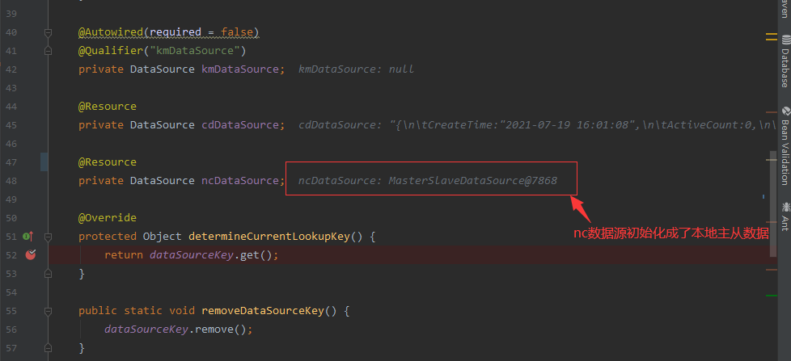

背景：项目使用到四个数据源，一个数据源是本地主从，另外三个分别是成都仓库、南充仓库、昆明仓库。项目配置了多数据源，代码如下：

```java
@Slf4j
@Component("multipleDataSource")
public class MultipleDataSource extends AbstractRoutingDataSource {
    public static final String SMC_DS_KM = "km";//数据源一：昆明仓库
    public static final String SMC_DS_NC = "nc";//数据源二：南充仓库
    public static final String SMC_DS_CD = "cd";//数据源三：成都仓库
	//记录当前线程的数据源路由KEY
    private static ThreadLocal<String> dataSourceKey = new InheritableThreadLocal<>();
	//记录四个数据源对象
    private static Map<Object, Object> dataSourceMap = new HashMap<>();

    public static void setDataSourceKey(String dataSource) {
        if (SMC_DS_KM.equals(dataSource) || SMC_DS_NC.equals(dataSource) || SMC_DS_CD.equals(dataSource)) {
            dataSourceKey.set(dataSource);
        }
    }

    @Autowired(required = false)
    @Qualifier("kmDataSource")
    private DataSource kmDataSource;

    @Resource
    private DataSource cdDataSource;

    //1.1后续要提到
    @Resource
    private DataSource ncDataSource;

    @Override
    protected Object determineCurrentLookupKey() {
        return dataSourceKey.get();
    }

    public static void removeDataSourceKey() {
        dataSourceKey.remove();
    }

    @Override
    public void afterPropertiesSet() {
        if (kmDataSource != null) {
            dataSourceMap.put("km", kmDataSource);
        }
        if (cdDataSource != null) {
            dataSourceMap.put("cd", cdDataSource);
            //此处设置了默认的数据源为成都仓库
            super.setDefaultTargetDataSource(cdDataSource);
        }
        if (ncDataSource != null) {
            dataSourceMap.put("nc", ncDataSource);
        }
        //将自定义的dataSourceMao作为targetDataSources
        super.setTargetDataSources(dataSourceMap);
        super.afterPropertiesSet();
    }
}
```

首先，在容器中定义三个数据源的Bean，然后赋值给targetDataSources且设置默认数据源，每当有请求过来时，如果没有设置key值，则依据AbstractRoutingDataSource类#determineTargetDataSource源码：

```java
protected DataSource determineTargetDataSource() {
   Assert.notNull(this.resolvedDataSources, "DataSource router not initialized");
    //2.1首先通过determineCurrentLookupKey方法获取key，由于我们重写了值为dataSourceKey.get(),若此时没有设置结果为null
   Object lookupKey = determineCurrentLookupKey();
    //2.2根据key获取经处理的数据源对象，默认为不做任何处理。（resolvedDataSources为原始的targetDataSource处理而得，处理方式在afterPropertiesSet方法中），此时结果为null
   DataSource dataSource = this.resolvedDataSources.get(lookupKey);
   if (dataSource == null && (this.lenientFallback || lookupKey == null)) {
       //2.3如果2.2获取为null则取默认数据源即成都仓库
      dataSource = this.resolvedDefaultDataSource;
   }
   if (dataSource == null) {
      throw new IllegalStateException("Cannot determine target DataSource for lookup key [" + lookupKey + "]");
   }
   return dataSource;
}
```

也就是如果不设置key那么都会使用到默认数据库。除非指定数据key才会路由到指定数据源，如下：

```java
public void handle(){
    ....
    // 手动切换数据源
    MultipleDataSource.setDataSourceKey(warehouseConfig.getDataSource());
    //查询数据库
    dbCustomer = customerMapper.selectCustomerList();
    //删除key
    MultipleDataSource.removeDataSourceKey();
    ....
}
```

线上问题：

一、设置了dataSourceKey为nc后，执行sql语句，发现依然路由到了本地数据源，导致出现表不存在的问题。

- 分析调试：

在初始化DataSource时候打个断点后，竟然发现南充数据源竟然被初始化成了本地的数据源。



赶紧去看远程三个数据源的配置类：

```java
@Configuration
@MapperScan(basePackages = {"com.jwell.msa.synergy.provider.**.dao.smc",
        "com.jwell.msa.synergy.provider.**.smcdao"}, sqlSessionFactoryRef = "smcSqlSessionFactory")
public class SmcMybatisConfig {

    @Bean("cdDataSource")
    @ConfigurationProperties(prefix = "spring.datasource.cd")
    @ConditionalOnProperty(value = "spring.datasource.cd.enabled", havingValue = "true")
    public DataSource cdDataSource() {
        return initDruidDataSource();
    }

    @Bean("kmDataSource")
    @ConfigurationProperties(prefix = "spring.datasource.km")
    @ConditionalOnProperty(value = "spring.datasource.km.enabled", havingValue = "true")
    public DataSource kmDataSource() {
        return initDruidDataSource();
    }

    @Bean("ncDataSource")
    @ConfigurationProperties(prefix = "spring.datasource.nc")
    @ConditionalOnProperty(value = "spring.datasource.nc.enabled", havingValue = "true")
    public DataSource ncDataSource() {
        return initDruidDataSource();
    }

    private DruidDataSource initDruidDataSource() {
        DruidDataSource druidDataSource = new DruidDataSource();
        druidDataSource.setDriverClassName("oracle.jdbc.OracleDriver");
        druidDataSource.setTestWhileIdle(true);
        druidDataSource.setTestOnBorrow(true);
        druidDataSource.setValidationQuery("SELECT 'x' FROM DUAL");
        return druidDataSource;
    }

    @Bean(name = "smcSqlSessionFactory")
    @Resource
    public SqlSessionFactory smcSqlSessionFactory(MultipleDataSource multipleDataSource) throws Exception {
        SqlSessionFactoryBean factoryBean = new SqlSessionFactoryBean();
        factoryBean.setConfigLocation(new ClassPathResource("mybatis-config.xml"));
        factoryBean.setDataSource(multipleDataSource);
        factoryBean.setMapperLocations(new PathMatchingResourcePatternResolver()
                .getResources("classpath:META-INF/mapper/smc/*.xml"));
        return factoryBean.getObject();
    }
}
```

注意到**ncDataSource()**方法上有注解表名该类初始化是有前提条件的，而对比后发现该属性确实设置为false。

`@ConditionalOnProperty(value = "spring.datasource.nc.enabled", havingValue = "true")`

导致由于**ncDataSource**的bean不存在，故在1.1处@Resouce装配时，按名字没有找到，然后再去按类型装配，最终匹配到了本地数据源。（本地数据源为默认声明，使用shardingJDBC主从）

```java
@EnableEngineStart
@EnableFeignClients
@MapperScan(basePackages = "com.jwell.msa.synergy.provider.**.dao", sqlSessionFactoryRef = "sqlSessionFactory")//本地数据源
@SpringBootApplication
public class SynergyServiceApplication {
    public static void main(String[] args) {
        SpringApplication.run(SynergyServiceApplication.class);
    }
｝
```

- 解决方案

打开配置`spring.datasource.nc.enabled`设置为true。

二、第三方调用我们的服务的时候，需要根据accountId自动去路由到指定仓库后执行后，本地再次调用接口，会路由到上次指定的仓库。

- 背景概述
  首先是定义Interceptor根据第三方调用时设置LookUpKey。

  ```java
  
  @Component
  public class UserContextInterceptor extends HandlerInterceptorAdapter {
      @Resource
      private WarehouseConfigMapper warehouseConfigMapper;
      @Override
      public boolean preHandle(HttpServletRequest httpServletRequest, HttpServletResponse httpServletResponse, Object o) throws Exception {
          //...省略不相关代码...
          String accountId = httpServletRequest.getHeader("accountId");
          //动态切换数据源
          if (StringUtils.isNotBlank(accountId)) {
              //查询仓库配置信息
              WarehouseConfigDO warehouseConfigDO = warehouseConfigMapper.selectWxInfoByWarehouse(accountId);
              if (warehouseConfigDO != null) {
                  if (MultipleDataSource.SMC_DS_KM.equals(warehouseConfigDO.getDataSource()) ||          MultipleDataSource.SMC_DS_NC.equals(warehouseConfigDO.getDataSource()) ||           MultipleDataSource.SMC_DS_CD.equals(warehouseConfigDO.getDataSource())) {           //设置根据查询到仓库信息获取到指定到的数据源key
    MultipleDataSource.setDataSourceKey(warehouseConfigDO.getDataSource());
                  }
              } 
          } 
          return true;
      }
  
     
  ｝
  ```

  由此可知，当外部调用时需要在header中带入accountId字段，然后仓库服务会根据该字段查询数据库后设置对应的KEY。此时如果用postman模拟多线程调用接口，并设置accountId值使其路由到nc数据源。然后再通过swagger调用不指定key，结果发现依然被路由到了nc数据源，而不是默认的cd数据源。

- 分析处理
  由于DataSourceKey是存储在ThreadLocal中的，由其特性可知，每个线程持有一份。但是由于tomcat是个容器，其维护了一个线程池，处理请求的线程可以复用，所以本地请求时用到以前设置过key的线程则会导致路由失败。

- 解决方案

  使用ThreadLocal应养成习惯，使用后一定记得remove!!!解决方式就是在UserContextInterceptor中添加afterCompletion后置处理方法。

  ```java
   @Override
      public void afterCompletion(HttpServletRequest request, HttpServletResponse response, Object handler, Exception ex) throws Exception {
          MultipleDataSource.removeDataSourceKey();//移除当前线程的key值
          super.afterCompletion(request, response, handler, ex);
      }
  ```

  


